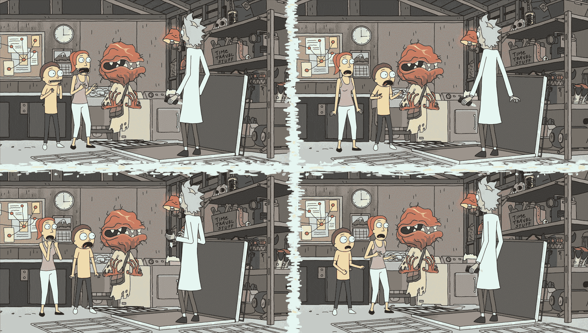

# DevOps 的历史:自动化测试和 CI | CircleCI

> 原文：<https://circleci.com/blog/a-brief-history-of-devops-part-iii-automated-testing-and-continuous-integration/#2018-02-01T07:06:00-08:00>

这是一个四部分系列的第三部分。在这里看零件[一个](https://circleci.com/blog/a-brief-history-of-devops-part-i-waterfall/)、[两个](https://circleci.com/blog/a-brief-history-of-devops-part-ii-agile-development/)、[四个](https://circleci.com/blog/a-brief-history-of-devops-part-iv-continuous-delivery-and-continuous-deployment/)。)

亲爱的读者，欢迎回到我们正在进行的关于 DevOps 丰富历史的旅程！在[的最后一章](https://circleci.com/blog/a-brief-history-of-devops-part-ii-agile-development/)中，我们讨论了许多导致敏捷方法的运动。在最后，我们预示了常量验证在本章中的作用。

现在伏笔露出来了！这一次，我们将讨论两个与我们的心息息相关的过程:自动化测试和持续集成。

## 自动化测试

我们已经看到敏捷运动是如何从繁重的文档转移到轻松的工作中的。每个人都经历了一个集体启示:风险是不可避免的，所以你最好通过将食物切成小块来最小化风险——也就是说，在吞咽食物之前先咀嚼，否则你会窒息而死。

随着人们对失败越来越适应，他们创造了失败不仅可以被接受，而且被鼓励的地方。像 [JUnit](http://junit.org/junit5/) 和 [Cucumber](https://cucumber.io/) 这样的测试框架的兴起反映了这种对待风险的新态度。工具不会先于流程，我们创建工具是为了优化现有流程。这意味着工程师花了足够的时间编写测试来保证这些框架的创建。

第一个自动化测试框架非常有效，但是在伦理上有问题。

极限编程是这种测试热情背后的主要影响因素。肯特·贝克(Kent Beck)和罗恩·杰弗里斯(Ron Jeffries)用一个令人信服的论点支持测试驱动开发:“如果 bug 将要发生(并且它们将会发生)，工程师应该在他们还记得代码的时候修复至少一些 bug。”因为代码从工程师头脑中蒸发的速度比一滴[白酒](https://en.wikipedia.org/wiki/Baijiu)还要快。

在编写代码之前编写测试迫使工程师考虑他们希望软件如何工作。在许多方面，这种实践与瀑布年的详尽文档服务于相同的目的:测试指定事情**应该**如何。但是**自动化**测试更进了一步，通过**在每个代码变更上强制**这些需求，当[有什么不对劲的时候](https://www.youtube.com/watch?v=qgqJSxviu6Q)大声抱怨。

工程师们发现，通过更频繁地运行测试，他们增加了捕捉错误和防止灾难的几率。这意味着一边走一边检查**，而不是在终点检查**。这在今天看来似乎是显而易见的，但在当时，这是一种根本不同的软件开发方式。****

 **正是从这种冒泡的原始测试中，持续集成诞生了。

## 论持续集成的起源

DevOps 时间线并不像我们希望的那样清晰。

这两个概念实际上是同时代的，而不是从敏捷时代到持续集成时代的离散进展。短语*持续集成*(简称 CI)实际上比许多敏捷的祖先还要古老。它是由 Grady Booch 在 1994 年创造的，Grady Booch 是一个有相当学术造诣的人。

Booch 最出名的是与两位同事开发了统一建模语言(UML ): Ivar Jacobson 和 James Rumbaugh。UML 是过度热心的设计阶段的一个很好的例子，敏捷联盟试图与它保持距离，但是在这个故事中没有位置。走开，兔子洞，尽管你的深度很诱人！

*布奇惊讶地捂着自己的羊排。*

这个短语出现在 Booch 的书《面向对象的分析和设计及其应用》中:

“微观过程的需求决定了开发团队将完成更多的内部发布，只有少数可执行的发布被移交给外部方。这些内部发布代表了系统的一种**持续集成**，其存在是为了强制关闭微流程。

虽然粗体和大写是我做的，其余的是直接来自布奇的头。他还写道，测试应该是“开发过程中的持续活动”，因此从早期开始，测试和持续集成就紧密地交织在一起。

请密切注意 Booch 的用词:他描述了“微过程的需求”，这是对软件开发的**步调的认可。他没有讨论正常规模或宏观流程——不，这些是**微观**流程，因为交付的切片被切得越来越薄。**

### 发现差异

如果你读过[我们关于反馈循环的讨论](https://circleci.com/blog/the-feedback-loop-how-to-adapt-to-constant-change/)(你最好读过！)，这些话和想法应该是敲响了各种各样的钟。敏捷运动本身可以被描述为软件中反馈循环的大幅减少。持续集成——虽然比敏捷的各种策略更面向过程——是这种缩减的自然延伸。

做得好的话，持续集成就像一种无止境的过程修正——不确定性是确定性的一种形式化应用。虽然它和敏捷的同类有很多共同之处，但是持续集成在规模上是不同的。敏捷运动提供了一套**策略**，使得一个组织反应更加敏捷；持续集成是一种从根本上改变组织文化的**战略转变**。

但是这些区别很快变得模糊。当 Kent Beck 和 Ron Jeffries 在 1996 年创建极限编程时，他们正式将持续集成作为其十二个核心实践之一。他们甚至走得更远，提倡每天**多次集成**。

所以:敏捷和持续集成是同时代的，一个不一定导致另一个，持续集成不仅仅是另一种敏捷策略——尽管它是敏捷原则的应用。所有这些模糊不清是讨论最近事件的一个不幸的副作用:我们还没有时间就一个单一的叙述达成一致！

但是有一件事每个人**都能**同意:CI 是个好东西——好到可以围绕它构建工具，使它可重复和可扩展。

### ThoughtWorks 和 CruiseControl

2000 年，[敏捷联盟的创始成员之一](https://www.agilealliance.org/)成为 ThoughtWorks 持续集成的内部倡导者。他的名字叫马丁·福勒，他是[相当有名的](https://martinfowler.com/)。Fowler 指出，持续集成在概念上并不局限于特定的软件；开发人员可以**实践** CI，而不需要专门的工具。但是——和任何自制的解决方案一样——个性化是以时间、金钱和建立用户网络的能力为代价的。

因此，使用专门为日常构建和连续测试而构建的服务器，可以更容易地练习 CI。2001 年，另一个名叫马修·福梅尔的思想工作者建造了这个，并命名为 CruiseControl。该工具是开源的，并且[仍然在](http://cruisecontrol.sourceforge.net/)附近，尽管现在维护人员较少。

巡航控制很重要。它有助于将最佳实践变为现实，其公共性质鼓励了整个行业的采用。它没有太多的职责:观察应用程序代码库的变化，如果有必要，创建一个新的版本，并通过一系列测试运行它，以验证一切实际上仍然工作。

 *不连续积分会怎么样。*

### 哈德森和詹金斯

虽然 CruiseControl 是一个相对简单的工具，但它代表了对软件和时序完整性的承诺。很快，其他竞争者就像水仙花一样围绕这个概念涌现出来。另一个用 Java 编写的 CI 工具 Hudson 于 2005 年发布，但直到 2008 年才真正开始超越 CruiseControl。

然后！正如所有好故事通常会做的那样，这是一场戏剧性的争论。Hudson 的作者 Kohsuke Kawaguchi 曾在 Sun Microsystems 工作，该公司于 2010 年被甲骨文收购。像 CruiseControl 一样，Hudson 是免费和开源的，所以当甲骨文宣布计划将其注册商标并商业化时，Hudson 社区在 2011 年以 Jenkins 的新名字逃离了现场，这个名字一直延续到今天。

## 熟能生巧

有很多地方可以读到那次分裂的[余波，所以我们不会在这里涉及它们。相反，让我们后退一步，讨论** **这些不同的工具(和分歧)如何代表**行业对最佳实践的快速接受**。](https://www.infoworld.com/article/2624074/application-development/oracle-hands-hudson-to-eclipse--but-jenkins-fork-seems-permanent.html)

在短短的十年里，开发人员制定、提议、实现并商业化了一个建议的过程。甲骨文愿意抗争的事实表明，这个想法及其实施是有价值的。这种价值已经渗透到整个软件世界，直到它变得如此根深蒂固，以至于问题已经从“**你在持续集成吗？”到"**当**和**时，你多久**持续积分一次？"**

有一段时间，脸书的座右铭是“快速行动，打破东西”。随着软件行业的成熟，工程师们已经意识到，如果一切都在崩溃，你实际上不可能走得那么快。这就是为什么脸书[将它的座右铭](https://mashable.com/2014/04/30/facebooks-new-mantra-move-fast-with-stability/#7PMW1XNicPq4)改为“在稳定的基础上快速前进”。

持续集成是这条道路上的第一步。在问题失去控制之前抓住它们，表明了对风险处理的转变。这是敏捷自动扶梯上合乎逻辑的下一步，之所以用这个比喻说它是自动扶梯，是因为**旅程永远不会结束**。

至少在理论上是这样。实际上，本系列将在下一部分结束，届时我们将讨论持续交付和部署！

**来源**

[http://www . CVA uni . edu . VN/imgupload _ dinhkem/file/PTT kht/object-oriented-analysis-and-design-with-applications-2nd-edition . pdf](http://www.cvauni.edu.vn/imgupload_dinhkem/file/pttkht/object-oriented-analysis-and-design-with-applications-2nd-edition.pdf)

[https://Martin fowler . com/articles/continuous integration . html](https://martinfowler.com/articles/continuousIntegration.html)

[https://shebanator . com/2007/08/21/a-brief-history-of-test-frameworks/](https://shebanator.com/2007/08/21/a-brief-history-of-test-frameworks/)**