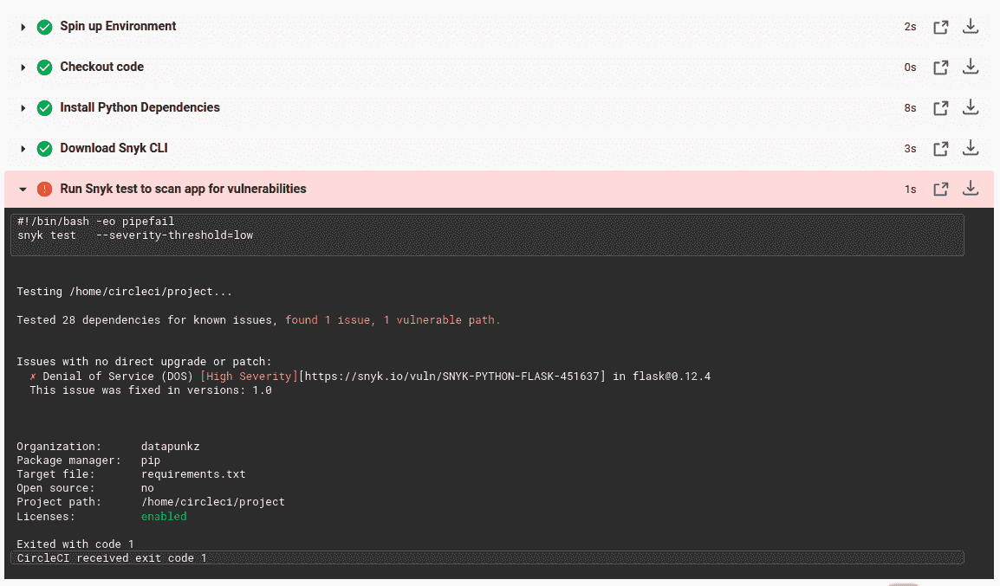
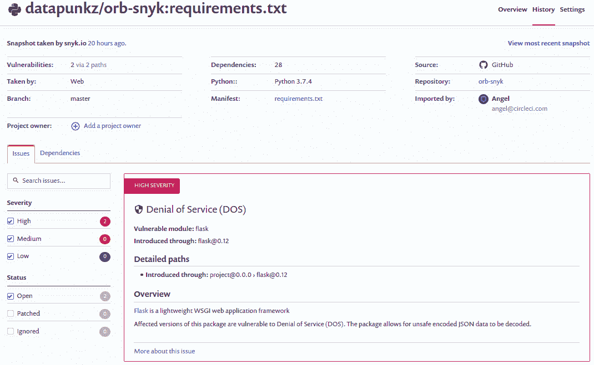
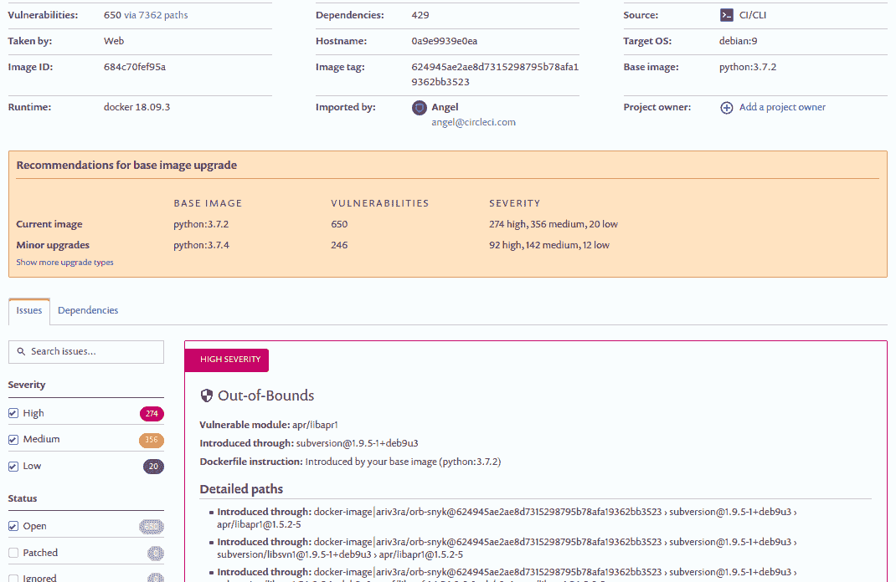

# 保护您的 CI/CD 渠道- DevSecOps | CircleCI

> 原文：<https://circleci.com/blog/adding-application-and-image-scanning-to-your-cicd-pipeline/#2019-10-25T00:10:00-07:00>

你听过有人说“安全是每个人的工作”吗？在我职业生涯的大部分时间里，我一直听到这样的话。像大多数有幸听到这句话的人一样，这句话主要是由安全团队成员说的，我也在听到这句话后翻了翻白眼。我记得自己被冒犯了，心想，“这个人有什么权利把他们的责任推卸给我？”直到我职业生涯的后期，在经历了几次安全事故后，我才意识到这句话的含义。他们说安全是每个人的工作，这是正确的。

## DevSecOps

DevSecOps 是将安全实践融入软件开发生命周期(SDLC)的哲学。这意味着在应用程序开发过程中添加安全检查，而不是事后才添加。将安全性构建到 DevOps 实践中并不是一个新概念，但是根据我的经验，安全性实践通常是在 SDLC 结束时附加的。

您可能会问，“只要安全操作已经完成，在哪里和什么时候执行安全操作有什么关系？”好吧，这里有一个场景可能会澄清一些事情。想象一下，你刚刚为一个项目开发了一些很棒的新功能。您已经编写了新的特性，编写了所有相应的测试，并且您的工作正在您的 [CI/CD](https://circleci.com/continuous-integration/) 平台上通过。您很高兴您的工作得到部署，但是在这个过程的最后，您的发布被安全标记。他们手动对您的软件进行了扫描，扫描报告了项目中使用的一些依赖关系库中的高风险漏洞。您现在必须修复所有的安全问题，然后重新运行整个过程。

DevOps 使我们能够快速高效地交付高质量的软件。然而，我上面提到的场景效率不高。将安全流程自动化并实施到 CI/CD 管道中可以解决这一问题。通过将安全扫描集成到 CI/CD 管道的各个部分，团队可以在开发过程的早期就注意到安全差异。修复易受攻击的库越早出现就越容易缓解。考虑到更新后的库不支持易受攻击版本中的一些功能，而这些功能在应用程序中被大量使用。这是一个很大的问题，它需要一些重新设计来适应更新库的变化，在开发过程中增加了意想不到的时间和精力。同样，将安全性集成到 CI/CD 管道中会在早期提醒您注意安全性问题，并使您能够在过程中尽早修复它们。

既然我已经分享了什么是 DevSecOps 以及它的一些好处，我想演示如何使用一个名为 [Snyk](https://snyk.io/) 的安全扫描工具轻松地将安全扫描添加到您的 CI/CD 管道中。

## Snyk

CircleCI 与许多安全公司合作，但出于本文的目的，我们将使用 Snyk 来集成安全检查。Snyk 使您能够发现，更重要的是，修复您的应用程序和容器中的已知漏洞。Snyk 是 CircleCI 的技术合作伙伴，他们创造了 T2 Snyk orb，使开发者能够将安全扫描添加到他们的 CI/CD 管道中。在这篇文章中，我将展示给你的管道增加安全性是多么容易。

## 先决条件

开始之前，您需要准备一些东西:

一旦完成了所有这些先决条件，我们就可以进入下一部分了。

## 没有安全性的基本管道配置

让我们从一个基本的管道配置开始，这样您就可以看到一个没有安全集成的管道。这些天我一直在使用 Python 应用程序，所以下面是一个不包含任何安全操作的 Python 应用程序的管道配置示例。

```
version: 2.1
jobs:
  build_test:
    docker:
      - image: circleci/python:3.7.4
    steps:
      - checkout
      - run:
          name: Install Python Dependencies
          command: |
            echo 'export PATH=~$PATH:~/.local/bin' >> $BASH_ENV && source $BASH_ENV
            pip install --user -r requirements.txt
      - run:
          name: Run Unit Tests
          command: |
            pytest
  build_push_image:
    docker:
      - image: circleci/python:3.7.4
    steps:
      - checkout
      - setup_remote_docker:
          docker_layer_caching: false
      - run:
          name: Build and Push Docker image to Docker Hub
          command: |
            echo 'export PATH=~$PATH:~/.local/bin' >> $BASH_ENV
            echo 'export TAG=${CIRCLE_SHA1}' >> $BASH_ENV
            echo 'export IMAGE_NAME=orb-snyk' >> $BASH_ENV && source $BASH_ENV
            pip install --user -r requirements.txt
            pyinstaller -F hello_world.py
            docker build -t $DOCKER_LOGIN/$IMAGE_NAME -t $DOCKER_LOGIN/$IMAGE_NAME:$TAG .
            echo $DOCKER_PWD | docker login -u $DOCKER_LOGIN --password-stdin
            docker push $DOCKER_LOGIN/$IMAGE_NAME
workflows:
  build_test_deploy:
    jobs:
      - build_test
      - build_push_image:
          requires:
            - build_test 
```

这种管道配置实现了以下功能:

*   安装在`requirements.txt`清单文件中定义的应用程序依赖项
*   执行应用程序的单元测试
*   为应用程序创建/构建新的 Docker 映像
*   将新创建的 Docker 映像发布到 Docker Hub 注册表以备后用

这个管道的目标是通过 Docker 映像构建、测试和部署代码。在这个过程中，没有任何安全或漏洞扫描。

## 启用安全的管道 Snyk 应用程序扫描

现在你已经看到了一个“不安全”的管道，它应该会让你起鸡皮疙瘩。接下来，我将向您展示一个支持安全的管道配置示例。

```
version: 2.1
orbs:
  snyk: snyk/snyk@0.0.8
jobs:
  build_test:
    docker:
      - image: circleci/python:3.7.4
    steps:
      - checkout
      - run:
          name: Install Python Dependencies
          command: |
            echo 'export PATH=~$PATH:~/.local/bin' >> $BASH_ENV && source $BASH_ENV
            pip install --user -r requirements.txt
      - snyk/scan
      - run:
          name: Run Unit Tests
          command: |
            pytest
  build_push_image:
    docker:
      - image: circleci/python:3.7.4
    steps:
      - checkout
      - setup_remote_docker:
          docker_layer_caching: false
      - run:
          name: Build and Push Docker image to Docker Hub
          command: |
            echo 'export PATH=~$PATH:~/.local/bin' >> $BASH_ENV
            echo 'export TAG=${CIRCLE_SHA1}' >> $BASH_ENV
            echo 'export IMAGE_NAME=orb-snyk' >> $BASH_ENV && source $BASH_ENV
            pip install --user -r requirements.txt
            pyinstaller -F hello_world.py
            docker build -t $DOCKER_LOGIN/$IMAGE_NAME -t $DOCKER_LOGIN/$IMAGE_NAME:$TAG .
            echo $DOCKER_PWD | docker login -u $DOCKER_LOGIN --password-stdin
            docker push $DOCKER_LOGIN/$IMAGE_NAME
workflows:
  build_test_deploy:
    jobs:
      - build_test
      - build_push_image:
          requires:
            - build_test 
```

在我解释这个管道中发生了什么之前，我想提一下 [Snyk 有许多功能](https://docs.snyk.io/)，但是为了这篇文章的目的，我只打算涵盖[应用程序](https://docs.snyk.io/features/snyk-cli/cli-reference/)和 [Docker 图像](https://snyk.io/docs/container-security-overview/)扫描。上面的例子演示了应用程序扫描。现在，我将解释为使管道更加安全而添加的新部件。

下面的管道块使用 [Snyk orb](https://circleci.com/developer/orbs/orb/snyk/snyk) 轻松地将 Snyk 工具集成到管道中。该块相当于脚本或编程语言中的 import 或 include 语句。在这个块中，您还声明了想要使用的 Snyk orb 的版本。

```
version: 2.1
orbs:
  snyk: snyk/snyk@0.0.8 
```

下一个管道块定义了用于运行构建的 Docker 映像。然后，它会将您的源代码`checkout`或“git 克隆”到容器中。接下来，`run:`块将安装在`requirements.txt`文件中列出的依赖项。该文件列出了您所有的应用程序库和依赖项，它们可以被认为是项目 Python 方面特有的[软件材料清单(SBOM)](https://en.wikipedia.org/wiki/Software_bill_of_materials) 。它还将软件列表提供给 Snyk，以便它知道要扫描和测试什么。

```
jobs:
  build_test:
    docker:
      - image: circleci/python:3.7.4
    steps:
      - checkout
      - run:
          name: Install Python Dependencies
          command: |
            echo 'export PATH=~$PATH:~/.local/bin' >> $BASH_ENV && source $BASH_ENV
            pip install --user -r requirements.txt 
```

下面您会发现之前讨论过的`requirements.txt`文件的内容。


下一个块是我们在管道中执行一些 DevSecOps 操作的地方。`- snyk/scan`从 Snyk orb 调用`scan`命令。它将读取`requirements.txt`文件，然后将该软件列表与 Snyk 漏洞数据库进行比较，寻找任何匹配。如果有任何匹配，Snyk 将对其进行标记，并使该管道段失败。这里的目标是尽早提醒团队注意安全问题，以便可以快速缓解这些问题，并安全地继续 CI/CD 流程。

```
 - snyk/scan
      - run:
          name: Run Unit Tests
          command: |
            pytest 
```

示例流水线配置的其余部分处理 Docker 映像构建段。

Snyk 应用程序安全扫描完成后，如果没有检测到漏洞，您的构建将通过。如果扫描检测到漏洞，构建将会失败。这是 Snyk orb 的默认行为(关于这些参数的更多细节，参见 [Snyk orb 参数](https://circleci.com/developer/orbs/orb/snyk/snyk))。随着扫描后管道的失败，Snyk 将提供一个关于构建失败原因的详细报告。

以下是 CircleCI 仪表板中报告的应用程序安全扫描失败的示例。



扫描结果提供了有关安全扫描的有用详细信息。它们表明该应用程序正在使用易受攻击的版本 [Flask 库](https://palletsprojects.com/p/flask/)，0.12.4。研究结果还提出了一个解决方案。该修复需要将 Flask 升级到较新的 1.0 版本。

您还可以从 Snyk 仪表板上看到这次失败扫描的结果。该仪表板具有更高层次的细节。下图显示了 Snyk 仪表板的示例。



安全扫描提供了对应用程序漏洞的洞察，以及如何缓解问题的有用建议，以便团队可以修复它们并继续下一个任务。有些修复比其他的更复杂，但是对问题的提醒是一个非常强大的特性。

## 安全启用管道 Snyk Docker 图像扫描

上面我已经讨论了 Snyk 应用程序扫描功能，现在我想讨论 Docker 图像扫描功能，它也可以轻松集成到 CI/CD 管道中。下面显示的`build_push_image:`块来自之前没有安全示例的**基本管道配置。**

```
 build_push_image:
    docker:
      - image: circleci/python:3.7.4
    steps:
      - checkout
      - setup_remote_docker:
          docker_layer_caching: false
      - run:
          name: Build and Push Docker image to Docker Hub
          command: |
            echo 'export PATH=~$PATH:~/.local/bin' >> $BASH_ENV
            echo 'export TAG=${CIRCLE_SHA1}' >> $BASH_ENV
            echo 'export IMAGE_NAME=orb-snyk' >> $BASH_ENV && source $BASH_ENV
            pip install --user -r requirements.txt
            pyinstaller -F hello_world.py
            docker build -t $DOCKER_LOGIN/$IMAGE_NAME -t $DOCKER_LOGIN/$IMAGE_NAME:$TAG .
            echo $DOCKER_PWD | docker login -u $DOCKER_LOGIN --password-stdin
            docker push $DOCKER_LOGIN/$IMAGE_NAME 
```

上面的运行块没有集成安全扫描。这增加了暴露 Docker 映像中严重漏洞的风险。Synk 的 Docker 图像扫描是检查您的 Docker 图像漏洞的重要功能。以下是如何将 Snyk Docker 图像扫描集成到您的管道配置中的示例。

```
 build_push_image:
    docker:
      - image: circleci/python:3.7.4
    steps:
      - checkout
      - setup_remote_docker:
          docker_layer_caching: false
      - run:
          name: Build and Scan Docker image
          command: |
            echo 'export PATH=~$PATH:~/.local/bin' >> $BASH_ENV
            echo 'export TAG=${CIRCLE_SHA1}' >> $BASH_ENV
            echo 'export IMAGE_NAME=orb-snyk' >> $BASH_ENV && source $BASH_ENV
            pip install --user -r requirements.txt
            pyinstaller -F hello_world.py
            docker build -t $DOCKER_LOGIN/$IMAGE_NAME -t $DOCKER_LOGIN/$IMAGE_NAME:$TAG .
      - snyk/scan:
          fail-on-issues: true
          monitor-on-build: true
          docker-image-name: $DOCKER_LOGIN/$IMAGE_NAME:$TAG
          target-file: "Dockerfile"
          project: ${CIRCLE_PROJECT_REPONAME}/${CIRCLE_BRANCH}-app
          organization: ${SNYK_CICD_ORGANIZATION}
      - run:
          name: Push Docker image to Docker Hub
          command: |
            echo $DOCKER_PWD | docker login -u $DOCKER_LOGIN --password-stdin
            docker push $DOCKER_LOGIN/$IMAGE_NAME 
```

上面的管道配置块示例与原始示例有很大不同，现在我将讨论这些不同之处。

下面的块是一个新的`- run:`块，它设置了一些环境变量，用于命名和版本化正在构建的 Docker 映像。这个块中的最后一行构建了图像。

```
 - run:
          name: Build and Scan Docker image
          command: |
            echo 'export PATH=~$PATH:~/.local/bin' >> $BASH_ENV
            echo 'export TAG=${CIRCLE_SHA1}' >> $BASH_ENV
            echo 'export IMAGE_NAME=orb-snyk' >> $BASH_ENV && source $BASH_ENV
            pip install --user -r requirements.txt
            pyinstaller -F hello_world.py
            docker build -t $DOCKER_LOGIN/$IMAGE_NAME -t $DOCKER_LOGIN/$IMAGE_NAME:$TAG . 
```

下面的下一个块是 Docker 图像安全扫描声明和执行的地方。`- snyk/scan:`与之前的 app 安全扫描中使用的命令相同，但有所不同。为了从`- snyk/scan:`命令执行 Docker 图像扫描，您必须声明并设置`docker-image-name:` 和`target-file:` 参数的值。同样，我建议你熟悉一下 [Snyk orb 参数](https://circleci.com/developer/orbs/orb/snyk/snyk)，以了解该工具的功能。

```
 - snyk/scan:
          fail-on-issues: true
          monitor-on-build: true
          docker-image-name: $DOCKER_LOGIN/$IMAGE_NAME:$TAG
          target-file: "Dockerfile"
          project: ${CIRCLE_PROJECT_REPONAME}/${CIRCLE_BRANCH}-app
          organization: ${SNYK_CICD_ORGANIZATION} 
```

下面是 CircleCI 仪表板中报告的管道内失败的 Docker 扫描的示例。显示的详细信息看起来与应用程序扫描相似，但绝对不同。它表明 Docker 映像中的漏洞源于基础映像，该映像是由语言维护者发布的。


与 Snyk 应用程序扫描一样，关于失败的 Docker 图像扫描的更多详细信息可以从 Snyk 仪表板中找到。Snyk 仪表板将包含缓解检测到的漏洞所需的所有详细信息。Snyk 仪表板中 Docker 图像扫描失败的示例如下所示。



最后一个流水线块访问 Docker Hub，并将扫描的 Docker 映像推送到并发布到 Docker Hub 注册表。这是在`build_push_image:`程序块中执行的最后一个命令。

```
 - run:
          name: Push Docker image to Docker Hub
          command: |
            echo $DOCKER_PWD | docker login -u $DOCKER_LOGIN --password-stdin
            docker push $DOCKER_LOGIN/$IMAGE_NAME 
```

## 包扎

在这篇文章中，我讨论了 DevSecOps 以及采用和集成到 CI/CD 管道中所带来的好处。将安全性集成到开发周期中的团队可以节省时间和精力，并避免潜在的安全事故。这意味着将安全扫描集成到 CI/CD 管道的每个可能的部分，以确保您的应用程序和基础架构得到适当的保护。

使用 CircleCI 合作伙伴的工具，如 Snyk 的 orb T1，将使团队能够轻松地将 DevSecOps 实践集成到他们的 CI/CD 管道中，保护他们的应用程序免受已知的威胁和漏洞。

你对这篇文章有什么反馈吗？欢迎在 twitter 上@我 [@punkdata](https://twitter.com/punkdata) 开始关于 DevSecOps 的对话。

感谢阅读！