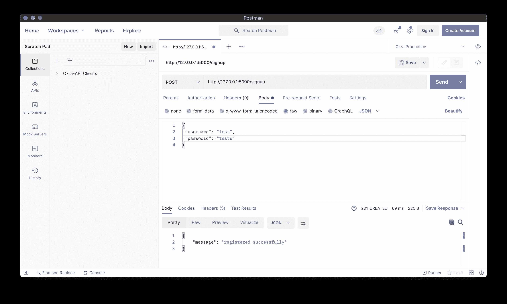
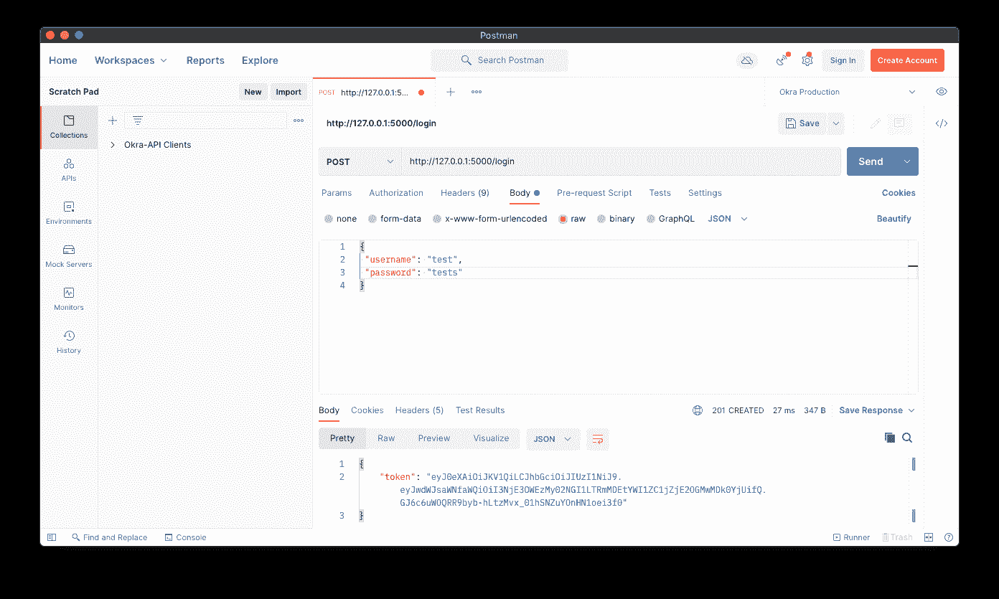
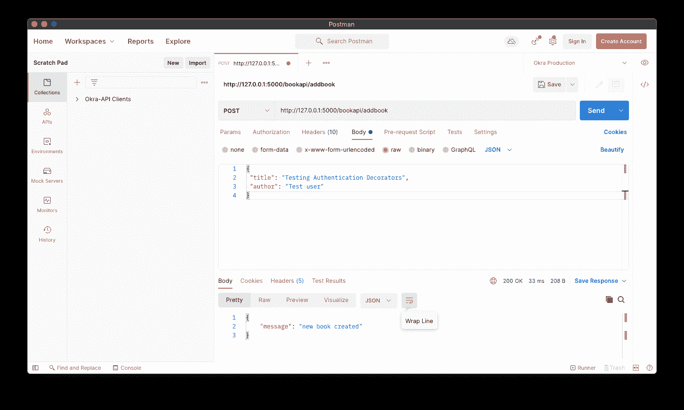
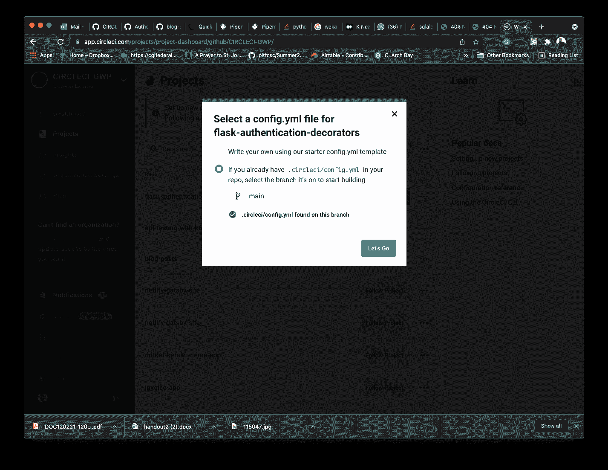

# 在 Flask | CircleCI 中使用身份验证装饰器

> 原文：<https://circleci.com/blog/authentication-decorators-flask/#2022-02-04T09:00:00-08:00>

> 本教程涵盖:
> 
> 1.  了解烧瓶装饰工
> 2.  编写认证装饰器
> 3.  设置和测试端点

您的团队是否开发了一个 API，并希望(以某种方式)实现更强大的安全特性？如果您对 API 中的安全级别不满意，有改进它的解决方案！在本教程中，我将引导您完成创建 API 端点的过程，这些端点使用身份验证令牌进行保护。使用这些端点，我们将能够只为经过身份验证的用户向 Flask API 发出请求。

## 先决条件

要完成本教程，您需要:

> 我们的教程是平台无关的，但是使用 CircleCI 作为例子。如果你没有 CircleCI 账号，请在 注册一个免费的 [**。**](https://circleci.com/signup/)

## 使用 Flask API 示例项目

我们将在本教程中使用的应用程序是一个简单的图书管理 API。我们将使用这个 API 来创建、阅读和删除书籍。在本教程中，我们将不会关注开发 API 端点的过程，而是关注通过强制使用认证令牌来确保端点安全的过程。值得注意的是，本教程的重点是如何在 Flask 中使用和配置身份验证令牌，而不是令牌的结构或各种令牌配置，例如它们何时过期或它们的组成。关于创建和配置令牌过程的更多细节，您可以在 [PyJWT 文档](https://pyjwt.readthedocs.io/en/stable/)中阅读更多内容。

### 克隆示例项目

要克隆项目，请在终端中运行以下命令:

```
$ git clone https://github.com/mwaz/flask-authentication-decorators.git

$ cd flask-authentication-decorators 
```

现在，您可以访问我将在本教程的剩余部分中引用的代码库。在我们开始之前，让我解释一下什么是装饰者。

## 了解烧瓶装饰工

装饰器是一个函数，它接受另一个函数作为参数，然后返回一个函数。这是可能的，因为 Python 赋予函数特殊的地位。一个函数可以被用作参数*和返回值*，同时也被赋值给一个变量。换句话说，装饰者总是扩展一个函数的行为，而不修改那个函数的行为。

您可能用过的一个烧瓶装饰器的例子是用于定义路线的`@app.route(‘/’)`。当向浏览器显示输出时，这个装饰器将函数转换成浏览器可以访问的路由，而不必在程序中显式调用函数。


该工作流程图显示了装饰器函数是如何执行的，以及它是如何在请求可以继续或响应被返回之前强制要求的。

## 在 Flask API 上设置身份验证装饰器

现在我们可以探索如何使用 decorators 进行身份验证。

端点必须先经过身份验证，然后才能在应用程序中发出请求。身份验证意味着端点具有现有会话，并且对于特定用户是唯一的。

您可以为经过身份验证的用户设置额外的角色，比如具有提升权限的管理员角色。这样，装饰者可以锁定某些资源，这些资源应该只由一种类型的用户(例如，管理员)访问。把它想象成一家银行。所有员工都可以进入银行，但并不是所有人都有授权交易的特权。

例如，`@login_required` decorator 将在每次调用路由时执行。下面的代码片段展示了这是如何实现的:

```
# Decorator usage on an endpoint
@app.route("/bookapi/books/<int:book_id>") 
@login_required
def add_book():
      # Adding a book requires that the endpoint
      # is authenticated
	return book[book_id] 
```

装饰器`@login_required`用于保护 Flask 应用程序中的`bookapi/books/:bookid`路径。它强制执行一条规则，即客户端必须通过有效登录用户的身份验证，或者拥有一个现有令牌。对于要执行的`add_book()`方法，请求必须首先通过已定义的装饰器来验证它是否具有所需的访问权限。

**注意:***decorator 可以协助实现干代码原则，比如接受来自查询、JSON 或者带有类型检查的表单请求的输入。在这种情况下，如果装饰器的输入不正确，或者缺少必需的输入，就会出现错误。*

## 编写认证装饰器

使用您之前克隆的 API，您可以生成我们自己的定制装饰器。这个装饰器将通过要求用户提供由 [PyJWT](https://pyjwt.readthedocs.io/) 提供的认证令牌来强制授权。生成的令牌将只允许注册和登录的用户在我们的端点中创建和查看图书。

这看起来很复杂，但是我们可以一步一步来。首先使用以下代码片段创建您的身份验证装饰器:

```
# Authentication decorator
def token_required(f):
    @wraps(f)
    def decorator(*args, **kwargs):
        token = None
        # ensure the jwt-token is passed with the headers
        if 'x-access-token' in request.headers:
            token = request.headers['x-access-token']
        if not token: # throw error if no token provided
            return make_response(jsonify({"message": "A valid token is missing!"}), 401)
        try:
           # decode the token to obtain user public_id
            data = jwt.decode(token, app.config['SECRET_KEY'], algorithms=['HS256'])
            current_user = User.query.filter_by(public_id=data['public_id']).first()
        except:
            return make_response(jsonify({"message": "Invalid token!"}), 401)
         # Return the user information attached to the token
        return f(current_user, *args, **kwargs)
    return decorator 
```

**注意:** *这段代码片段位于克隆的存储库中的`library/models.py`中。*

这段代码首先检查我们的请求头中是否有一个名为`x-access-token`的令牌。如果没有，它会发送一个响应，指出请求中缺少有效的令牌。

当请求中出现有效的令牌头时，使用我们的应用程序`SECRET_KEY`对其进行解码。然后，提取与解码数据相关联的用户的`public_id`。这是装饰器返回的内容。

## 创建身份验证令牌

现在，您有了一个装饰器来确保您的受限端点在发出请求之前有一个有效的访问令牌。接下来，我们需要在端点中利用创建的装饰器。要完成这项任务，我们需要回答两个问题:

*   令牌是如何生成的？
*   如何在请求方法上调用装饰器？

### 如何创建访问令牌

在确定令牌是否有效时，登录过程是最重要的考虑因素之一。登录过程中生成的令牌与我们的 decorator 方法解码时收到的令牌相同。

以下是创建令牌所需的内容:

```
# Login method responsible for generating authentication tokens
@app.route('/login', methods=['POST'])
def login():
    auth = request.get_json()
    if not auth or not auth.get('username') or not auth.get('password'):
        return make_response('Could not verify!', 401, {'WWW-Authenticate': 'Basic-realm= "Login required!"'})

    user = User.query.filter_by(username=auth['username']).first()
    if not user:
        return make_response('Could not verify user, Please signup!', 401, {'WWW-Authenticate': 'Basic-realm= "No user found!"'})

    if check_password_hash(user.password, auth.get('password')):
        token = jwt.encode({'public_id': user.public_id}, app.config['SECRET_KEY'], 'HS256')
        return make_response(jsonify({'token': token}), 201)

    return make_response('Could not verify password!', 403, {'WWW-Authenticate': 'Basic-realm= "Wrong Password!"'}) 
```

这段代码的作用:

1.  验证用户名和密码是否已随请求一起传递。如果没有，则向用户返回一个错误。
2.  验证用户名是否存在；如果没有，用户会收到注册账户的提示。
3.  检查存储在数据库中的哈希密码是否与提供的密码哈希相同。如果是这种情况，则通过对用户的`public_id`和`SECRET_KEY`进行编码来创建令牌。这些是在解码来自请求的提供的`x-access-token`时使用的相同成分。

如果用户名和密码与数据库中已经存储的值相匹配，代码将生成一个访问令牌，您可以在接下来的步骤中使用它来访问 API 资源。

**注意:** *我们只能比较密码散列，因为使用相同的散列算法，两个散列文本将总是具有相同的散列结果。另一方面，解码散列密码文本以将其还原为纯密码文本并将其与实际密码进行比较需要太多的计算能力(使用好的算法，这几乎是不可能的)。*


此流程图显示，一旦身份认证过程成功，就会创建一个令牌并发送给用户。这是用于访问受限端点的令牌。

您可以通过向`signup`和`login`端点发出 CURL 请求来验证这个流。然后，确保您可以创建一个新用户，并使用详细信息让该用户登录并获得一个令牌。





好啊，你有代币了！现在可以投入使用了。

## 在 API 端点中使用身份验证装饰器

在前面的步骤中，您已经创建了一个令牌，并且还解码了该令牌以获得身份验证装饰器的用户信息。现在，您可以开始将身份验证装饰器集成到 API 端点的过程了。

```
# Endpoint to delete a book
@app.route('/bookapi/books/<book_id>', methods=['DELETE'])
@token_required
def delete_book(book_id): 

   book = BookModel.query.filter_by(id=book_id).first()  
   if not book:  
       return jsonify({'message': 'book does not exist'})  

   db.session.delete(book) 
   db.session.commit()  
   return jsonify({'message': 'Book deleted'}) 
```

这段代码片段向`bookapi/books/:bookid`端点发出 API 请求，并调用`@token_required`装饰器。一旦装饰器被调用，它将验证请求在请求头中有一个有效的`x-access-token`令牌。如果请求中传递的令牌有效，则发送对已删除图书的成功请求的响应。

就这样，您拥有了一个经过身份验证的端点，只有拥有有效令牌的用户才能访问它！您可以通过向 API 端点发出 CURL 请求来创建和获取已创建的图书，从而再次验证这一点。



**注意** : *大多数令牌都是以 JWT (JSON Web Tokens)格式创建的。JWT 是一种开放标准，用于在双方之间共享安全信息，例如在客户端和服务器之间。*

## 测试需要身份验证令牌的端点

俗话说，不测试代码，开发就不会完整。我们的下一步是为使用认证装饰器的端点创建测试。我们将使用 [pytest](https://pytest.org/) 来创建测试。

**注** : *测试可以在`tests/test_book_api.py`文件下的克隆项目根目录下找到。*

首先定义一个方法，在我们每次执行测试时让用户登录，以确保有一个有效的令牌。这段代码片段展示了如何:

```
# Method in test file to generate a user token
def getLoginToken(self):
        """"Method to get a login token
        """
        user_register = self.client().post('/signup', data=self.user_details, content_type="application/json")
        self.assertEqual(user_register.status_code, 201)
        user_login = self.client().post('/login', data=self.user_details, content_type="application/json")
        self.assertEqual(user_login.status_code, 201)
        token = ast.literal_eval(user_login.data.decode())
        return token['token'] 
```

在这个代码片段中，我们使用 pytest 的`app.client()`方法向我们的 API 发出一个请求，创建一个用户并使用同一个用户登录以获得身份验证令牌。一旦我们有了令牌，我们现在就可以在测试中使用它来发出请求。

**注意** : *为了确保数据不被破坏，我们总是在每次测试运行时删除测试数据库并添加一个新用户。这由`test_db`处理，因为将测试数据库用作试运行/开发数据库是反实践的。*

一旦我们有了令牌，在测试中发出 API 请求就很简单了。只需通过您的测试客户机发出请求，并在头部请求中传递令牌。这段代码片段展示了如何:

```
# Test to ensure that a user can get all books from the app
def test_user_logged_in_user_can_get_books(self):
      """"Method to test fetching books with logged in user
      """
      logintoken = getLoginToken(self) # Get a login token from our method
      headers = {
          'content-type': "application/json",
          'x-access-token': logintoken # pass the token as a header
      }
      fetch_books = self.client().get('/bookapi/books', data=self.user_details, content_type="application/json", headers=headers)
      response = fetch_books.data.decode()
      self.assertEqual(fetch_books.status_code, 200)
      self.assertEqual(ast.literal_eval(response), {"Books":[]}) 
```

在上面的代码片段中，我们首先获得一个登录令牌，然后向`/bookapi/books`端点发出请求。然后我们断言响应代码是`200`，并且`response`是一个空的图书列表，因为我们还没有创建任何图书。

同时，我们还可以测试没有有效令牌的用户无法访问 books 端点。让我们在下面的代码片段中看到这一点。

```
# Test to ensure that a user without a valid token cannot access the books endpoint
def test_user_without_valid_token_cannot_get_books(self):
        """Method to check errors with invalid login
        """
        headers = {
            'content-type': "application/json",
            'x-access-token': 'invalid-token'
        }
        fetch_books = self.client().get('/bookapi/books', data=self.user_details, content_type="application/json", headers=headers)
        response = fetch_books.data.decode()
        self.assertEqual(fetch_books.status_code, 401)
        self.assertEqual(ast.literal_eval(response)['message'], 'Invalid token!') 
```

在下面的代码片段中，我们没有在要传递给`/bookapi/books`端点的头中将有效的令牌传递给`x-access-token`，而是传递了一个无效的令牌，由于令牌无效，这将导致一个`401`错误。

为了验证上述测试是否有效，我们可以在终端中运行以下命令来执行测试:

```
pipenv run pytest 
```

为了学习和获得更多图书管理 API 的测试示例，您可以查看我们克隆的存储库中的`tests/test_book_api.py`文件的完整实现。

既然我们知道了如何创建认证令牌，如何用 decorators 对它们进行解码，以及如何在我们的 API 端点中使用它们，那么我们需要一种合适的方式在云中运行我们的测试。更简单的方法是使用`pytest`命令在本地运行它们，但是我们希望向全世界展示它们。为了实现这一点，我们需要将我们的测试与 CI/CD 工具集成在一起，在我们的例子中就是 CircleCI。

CircleCI 给了我们测试工作的信心，这提高了信任度，尤其是当我们进行持续集成和持续部署的时候。

## 设置 CircleCI

要设置 CircleCI，提交您的工作并[将您的更改推送到 GitHub](https://circleci.com/blog/pushing-a-project-to-github/) 。

**注意** : *如果您已经克隆了项目存储库，那么您可以跳过这部分教程。如果你想学习如何建立自己的项目，我在这里添加了一些步骤。*

登录 CircleCI 并转到项目仪表板。您可以从与您的 GitHub 用户名或您的组织相关联的所有 GitHub 存储库列表中选择您想要设置的存储库。本教程的项目名为`flask-authentication-decorators`。在“项目”面板上，选择设置所需项目的选项。选择使用现有配置的选项。然后在提示符下选择开始构建过程的选项。



**注意:** *在启动构建之后，预计您的管道会失败。您仍然需要将定制的`.circleci/config.yml`配置文件添加到 GitHub 中，以便正确构建项目。*

### 编写 CI 管道

在根目录下创建一个`.circleci`目录，然后添加一个`config.yml`文件。配置文件保存每个项目的 CircleCI 配置。使用此代码:

```
version: 2.1
orbs:
  python: circleci/python@1.2

workflows:
  build-app-with-test:
    jobs:
      - build-and-test
jobs:
  build-and-test:
    docker:
      - image: cimg/python:3.9
    steps:
      - checkout
      - python/install-packages:
          pkg-manager: pipenv
      - run:
          name: Run tests
          command: pipenv run pytest 
```

在上面的配置中，CircleCI 使用了 python 版本的`3.9`。我们使用`pipenv`包管理器来安装依赖项。我们也使用`pytest`包来运行我们的测试。一旦安装了所有的依赖项，并且设置了环境，使用`pipenv run pytest`命令执行。

添加这个配置后，将您的更改推送到 GitHub。CircleCI 将在构建 Python 映像后开始执行测试。因为在`tests`目录中已经有了测试，最后一个命令将执行这些测试，您的管道将通过。


瞧啊。您已经成功地设置了 CircleCI 管道，以便在云中运行测试。这使得我们的身份验证装饰者使用 Flask 的旅程接近尾声，至少现在是这样。

## 结论

恭喜你走到这一步！在本教程中，我们已经学习了如何创建自定义身份验证装饰器，并在我们的 API 中使用它们来接收和解码来自注册用户的登录过程中的 JWT 令牌。我们还学习了如何使用`headers`将认证令牌传递给 API，期望应用程序收到的请求具有相同的头。最后，我们了解了如何通过确保使用身份验证装饰器保护端点来实施身份验证。作为奖励，您可以向您的团队展示如何设置 CircleCI 和执行自动化测试。如果您还没有为您的应用程序采用持续集成和持续部署，这是一个很好的时机。

我希望你像我写这篇教程一样喜欢它。下次见！

* * *

Waweru Mwaura 是一名软件工程师，也是一名专门研究质量工程的终身学习者。他是 Packt 的作者，喜欢阅读工程、金融和技术方面的书籍。你可以在[他的网页简介](https://waweruh.github.io/)上了解更多关于他的信息。

[阅读更多 Waweru Mwaura 的帖子](/blog/author/waweru-mwaura/)