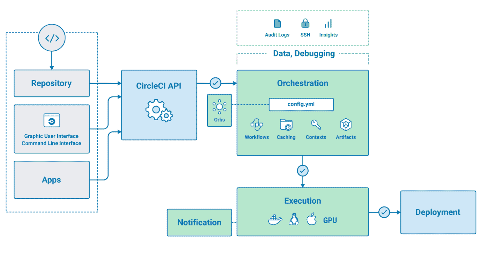
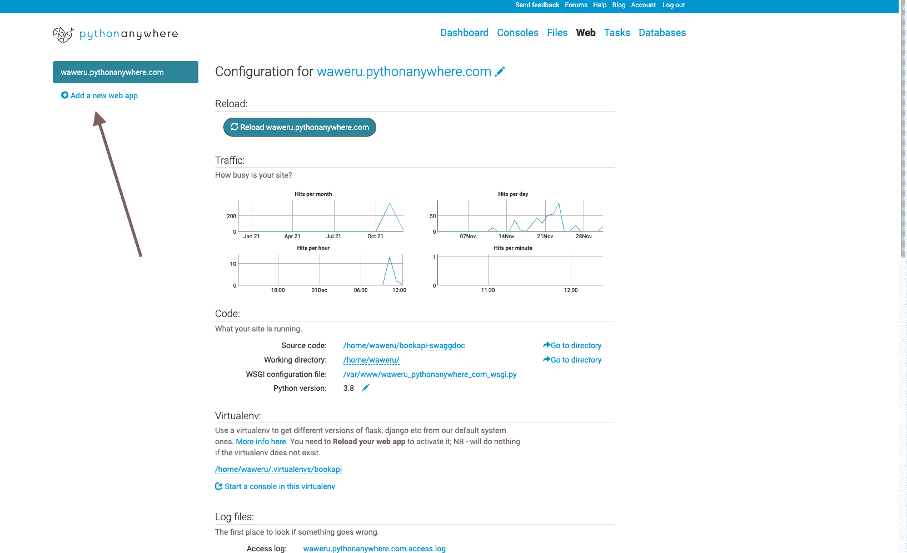
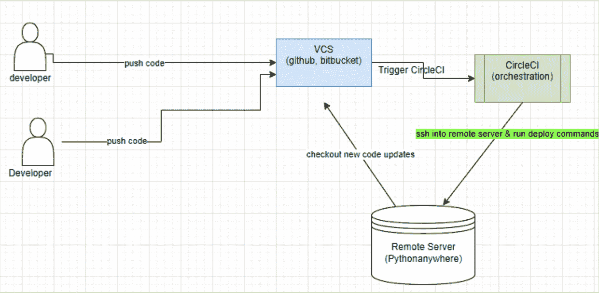
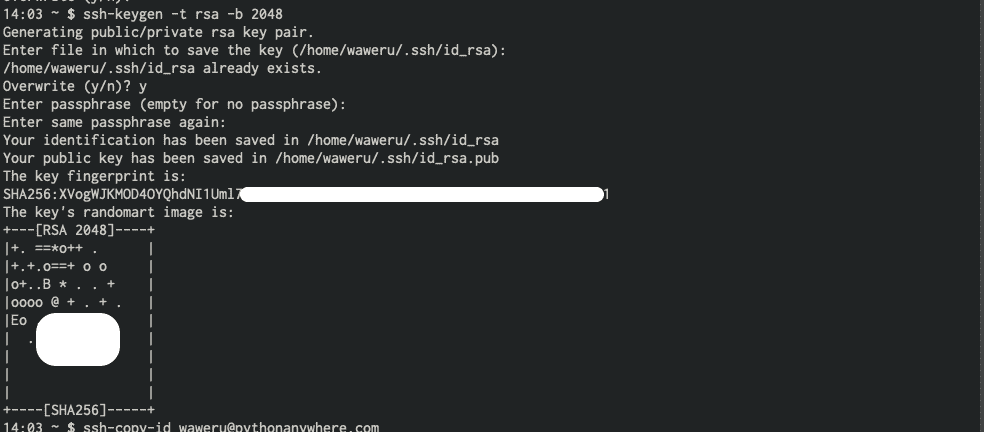
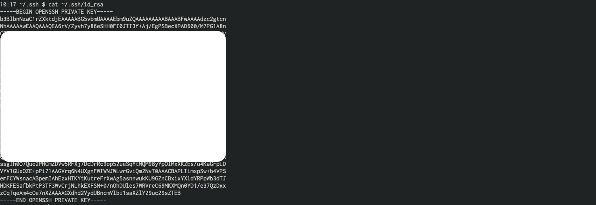
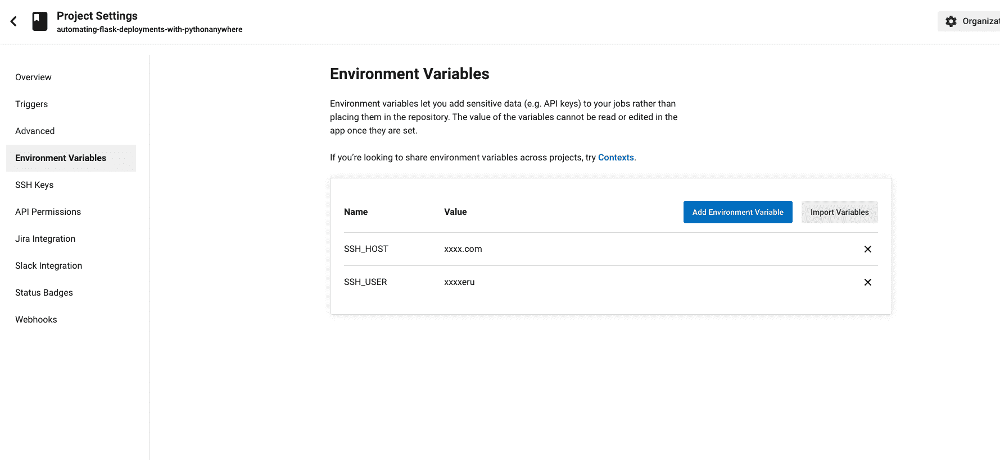
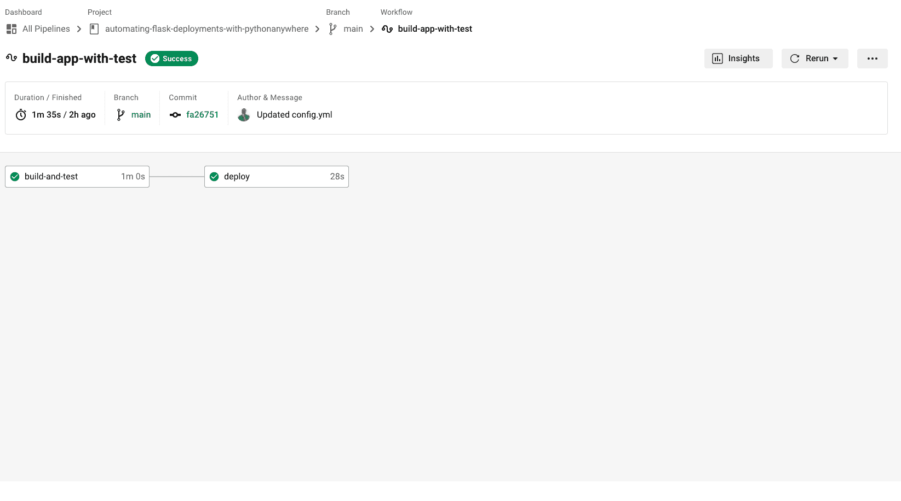
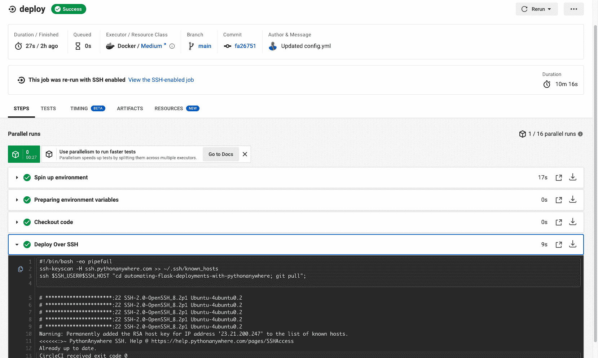

# 使用 PythonAnywhere | CircleCI 自动化烧瓶部署

> 原文：<https://circleci.com/blog/automating-flask-deployments-with-pythonanywhere/#2022-04-25T09:00:00-07:00>

> 本教程涵盖:
> 
> 1.  设置 PythonAnywhere
> 2.  在 CircleCI 建立一个烧瓶项目
> 3.  使用 CircleCI 自动将 Flask 部署到 PythonAnywhere

既然开发团队已经了解了 CI/CD，那么部署就没有理由成为一个耗时而繁琐的过程。CI/CD 可能从持续测试开始，但是添加自动化部署会将您的 CI/CD 实践带到下一个级别。

持续部署缩短了发布时间，因此您可以花更多时间来提高应用程序的质量。在本教程中，我将指导您使用自动连续部署将 Flask 应用程序部署到 PythonAnywhere。我希望在我们结束本教程时，你能感觉像一个“摇滚明星”级别的 CI/CD 从业者。

## 先决条件

开始之前，请确保这些项目已准备就绪:

> 我们的教程是平台无关的，但是使用 CircleCI 作为例子。如果你没有 CircleCI 账号，请在 注册一个免费的 [**。**](https://circleci.com/signup/)

我在本教程中使用的示例应用程序是一个 Flask API。Flask 应用程序公开了一个 Swagger API，我们可以用它来创建和检索书籍。通过克隆这个 GitHub 库获得应用程序的源代码:`git clone git@github.com:mwaz/automating-flask-deployments-with-pythonanywhere.git`

您将只为 PythonAnywhere 配置使用克隆的存储库，这将在本教程的后面部分介绍。

## 什么是 PythonAnywhere？

PythonAnywhere 是一个托管平台，是 AWS、Azure、Google Cloud 或 Heroku 等平台的替代平台。PythonAnywhere 平台为在线开发和部署提供了一个基于云的、易于使用的工具。

### 自动化部署到 PythonAnywhere

自动化持续部署到 PythonAnywhere 为开发人员提供了许多好处:

*   设置简单快捷
*   专为性能打造
*   开源项目免费

我创建了一个流程图(以 CircleCI 为例),展示了如何自动连续部署到 PythonAnywhere。该过程可以适用于任何 CI/CD 工具和任何其他托管平台。



该图显示了如何通过 CircleCI web 界面和配置文件使用 CircleCI API 来配置部署作业。该图还显示了从高级视图执行所有 CircleCI 步骤和服务的过程。请注意从应用程序克隆到准备部署再到部署应用程序之间的上下文分离。

## 设置 PythonAnywhere

PythonAnywhere 使入门和设置变得简单。PythonAnywhere 平台:

*   附带预安装的 Python 库
*   允许您为应用程序设置不同的环境
*   支持调度任务，如常规数据库清理或使用 cron 作业执行重复性任务

登录到您注册的 PythonAnywhere 黑客帐户后，打开`web`选项卡并创建一个新的`webapp`。对于这个项目，使用手动配置选项。这允许您设置一个虚拟环境并安装特定于项目的附加库。



安装完成后，您将被重定向到 web 应用程序的仪表板。您可以使用仪表板，通过控制台界面进一步配置您的应用程序。


从控制台，您可以使用特定的 python 版本声明版本:`3.9`为您的应用程序创建一个虚拟环境。运行以下命令:

```
mkvirtualenv flask-venv --python=’/usr/bin/python3.9 
```

### 将应用程序克隆到 PythonAnywhere 控制台

接下来，将应用程序从 GitHub 克隆到 PythonAnywhere 控制台。这是重要的一步，因为它还设置了远程`push`和`pull` GitHub 链接，我们稍后将使用这些链接从 GitHub 中提取更改。在控制台上运行以下命令:

`git clone https://github.com/mwaz/automating-flask-deployments-with-pythonanywhere.git`

### 安装依赖项

更改目录:`cd automating-flask-deployments-with-pythonanywhere`使用:`pip install pipenv`安装 pipenv 软件包管理器

安装所有依赖项:`pipenv install`

克隆 Flask 应用程序后，您需要告诉 PythonAnywhere 您的项目所在的位置。为此，使用 **Web** 选项卡配置位置。不关闭 bash 控制台(在最右边的 hamburger 菜单上)，打开 **Web** 选项卡，设置项目的源代码路径、虚拟环境路径和静态文件，包括 Swagger UI YAML 文件。


将源代码路径设置为:`/home/<username>/<project-name>`

创建虚拟环境后，您可以用它打开控制台。现在你可以忽略这个选项。

**注意:** *要获取工作目录路径，使用 bash `$pwd`命令查找父目录。*

恭喜你！您的 Flask 项目已经在 PythonAnywhere 上设置并成功托管。打开 web 应用程序的链接，查看默认的 PythonAnywhere 屏幕。


到目前为止做得很好，但是还有一些步骤要做。

应用程序的页面显示 PythonAnywhere 的默认欢迎消息。要打开 Flask 应用程序，需要对 PythonAnywhere 的配置文件进行一些更改。

从仪表板打开 WSGI 配置文件，并修改配置。


WSGI (Web 服务器网关接口)是 Web 服务器的 Python 接口。它允许您编写可以在服务器上运行的 Python 代码，并用于配置 web 服务器。使用 WSGI，您可以将请求从 web 服务器转发到 Flask 后端，并从 web 服务器转发回请求者。

要执行 Flask 应用程序，请删除配置文件中的`hello world`代码。

此外，配置项目目录的路径和应用程序的入口点:

```
import sys

# add your project directory to the sys.path
project_home = '/home/waweru/automating-flask-deployments-with-pythonanywhere'
if project_home not in sys.path:
    sys.path = [project_home] + sys.path

# import flask app but need to call it "application" for WSGI to work
from run import app as application 
```

保存更改并关闭文件。接下来，您需要重新加载应用程序，并在 URL 后面添加后缀`api-docs`。加载您的 Flask Swagger 文档页面。


您已经成功地将 Flask 应用程序部署到 PythonAnywhere。

接下来，您需要配置您的应用程序，以便在您每次向主分支进行部署时，CircleCI 会自动进行部署。

## 设置 CircleCI 集成

要在这个项目中设置 CI/CD，使用`ssh`连接到 PythonAnywhere 服务器。这确保了一旦 CircleCI 执行，如果管道运行成功，您可以从主 GitHub 分支获取最新的更改。

**注:** *SSH 也称为安全 Shell 或安全套接字 Shell，是一种用于操作网络服务以在不安全的网络上安全连接的网络协议。ssh 的应用包括:远程命令行登录和远程命令执行。*

下图显示了如何使用 ssh 将 CI/CD 应用于 CircleCI 和 PythonAnywhere。



该图显示，当您将代码推送到 GitHub 时，它会启动一个进程将代码部署到 PythonAnywhere。一旦部署完成，您就可以连接到 PythonAnywhere 服务器，并从主分支获取最新的代码。现在您已经知道了它是如何工作的，下一步是编写一个 CircleCI 配置文件来实现它。

## 初始化仪表板上的 CircleCI

要在 CircleCI 设置任何项目，请从 CircleCI [仪表板](https://app.circleci.com/)开始。转到项目部分。列出了与您的 GitHub 用户名或组织相关的所有 GitHub 存储库。对于本教程，您想要设置的存储库是`automating-flask-deployments-with-pythonanywhere`。

在“项目”面板上，选择设置所选项目的选项。选择使用现有配置的选项。第一个配置步骤已经完成。

**注意:** *如果您已经克隆了这个库，这不是一个必须的步骤，但是对于您学习如何在您自己的项目中设置它来说，这是一个重要的步骤。*

首先，在您的根目录中创建一个`.circleci`目录，并添加一个`config.yml`文件。配置文件将包含每个项目的 CircleCI 配置。设置好之后，您可以在配置中使用 CircleCI orbs 来执行 Python API 测试。

## 设置 CircleCI

您的 CircleCI 配置文件将执行您的测试并将您的应用程序部署到 PythonAnywhere。在`.circleci/config.yaml`文件中，输入:

```
version: 2.1
orbs:
  python: circleci/python@1.2

workflows:
  build-app-with-test:
    jobs:
      - build-and-test
      - deploy:
          requires:
            - build-and-test
jobs:
  build-and-test:
    docker:
      - image: cimg/python:3.9
    steps:
      - checkout
      - run:
          name: Install dependencies
          command: |
            pipenv --three
            pipenv install
      - run:
          name: Run tests
          command: pipenv run pytest
  deploy:
    docker:
      - image: cimg/python:3.9
    steps:
      - checkout
      - run:
          name: Deploy Over SSH
          command: |
            ssh-keyscan -H ssh.pythonanywhere.com >> ~/.ssh/known_hosts
            ssh $SSH_USER@$SSH_HOST "cd automating-flask-deployments-with-pythonanywhere; git pull"; 
```

在这个 CircleCI 配置中，您将创建两个作业。第一个作业是构建作业，负责安装依赖项和运行测试。部署作业只负责将应用程序部署到 PythonAnywhere。运行构建和测试作业，然后运行部署作业，确保只有在测试成功后才进行部署。

```
jobs:
  - build-and-test
  - deploy:
      requires:
        - build-and-test 
```

测试通过后，您可以使用部署作业将应用程序部署到 PythonAnywhere。要允许部署应用程序，您需要在 PythonAnywhere 帐户中生成 SSH 密钥，然后将该私钥添加到 GitHub 帐户中。

### 生成 SSH 密钥

您不希望总是使用密码来连接到 PythonAnywhere。要允许连接到 PythonAnywhere 而不需要每次都输入密码，您可以在 PythonAnywhere 控制台上生成 SSH 密钥。从 PythonAnywhere 控制台，运行以下命令:

```
ssh-keygen -t rsa -b 2048 
```

系统将提示您输入密码以增强安全性。您可以添加此项，也可以留空。



太好了！您已经生成了您的密钥。现在您可以在 CircleCI 中使用它们来自动连接到 PythonAnywhere。我将在下一节讨论这个问题。

首先，您需要 PythonAnywhere 知道您的公钥是一个授权的密钥。使用以下命令将公钥添加到 PythonAnywhere 控制台中的`~/.ssh/authorized_keys`:

```
ssh-copy-id waweru@ssh.pythonanywhere.com 
```

系统将提示您输入密码。一旦获得授权，您就可以连接到 PythonAnywhere，再也不用使用密码了。酷吧？通过在 PythonAnywhere 控制台中运行以下命令进行测试:

```
ssh -i ~/.ssh/id_rsa_pub waweru@ssh.pythonanywhere.com 
```

这个命令应该可以让您从控制台登录到 PythonAnywhere 服务器，而无需输入密码。下一步是向 CircleCI 添加 SSH 密钥。

### 向 CircleCI 添加 SSH 密钥

按照上一节中的步骤，您能够为 PythonAnywhere 帐户生成私钥和公钥。现在您可以将您的私钥复制到 CircleCI。

为了避免增加服务器的开销，您可以只显示私钥，然后将其复制到剪贴板。在 PythonAnywhere 控制台中，输入以下命令:

```
 cat ~/.ssh/id_rsa 
```



将您的私钥复制到剪贴板后，导航到您项目的 CircleCI 项目设置，并在那里添加私钥。


### 使用 CircleCI 部署

部署到 CircleCI 的基本设置已经完成。返回到 CircleCI `config.yml`文件中的`Deploy Over SSH`配置步骤。使用[键扫描](https://circleci.com/docs/gh-bb-integration/#establishing-the-authenticity-of-an-ssh-host)步骤`ssh-keyscan -H ssh.pythonanywhere.com >> ~/.ssh/known_hosts`。这将获取 PythonAnywhere 帐户的 SSH 密钥，并将它们添加到部署作业的 runners `~/.ssh/known_hosts`文件中。

然后使用 SSH 进行身份验证，并使用以下命令从 GitHub 获取代码:

```
ssh $SSH_USER@$SSH_HOST "cd automating-flask-deployments-with-pythonanywhere; git pull"; 
```

注意，我们使用`$SSH_USER`和`$SSH_HOST`变量来进行认证，同时屏蔽 SSH 用户和主机名。我们通过在环境变量下的 CircleCI 设置页面中添加`SSH_USER`和`SSH_HOST`来实现这一点。你可以在这里阅读更多关于添加变量[的内容。](https://circleci.com/docs/env-vars/#adding-environment-variables)



通过 SSH 访问 PythonAnywhere 的`SSH_HOST`是`ssh.pythonanywhere.com`。`SSH_USER`是您的 PythonAnywhere 帐户的用户名。

现在您应该能够使用 CircleCI 将您的应用程序部署到 PythonAnywhere 了。



如前所述，部署作业在构建和测试作业之后运行。这是因为部署作业要求构建和测试作业通过，如果构建和测试作业失败，部署作业也会失败。



## 在 PythonAnywhere 上重新加载应用程序

要验证您的应用程序是否成功部署到 PythonAnywhere，您需要使用 PythonAnywhere 仪表板手动重新加载。您可以通过在 PythonAnywhere 帐户中创建一个 bash 脚本来避免这一步。该脚本会在部署后自动重新加载应用程序。调用这个脚本`reload.sh`，并添加命令来重新创建或更新`<username>_pythonanywhere_com_wsgi.py`文件。该命令控制应用程序的重新加载。

```
#!/bin/bash
touch var/www/<username>_pythonanywhere_com_wsgi.py 
```

将脚本添加到根文件夹中的`reload.sh`后，使用 PythonAnywhere 控制台使其可执行。在控制台中，运行以下命令:

```
chmod +x reload.sh 
```

每当在 PythonAnywhere 中检测到更改时，该命令使脚本在 bash 中可执行。现在，每次启动部署时，脚本都将被执行，应用程序也将被重新加载。祝贺您实现了我们使用 PythonAnywhere 实现自动化部署的目标！

## 结论

通过本教程，您已经能够学习如何为部署准备应用程序、配置 PythonAnywhere 环境以及使用 SSH 自动化部署。本教程还解释了 SSH 密钥在部署到 PythonAnywhere 中的重要性。如果满足所有参数(包括通过测试和 CircleCI 作业),您可以设置应用程序进行部署，从而丰富您的 CI/CD 实践知识。您了解了如何在每次部署后在 PythonAnywhere 上自动重新加载。我希望你喜欢这个教程，可以和你的团队一起使用它来提高你的 CI/CD 实践水平。直到下次，继续编码！

* * *

Waweru Mwaura 是一名软件工程师，也是一名专门研究质量工程的终身学习者。他是 Packt 的作者，喜欢阅读工程、金融和技术方面的书籍。你可以在[他的网页简介](https://waweruh.github.io/)上了解更多关于他的信息。

[阅读更多 Waweru Mwaura 的帖子](/blog/author/waweru-mwaura/)