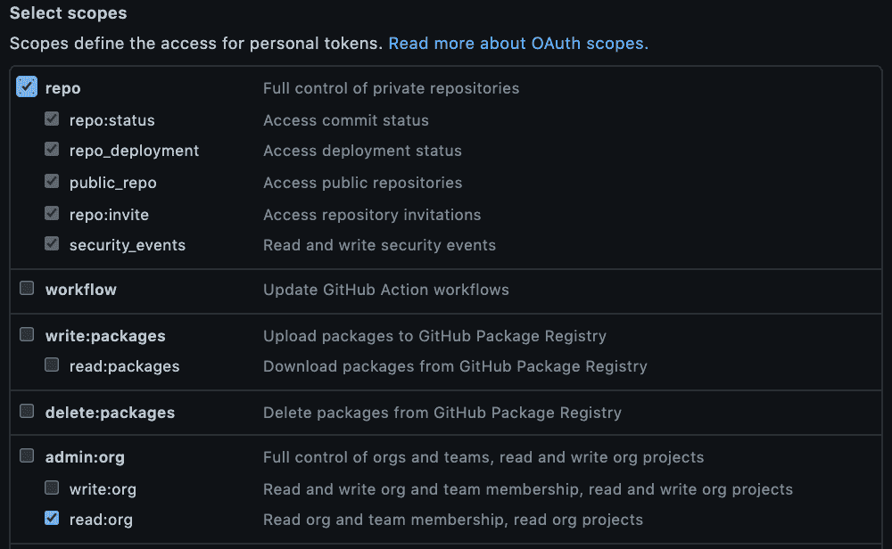
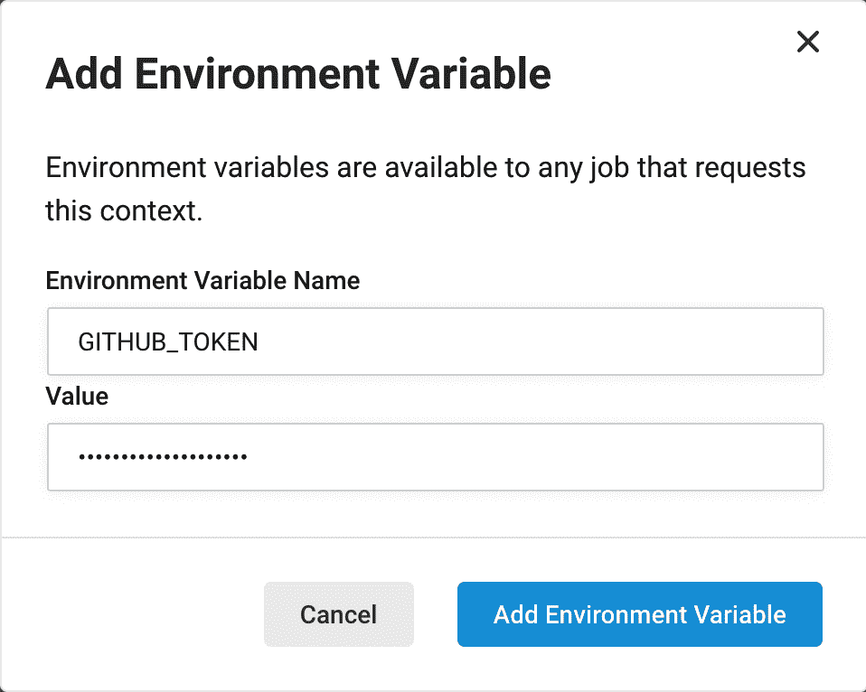
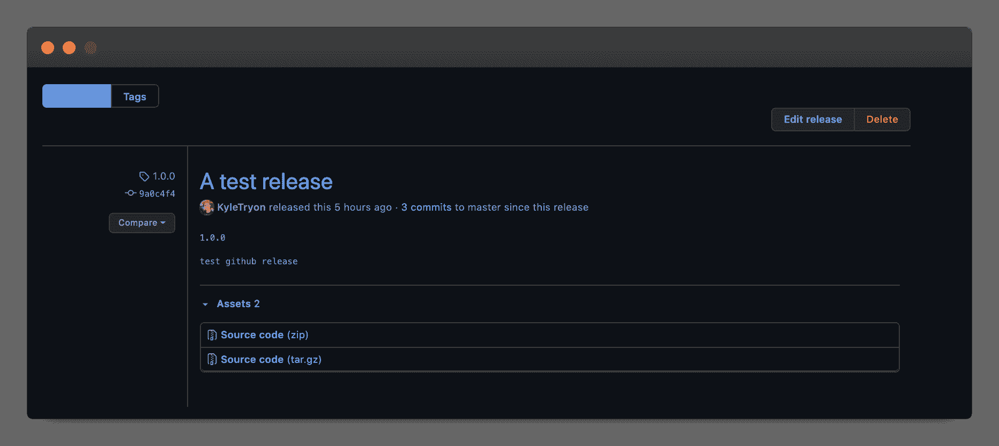

# 使用 CircleCI 和 GitHub CLI orb 自动化您的发布

> 原文：<https://circleci.com/blog/automating-your-releases-with-circleci-and-the-github-cli-orb/#2021-07-30T09:00:00-07:00>

去年，GitHub 宣布发布他们的新 CLI 工具[。新的`gh` CLI 包含了标准的`git` cli，并提供了一套附加的 GitHub.com 专用命令。这些新命令包括创建新的](https://github.blog/2020-09-17-github-cli-1-0-is-now-available/)*[拉请求](https://docs.github.com/en/github/collaborating-with-issues-and-pull-requests/about-pull-requests)* 和直接从终端创建 *[发布](https://docs.github.com/en/github/administering-a-repository/managing-releases-in-a-repository)* 的能力。

我们 CircleCI 社区和 CircleCI 的合作伙伴工程团队一直使用`gh pr checkout`命令来安全地测试来自社区(您！)在[我们的各种球体](https://github.com/CircleCI-Public?q=-orb&type=&language=&sort=)上。

今天我们分享新的 [GitHub CLI orb](https://circleci.com/developer/orbs/orb/circleci/github-cli) 。现在，您可以将 GitHub CLI 的强大功能和灵活性带到您的 CI/CD 管道中。

## 什么是球体？

[orb](https://circleci.com/orbs/)是 CI 配置的可重用包，可以在您的 CircleCI 配置中使用，以自动化和优化 CI 任务。使用 orbs，您可以[测试和部署 Node.js 应用程序](https://circleci.com/developer/orbs/orb/circleci/node#usage-node_test_and_deploy)，或者轻松地将[可定制的 Slack 通知添加到您的 CI 管道](https://github.com/CircleCI-Public/slack-orb/wiki)。

现在 [GitHub CLI orb](https://circleci.com/developer/orbs/orb/circleci/github-cli) 已经可用，我们可以向您展示我们如何结合 CircleCI 和 GitHub 的力量来自动化我们的测试和发布过程。

## 测试代码

我们配置的最终目标是拥有一个 CI/CD 管道，在那里任何分支上的代码都将被测试。在这种情况下，如果我们将我们的更改合并到`main`分支，我们希望标记并发布 GitHub.com 上的更新。

首先，我们将从一个非常简单的 Node.js 项目的示例配置开始，在这个项目上，我们将在所有分支上对推送到存储库的每个提交运行`npm run test`。

```
version: '2.1'
orbs:
  node: circleci/node@4.3
workflows:
  test-and-release:
    jobs:
      - node/test 
```

这个配置文件包含一个工作流`test-and-release`，该工作流包含由[节点 orb](https://circleci.com/developer/orbs/orb/circleci/node) 提供的单个`node/test`作业。这项工作自动检查我们的代码，安装和缓存我们的依赖项，并运行我们的`test` npm 脚本。如果你想看看这项工作的实际效果，你可以在 CircleCI 应用程序中查看这个[实时示例。](https://app.circleci.com/pipelines/github/CircleCI-Public/node-orb/719/workflows/e17c4f8f-db71-4d92-9a60-9af2cdd2a377/jobs/4663)

现在，我们的测试是自动运行的，但当发布我们产品的新版本时，我们需要手动创建一个标签并在 GitHub.com 上发布。我们可以利用新的 GitHub CLI orb 和 CircleCI 配置来自动化这个过程。

## 准备 GitHub 认证

为了自动创建标签和发布，我们将使用 GitHub CLI 和基于令牌的认证。首先，我们将创建一个具有适当权限的 GitHub 令牌，然后我们将该令牌添加到一个 [CircleCI 上下文](/docs/contexts/#creating-and-using-a-context)中。

CircleCI 上的上下文是环境变量的共享集合，可以附加到组织内任何项目中的各种作业。当您需要在许多项目之间共享凭证(如 GitHub 认证)时，这很有用。上下文甚至可以被[限制](/docs/contexts/#restricting-a-context)以防止作业访问上下文，除非被具有适当权限的用户触发。

首先创建一个 [GitHub 个人访问令牌](https://docs.github.com/en/github/authenticating-to-github/keeping-your-account-and-data-secure/creating-a-personal-access-token)。



GitHub CLI 需要的权限范围是`repo`和`read:org`。

一旦你有了个人访问令牌，前往 https://app.circleci.com/，在左侧垂直导航栏中，选择`Organization Settings`的齿轮图标。这将打开“上下文设置”页面。网址看起来会像这样:`https://app.circleci.com/settings/organization/<VCS>/<Organization>/contexts`

点击**创建上下文**并为其命名。在我们的例子中，我们将使用`GITHUB_CREDS`。

然后，点击**添加环境变量**并添加您的令牌，使用名称`GITHUB_TOKEN`。



## 自动化发布

首先将 GitHub CLI orb 添加到您的配置中:

```
version: '2.1'
orbs:
  node: circleci/node@4.3
  gh: circleci/github-cli@1.0 
```

这让我们可以访问 GitHub CLI orb 提供的各种[命令](https://circleci.com/docs/orb-concepts/?section=configuration#commands)和[任务](https://circleci.com/docs/orb-concepts/?section=configuration#jobs)。可以在您的自定义作业中使用命令来设置和验证 CLI 以便手动使用，但在本例中，我们将使用带有一些自定义参数的 [*发布*作业](https://circleci.com/developer/orbs/orb/circleci/github-cli#jobs-release)和[过滤器](https://circleci.com/docs/configuration-reference/#jobfilters)。

## 使用 GitHub CLI orb 实现完整的测试和发布工作流

```
version: '2.1'
orbs:
  node: circleci/node@4.3
  gh: circleci/github-cli@1.0
workflows:
  test-and-release:
    jobs:
      - node/test
      - gh/release:
          notes-file: changelog.md
          tag: 1.0.0
          title: The initial release
          requires:
            - node/test
          context:
            - GITHUB_CREDS
          filters:
            branches:
              only:
                - main 
```

您可以看到，我们已经将`gh/release`作业添加到了我们的`test-and-release`工作流中，并添加了一些定制的参数。您可以在该 Orb 作业的 [Orb 注册表页面](/developer/orbs/orb/circleci/github-cli?version=dev:alpha#jobs-release)上查看该作业的*所有*可用参数。该作业自动运行`gh/setup`命令，该命令安装并验证 GitHub CLI，然后使用我们指定的参数运行`gh release create`。

假设您正在开发您产品的第一个主要版本。目前，你在`beta`分公司工作。当*测试版*完成后，你计划合并到`main`并发布你的发布版本`1.0.0`。

查看完整的示例，我们提供了(必需的)`tag`参数来指定预期的发布标签。如果不存在这样的标签，`gh cli`将使用默认分支中的最新代码创建一个新标签，在我们的例子中是`main`。

这里显示了三个额外的参数，它们是直接来自 orb 的*而不是*，所以您不会在 Orb 注册表文档中看到它们。参数`requires`、`context`、`filters`是 CircleCI 上任何一个作业本身都有的特殊作业参数。

*   [`requires`参数](/docs/configuration-reference/?section=configuration#requires)指定在`requires`下的所有作业成功完成之前，该作业(`gh/release`)不会运行。在这种情况下，作业是`node/test`。
*   [上下文](/docs/contexts/#creating-and-using-a-context)包含我们共享的环境变量。这里是我们可以附加之前创建的`GITHUB_CREDS`上下文的地方。
*   筛选器限制了作业执行的条件。如果没有任何筛选器，工作流中的所有作业将始终执行。使用本例中应用的过滤器，我们的`gh/release`作业只有在`main`分支上被触发时才会运行(当我们合并时)。

这意味着当我们在配置设置中将我们的变更从`beta`合并到`main`时，将会从包含我们新变更的`main`的新`HEAD`中创建`1.0.0`标签和发布。



在上面的例子中，我们使用了几个附加参数来指定 changelog 文件的位置、设置标题等等。

## 包扎

在实现了测试和发布工作流之后，我们可以用每个拉请求来更新我们的`.circleci/config.yml`,以反映期望的变化。例如，如果我们要打开一个名为`add-feature-blink`的新分支，我们将通过更新配置来开始我们的新分支，以反映当我们再次准备合并到`main`时我们想要准备的预期发布:

```
workflows:
  test-and-release:
    jobs:
      - node/test
      - gh/release:
          notes-file: changelog.md
          tag: 1.1.0
          title: "Add Feature: Blinking text" 
```

感谢您的阅读！

Kyle Tryon @TechSquidTV

查看 [GitHub CLI orb](https://circleci.com/developer/orbs/orb/circleci/github-cli) 。