# 将自定义映像持续部署到 Azure 容器注册表| CircleCI

> 原文：<https://circleci.com/blog/azure-custom-images/#2021-06-14T13:00:00-07:00>

Azure 容器注册中心是微软自己的用于 [Docker](https://www.docker.com/) 图片的托管平台。这是一个私有注册表，您可以在其中存储和管理私有的`docker`容器图像和其他相关工件。然后，这些映像可以被拉出并在本地运行，或者用于托管平台的基于容器的部署。

在本教程中，您将学习如何创建一个定制的`docker`映像，并不断地将其部署到 Azure 容器注册中心。

## 先决条件

要遵循本教程，需要做一些事情:

1.  您系统上安装的 [Node.js](https://nodejs.org) (版本> = 10.3)
2.  一个蓝色的账户
3.  一个[圆](https://circleci.com/)的账户
4.  GitHub 的一个账户
5.  安装在您系统上的 Azure CLI
6.  [Docker](https://www.docker.com/get-started) 安装在您的系统上

安装并设置好所有这些之后，您就可以开始本教程了。

## 在 Azure 上创建容器注册中心

首先，您需要在 Azure 上创建一个容器注册中心来存储和构建您的 Docker 容器。点击 Azure 门户主页上的**创建**按钮，进入**容器** - > **容器注册中心**。

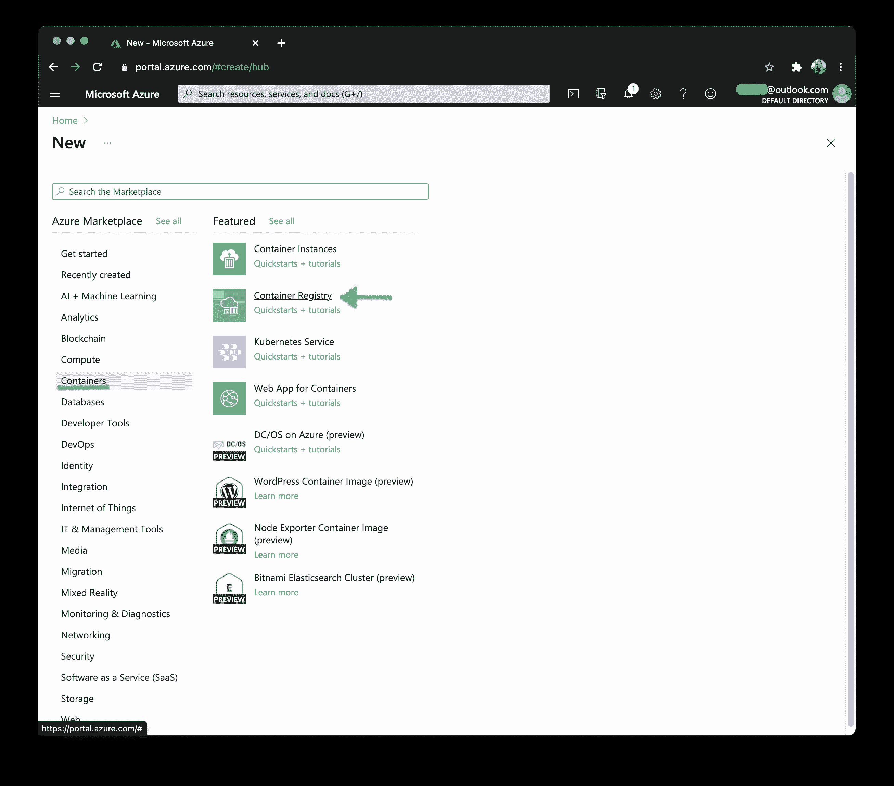

在注册表创建页面上，填写适当的信息，包括注册表的名称。

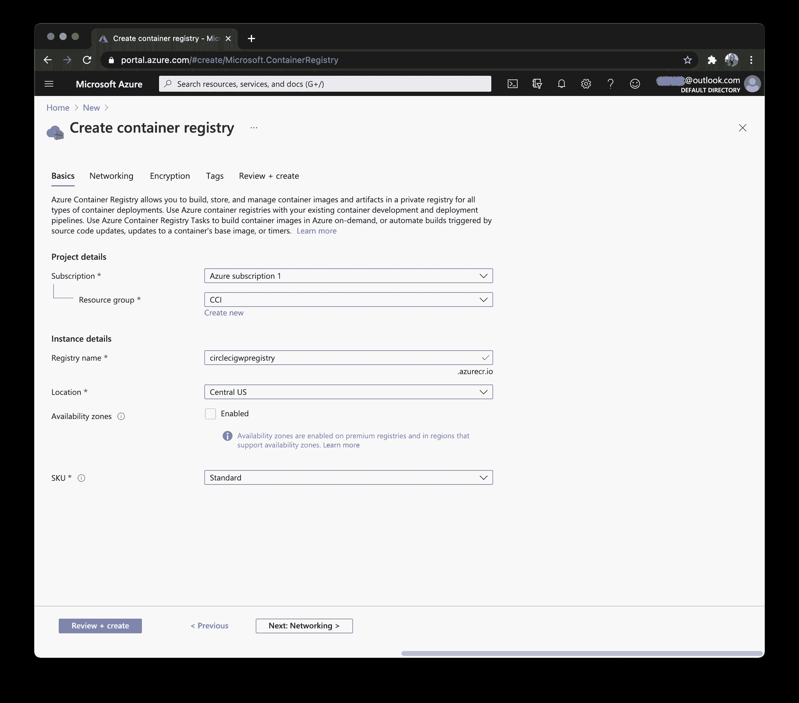

点击**审核+创建**按钮。在查看页面中，确认您的注册表信息，点击**创建**触发注册表创建过程。

如果您更喜欢使用 Azure CLI 来创建您的资源，您也可以使用此命令来创建注册表:

```
az acr create --name circlecigwpregistry --resource-group Demos-Group --sku standard --admin-enabled true 
```

注意，在这个过程中，我已经将我的注册表命名为`circlecigwpregistry`。如前所述，您可能希望使用不同的名称。请确保在本教程后面的所有步骤中替换您的注册表名称。

## 克隆演示项目

下一步是获取 Node.js 项目，该项目将用于构建一个 [Docker](https://www.docker.com/) 容器，并将其托管在 Azure 容器注册表中。运行以下命令来克隆项目:

```
git clone --single-branch --branch base-project https://github.com/CIRCLECI-GWP/azure-custom-images.git 
```

这个项目是一个基本的 Node.js API，有两个端点:

*   根端点(`/`)简单地打印出一条欢迎消息
*   `/todos`端点返回一组`todo`任务对象，还包含一个用于测试`/todos`端点的测试套件

## 编写和构建自定义 Docker 映像

下一步是编写一个自定义 Docker 映像来托管应用程序。进入项目文件夹(`cd azure-custom-images`)的根目录，创建`Dockerfile`文件。将以下代码输入到文件中:

```
FROM node:current-alpine

WORKDIR /app

COPY ./package.json ./

RUN npm install

COPY ./ ./

CMD ["npm", "start"] 
```

`docker`文件使用`node:current-alpine`作为其基础映像，并将容器中的工作目录(将基于该映像创建)设置为`/app`。首先使用`npm install`将`package.json`文件拉入`/app`来安装依赖项。最后，项目的剩余内容被复制到映像中，应用程序将在运行时使用`npm start`启动。参考[本页](https://www.docker.com/resources/what-container)了解更多关于 Docker 图像和容器的上下文。

通过在项目的根目录下运行以下命令并使用名称`customnodeimage`对其进行标记来构建映像。

```
docker build -t customnodeimage . 
```

注意命令末尾的点(`.`)。不要忘记加上这一点；它将构建上下文定义为当前目录。

构建完成后，您可以运行下面的命令，将 Node.js 应用程序作为基于`customnodeimage` Docker 映像的容器来运行。

```
docker run -p 1337:1337 customnodeimage 
```

CLI 中该命令的输出应该包含:`Server running on localhost:1337`行，这表示应用程序正在运行。

前面的命令将容器(`1337`)中的应用程序端口转发到您机器上的端口`1337`。您可以导航到 [`http://localhost:1337`](http://localhost:1337) 查看应用基础端点。

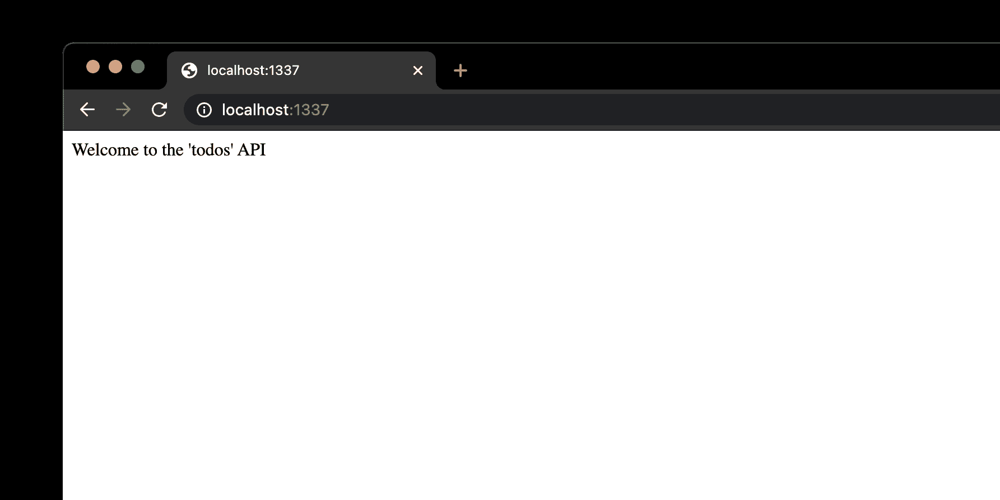

你也可以访问`/todos`路线来装载`todo`对象。

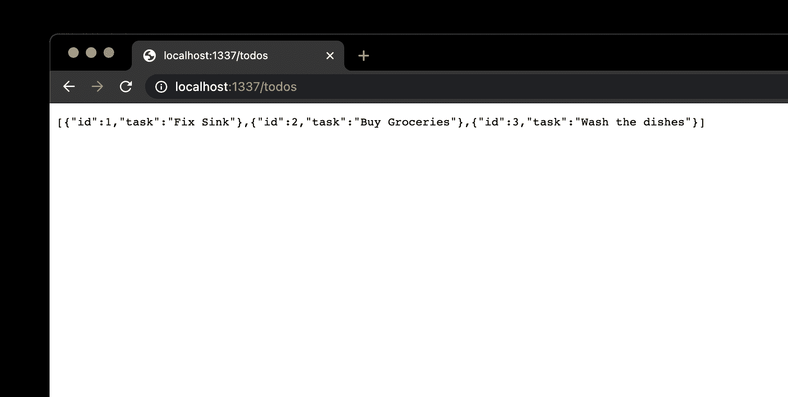

要将这个映像放到您的注册表中，运行下面的命令从 docker 文件中在`ACR`上构建映像。用您创建的注册表的名称替换`<container_registry_name>`。

```
az acr build --registry <container_registry_name> --image customnodeimage . 
```

您现在可以在注册表上查看此图像。在 Azure 资源页面上单击您的注册表。应该会列在 [Azure 门户首页](https://portal.azure.com/)的**最近资源**下。进入**服务**->-仓库。

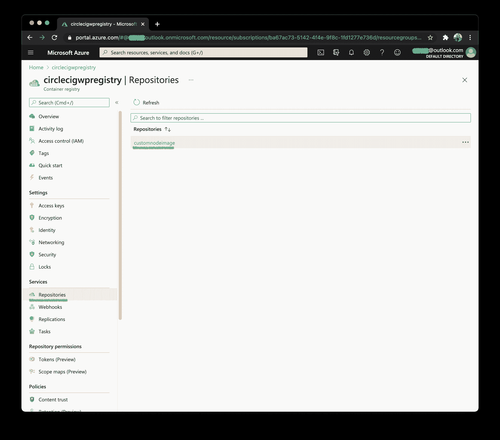

## 为容器设置构建任务

当对应用程序代码或`Dockerfile`进行任何更新时，我们希望在`ACR`上推送和构建更新，以便在`ACR`上始终有一个更新的映像。这就是持续部署。

幸运的是，`ACR`可以被配置为监视远程存储库上的一个分支，并根据该分支的更新触发构建。持续部署映像的策略是在远程存储库上为映像创建一个分支，`ACR`将监视该分支以触发构建。一旦应用程序测试通过，更新就会自动推送到被监视的分支，从而使用更新的内容触发映像的重建。

首先，运行项目根目录下的命令`rm -rf .git`删除任何现有的`git`历史，然后[将项目推送到 GitHub](https://circleci.com/blog/pushing-a-project-to-github/) 。

接下来，在 GitHub 存储库中，从主分支创建一个`buildimage`分支。

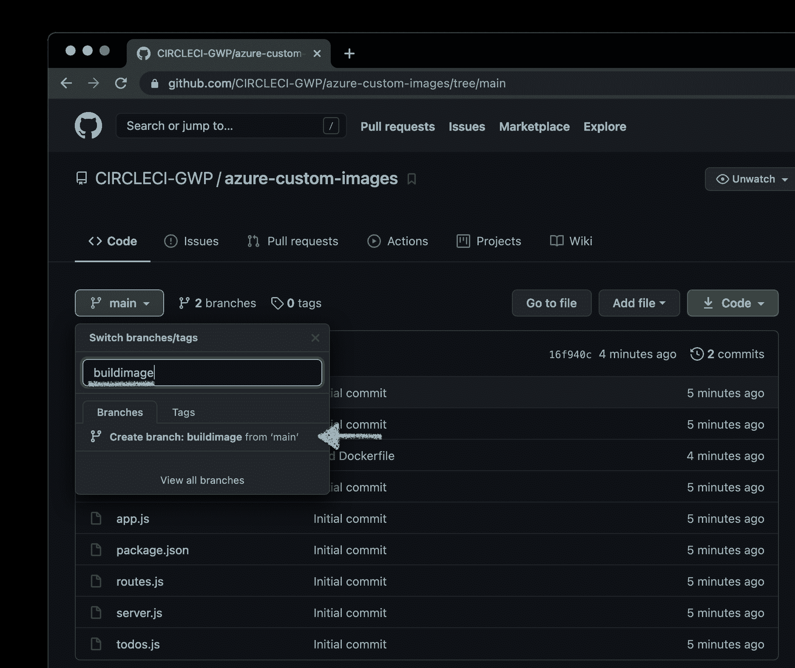

要查看刚刚创建的分支，您需要一个 [ACR 任务](https://docs.microsoft.com/en-us/azure/container-registry/container-registry-tasks-overview)。要创建一个`ACR`任务，你需要一个 [GitHub 个人访问令牌](https://docs.github.com/en/free-pro-team@latest/github/authenticating-to-github/creating-a-personal-access-token)。

要创建 GitHub 令牌，请在您的 GitHub 页面上进入**设置**->-**开发者设置**。在侧边菜单上，点击**个人访问令牌**，然后点击**生成新令牌**按钮。确认您的密码以继续，您将被带到令牌创建页面。

输入密钥的描述。对于这个演示，给它所有的`repo`权限(除了`delete_repo`权限)。也给了它`webhook`的许可。`webhook`许可是最重要的一个，因为它有能力在你的回购中创建一个 webhook，用来通知`ACR`触发一个新的`Docker`映像构建。


点击**生成令牌**按钮。生成令牌后复制它。它将不会再次显示。

要创建一个`ACR`任务，使用您的存储库地址、您的注册表名称和 GitHub 访问令牌在您的项目的根目录下运行以下命令:

```
az acr task create --registry <container_registry_name> --name buildcustomimage --image customnodeimage --context <your_github_repo>#buildimage --file Dockerfile --git-access-token <access_token> 
```

对于本教程中的注册中心和存储库，这将是:

```
az acr task create --registry circlecigwpregistry --name buildcustomimage --image customnodeimage --context https://github.com/CIRCLECI-GWP/azure-custom-images.git#buildimage --file Dockerfile --git-access-token [My_TOKEN] 
```

这将创建一个`buildcustomimage`任务，它将在每次更新被推送到`buildimage`分支时重建`customnodeimage`映像。要查看您新创建的任务，请进入注册页面，然后进入**服务**->-**任务**。

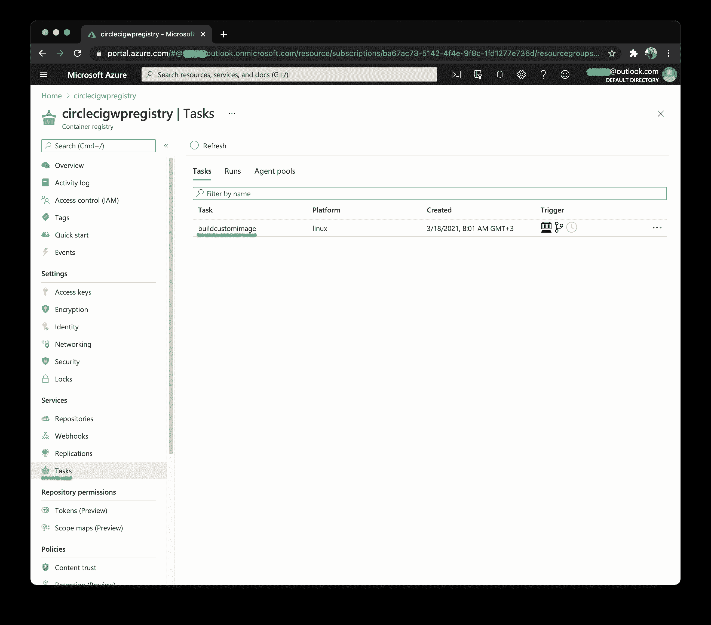

## 创建 CircleCI 项目

现在，进入 [CircleCI 仪表板](https://app.circleci.com/projects)上的**项目**页面。选择您在本教程中使用的 GitHub 帐户来添加项目。

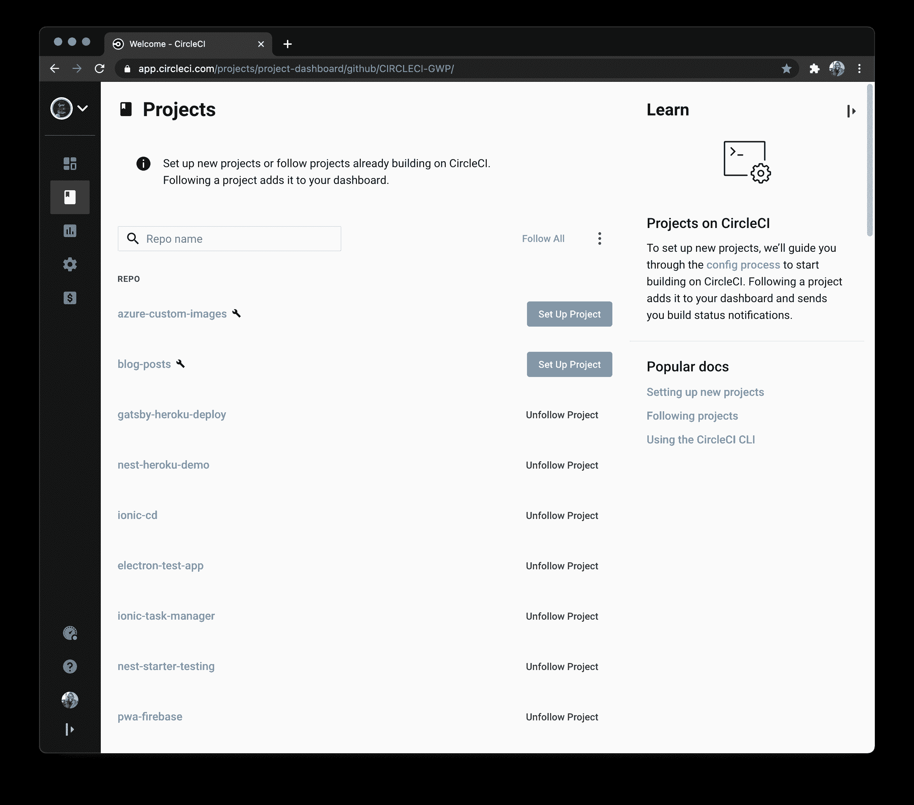

点击**设置项目**按钮开始添加信息。

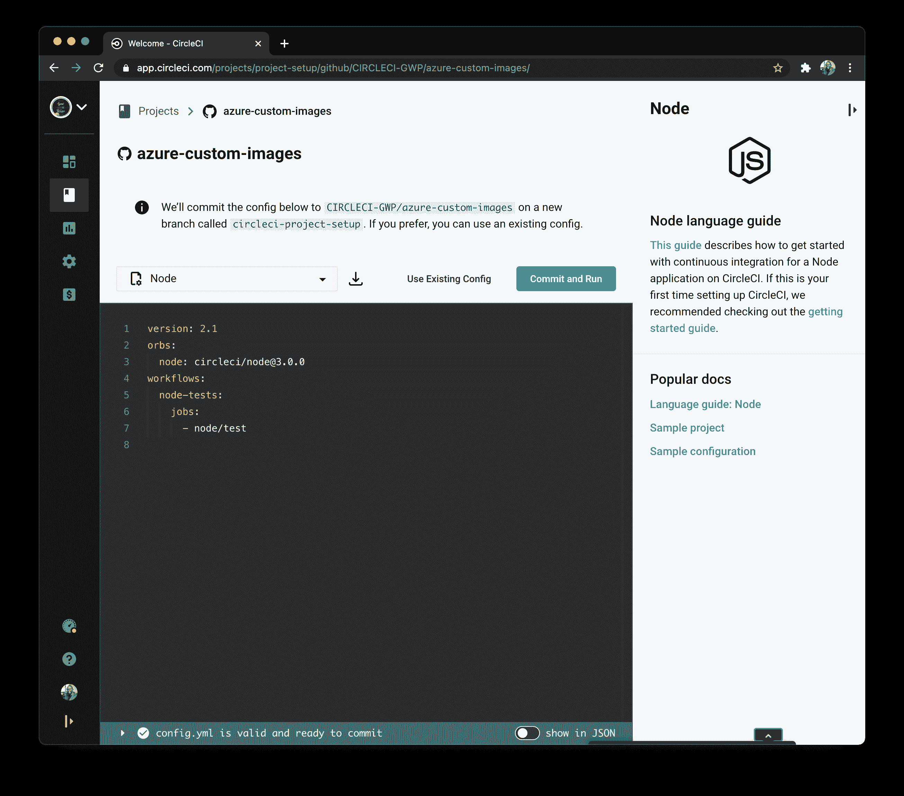

在设置页面上，点击 **Use Existing Config** 表示您正在手动添加一个配置文件，而不是使用样本。系统会提示您下载管道的配置文件或开始构建。


点击**开始构建**开始构建。此构建将失败，因为您尚未设置配置文件。我们将在本教程的后面完成这项任务。

## 设置 GitHub 认证

持续部署策略的一部分是从将为该项目编写的管道配置推送到`buildimage`分支，因此 CircleCI 需要经过身份验证的访问才能访问 GitHub 上的存储库。

幸运的是，CircleCI 提供了一种添加`User API Key`来实现这一点的方法。在你的项目上，进入**项目设置**->-**SSH 密钥**，进入**用户密钥**部分。点击**授权 GitHub** 按钮，连接 GitHub。

一旦完成，一个**添加用户密钥**按钮出现在**用户 API 密钥**部分。

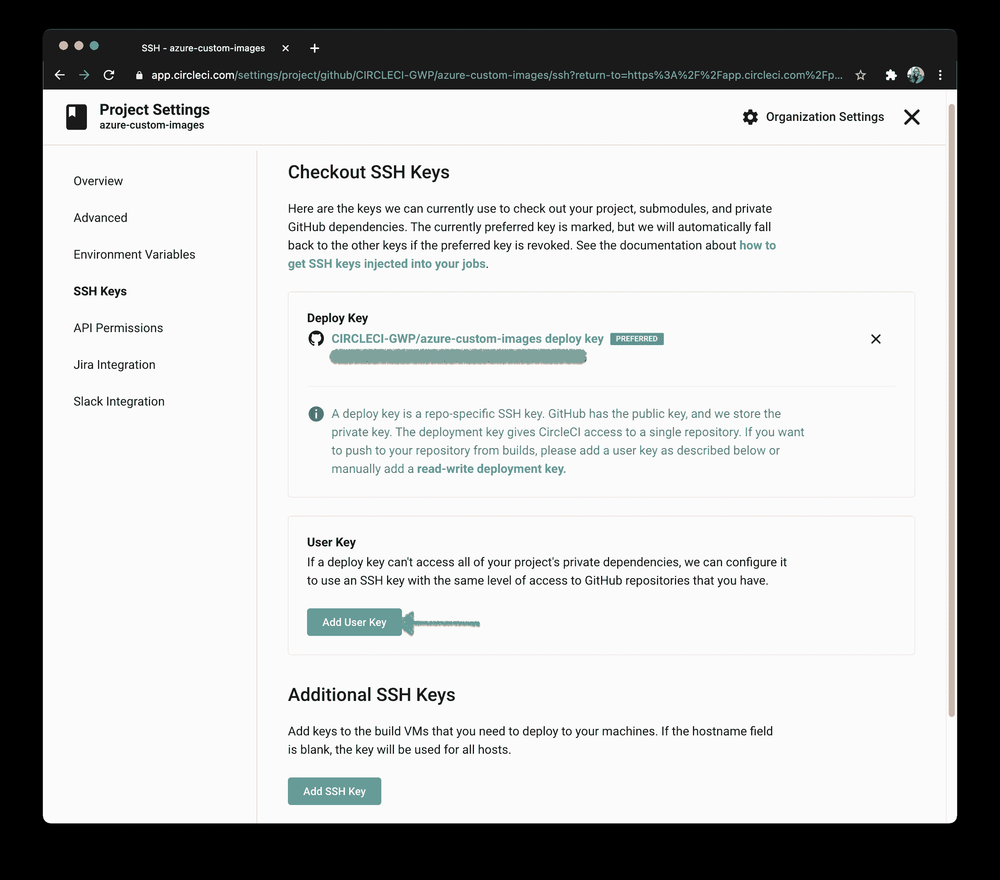

将生成一个指纹，稍后将在部署管道中使用。复制指纹，并将其保存在安全的地方。

因为指纹将与您的 GitHub 电子邮件和用户名一起在管道脚本中使用，所以将它们放在环境变量中是安全的。在项目设置的侧菜单上，点击**环境变量**并添加这些变量:

*   `GITHUB_EMAIL`是您连接的 GitHub 帐户的电子邮件
*   你的 GitHub 用户名是
*   `GITHUB_FINGERPRINT`是生成的认证指纹

## 编写管道脚本

本教程的最后一个任务是为定制的`docker`映像编写连续部署管道脚本。

为了使管道脚本能够将更新推送到 GitHub repo 的`buildimage`分支，我们将使用节点包 [gh-pages](https://www.npmjs.com/package/gh-pages) 。这个包是可配置的，可以将文件从一个分支推到任何给定存储库中的另一个分支。

在项目根目录下使用以下命令将软件包作为开发依赖项进行安装:

```
npm install gh-pages --save-dev 
```

接下来，在`package.json`文件中添加一个`pushtobuild`脚本:

```
"scripts" : {
  .....,
  "pushtobuild": "npx gh-pages -b buildimage --message '[skip ci] Updates' -d ./"
} 
```

这个脚本调用`gh-pages`，使用`npx`将文件从`main`分支推送到`buildimage`分支。添加了`[skip ci] Updates`的`--message`参数，以便在将更改推送到该分支时，CircleCI 不会重新运行管道。

现在，您可以开始编写管道脚本了。在项目的根目录下，创建一个名为`.circleci`的文件夹，并在其中创建一个名为`config.yml`的文件。在`config.yml`里面，输入:

```
version: 2
jobs:
  build:
    working_directory: ~/repo
    docker:
      - image: circleci/node:10.16.3
    steps:
      - checkout
      - run:
          name: update-npm
          command: "sudo npm install -g npm@5"
      - restore_cache:
          key: dependency-cache-{{ checksum "package-lock.json" }}
      - run:
          name: install-packages
          command: npm install
      - save_cache:
          key: dependency-cache-{{ checksum "package-lock.json" }}
          paths:
            - ./node_modules
      - run:
          name: Run tests
          command: npm run test

  deploy:
    working_directory: ~/repo
    docker:
      - image: circleci/node:10.16.3
    steps:
      - checkout
      - run:
          name: Configure Github credentials
          command: |
            git config user.email $GITHUB_EMAIL
            git config user.name $GITHUB_USERNAME
      - add_ssh_keys:
          fingerprints:
            - $GITHUB_FINGERPRINT
      - run:
          name: Build Image on Azure Container Registry Task
          command: npm run pushtobuild

workflows:
  version: 2
  build:
    jobs:
      - build
      - deploy:
          requires:
            - build # only deploy once build job has completed
          filters:
            branches:
              only: main # only deploy on the main branch 
```

这个文件用两个`jobs`定义了一个工作流。

`build`作业从远程存储库中检出代码，安装所需的依赖项，并运行测试以确保代码中没有错误。一旦`build`任务完成，`deploy`任务接管并签出一份干净的代码副本(我们不希望将`node_modules`文件夹从之前的任务推送到被监视的分支)。然后，它配置对 GitHub 的访问，使管道脚本能够将更新推送到被监视的分支(`buildimage`)。最后，`deploy`作业运行 Node.js 脚本来推送更新并触发`docker`映像的新构建。

当您提交您的更新并推送到 GitHub 存储库时，您将拥有一个成功的工作流！

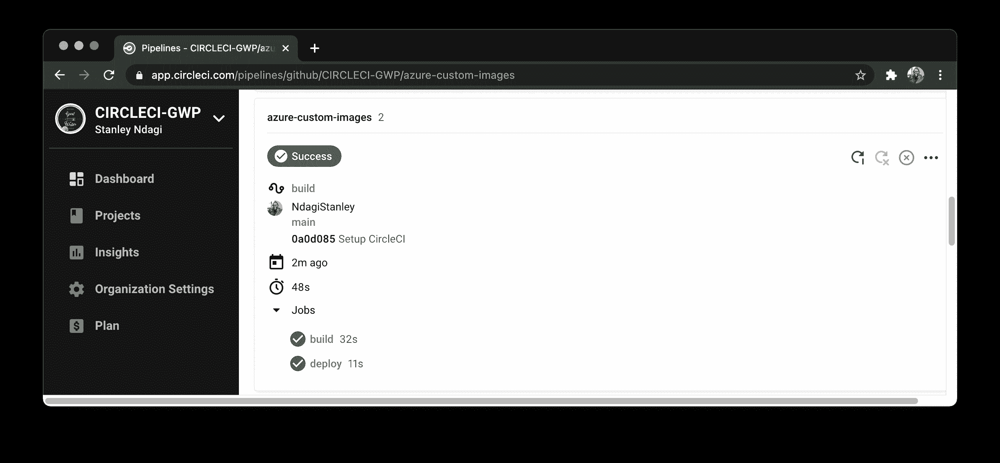

您可以点击`build`任务查看成功的测试。

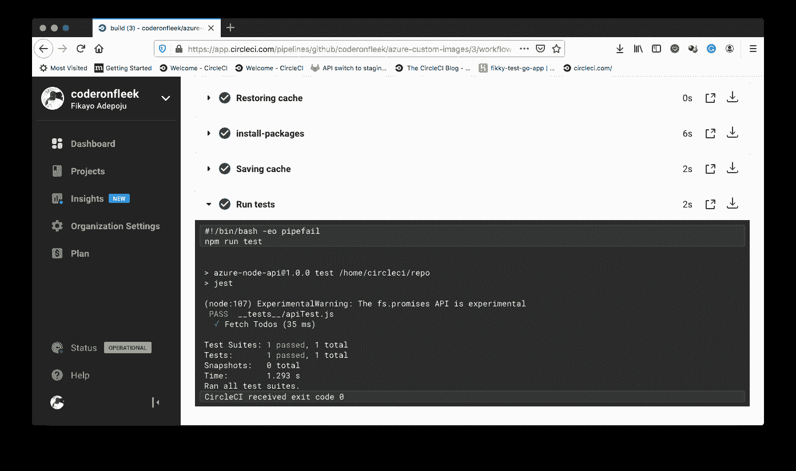

要查看流程的详细信息，请单击`deploy`作业(在浏览器中，返回上一页)。

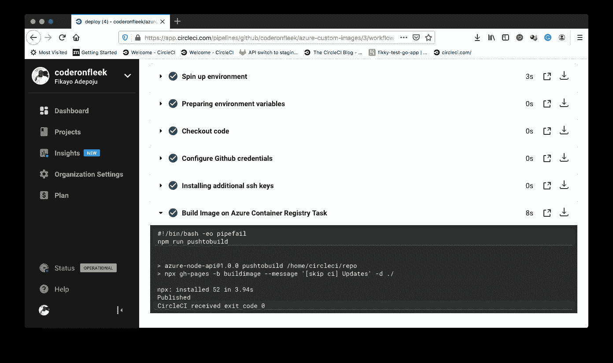

在**服务**->-**任务**进入你的注册表任务，点击**运行**标签。您将看到构建正在运行。


过一会儿，构建将完成并标记为**成功**。

当您在**Services**->-**Repositories**中找到您的映像并单击该映像时，您会注意到`Last updated date`已经更改，这表明新的构建现在是最新的。

## 结论

Azure Container Registry 为您提供了存储容器映像的能力，支持快速和可扩展的容器工作负载检索。在本教程中，您已经构建了一个定制的`docker`映像，并在每次您的应用程序代码或`Dockerfile`发生变化时不断地将它部署到`ACR`。要开始将你所学到的应用到你自己的工作中，今天就注册参加你的 [CircleCI 免费试用](https://circleci.com/signup/)。

编码快乐！

* * *

Fikayo Adepoju 是 LinkedIn Learning(Lynda.com)的作者、全栈开发人员、技术作者和技术内容创建者，精通 Web 和移动技术以及 DevOps，拥有 10 多年开发可扩展分布式应用程序的经验。他为 CircleCI、Twilio、Auth0 和 New Stack 博客撰写了 40 多篇文章，并且在他的个人媒体页面上，他喜欢与尽可能多的从中受益的开发人员分享他的知识。你也可以在 Udemy 上查看他的视频课程。

[阅读 Fikayo Adepoju 的更多帖子](/blog/author/fikayo-adepoju/)