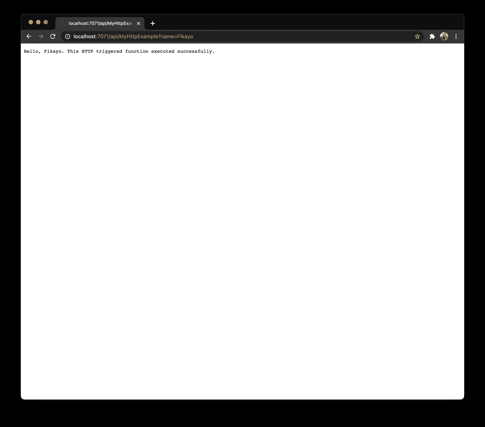
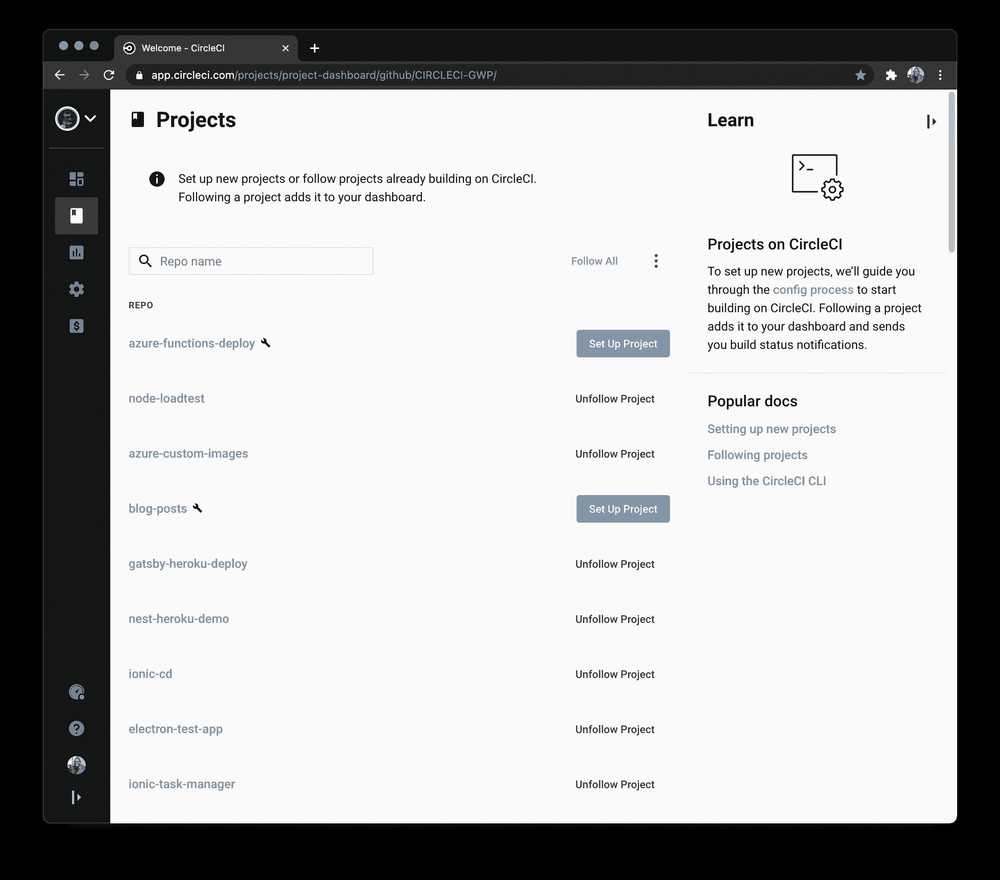
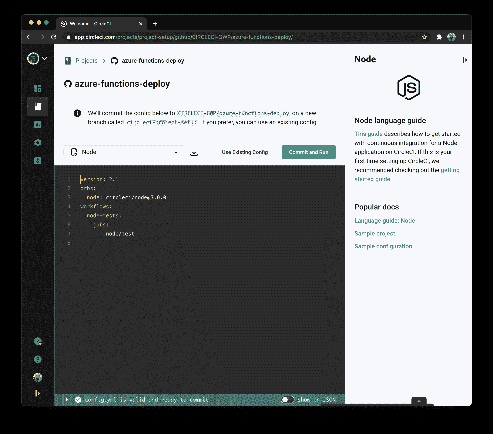
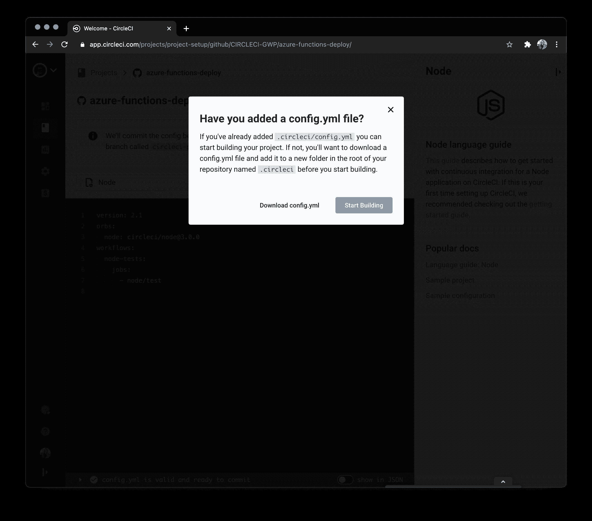
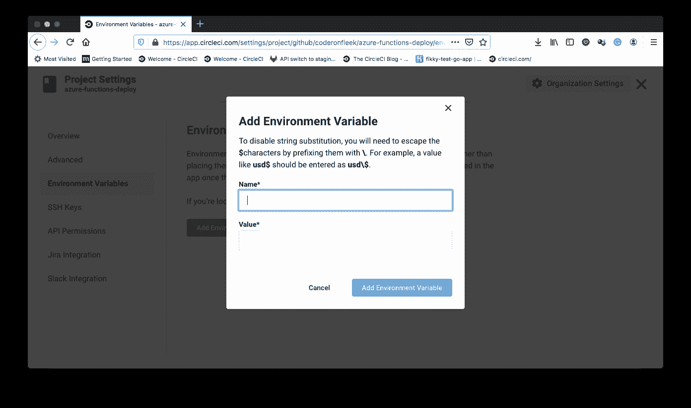
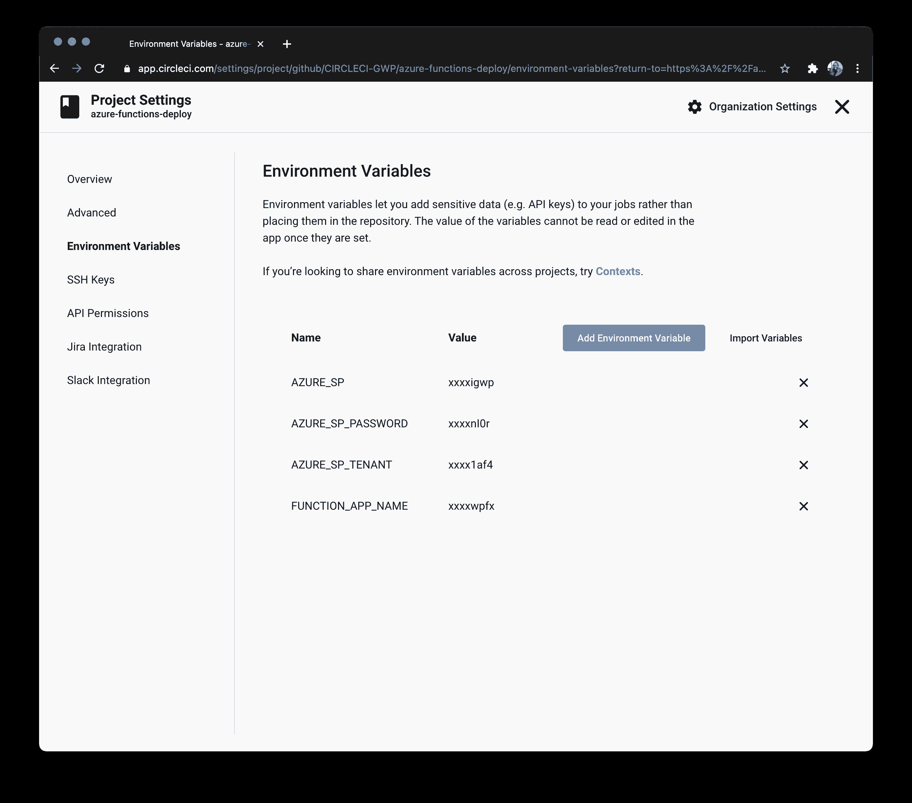
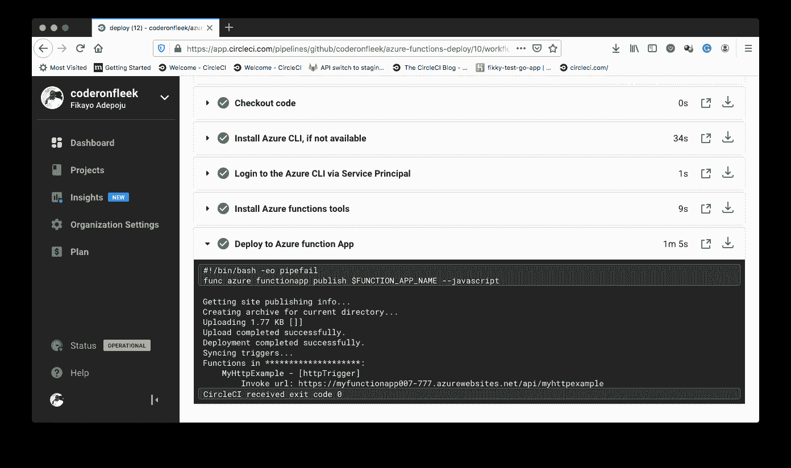

# Azure 功能的持续部署| CircleCI

> 原文：<https://circleci.com/blog/azure-functions-cd/#2021-05-18T13:00:00-07:00>

[无服务器计算](https://en.wikipedia.org/wiki/Serverless_computing)，一种由提供商管理服务器的模式，让开发者专注于编写专用的应用程序逻辑。无服务器计算已经被许多开发团队采用，因为它可以自动伸缩。自动伸缩将开发人员从分配管理任务中解放出来，因此他们不必担心服务器资源的分配，也不必为他们没有消耗的资源付费。另一个巨大的好处是，无服务器计算非常适合传统和[微服务](https://en.wikipedia.org/wiki/Microservices)架构。

几乎每个大型云计算服务提供商都有自己版本的无服务器产品。几个例子是:

## 先决条件

要遵循本教程，需要做一些事情:

1.  安装在您系统上的 [Node.js](https://nodejs.org) (版本> = 12)
2.  一个蓝色的账户
3.  一个[圆](https://circleci.com/signup/)的账户
4.  GitHub 的一个账户
5.  安装了 Azure CLI
6.  [Azure 功能核心工具](https://docs.microsoft.com/en-us/azure/azure-functions/functions-run-local)已安装

安装并设置好所有这些之后，您就可以开始本教程了。

## 创建 Azure 服务主体帐户

首先，您需要创建一个 [Azure 服务主帐户](https://docs.microsoft.com/en-us/cli/azure/create-an-azure-service-principal-azure-cli)。这种类型的账户是 Azure 专门为自动化流程设计的，比如[连续部署管道](https://circleci.com/blog/what-is-a-ci-cd-pipeline/)。您将需要在本教程稍后构建的管道中访问您的 Azure 帐户，因此这是必需的。

在确保您登录到您的控制台后，(如果没有，运行`az login`)，使用 Azure CLI 创建一个服务主体帐户，并给它一个唯一的名称。运行命令:

```
az ad sp create-for-rbac --name [ServicePrincipalName] 
```

用您想要使用的名称替换占位符`ServicePrincipalName`。例如:

```
az ad sp create-for-rbac --name MyServicePrincipal 
```

这个命令的输出是一个带有`name`键的`json`字符串。管道脚本中的身份验证需要这三(3)个详细信息。

*   该名称的格式为`http://[ServicePrincipalName]`
*   租户 id 为`tenant`
*   `password`是自动生成的账户密码

## 创建函数项目

下一步是使用 Azure core tools CLI 实用程序在本地创建 Azure functions 项目。运行以下命令创建一个基于 JavaScript 的 Azure functions 项目。

```
func init MySampleFunctionProject --javascript 
```

该命令在`MySampleFunctionProject`文件夹中创建一个新项目。该项目将包含两个文件，`host.json`和`local.settings.json`。这些文件包含全局和本地环境的配置。

进入新创建项目的根目录。输入:

```
cd MySampleFunctionProject 
```

## 向项目中添加新函数

接下来，您将向您的项目添加一个新函数。我们将在本教程中使用的函数将由一个简单响应请求客户端的 [HTTP](https://en.wikipedia.org/wiki/Hypertext_Transfer_Protocol) 调用触发。

通过运行以下命令，将函数`MyHttpExample`添加到您的项目中:

```
func new --name MyHttpExample --template "HTTP trigger" --authlevel "anonymous" 
```

该函数使用`HTTP trigger`模板来搭建一个基本的`index.js`入口点。

```
module.exports = async function (context, req) {
  context.log("JavaScript HTTP trigger function processed a request.");

  const name = req.query.name || (req.body && req.body.name);
  const responseMessage = name
    ? "Hello, " + name + ". This HTTP triggered function executed successfully."
    : "This HTTP triggered function executed successfully. Pass a name in the query string or in the request body for a personalized response.";

  context.res = {
    // status: 200, /* Defaults to 200 */
    body: responseMessage
  };
}; 
```

这段代码导出一个接收 Node.js 请求对象(`req`)和一个函数(`context`)的函数。然后检查请求中是否设置了一个`name`查询字符串参数。如果设置了该参数，代码将在响应体中用字符串`Hello [name]. This HTTP triggered function executed successfully.`进行响应。否则，响应正文中将返回一条默认消息。

这个`function.json`文件也被创建:

```
{
  "bindings": [
    {
      "authLevel": "Anonymous",
      "type": "httpTrigger",
      "direction": "in",
      "name": "req",
      "methods": ["get", "post"]
    },
    {
      "type": "http",
      "direction": "out",
      "name": "res"
    }
  ]
} 
```

这将功能配置为响应`HTTP`触发，并允许`GET`和`POST`请求。该函数的输出被路由到`HTTP`请求的响应流。`authLevel`键被设置为`Anonymous`，允许对功能端点的非认证访问。

现在，通过运行以下命令，在项目(非函数)文件夹的根目录下本地启动函数:

```
func start 
```

**注意:**如果第一次没有运行或者返回一个关于丢失参数的错误，重新运行该命令。确保您位于项目文件夹的根目录:`MySampleFunctionProject`。

该功能将在本地启动，并在您的 CLI 中显示端点。请耐心等待，显示`localhost` URL 可能需要一段时间。

```
Azure Functions Core Tools
Core Tools Version:       3.0.3388 Commit hash: fb42a4e0b7fdc85fbd0bcfc8d743ff7d509122ae 
Function Runtime Version: 3.0.15371.0

Functions:

        MyHttpExample: [GET,POST] http://localhost:7071/api/MyHttpExample

For detailed output, run func with --verbose flag.
[2021-03-18T08:45:44.954Z] Worker process started and initialized.
[2021-03-18T08:45:49.427Z] Host lock lease acquired by instance ID '0000000000000000000000003EA6BE15'. 
```

通过在浏览器中向其传递查询参数`name`来访问该端点。



## 创建存储帐户

Azure 函数需要一个[存储帐户](https://docs.microsoft.com/en-us/azure/storage/common/storage-account-overview)来维护项目的状态和其他信息。

如果没有创建资源组，请使用 Azure CLI 工具创建一个。使用您喜欢的`resource_group_name`和`region`并运行:

```
az group create --name <resource_group_name> --location <region> 
```

例如，我在本教程中使用了以下命令:

```
az group create --name Demos-Group --location westeurope 
```

接下来，使用您的资源组创建一个通用存储帐户。您需要为您的`storage_account_name`取一个全球唯一的名称。该名称只能包含数字和小写字母。使用以下命令创建存储帐户:

```
az storage account create --name <storage_account_name> --location <region> --resource-group <resource_group_name> --sku Standard_LRS 
```

例如，我在本教程中使用了以下命令:

```
az storage account create --name <storage_account_name> --location westeurope --resource-group Demos-Group --sku Standard_LRS 
```

`Standard_LRS`指定通用账户，由函数支持。

## 创建 Azure 函数应用程序

您当前使用的函数项目仅存在于您的本地计算机上。现在是时候在 Azure 上创建函数了。通过运行以下命令创建新的 Azure 函数:

```
az functionapp create --resource-group <resource_group_name> --consumption-plan-location <region> --runtime node --runtime-version 12 --functions-version 3 --name <app_name> --storage-account <storage_name> 
```

您需要用之前选择的信息替换占位符。将`resource_group_name`替换为您的资源组，将`region`替换为您目前使用的区域(在本例中为`westeurope`)，将`app_name`替换为您的函数的全局唯一名称，将`storage_name`替换为您刚刚在最后一个 CLI 命令中创建的存储帐户的名称(`<storage_account_name>`)。

这个命令基于 Node.js 版本 12 在 Azure 上创建一个函数。如果您使用的是不同的 Node.js 版本(也支持版本 10 ),请使用`--runtime-version`参数切换版本。

`app_name`将是您的功能应用的默认 DNS 域，因此它必须是全球唯一的。还将为此功能自动创建一个[应用洞察](https://docs.microsoft.com/en-us/azure/azure-monitor/app/app-insights-overview)资源，用于监控。

## 在 CircleCI 建立项目

在这一步中，我们将自动化部署过程。从项目文件夹的根目录，[将项目推送到 GitHub](https://circleci.com/blog/pushing-a-project-to-github/) 。

现在，进入 [CircleCI 仪表板](https://app.circleci.com/projects)上的**项目**页面。选择关联的 GitHub 帐户以添加项目。



点击**设置项目**按钮开始设置项目。



在 setup 页面上，点击 **Use Existing Config** 以指示 CircleCI 您正在手动添加一个配置文件，而不是使用显示的示例。接下来，系统会提示您下载管道的配置文件或开始构建。



点击**开始建造**。此构建将失败，因为您尚未设置配置文件。我们将在教程的后面完成这一步。

您将需要从部署脚本访问您的 Azure 帐户，这就是我们在教程开始时创建 Azure 服务主体帐户的原因。我们可以使用 [azure-cli](https://circleci.com/developer/orbs/orb/circleci/azure-cli) orb 登录并在部署脚本中使用 Azure CLI。这个 orb 需要在项目上设置一些环境变量。

这些是:

*   AZURE_SP，这是您的服务主体名称(格式为`http://[ServicePrincipalName]`)
*   AZURE_SP_PASSWORD 是您的服务主体帐户创建响应中的`password`密钥
*   AZURE_SP_TENANT 是您的服务主体帐户创建响应中的`tenant`键
*   FUNCTION_APP_NAME 是使用 Azure CLI 创建的 Azure function 应用的名称

**注意:** *FUNCTION_APP_NAME 不是`azure-cli` orb 所必需的，但最好将其设置为一个环境变量。*

转到 CircleCI 项目上的`Project Settings`然后`Environment Variables`，点击**添加环境变量**。



使用该对话框，添加前面描述的环境变量。



## 编写部署配置

该过程的最后一步是编写持续部署管道脚本，该脚本将部署 function app，并在更新被推送到 GitHub 存储库时持续部署它。

在项目的根目录下，创建一个名为`.circleci`的文件夹，并在其中创建一个名为`config.yml`的文件。在`config.yml`里面，输入这个代码:

```
jobs:
  deploy:
    working_directory: ~/repo
    executor: node/default
    steps:
      - checkout
      - azure-cli/install
      - azure-cli/login-with-service-principal
      - run:
          name: Install Azure functions tools
          command: sudo npm i -g azure-functions-core-tools@3 --unsafe-perm true
      - run:
          name: Deploy to Azure function App
          command: func azure functionapp publish $FUNCTION_APP_NAME --javascript

orbs:
  azure-cli: circleci/azure-cli@1.0.0
  node: circleci/node@4.1.0
version: 2.1
workflows:
  login-workflow:
    jobs:
      - deploy 
```

在该文件中，定义了一个`deploy`任务。这个文件使用了两个圆球，`azure-cli`圆球和`node`圆球。`node/default`用作`executor`提供 Node.js 环境，而`azure-cli`用于安装 Azure CLI 并使用服务主体帐户登录。接下来，使用`npm`安装`azure-functions-core-tools`。它用于使用`func azure functionapp publish`命令以及函数应用程序名称和将项目定义为 Node.js/JavaScript 项目的`--javascript`标志来部署函数应用程序。

提交您的更改并推送到 GitHub 存储库。你会有一个成功的部署。


点击进入`deploy`工单查看详情。



功能终点显示在`Deploy to Azure function App`步骤细节中。如果 URL 的一部分被屏蔽，从 Azure 获取链接。用查询参数`name`在您的浏览器中加载这个端点来测试它。


厉害！

## 结论

无服务器架构提供了许多可扩展性和成本节约优势。您可以轻松地将这些无服务器功能插入到您的应用程序流程中，并通过存储服务、邮件服务和发布/订阅系统等服务来触发它们。这些优点使得无服务器功能成为一种在每个应用程序架构中都有用的技术。

在本教程中，您已经使用 CircleCI 创建并部署了一个 Azure 函数，以建立一个连续的部署管道来无缝地部署对该函数的更新。

编码快乐！

* * *

Fikayo Adepoju 是 LinkedIn Learning(Lynda.com)的作者、全栈开发人员、技术作者和技术内容创建者，精通 Web 和移动技术以及 DevOps，拥有 10 多年开发可扩展分布式应用程序的经验。他为 CircleCI、Twilio、Auth0 和 New Stack 博客撰写了 40 多篇文章，并且在他的个人媒体页面上，他喜欢与尽可能多的从中受益的开发人员分享他的知识。你也可以在 Udemy 上查看他的视频课程。

[阅读 Fikayo Adepoju 的更多帖子](/blog/author/fikayo-adepoju/)