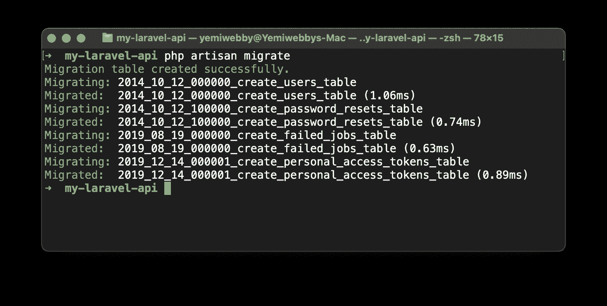
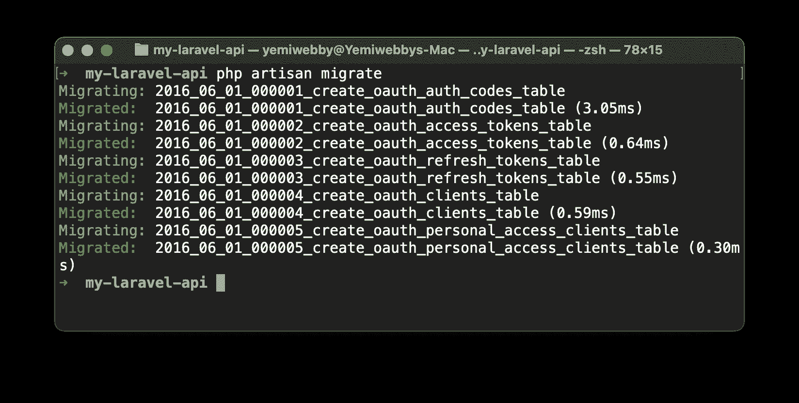
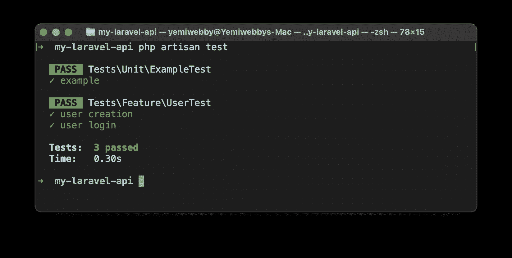
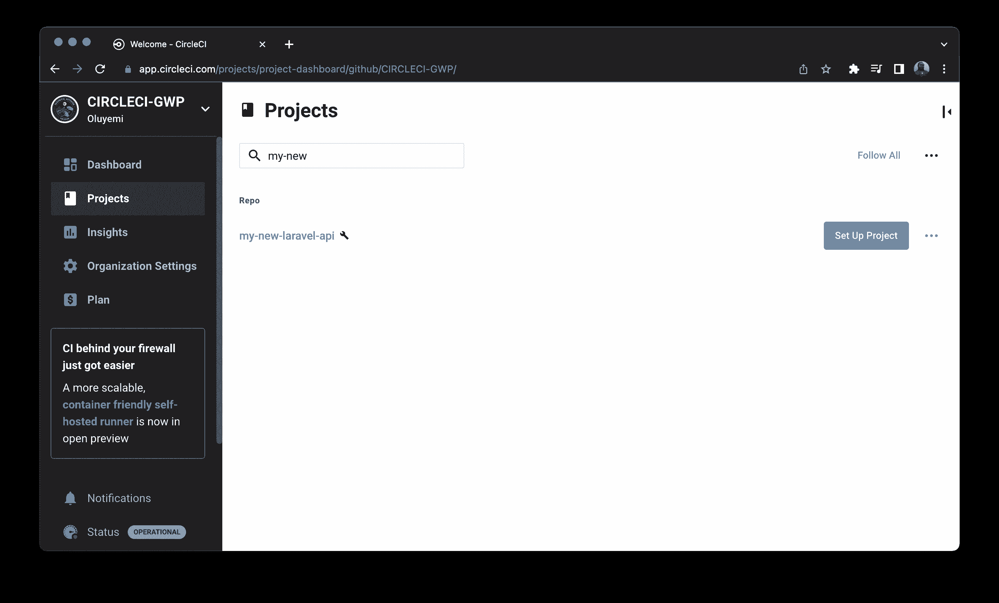
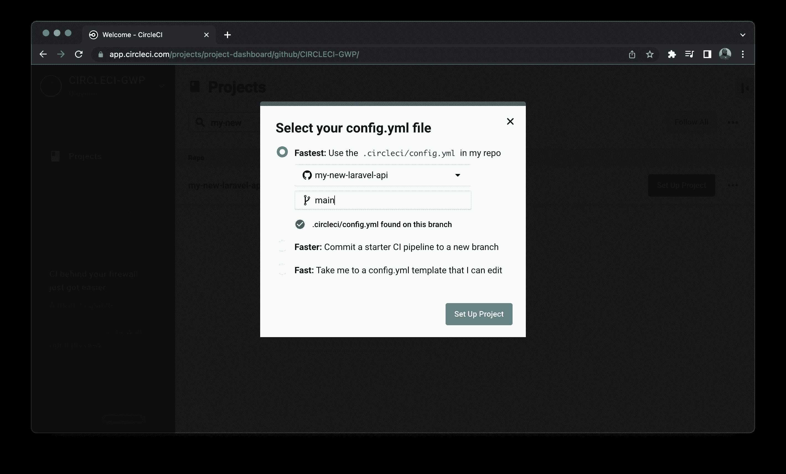
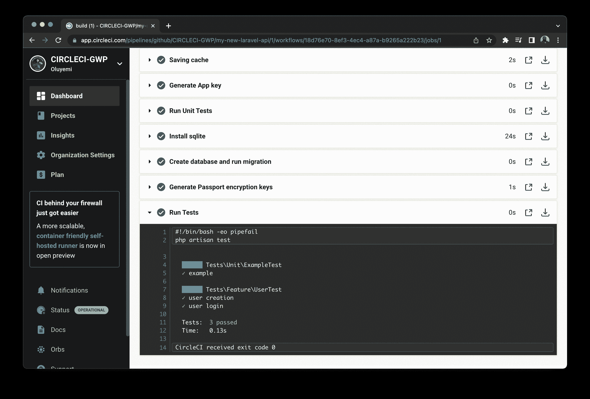

# 用 Laravel | CircleCI 构建 CI 驱动的 RESTful API

> 原文：<https://circleci.com/blog/build-a-ci-powered-restful-api-with-laravel/#2022-11-28T01:00:00-08:00>

> 本教程涵盖:
> 
> 1.  用 Laravel 构建 RESTful API
> 2.  在本地测试 API
> 3.  自动化 API 测试

当谈到构建 RESTful APIs 时，PHP 的开源 Laravel 框架仍然是 web 开发的五大后端框架之一。Laravel 还通过提供一个易于使用的测试套件，使测试 API 端点变得轻而易举。在本文中，我们将使用 Laravel 构建一个基于令牌的身份验证 API，为端点编写测试，并使用 CircleCI 自动化构建和测试过程。

## 先决条件

要跟进这篇文章，你需要一些东西:

*   [PHP](https://www.php.net/) > = 7.3 安装在您的系统上(您可以通过在终端上运行命令`php -v`来确认您的版本是否足够高)
*   [全球安装的作曲家](https://getcomposer.org/)(通过在您的终端上运行`composer`命令来确认)
*   安装在您系统上的 Git
*   GitHub 的一个账户
*   一个[圆](https://circleci.com/signup/)的账户

> 我们的教程是平台无关的，但是使用 CircleCI 作为例子。如果你没有 CircleCI 账号，请在 注册一个免费的 [**。**](https://circleci.com/signup/)

一旦你有了这些并运行，你将准备好跟随教程。

## 搭建 Laravel API

第一步是构建一个新的 Laravel 应用程序。首先，发出以下命令:

```
composer create-project laravel/laravel my-new-laravel-api 
```

这将在命令运行的位置创建一个名为`my-new-laravel-api`的项目。你可以给你的项目取任何你想要的名字。

## 设置数据库

对于本教程，您将对测试数据库和主数据库使用 SQLite。在实践中，您可能会使用更复杂的 DBMS，如 MySQL 或 MSSQL，但我们将在本教程中保持简单。主数据库的配置在`.env`文件中。创建一个`.env.testing`文件来保存您的测试数据库配置。

您已经有了默认项目搭建附带的`.env`文件。创建一个名为`.env.testing`的新文件，并将`.env.example`(也是默认创建的)的内容复制到其中。

用以下配置替换两个文件(`.env`和`.env.testing`)的数据库配置部分:

```
DB_CONNECTION=sqlite
DB_HOST=null
DB_PORT=null
DB_DATABASE=database/database.sqlite
DB_USERNAME=null
DB_PASSWORD=null 
```

因为主数据库和测试数据库都使用 SQLite，所以两个文件使用相同的配置。在前面的代码片段中，您的连接被设置为`sqlite`，您的数据库被设置为`database.sqlite`，它位于`database`文件夹中。您还没有创建这个`database.sqlite`文件。进入项目根目录下的`database`文件夹并创建它。

设置数据库的最后一个任务是使用 Laravel 的一个助手指向`config/database.php`中数据库配置文件中的 SQLite 数据库文件。在`config/database.php`文件中，用下面的代码替换`connections`数组中的 SQLite 配置:

```
'sqlite' => [
            'driver' => 'sqlite',
            'database' => database_path('database.sqlite'),
            'prefix' => '',
    ], 
```

这确保了 SQLite 配置总是指向正确的数据库路径，即使您更改了应用程序运行的环境。

要确认一切正常，请通过运行以下命令来迁移数据库:

```
php artisan migrate 
```

成功的迁移应该会显示类似于下面的屏幕截图:



通过在您的`.gitignore`文件中声明它，确保您忽略了数据库文件。

## 使用 Passport 设置基于令牌的身份验证

您的下一个任务是设置一个 API 项目来使用基于令牌的身份验证。您将使用 [Laravel Passport](https://github.com/laravel/passport) OAuth 库来实现，该库为您的 Laravel 应用程序提供了完整的 OAuth2 服务器实现。首先，安装`laravel/passport`包:

```
composer require laravel/passport 
```

安装完成后，运行这个命令来运行`laravel/passport`附带的迁移:

```
php artisan migrate 
```

这应该会在命令行上打印出与下面类似的屏幕:



Passport 需要加密密钥来生成访问令牌，这些密钥需要生成并保存在数据库中。要生成这些密钥，请运行以下命令:

```
php artisan passport:install 
```

成功运行该命令后，您应该会看到生成的客户端机密。

下一步是将`Laravel\Passport\HasApiTokens`特征添加到您的`App\User`模型中。这将把`laravel/passport`包中的助手方法引入到应用程序中，以帮助检查用户的令牌和范围。打开`app/Models/User.php`文件，用下面的代码替换其内容:

```
<?php

<?php

namespace App\Models;

use Illuminate\Contracts\Auth\MustVerifyEmail;
use Illuminate\Database\Eloquent\Factories\HasFactory;
use Illuminate\Foundation\Auth\User as Authenticatable;
use Illuminate\Notifications\Notifiable;
use Laravel\Passport\HasApiTokens;

class User extends Authenticatable
{
    use HasApiTokens, HasFactory, Notifiable;

    /**
     * The attributes that are mass assignable.
     *
     * @var array<int, string>
     */
    protected $fillable = [
        'name',
        'email',
        'password',
    ];

    /**
     * The attributes that should be hidden for serialization.
     *
     * @var array<int, string>
     */
    protected $hidden = [
        'password',
        'remember_token',
    ];

    /**
     * The attributes that should be cast.
     *
     * @var array<string, string>
     */
    protected $casts = [
        'email_verified_at' => 'datetime',
    ];
} 
```

在这个文件中，您导入了`Laravel\Passport\HasApiTokens`特征并指示您的类使用它。

接下来，您需要调用包含在`app/Providers/AuthServiceProvider.php`文件中的`AuthServiceProvider`的引导方法中的`Passport::routes`方法。打开该文件，用下面的代码替换内容:

```
<?php

namespace App\Providers;

use Laravel\Passport\Passport;
use Illuminate\Support\Facades\Gate;
use Illuminate\Foundation\Support\Providers\AuthServiceProvider as ServiceProvider;

class AuthServiceProvider extends ServiceProvider
{

    protected $policies = [
        'App\Model' => 'App\Policies\ModelPolicy',
    ];

    public function boot()
    {
        $this->registerPolicies();

        Passport::routes();
    }
} 
```

最后，打开`config/auth.php`配置文件，定义一个 api 认证保护，将驱动选项设置为 passport，如下所示:

```
'guards' => [
    'web' => [
        'driver' => 'session',
        'provider' => 'users',
    ],

    'api' => [
        'driver' => 'passport',
        'provider' => 'users',
    ],
], 
```

这样，应用程序现在将使用 Passport 的 TokenGuard 来验证传入的请求。

## 创建 API 端点

您将构建一个简单的用户配置文件 API。用户将能够:

*   注册一个新账户
*   使用他们的登录凭据登录他们的帐户
*   获取他们的个人资料
*   注销应用程序

您需要为这四个任务创建 API 端点。进入文件`routes/api.php`，用下面的代码替换它的内容:

```
<?php

use App\Http\Controllers\AuthController;

Route::group([
    'prefix' => 'auth'
], function () {
    Route::post('login', [AuthController::class, 'login']);
    Route::post('signup', [AuthController::class, 'signup']);

    Route::group([
        'middleware' => 'auth:api'
    ], function() {
        Route::get('logout', [AuthController::class, 'logout']);
        Route::get('user', [AuthController::class, 'user']);
    });
}); 
```

这段代码创建了一个`auth`路由组，并为前面提到的四个任务创建了四条路由。

通过`auth:api`中间件对`auth/logout`和`auth/user`路由进行认证，以确保只有通过认证的访问才被允许访问这些端点。您还引用了上面的`AuthController`，这是您接下来要创建的控制器。为此，运行以下命令来创建控制器:

```
php artisan make:controller AuthController 
```

现在将这段代码放到新创建的控制器中:

```
<?php

namespace App\Http\Controllers;

use App\Models\User;
use Carbon\Carbon;
use Illuminate\Http\Request;
use Illuminate\Support\Facades\Auth;

class AuthController extends Controller
{
    /**
     * Create user
     *
     * @param  [string] name
     * @param  [string] email
     * @param  [string] password
     * @param  [string] password_confirmation
     * @return [string] message
     */
    public function signup(Request $request)
    {
        $request->validate([
            'name' => 'required|string',
            'email' => 'required|string|email|unique:users',
            'password' => 'required|string|confirmed'
        ]);

        $user = new User([
            'name' => $request->name,
            'email' => $request->email,
            'password' => bcrypt($request->password)
        ]);

        $user->save();

        return response()->json([
            'message' => 'Successfully created user!'
        ], 201);
    }

    /**
     * Login user and create token
     *
     * @param  [string] email
     * @param  [string] password
     * @param  [boolean] remember_me
     * @return [string] access_token
     * @return [string] token_type
     * @return [string] expires_at
     */
    public function login(Request $request)
    {
        $request->validate([
            'email' => 'required|string|email',
            'password' => 'required|string',
            'remember_me' => 'boolean'
        ]);

        $credentials = request(['email', 'password']);
        if(!Auth::attempt($credentials)){
            return response()->json([
                'message' => 'Unauthorized'
            ], 401);
        }

        $user = $request->user();
        $tokenResult = $user->createToken('Personal Access Token');
        $token = $tokenResult->token;

        if ($request->remember_me){
            $token->expires_at = Carbon::now()->addWeeks(1);
        }

        $token->save();

        return response()->json([
            'access_token' => $tokenResult->accessToken,
            'token_type' => 'Bearer',
            'expires_at' => Carbon::parse(
                $tokenResult->token->expires_at
            )->toDateTimeString()
        ]);
    }

    /**
     * Logout user (Revoke the token)
     *
     * @return [string] message
     */
    public function logout(Request $request)
    {
        $request->user()->token()->revoke();

        return response()->json([
            'message' => 'Successfully logged out'
        ]);
    }

    /**
     * Get the authenticated User
     *
     * @return [json] user object
     */
    public function user(Request $request)
    {
        return response()->json($request->user());
    }
} 
```

这是一大堆代码。我会一点一点地为你解释。

### 注册方法

该方法接收电子邮件、密码和用户名作为参数，然后在`User`模型上使用 Lucid 模型的`save()`方法创建一个用户，并返回一条成功消息以及状态 201。

### 登录方法

该方法接收用户电子邮件和密码以及一个可选的`remember_me`参数。然后，它验证凭证，并在成功验证后，返回访问令牌、令牌类型和令牌将过期的时间。

### 注销方法

该方法接收并撤销给予用户的访问令牌，然后在注销时发送成功消息。

### 用户方法

该方法接收用户的访问令牌，并使用它返回用户的详细信息。

**注意:** *如果你看到在你的项目中创建了一个文件`.rnd`，忽略这个文件，把它添加到你的`.gitignore`文件中。*

## 测试 API 端点

现在是时候为 API 端点编写一些测试了。通过运行以下命令创建测试:

```
php artisan make:test UserTest 
```

这将在`tests/Feature`文件夹中创建`UserTest`测试文件。删除文件夹中默认的`ExampleTest.php`文件。打开刚刚创建的`UserTest.php`文件，用下面的代码替换其内容:

```
<?php

namespace Tests\Feature;

use Tests\TestCase;
use Illuminate\Foundation\Testing\WithFaker;
use Illuminate\Foundation\Testing\RefreshDatabase;

use App\Models\User;

class UserTest extends TestCase
{

    use WithFaker;

    private $password = "mypassword";

    public function testUserCreation()
    {

        $name = $this->faker->name();
        $email = $this->faker->email();

        $response = $this->postJson('/api/auth/signup', [
            'name' => $name,
            'email' => $email,
            'password' => $this->password,
            'password_confirmation' => $this->password
        ]);

        $response
            ->assertStatus(201)
            ->assertExactJson([
                'message' => "Successfully created user!",
            ]);
    }

    public function testUserLogin()
    {
        $name = $this->faker->name();
        $email = $this->faker->email();

        $user = new User([
            'name' => $name,
            'email' => $email,
            'password' => bcrypt($this->password)
        ]);

        $user->save();

        $response = $this->postJson('/api/auth/login', [
            'email' => $email,
            'password' => $this->password
        ]);

        $response->assertStatus(200);
        $this->assertAuthenticated();
    }

} 
```

该文件包含对`/api/auth/signup`和`/api/auth/login` API 端点的测试。这些端点确保用户能够成功注册和登录。该测试使用已经安装的 PHP [Faker 库](https://github.com/fzaninotto/Faker)生成了一个随机的电子邮件地址和用户名，以及一个通用密码来创建一个新的用户帐户。该测试还断言在控制器中定义了适当的 HTTP 状态代码和消息。

## 在本地运行测试

现在来测试一下。您将使用 PHPUnit 来运行您的测试。PHPUnit 的安装附带了`phpunit` CLI 命令。您可以通过全局安装 [PHPUnit](https://phpunit.de/) 来全局运行这个命令，或者在项目级别运行它。默认搭建的 Laravel 项目已经在本地安装了包，这使我们能够运行您的测试。

要运行测试，请在项目根目录下运行以下命令:

```
php artisan test 
```

这将使用您本地安装的软件包运行`phpunit`命令。如果一切顺利，您的所有测试都应该成功运行，您应该会看到类似下面的屏幕。



## 用 CircleCI 自动化测试

是时候将 CI/CD 的强大功能引入您的 Laravel API 了。您将创建一个管道，在每次推送新代码时自动运行测试。您可以从 CircleCI 获得成功或失败的 CI/CD 管道状态。您的管道将由以下步骤组成:

*   启动所需的环境
*   使用 composer 安装依赖项
*   为项目设置一个`.env`环境文件
*   设置测试数据库并运行迁移
*   为`laravel/passport`包生成加密密钥
*   运行测试

要创建 CI/CD 管道，您需要为 CircleCI 编写一个配置文件。进入项目的根目录，创建一个名为`.circleci`的文件夹。在这个文件夹中，创建一个名为`config.yml`的文件。

打开新创建的配置文件，使用以下代码:

```
version: 2.1
orbs:
  browser-tools: circleci/browser-tools@1.1
jobs:
  build:
    docker:
      # Specify the version you desire here
      - image: cimg/php:7.4.14-browsers

    steps:
      - browser-tools/install-browser-tools
      - checkout

      - run:
          name: "Create Environment file and generate app key"
          command: |
            mv .env.testing .env

      # Download and cache dependencies
      - restore_cache:
          keys:
            # "composer.lock" can be used if it is committed to the repo
            - v1-dependencies-{{ checksum "composer.json" }}
            # fallback to using the latest cache if no exact match is found
            - v1-dependencies-

      - run:
          name: "Install Dependencies"
          command: composer install -n --prefer-dist

      - save_cache:
          key: v1-dependencies-{{ checksum "composer.json" }}
          paths:
            - ./vendor

      # prepare the database
      - run:
          name: "Generate App key"
          command: php artisan key:generate

      - run:
          name: "Install sqlite"
          command: sudo apt-get install php7.4-sqlite3

      - run:
          name: "Create database and run migration"
          command: |
            touch database/database.sqlite
            php artisan migrate --env=testing

      - run:
          name: "Generate Passport encryption keys"
          command: php artisan passport:install

      # run tests with phpunit
      - run:
          name: "Run Tests"
          command: php artisan test 
```

在这个配置文件中，您从 [CircleCI 映像注册表](https://hub.docker.com/search?q=circleci&type=image)中提取了 PHP 的 [Docker 映像](https://circleci.com/developer/images/image/cimg/php)。这个图像包含 PHP 编程语言、composer、节点和浏览器扩展。

接下来，它检查您的代码，创建一个`.env`文件并安装项目的依赖项。用`php artisan key:generate`生成应用程序密钥后，安装 SQLite，运行数据库迁移，最后用 PHPUnit 运行测试。

现在，您可以在 GitHub 上建立一个存储库，并将您的项目推送到其中。[回顾将项目推送到 GitHub](https://circleci.com/blog/pushing-a-project-to-github/) 以获取指示。在下一节中，您将把项目链接到 CircleCI。

## 将 API 项目连接到 CircleCI

现在是时候把这个配置交给 CircleCI 来设置您的管道了。您可以通过将您的项目连接到 CircleCI 来实现。前往你的 [CircleCI 仪表盘](https://app.circleci.com/dashboard)。如果你注册了你的 GitHub 账户，你所有的库都可以在你项目的仪表盘上看到。

点击`my-new-laravel-api`项目旁边的设置项目。



在**选择您的 config.yml 文件**屏幕上，选择最快的选项并键入`main`作为分支名称。CircleCI 会自动定位`config.yml`文件。点击**设置项目**启动工作流程。



CircleCI 将开始运行您的管道配置。如果您正确地遵循了说明，您应该会得到一个成功的构建，如下图所示。



完美。您已经成功地为您的 Laravel API 提供了一个 CI/CD 管道，该管道使用 CircleCI 自动运行您的测试。

## 结论

在本文中，您使用 Laravel 开发了一个基于令牌的身份验证 API，对其进行了测试，并使用为 CircleCI 创建并由 circle CI 运行的 CI/CD 管道自动化了构建和测试过程。这只是将自动化引入 Laravel APIs 开发的起点。使用 CircleCI，您可以做更多的事情来创建一个更健壮、更复杂的管道，从而消除应用程序开发中涉及的大量手动任务。

我希望你从这篇文章中学到了一些有价值的东西。完整的源代码可以在 GitHub 的[这里找到。快乐编码:)](https://github.com/CIRCLECI-GWP/my-new-laravel-api)

* * *

Fikayo Adepoju 是 LinkedIn Learning(Lynda.com)的作者、全栈开发人员、技术作者和技术内容创建者，精通 Web 和移动技术以及 DevOps，拥有 10 多年开发可扩展分布式应用程序的经验。他为 CircleCI、Twilio、Auth0 和 New Stack 博客撰写了 40 多篇文章，并且在他的个人媒体页面上，他喜欢与尽可能多的从中受益的开发人员分享他的知识。你也可以在 Udemy 上查看他的视频课程。

[阅读 Fikayo Adepoju 的更多帖子](/blog/author/fikayo-adepoju/)