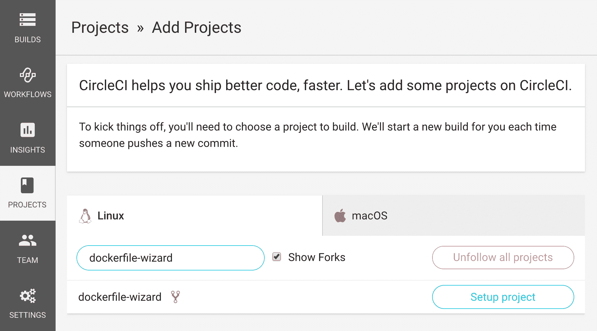

# 停靠影像-停靠精灵|圆形

> 原文：<https://circleci.com/blog/build-custom-docker-images-faster-and-more-easily-with-our-dockerfile-wizard/#2018-01-10T06:52:00-08:00>

**有关我们最新的 Docker 内容，请参见[为您的 CI/CD 管道使用 Docker 指南](https://circleci.com/blog/guide-to-using-docker-for-your-ci-cd-pipelines/)。**

在过去几年中，Docker 和其他容器化/虚拟化工具的崛起已经帮助我们重新关注 CircleCI 所珍视的一些软件开发价值——一致性、自动化和连续性；也就是说，在一个一致的执行环境中开发软件，以自动化的方式测试它，并在关注新代码的持续交付的情况下部署它。

我们在去年夏天发布了 CircleCI 2.0，将 Docker 置于我们的[持续集成](https://circleci.com/continuous-integration/)平台的核心，并允许客户使用 [Docker 映像](https://circleci.com/docs/custom-images/)的任意组合作为执行环境，在 CircleCI 上构建项目。

然而，在实践中，用您需要的每种语言和依赖项的精确版本构建和定制您自己的 Docker 映像可能是棘手的、乏味的和令人生畏的——尤其是对于那些对 Docker 还不熟悉的软件开发人员。出于这个原因，我们发布了[各种各样的便利 Docker 镜像](https://hub.docker.com/r/circleci),以及软件工具集和执行环境的常见组合。

但是，如果您使用的是旧版本的某某工具，而我们的便利图片没有涵盖，或者只是想要更多的选项，该怎么办呢？现在，我们开发了一个 Docker 工具，可能会有所帮助。我们新的 [Dockerfile 向导](https://github.com/circleci-public/dockerfile-wizard)允许您在 CircleCI 上构建和部署您自己的定制 Docker 映像——您所需要的只是一个 Docker Hub 帐户(当然，还有一个 CircleCI 帐户)。

要使用它，将[docker file-wizard repository](https://github.com/circleci-public/dockerfile-wizard)分支到您的 GitHub 帐户，并开始在 CircleCI 上构建您的项目分支。然后，按照[自述文件](https://github.com/circleci-public/dockerfile-wizard)中的说明，你可以在 CircleCI 上定制和构建你的 Docker 镜像，甚至不需要在你的本地计算机上安装 Docker。

完成后，您将拥有一个 Docker 图像，可以在 CircleCI 上构建的任何项目中使用——或者在任何其他地方使用。

当您能够维护一个一致的软件环境时，持续集成工作得最好，从您的本地开发机器到您的 [CI](https://circleci.com/continuous-integration/) 构建。Dockerfile 向导将帮助您做到这一点。

我们希望这个工具能让您更进一步，永远不必再说“它在我的本地机器上工作，但在 CircleCI 上不工作”。