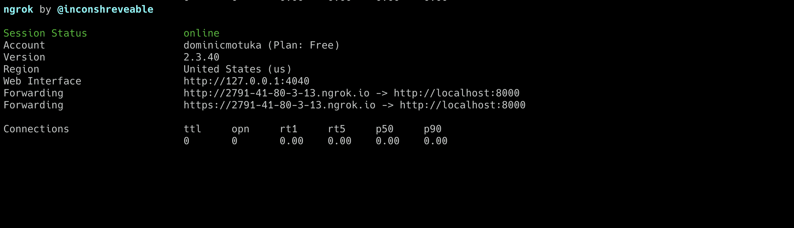
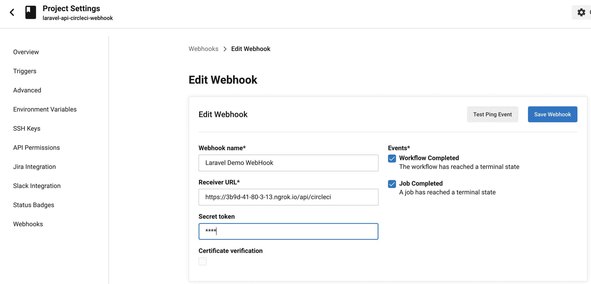
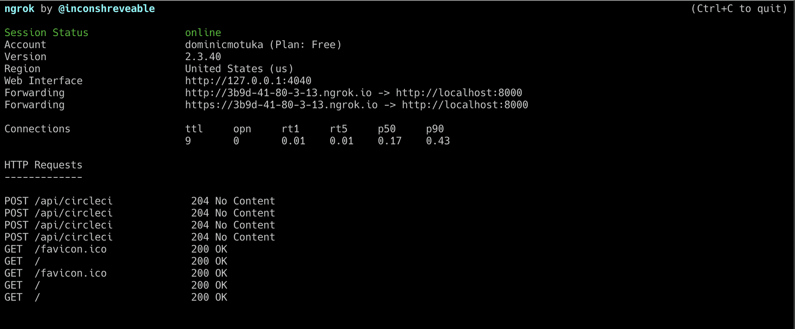

# 为 CircleCI webhooks | CircleCI 构建 Laravel API

> 原文：<https://circleci.com/blog/building-a-laravel-api-for-circleci-webhooks/#2022-01-07T12:00:00-08:00>

软件应用程序由相互连接的系统组成——每个系统都为满足业务需求的共同目标提供专门的服务。与任何网络一样，高效的数据交换机制是其功能性、有效性和响应性的关键。

过去，使用*轮询*请求来执行数据交换。每隔一段时间，系统就会请求获取最新的信息，或者了解是否有更新需要处理。这种技术被证明是低效的，因为大多数请求被返回，而没有新的信息来处理。如果有新的东西要处理，信息很可能是陈旧的，使应用程序无法实时响应。

这导致了一种新的交流形式:网页挂钩。如果预先约定的事件发生，则请求通知需要该信息的系统，允许该系统立即响应。使用 webhooks 的优点是系统开销较低，因为发出的请求较少。它还确保了数据的实时交换。CircleCI 提供了 [webhooks](/blog/create-customizable-experiences-with-circleci-webhooks/) ，允许您实时接收关于您的管道的信息。这可以帮助您避免轮询 API 或手动检查 CircleCI web 应用程序中您需要的数据。

在本教程中，我将带领您构建一个 Laravel API，它将被用作我们也将创建的 CircleCI 管道的 webhook。

## 先决条件

为了从本教程中获得最大收益，您需要一些东西:

> 我们的教程是平台无关的，但是使用 CircleCI 作为例子。如果你没有 CircleCI 账号，请在 注册一个免费的 [**。**](https://circleci.com/signup/)

## CircleCI webhooks 的用例

如果您仍然想知道如何使用 CircleCI webhooks，而不管您选择哪种编程语言，这里有一些用例:

*   聚合来自单个或多个项目的事件，并将数据发送到 Slack 等通信渠道
*   当工作流/作业被取消或完成时，自动向开发团队发送通知。
*   通过自定义控制面板可视化和分析工作流/作业事件。
*   向数据记录和事故管理工具发送有价值的数据

## 入门指南

创建一个新项目开始。

```
laravel new circle_ci_webhook_api

cd circle_ci_webhook_api 
```

现在，要设置 webhook，您需要创建一个基本的 CircleCI 配置，并为 CI 管道设置一个 GitHub 存储库。在项目的根目录下，创建一个名为`.circleci`的新文件夹。在`.circleci`文件夹中，创建一个名为`config.yml`的新文件。将此添加到文件中:

```
version: 2
jobs:
  build:
    docker:
      - image: cimg/php:8.0-browsers

    steps:
      - checkout

      - run:
          name: "Prepare Environment"
          command: |
            sudo apt update

      # Download and cache dependencies
      - restore_cache:
          keys:
            # "composer.lock" can be used if it is committed to the repo
            - v1-dependencies-{{ checksum "composer.json" }}
            # fallback to using the latest cache if no exact match is found
            - v1-dependencies-

      - run:
          name: "Install Dependencies"
          command: composer install -n --prefer-dist

      - save_cache:
          key: v1-dependencies-{{ checksum "composer.json" }}
          paths:
            - ./vendor 
```

下一步是创建控制器。这个控制器将用于处理来自 CircleCI 的请求，并根据保存到数据库中的内容检索请求的历史记录。要创建一个控制器，运行这个`artisan`命令:

```
php artisan make:controller CircleCIController 
```

在新创建的`app/Http/Controllers/CircleCIController.php`文件中，添加以下内容:

```
<?php

namespace App\Http\Controllers;

use App\Models\WebhookNotification;
use Illuminate\Http\{JsonResponse, Response};

class CircleCIController extends Controller {

    public function getAllNotifications()
    : JsonResponse {

        return response()->json();
    }

    public function handleNotification()
    : JsonResponse {

        return response()
            ->json(null, Response::HTTP_NO_CONTENT);
    }

} 
```

这段代码片段声明了两个函数。目前，它们只分别返回状态为`200`和`204`的 JSON 响应。

接下来，为您的 API 添加两条路由。打开`routes/api.php`并添加以下内容:

```
Route::post('circleci', [CircleCIController::class, 'handleNotification']);
Route::get('circleci', [CircleCIController::class, 'getAllNotifications']); 
```

第一条路线是 webhook 路线。它将处理来自 CircleCI 的 **POST** 请求。第二条路径将用于获取 CircleCI 发送给 webhook 的通知。因为这些航线已经被注册为 API 航线，所以完整的 URIs 航线将被加上`api` : `api/circleci`。

导入`CircleCIController`:

```
use App\Http\Controllers\CircleCIController; 
```

现在，您已经准备好为您的应用程序服务了。使用以下命令运行应用程序:

```
php artisan serve 
```

## 设置 ngrok

出于开发目的，我们需要一种方式将本地应用程序作为 webhook 公开给 CircleCI。我们可以使用 [ngrok](https://ngrok.com/) 向互联网公开我们正在运行的 Laravel 应用程序。

下载 [ngrok 可执行文件](https://ngrok.com/download)并解压。要在您的本地机器上公开一个端口，使用`ngrok http`命令，指定您想要公开的端口号。我们的 Laravel 应用程序将在端口 8000 上运行，因此使用以下命令:

```
ngrok http 8000 
```

当您启动 ngrok 时，它将在您的终端中显示一个 UI，其中包含您的隧道的公共 URL 以及有关通过您的隧道建立的连接的其他状态和度量信息。



## 设置 CircleCI 管道

接下来，在 GitHub 上建立一个存储库，并将项目链接到 CircleCI。参考这篇文章来获得帮助[把你的项目推到 GitHub](https://circleci.com/blog/pushing-a-project-to-github/) 。

登录您的 CircleCI 帐户。如果你注册了你的 GitHub 账户，你所有的库都会显示在你项目的仪表盘上。

在您的`circle_ci_webhook_api`项目旁边，点击**设置项目**。

CircleCI 将检测项目中的`config.yml`文件。点击**使用现有配置**，然后点击**开始建造**。您的第一个构建过程将开始运行并成功完成。

## 为项目配置 webook

在`circle_ci_webhook_api`项目的 CircleCI 仪表盘上，点击**项目设置**。在工具条中，点击**网页挂钩**，然后点击**添加网页挂钩**。填写表格。



在**接收者 URL** 字段中指定 ngrok 给出的公共 URL。添加一个秘密令牌来验证对 webhook 的传入请求，并确保只接受来自 CircleCI 的请求。记下这个秘密令牌，因为您将使用它来验证对接收方 URL 的传入请求。

点击**添加网页挂钩**保存网页挂钩的详细信息。当一个工作流或作业完成时，一个 POST 请求将被发送到我们的 Laravel 应用程序的`api/circleci`路径。

## 设置环境变量

对于本教程，我们将使用 MySQL 来管理我们的数据库。在`.env`文件中，用以下内容更新数据库相关参数:

```
DB_CONNECTION=mysql
DB_HOST=127.0.0.1
DB_PORT=3306
DB_DATABASE=circle_ci_webhook_api
DB_USERNAME=YOUR_DATABASE_USERNAME
DB_PASSWORD=YOUR_DATABASE_PASSWORD 
```

使用您喜欢的数据库管理应用程序，创建一个名为`circle_ci_webhook_api`的新数据库。

您还需要一个环境变量来保存 webhook secret 令牌。在`.env`文件中包含以下内容。

```
CIRCLE_CI_WEBHOOK_SECRET="YOUR_CIRCLE_CI_WEBHOOK_SECRET" 
```

## 创建`WebhookNotification`模型

在我们的应用程序中，我们需要一个模型来表示 webhook 收到的通知的细节。给这个型号取名`WebhookNotification`。它将包含以下字段:

*   `id`是数据库中的主键。
*   `notification_id`是 webhook 提供的 id，用于唯一标识来自 CircleCI 的每个通知。
*   `type`值为`workflow-completed`或`job-completed`。
*   `happened_at`是代表事件发生时间的 ISO 8601 时间戳。
*   `has_vcs_info`让您知道通知是否有一个[版本控制](https://circleci.com/docs/webhooks/#vcs)映射，用于访问与触发事件的 git 提交相关的元数据。
*   如果通知具有版本控制映射，则代表提交的主题。否则，该值为空。
*   `commit_author`代表提交的作者。如果`has_vcs_info`为假，则该值可以为空。
*   `event_status`对应于工作流或作业到达终止状态时的状态。这些值可以是`success`、`failed`、`error`、`canceled`或`unauthorized`。
*   `workflow_url`包含 CircleCI 仪表板上工作流程或作业的 URL。

使用以下命令创建模型:

```
php artisan make:model WebhookNotification -m 
```

在新创建的`database/migrations/*YYYY_MM_DD_HHMMSS*_create_webhook_notifications_table.php`中，更新`up`函数以匹配该代码块:

```
public function up() {

        Schema::create('webhook_notifications', function (Blueprint $table) {

            $table->id();
            $table->string('notification_id');
            $table->string('type');
            $table->string('happened_at');
            $table->boolean('has_vcs_info');
            $table->string('commit_subject')->nullable();
            $table->string('commit_author')->nullable();
            $table->string('event_status');
            $table->text('workflow_url');
            $table->timestamps();
        });
    } 
```

接下来，打开`WebhookNotification`模型文件:`app/Models/WebhookNotification.php`。使用以下代码更新它以添加字段作为`$fillable`属性:

```
<?php

namespace App\Models;

use Illuminate\Database\Eloquent\Factories\HasFactory;
use Illuminate\Database\Eloquent\Model;

class WebhookNotification extends Model
{
    use HasFactory;

    protected $fillable = [
        'notification_id', 'type', 'happened_at', 'has_vcs_info', 'commit_subject','commit_author',
        'event_status','workflow_url'
    ];
} 
```

运行迁移来创建`webhook_notifications`表及其列。

```
php artisan migrate 
```

## 创建一个助手类来管理 CircleCI 请求

为了分离关注点并使我们的控制器更精简，您可以创建一个助手类。helper 类验证传入的请求，并解析请求中用于填充`WebhookNotification`模型的信息。

在项目的`app`文件夹中，创建一个名为`Helpers`的新文件夹。在那个文件夹中，创建一个名为`CircleCINotificationHelper.php`的新文件。用以下代码更新该文件的内容:

```
<?php

namespace App\Helpers;

use App\Models\WebhookNotification;
use Illuminate\Http\{Request, Response};

class CircleCINotificationHelper {

    public static function handle(Request $request)
    : void {

        $circleCISignature = $request->headers->get('circleci-signature');

        self::validate($circleCISignature, $request->getContent());
        $requestContent = $request->toArray();
        $hasVCSInfo = isset($requestContent['pipeline']['vcs']);

        $notificationType = $requestContent['type'];

        $notificationDetails = [
            'notification_id' => $requestContent['id'],
            'type'            => $notificationType,
            'happened_at'     => $requestContent['happened_at'],
            'workflow_url'    => $requestContent['workflow']['url'],
            'has_vcs_info'    => $hasVCSInfo,
        ];

        if ($hasVCSInfo) {
            $commitDetails = $requestContent['pipeline']['vcs']['commit'];
            $notificationDetails['commit_subject'] = $commitDetails['subject'];
            $notificationDetails['commit_author'] = $commitDetails['author']['name'];
        }

        $notificationDetails['event_status'] = $notificationType === 'job-completed' ?
            $requestContent['job']['status'] :
            $requestContent['workflow']['status'];

        $webhookNotification = new WebhookNotification($notificationDetails);

        $webhookNotification->save();
    }

    private static function validate(string $signature, string $requestContent)
    : void {

        $receivedSignature = explode('=', $signature)[1];

        $generatedSignature = hash_hmac(
            'sha256',
            $requestContent,
            env('CIRCLE_CI_WEBHOOK_SECRET')
        );

        abort_if(
            $receivedSignature !== $generatedSignature,
            Response::HTTP_UNAUTHORIZED,
            'Invalid Signature Provided'
        );
    }
} 
```

`CircleCINotificationHelper`只有一个名为`handle`的公共方法，它接受一个`Request`对象。

在解析请求的内容之前，首先使用`validate`函数进行验证检查。这确保了只处理来自 CircleCI 的请求。为了验证请求，使用配置的签名秘密作为秘密密钥，将`circleci-signature`头与请求体的 HMAC-SHA256 摘要进行比较。如果这些值不匹配，该过程被中止，并返回一个`401`响应。你可以在这里阅读更多关于 Webhook 有效载荷签名[的信息。](https://circleci.com/docs/webhooks/#payload-signature)

如果请求签名通过检验，`handle`方法检索`WebhookNotification`模型的值，创建一个，并保存到数据库。

## 向 CircleCIController 添加功能

有了模型和助手，我们就可以在 CircleCIController 中向前面定义的函数添加功能。打开`app/Http/Controllers/CircleCIController.php`并将其更新为与此匹配:

```
<?php

namespace App\Http\Controllers;

use App\Helpers\CircleCINotificationHelper;
use App\Models\WebhookNotification;
use Illuminate\Http\{JsonResponse, Request, Response};

class CircleCIController extends Controller {

    public function getAllNotifications()
    : JsonResponse {

        return response()->json(WebhookNotification::all());
    }

    public function handleNotification(Request $request)
    : JsonResponse {

        CircleCINotificationHelper::handle($request);

        return response()
            ->json(null, Response::HTTP_NO_CONTENT);
    }

} 
```

现在已经完成了这些更改，您可以通过提交和推送您的更改到 GitHub 存储库来触发一个新的事件。

```
git add .

git commit -m 'Implement Webhook for CircleCI'

git push origin main 
```

这将触发一个构建过程。当这个过程完成时，一个请求被发送到我们指定的 ngrok 公共 URL。使用 ngrok 创建的隧道，应用程序接收请求并将通知保存到数据库。您可以在 ngrok 终端中查看`HTTP Requests`部分。



## 结论

在本教程中，我们设置了一个 Laravel API 来与 CircleCI webhook 通信。虽然我们只是将数据保存到数据库中以供将来可视化/分析，但 webhooks 为许多依赖于实时数据的操作打开了大门，例如事件检测和响应/管理。与您的团队分享本教程，使用您自己的项目扩展您所学到的内容。

这篇文章的代码可以在 [GitHub](https://github.com/yemiwebby/circle_ci_webhook) 上找到，CircleCI webhooks 的完整文档可以在[这里](https://circleci.com/docs/webhooks/)找到。

尽情享受吧！

* * *

[Oluyemi](https://twitter.com/yemiwebby) 是一名拥有电信工程背景的技术爱好者。出于对解决用户日常遇到的问题的浓厚兴趣，他冒险进入编程领域，并从那时起将他解决问题的技能用于构建 web 和移动软件。Oluyemi 是一名热衷于分享知识的全栈软件工程师，他在世界各地的几个博客上发表了大量技术文章和博客文章。由于精通技术，他的爱好包括尝试新的编程语言和框架。

* * *

Oluyemi 是一名拥有电信工程背景的技术爱好者。出于对解决用户日常遇到的问题的浓厚兴趣，他冒险进入编程领域，并从那时起将他的问题解决技能用于构建 web 和移动软件。Oluyemi 是一名热衷于分享知识的全栈软件工程师，他在世界各地的几个博客上发表了大量技术文章和博客文章。作为技术专家，他的爱好包括尝试新的编程语言和框架。

[阅读更多 Olususi Oluyemi 的帖子](/blog/author/olususi-oluyemi/)