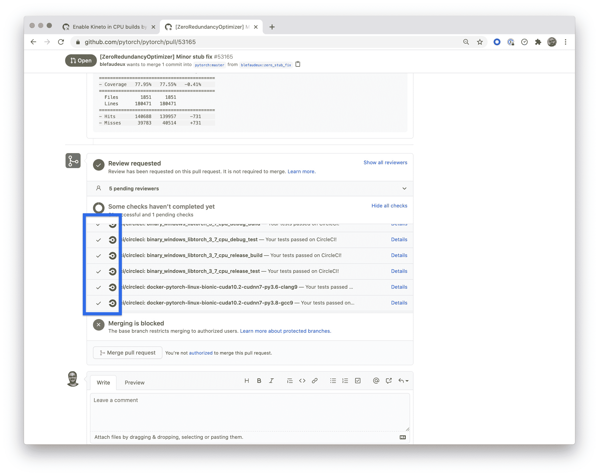
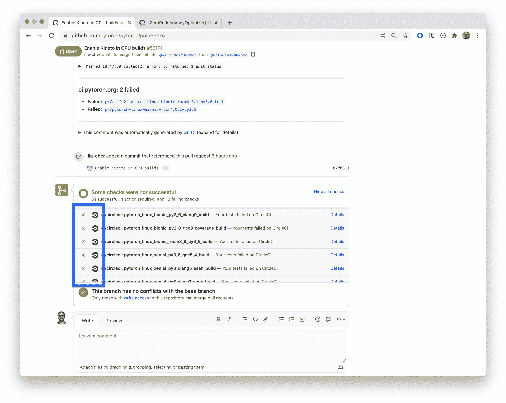

# DevOps 公司- CircleCI 的增长工程挑战

> 原文：<https://circleci.com/blog/challenges-of-growth-engineering/#2021-03-03T08:36:00-08:00>

## 什么是增长工程？

增长工程是一种实践，其中产品、工程和设计从产品本身内部支持公司的增长努力。

增长工程在面向消费者的公司中获得了牵引力。在过去十年中，这种做法在 SaaS 世界获得了很大的吸引力，有助于支持自助服务用户的增长，这些用户经常在没有传统销售团队参与的情况下购买服务。

## CircleCI 的增长工程

CircleCI 最近成立了一组[增长工程](https://circleci.com/blog/how-we-improve-circleci-learnings-from-the-growth-engineering-team/)团队，让工程师更密切地参与到提高产品采用率的工作中。我们成长团队的目标是优化用户体验，让他们尽可能有效地使用我们的工具。

但是，作为一家 B2B DevOps 工具公司，我们的客户是*工程组织*，而不是个人用户。因此，我们面临一些独特的挑战，这些挑战在 B2C 组织的成长工程团队中并不常见。需要衡量我们的实验对付费组织的影响，而不是用户，这改变了我们处理增长工程的方式。

## 衡量成功的不同标准

当公司谈论增长时，尤其是那些受众是消费者的公司，他们的目标之一通常是让用户参与他们的产品。例如，对于 LinkedIn 这样的产品，目标是通过经常访问平台来保持访问者与平台的互动，并且当在网站上时，尽可能长时间地停留在网站上。最后，他们希望访问者尽可能经常地回到网站。

我们的情况完全不同。作为一个 DevOps 工具，CircleCI 是任务关键型的，允许我们客户的团队向数百万用户交付他们的代码。我们与平台用户的日常接触非常少，这是设计使然。我们的工具通常在后台运行，用户不会每天对其 CI 系统进行重大更改。因此，花在我们平台上的时间并不能像社交平台那样很好地代表用户的成功。

本质上，从 CircleCI 用户的角度来看，我们的日常 UI 是一个简单的集成点，它将通知用户他们的 CI/CD 管道是否成功，它看起来就像这样:

 

我们的用户需要进入我们的系统的用例是相当有限的:例如，更新他们的配置，对构建失败进行故障排除，或者建立一个新的项目。虽然这些表演不太频繁，但他们周围经常有一种紧迫感。这意味着当用户进入我们的系统时，我们的成功是以他们在我们的系统中花费的时间更少而不是更多来衡量的。

带着这个目标，我们大部分的实验都是为了找到让我们的 UI 对用户更有效的方法

*   改进错误预防；在错误发生之前捕捉它们。

*   减少解决错误所需的时间。

*   使工程师能够就配置或错误进行协作。

*   提供上下文信息，以便工程师可以更快地做出更改。

*   更改配置时缩短反馈循环。

*   提高 CI/CD 管道的成功机会。

*   减少构建和部署所需的时间。

这给我们带来了在 CircleCI 做实验时面临的重大挑战。

## 测量增长实验的挑战

### 我们的用户不是我们的付费客户，我们的付费客户也不是我们的用户

在 CircleCI，任何人今天都可以免费开始构建，我们平台上的数千名工程师在训练营、辅助项目、 [OSS 项目](https://circleci.com/open-source/)中使用 CircleCI，或者免费构建创业原型。我们的付费客户几乎都是专业组织，因为他们需要更多的容量，并需要访问仅在付费计划中提供的高级功能。

组织被定义为多个工程团队的集合，每个团队由一个或多个工程师组成。通常组织映射到一个公司，但是理论上，一个公司可以在其源代码控制管理系统中定义多个组织。对我们来说，关键的概念是，我们不把用户从免费转换成付费:我们转换的是组织。为 CircleCI 的产品付费的是组织，而不是最终用户。

考虑到这一点，我们需要让我们的实验面向那些有转化潜力的组织中的用户，并衡量我们的实验对组织而不是用户的影响。我们使用一些重要的指标来帮助我们定义组织转化的可能性，例如:

*   组织中的成员数量。

*   如果他们为他们的源代码控制系统付费。

*   他们为他们的源代码控制计划支付的费用。

### 受众限制

首先，增长工程团队的受众局限于我们的用户中有潜力成为付费用户的一部分。这种限制意味着我们经常面临更大的困难来达到我们度量的统计上的显著结果。在某些情况下，统计意义永远达不到，因为观众对于实验来说太受限制了。例如，如果我们只针对新组织的管理员，那么在任何给定的一天，看到这些实验的人数可能只有几百人。对此没有简单的解决办法——我们必须根据实验变得具有统计显著性的可能性来管理和优先考虑我们的实验，或者有时，只是接受我们在几周内不会得到结果的事实。

### 组织级实验

我们面临的另一个挑战是，大多数行业现成的实验工具都是面向用户级实验和度量的。虽然这些数据对我们有一定的价值，但是可用的工具不允许我们在更高的层次上对数据进行分组。为了正确理解组织如何使用我们的产品，我们需要能够在组织层面上测量我们的实验的影响。我们还希望在一个组织内为所有用户提供一致的体验。这对我们来说至关重要:为了真正理解我们的实验对一个组织的影响，我们需要该组织内的所有用户进行相同的实验，并在组织级别上测量它们的影响。在 CircleCI，我们使用 Optimizely，这使我们能够按组织交付实验，并在组织级别收集数据进行分析。

## 结论

增长工程作为一种支持业务增长的产品开发方法，正在我们的行业中获得发展势头。然而，这仍然是一种新的做法，大多数采用这种做法的公司都在用户层面迎合他们的增长，并希望让用户尽可能积极地参与他们的产品。

正如我们所展示的，由于我们拥有的工具和用户的类型，我们正面临着这种方法的独特挑战。我们专注于让用户参与进来，但对我们来说，这意味着让用户花更少的时间在我们的前端。我们还在建立自己的指标和数据管道，以确保我们能够在组织层面而不是用户层面衡量我们的实验的影响。

想为 CircleCI 的增长工程做贡献吗？参见[我们的开放角色](https://circleci.com/careers/)。