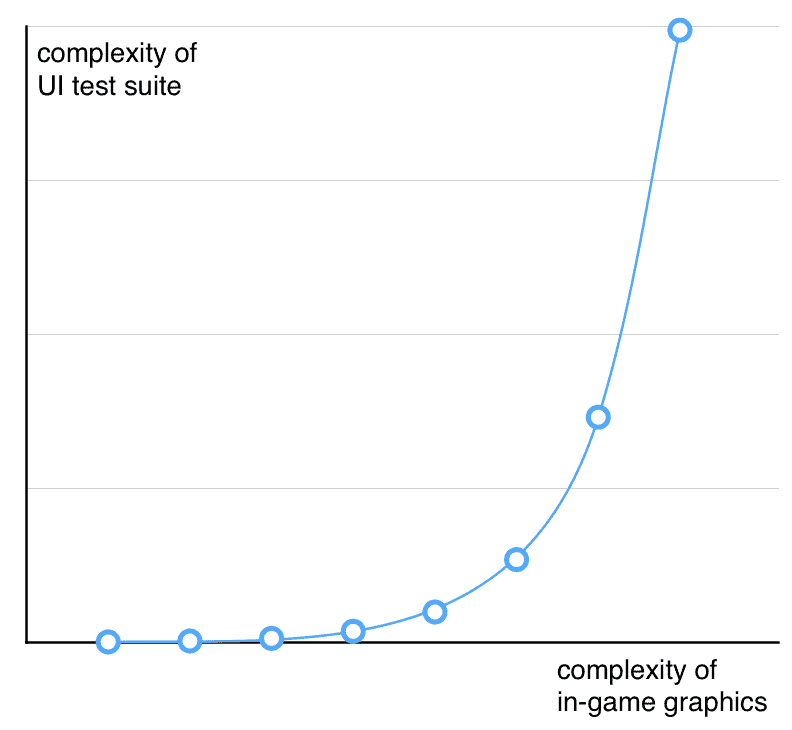

# 面向手机游戏开发者的 CI-circle CI

> 原文：<https://circleci.com/blog/ci-for-mobile-game-developers/#2016-03-10T08:49:29-08:00>

***来自出版商的说明:**您已经设法找到了我们的一些旧内容，这些内容可能已经过时和/或不正确。在这里阅读更多关于[移动应用开发持续集成](https://circleci.com/blog/ci-for-mobile-app-development/)的信息，或者尝试在[我们的文档](https://circleci.com/docs/)或[博客](https://circleci.com/blog/)中搜索当前信息。*

* * *

本周早些时候，[我们宣布了 OS X](/blog/circleci-enterprise-any-cloud-deployment-and-circleci-for-os-x/) 的 CircleCI。这一新产品允许 iOS 开发人员使用 CircleCI 为 iPhone、iPad、Mac 和 Apple Watch 应用程序构建和测试代码，极大地改善了 iOS 开发周期。

移动应用程序开发的需求可能比 web 应用程序更复杂，而游戏生成的图形内容要比传统的移动应用程序多得多。传统应用程序的测试可以依赖于屏幕上显示的已知内容，或者更具体地说，在一组应用程序交互之后，某些具有预配置 id 的元素是可见的。然而，对于手机游戏，编写这样的测试变得越来越困难。

## 测试图形表示是困难的

大多数设计用于与图形表示交互的测试机制依赖于搜索视图树或分析屏幕截图。如果有一种方法来表示正在测试的应用程序的状态——并在单次测试后回滚到该状态，这将非常有用

对于移动游戏，有效的状态实际上可能是一组状态，因为游戏的机制可能包括同一场景的多个视图，获得相同结果的多种方法，以及与外界的不同交互(AI)。即使仅仅通过与控制元件交互就有可能达到期望的状态，在移动模拟器或仿真器上达到该状态也可能需要大量的时间。

 *屏幕上方地面那根管子有测试吗？截图来自[太空警察](https://itunes.apple.com/us/app/space-marshals/id834315918?mt=8)。*

## 额外的抽象层将拯救我们

由于游戏中的表示层比传统应用程序的图形更通用、更灵活，因此可测试性更低，可能很难用传统的 XCTest 方法测试所有图形本身。

然而，如果发明了一个中间层——游戏状态的概念，事情就会简化很多。专注于独立于渲染机制生成、修改和测试游戏状态提供了必要的灵活性。专注于中间状态允许你用标准的测试工具测试游戏的实际逻辑，然后有一个单独的测试套件，只用于通过渲染类将游戏状态转换成屏幕上的实际图像。

## 如果呈现逻辑仅在真实设备上可用

如果游戏运行在模拟器/仿真器上，测试实际的渲染功能可能并不总是可能的。例如，为苹果 MetalKit [编写的代码只能在真实设备](https://forums.developer.apple.com/thread/17895)上运行。这意味着在没有真实设备的情况下在 CI 上运行测试时，您将不得不跳过呈现步骤。

好消息是:如果你决定将游戏状态从渲染逻辑中抽象出来，这将很容易实现。一旦逻辑被分离出来，如果构建的目标是模拟器/仿真器，并且实际上在 CI 上运行完整的单元测试套件，您就可以将这些类剔除。[这篇博客文章](https://medium.com/the-sup-app/bare-metal-working-with-metal-and-the-simulator-70e085e3a45#.1sduskhy5)为 MetalKit 提供了一个简洁的方法。

## 端到端测试

如果呈现逻辑仍然在真实设备上工作，您可能能够为您的呈现逻辑运行完整的端到端测试。在确保游戏状态交互层的正确性之后，你就可以实际渲染一些不同的游戏状态，并捕捉结果的截图。

如果渲染层正在积极地工作，则截图和标准具的实际比较将必须由人来完成，但是如果大部分工作被投入到游戏逻辑、性能优化或新的故事情节中，则确保渲染功能的结果没有改变是足够的措施。

## 游戏的非游戏部分

大多数游戏都有一套非游戏逻辑，如设置屏幕、菜单或场景选择。这些可以使用标准的类似 XCTest 的逻辑进行测试，因为只有一种正确的方法来表示一组稳定的信息。

如果游戏涉及任何类型的后端处理，可以使用传统的测试技术对所需的堆栈进行单独测试。

## 完美的游戏持续集成几乎是不可能的

由于渲染层没有完整的自动化测试，您必须自己测试，并在整个开发阶段保持测试。

我的一个同事曾经参观了一个游戏开发工作室，那里的办公室里安装了一个 Xbox，而那个 Xbox 大部分时间都没有被使用(这是有道理的)。当没有人使用 Xbox 时，当时正在开发的游戏会自动加载到设备上，主角的无敌模式会打开，然后它会对游戏进行完整的演练。在 Xbox 附近闲逛的开发人员会在经过屏幕时注意到渲染层问题——像游戏世界的部分渲染不工作，颜色关闭，或者物理的某些方面看起来不现实等方面很容易被注意到。

很难取代人工驱动的 QA 过程，但是可以将它尽可能地移到更高的位置，以节省开发人员的时间并最小化人为错误的风险。