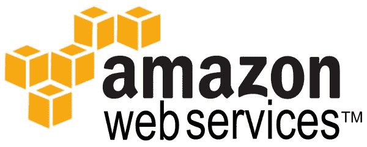

# 圆形+ AWS ECR/ECS -圆形

> 原文：<https://circleci.com/blog/circleci-aws-ecrecs/#2015-12-21T15:14:37-08:00>

**来自出版商的说明:**您已经找到了我们的一些旧内容，这些内容可能已经过时和/或不正确。尝试在[我们的文档](https://circleci.com/docs/)或[博客](https://circleci.com/blog/)中搜索最新信息。

* * *



假期已经到了，AWS 上的 Docker 开发人员今年得到了一份不错的礼物。今天，亚马逊发布了一项新服务:EC2 容器注册中心(ECR)。ECR 为开发人员提供了一个安全、可伸缩、可靠的容器注册中心，而无需手动设置基础设施。作为认证发布合作伙伴，现在只需使用 CircleCI 和 AWS，就可以在一次 git 推送中构建、测试、上传和部署新的 Docker 容器。

当亚马逊向我们提供这项新服务的测试版时，我们迫不及待地想看看 CircleCI 的所有可能性。现在，我们已经能够使用它了，我们想分享我们在一个使用 CircleCI 的小型演示项目中看到的内容，以测试并部署一个新的多容器设置到 AWS。

## 码头集装箱，运行和存储

去年，亚马逊发布了他们的 EC2 容器服务，消除了处理运行 Docker 图像所需的基础设施的麻烦。通过这项服务，不仅可以测试代码，还可以通过 CircleCI 测试基础设施，这使得真正将基础设施视为代码变得更加容易。结合 CircleCI，该系统允许快速测试和部署 Docker 化代码，但并没有真正提供一种存储 Docker 映像和轻松管理权限的方法。

AWS 并不是第一个拥有 Docker 注册表的公司；Docker 和 Google 都有自己的注册中心，当然，您也可以在现有的 AWS EC2 实例中运行自己的注册中心。即使有这些选项，AWS 的新容器注册中心仍然更有用，因为它与现有的 AWS 服务紧密集成。我们发现新 ECR 有两大优势。首先，ECR 是一个一流的 AWS 服务，因此它与 Amazon 的身份访问管理完全集成。其次，ECR 在所有地区提供冗余的 Docker 注册服务器。这使得在 AWS 中使用 Docker 映像更加方便，并提供了一些急需的冗余和安全性，尤其是对于那些到目前为止一直在运行自己的注册表的开发人员。

## 入门:通过 CircleCI 使用 Amazon 的容器服务

在我们演示将 Docker 注册表切换到 Amazon ECR 之前，我们想向您展示如何将 ECS 与 CircleCI 一起使用。这里我们假设您已经[在 Amazon 上设置了 EC2 容器服务](https://aws.amazon.com/ecs/)(但是还没有部署任何映像)，并且您了解 [Docker 和 Docker compose](https://docs.docker.com/compose/) 。[我们自己的凯文·贝尔](/blog/tame-your-test-environment-with-docker-compose/)已经构建了一个简单的多容器服务，你可以在这个项目的 GitHub 页面上查看。但是，您应该知道，要通过 CircleCI 使用 ECS 和 ECR，您至少需要有环境变量

AWS _ ACCESS _ KEY _ ID AWS _ DEFAULT _ REGION AWS _ SECRET _ ACCESS _ KEY

通过项目的 [CircleCI 环境变量](https://circleci.com/docs/1.0/environment-variables/#custom)设置页面进行设置。设置完这些变量后，启动并运行它们并不需要太多代码，而且 circle.yml 文件实际上并没有真正增加复杂性。下面是新 circle.yml 文件中仅有的非 Docker 或测试命令:

```
 machine:
    pre:
      - sudo curl -L -o /usr/bin/docker 'https://s3-external-1.amazonaws.com/circle-downloads/docker-1.9.0-circleci'
      - sudo chmod 0755 /usr/bin/docker
    services:
          - docker
  deployment:
    prod:
      branch: master
      commands:
        - ./deploy.sh 
```

正如您在这里看到的，该项目的 ECS 部分的真正内容在 deploy.sh 脚本中。如果你打开它，你可以看到它由四个独立但基本的功能组成。首先，我们用`deploy_image`将新创建的图像推送到我们的注册表中。在这种情况下，它被推送到 Docker.io，但我们很快就会改变这种情况。之后，我们用`deploy_cluster`部署我们的映像，创建一个[任务定义](http://docs.aws.amazon.com/AmazonECS/latest/developerguide/task_defintions.html)，用[AWS ECS register-task-definition](http://docs.aws.amazon.com/cli/latest/reference/ecs/register-task-definition.html)注册任务定义，然后等待旧的任务修订被删除。之后，亚马逊应该会运行你的新 Docker 容器！

## 那么我们如何使用 ECR 呢？

亚马逊 ECR 甚至更容易设置。一旦在 AWS 上创建了 Docker 存储库，只需使用

` aws ecr 获取-登录'

然后使用 docker 注册中心的地址和您的 AWS 帐户 ID 标记您的图像，例如

` docker tag Ubuntu:trusty AWS _ account _ id . dkr . ECR . us-east-1 . Amazon aws.com/ubuntu:trusty '

最后以类似的方式推送到 AWS，例如

` docker push AWS _ account _ id . dkr . ECR . us-east-1 . Amazon AWS . com/Ubuntu:trusty '

这就是全部了！您现在正在通过 CircleCI 和 AWS 构建、测试、推送和部署您的代码和基础设施！

我希望这有助于您了解如何在项目中使用 Docker 和 CircleCI 以及 AWS！这自然不是通过 CircleCI 使用亚马逊的容器服务和容器注册的唯一方式。我们期待着建立我们的合作伙伴关系，并带来更多的方式来整合亚马逊 ECR 和 CircleCI。

一如既往，如果您发现自己迷路了或在使用这些服务时遇到了麻烦，我们很乐意回答您的任何问题。您可以通过[我们的讨论社区网站](https://discuss.circleci.com/)联系我们的专家，或者通过【sayhi@circleci.com】T2 或应用内联系我们。