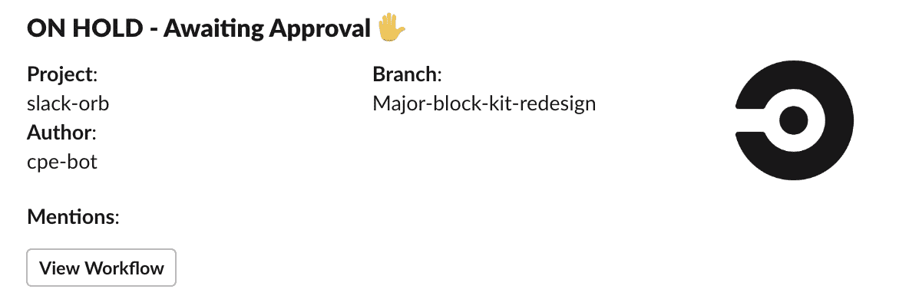
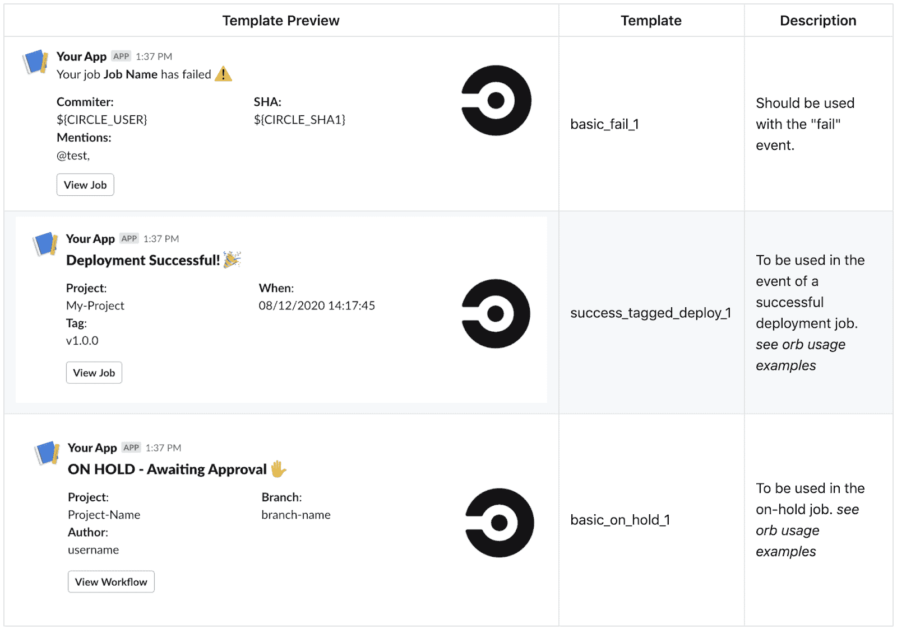

# 自定义管道通知| CircleCI + Slack

> 原文：<https://circleci.com/blog/circleci-slack-integration/#2020-10-09T09:00:00-07:00>

今天我们为 CircleCI 发布了 Slack orb v4.0。它使得[管道](https://circleci.com/blog/what-is-a-ci-cd-pipeline/)通知易于实现和定制。现在，随着对 Slack 的[块套件生成器](https://app.slack.com/block-kit-builder)的支持，它还提供了一种可视化的方式来创建无尽的自定义通知。看看这个松弛的球体:



## 有什么新鲜事？

### 简单易用。

以前，Slack orb 利用多个命令和大量 orb 参数来逐段构建通知。现在，在 4.0 及更高版本中，您可以选择几个内置的可用模板之一，或者使用 Slack 的 [Block Kit Builder](https://app.slack.com/block-kit-builder) 可视化地定制和导入您自己的通知。

在新的 Slack orb 中，你只会发现一个单独的命令`notify`，和一个任务`on-hold`。notify 命令是 orb 的核心，可用于根据*事件*向任何(或多个)空闲通道发送通知，如 CircleCI 作业已通过或失败。

### 专为团队打造

新的 Slack orb 使用 OAuth 进行认证，而不是像以前的版本那样使用[传入的 webhooks](https://api.slack.com/messaging/webhooks) 。通过这一改变，您现在可以在 Slack 工作区中安装一个“bot”应用程序，用于 CircleCI 通知，并通过一个集成向多个通道发出警报。要设置认证，请务必查看 [GitHub wiki 中的 Slack orb](https://github.com/CircleCI-Public/slack-orb/wiki/Setup)

### 升级

Slack orb 版本 4.0.0 是对以前的 Slack orb 的完全重写，具有新的功能集和更简单的设计，更易于使用。旧版本的 Slack orb 将继续运行，迁移到新的 Slack orb 体验完全是可选的。

要迁移到新的 Slack orb，必须完全删除旧 orb，因为版本 4.0 不与 orb 的以前版本共享任何功能。

从访问 [GitHub wiki](https://github.com/CircleCI-Public/slack-orb/wiki) 开始

## 它是如何工作的？

[orb](https://circleci.com/orbs/)是 CircleCI 配置的包，可以导入并在您的配置文件中使用。

要向前跳，你可以在 [orb 注册表](https://circleci.com/developer/orbs/)和 [GitHub](https://github.com/CircleCI-Public/slack-orb/) 上查看 [Slack orb](https://circleci.com/developer/orbs/orb/circleci/slack) 。

Slack orb 的主要组件是`notify`命令，它可以在任何作业结束时使用，根据该作业的状态发送通知。

```
 - slack/notify:
      event: fail
      template: basic_fail_1 
```

现在有一个带`event`参数的通知命令。`notify`命令应该放在任何作业的末尾，因为它将一直运行，并且可以检测作业的当前状态。

您可以指定在`always`发送通知，或者在`fail`或`pass`发送通知。如果指定了一个`branch_pattern`参数，当前分支也必须匹配发送通知的模式。

对于消息正文，您可以选择 orb 附带的一个预配置模板，或者创建您自己的自定义通知。

你可以在 [GitHub Wiki](https://github.com/CircleCI-Public/slack-orb/wiki) 上看到可用模板的完整列表。



默认情况下，Slack orb 将尝试发送到由`$SLACK_DEFAULT_CHANNEL`环境变量指定的通道，但是您也可以通过`channel`参数选择一个或多个通道。

## 一个工作实例

下面是 CircleCI 上测试和部署工作流的半真实示例。它有一个在每次提交时测试应用程序的作业(`test`)，还有一个只在标记提交时运行的部署作业(`deploy`)。

在本例中，我们将在部署之前暂停我们的工作流(`test-and-deploy`)，等待人工批准。在工程师手动批准工作流后，将执行部署作业。对于此工作流，我们希望设置三种潜在的时差通知:

*   工作流程处于暂停状态时的通知
*   部署失败时的通知
*   如果部署成功，则发出不同的通知

下面的使用示例直接来自 orb 注册表。

这种配置有两个假设:

1.  您已经将 OAuth 令牌作为`$SLACK_ACCESS_TOKEN`存储在名为`slack-secrets`的[受限上下文](https://circleci.com/docs/contexts/#restricting-a-context)中
2.  您已经将`$SLACK_DEFAULT_CHANNEL`定义为一个[项目环境变量](https://circleci.com/docs/env-vars/#setting-an-environment-variable-in-a-project)，或者在`slack-secrets`上下文中。

```
 version: 2.1
 orbs:
   slack: circleci/slack@4.0
 jobs:
   # This "test" job will run on every commit (as per our workflow)
   # We are ok with no notifications sent for this job.
   test:
     docker:
       - image: cimg/base:stable
     steps:
       - run: echo "test my app"
   # This "deploy" job will only run on a tagged commit (as per our workflow)
   # We want to be alerted if this job fails and also when it succeeds.
   deploy:
     docker:
       - image: cimg/base:stable
     steps:
       - run: echo "deploy my app"
       # In the event the deployment has failed, alert the engineering team
       - slack/notify:
           event: fail
           template: basic_fail_1
           mentions: "@EngineeringTeam"
       # When there is a successful deployment, send a notification with a different template.
       - slack/notify:
           event: pass
           template: success_tagged_deploy_1
 workflows:
   test-and-deploy:
     jobs:
       # We want the test job to run on all commits, so we will list it with no filters.
       - test
       # When we are on a tagged commit (example "v1.0.0"), we want to also place the workflow on-hold, pending manual approval for deployment.
       # We will also make use of the Slack orb's "on-hold" job to notify us to this on-hold workflow, making it easy to respond.
       - slack/on-hold:
          context:
            - slack-secrets
          requires:
            - test
          filters:
            tags:
              only: /^v.*/
       # Jobs with the type of "approval" act as place holders to pause the workflow, the job name does not matter.
       # Wait for both the test job and for the notification to send before pausing.
       - pause_workflow:
          type: approval
          requires:
            - test
            - slack/on-hold
          filters:
            tags:
              only: /^v.*/
       # The deploy job will continue once the workflow has been manually approved.
       - deploy:
          context:
            - slack-secrets
          requires:
            - pause_workflow
          filters:
            tags:
              only: /^v.*/ 
```

## 创建自定义通知

以前，创建自定义通知需要使用许多参数。它们受到限制并且难以配置。现在，你只需要一个参数就可以创建几乎任何你能想到的通知，而且通知是使用 Slack 的 [Block Kit Builder](https://app.slack.com/block-kit-builder) 可视化设计的。你可以从 Slack 的任何内置模板开始，或者从头开始设计你自己的模板。

 </blog/media/2020-09-25-slack.mp4> 

在上面屏幕的右侧，您可以获得包含我们通过`custom`参数(作为`template`参数的替代)提供给 Slack orb 的文本的有效负载。

```
- slack/notify:
    event: always
    custom: |
      {
        "blocks": [
          {
            "type": "section",
            "text": {
              "type": "mrkdwn",
              "text": "Current Job: $CIRCLE_JOB"
            }
          },
          {
            "type": "section",
            "text": {
              "type": "mrkdwn",
              "text": "Write some text here"
            }
          }
         ]
        } 
```

在拷贝有效负载之前，使用屏幕左侧的组件自定通知的外观。环境变量可以在任何文本字段中使用，其值将在运行时被替换。

如需更多信息和示例，请查看 GitHub Wiki 和 T2 orb 注册页面。

## 加入社区

欢迎 Orb 开发者和消费者[加入我们的讨论论坛](https://discuss.circleci.com/c/ecosystem/orbs/62)！我们希望听到您的意见，无论您对 Slack orb 有什么问题、意见或担忧。需要提出问题或想要申请功能？我们也希望在 [GitHub](https://github.com/CircleCI-Public/slack-orb/issues/new/choose) 上听到你的声音。