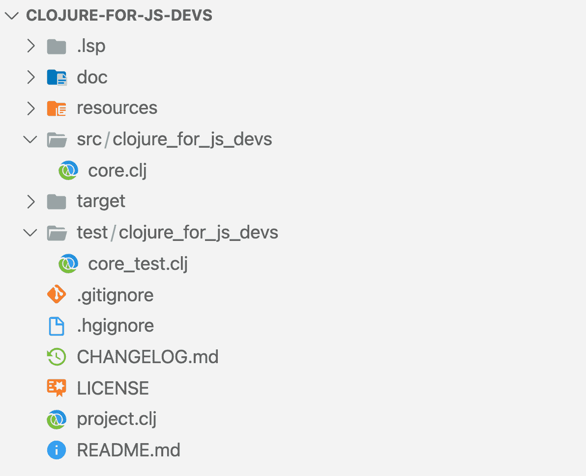
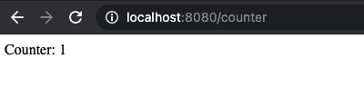

# 面向 JavaScript 开发人员的 Clojure 微服务第 2 部分

> 原文：<https://circleci.com/blog/clojure-microservices-for-js-devs-pt-2/#2021-07-26T04:20:00-07:00>

这个系列由泰勒·苏伯格和穆萨·巴里格扎伊共同撰写。

在[的前一篇文章](https://circleci.com/blog/clojure-microservices-for-js-devs-pt-1/)中，我们探讨了 Clojure 思维与 JavaScript 思维之间的高级差异。我们现在准备开始构建我们的第一个 Clojure 微服务。

我们要打造的微服务会非常简单。这将是一个 HTTP 服务器，它使用 Redis 数据存储来计算一个给定的 IP 地址 pinged 了`/counter`端点多少次。

在本教程中，我们将向您介绍如何构建该服务的每个步骤。如果你愿意，你可以在这里找到已完成的项目。

请注意，当您在 Clojure 中开发时，您将主要在 REPL 中工作，但是为了清楚起见，在本教程中我们不会使用 REPL。我们*高度*推荐你[查看这些使用 REPL](https://github.com/tsully/clojure-for-js-devs) 的说明，并开始让 REPL 成为你的 Clojure 开发工作流的中心。

在我们开始构建项目之前，我们应该向自己介绍管理项目结构的工具。

## 使用 Leiningen 自动化 Clojure 项目管理

Leiningen 是一个自动化 Clojure 项目管理的工具。Leiningen 是设置 Clojure 项目最流行的工具。我们在 CircleCI 特别喜欢它，因为它是由我们自己的 Phil Hagelberg 建造的。

JavaScript 世界中与 Leiningen 最相似的是 [Yarn](https://yarnpkg.com/) 和 [npm](https://www.npmjs.com/) 。像 Yarn 和 npm 一样，Leiningen 是你管理依赖和发布包的方式。不过，莱宁根的工作方式有很大的不同。

*   Leiningen 对你的项目结构固执己见。
*   Leiningen 将把依赖项( [Maven](https://maven.apache.org/) 安装到你机器上的一个公共位置，这个位置可以被多个项目使用。Yarn 和 npm 将依赖项安装到每个项目的`node_modules`文件夹中。
*   Leiningen 运行您的测试并配置您的 REPL。
*   Leiningen 创建您的 Uberjar 文件。您的 Uberjar 文件是一个独立的可执行文件 [JAR](https://en.wikipedia.org/wiki/JAR_(file_format)) 文件，其中包含您的项目及其依赖项。
*   [还有更](https://github.com/technomancy/leiningen/blob/stable/doc/TUTORIAL.md#tutorial)。

## 设置您的第一个 Clojure 项目

首先，[下载雷宁根](https://github.com/technomancy/leiningen/blob/stable/README.md)。

接下来，我们将创建 Leiningen 应用程序`clojure-for-js-devs`

```
Lang:shell
lein new app clojure-for-js-devs 
```

现在在编辑器中打开`clojure-for-devs`目录，您会看到 Leiningen 已经为您构建了一个项目。



这些文件中的大多数都是不言自明的——`src`目录和`test`是我们编写测试的地方。类似于 [ES](https://developer.mozilla.org/en-US/docs/Web/JavaScript/Guide/Modules) 或 [CommonJS](http://www.commonjs.org/) 模块，我们在这些目录中创建的每个`.clj`文件都将是它自己的名称空间。`project.clj`是这个项目最重要的文件。

```
(defproject clojure-for-js-devs "0.1.0-SNAPSHOT"
 :description "Simple app to demonstrate how to construct Clojure microservices."
 :url "https://github.com/tsully/clojure-for-js-devs"
 :dependencies [[org.clojure/clojure "1.10.1"]]
 :main ^:skip-aot clojure-for-js-devs.core
 :target-path "target/%s"
 :profiles {:uberjar {:aot :all
                      :jvm-opts ["-Dclojure.compiler.direct-linking=true"]}}) 
```

`project.clj`非常类似于一个`package.json`文件:

*   [依赖](https://github.com/technomancy/leiningen/blob/master/sample.project.clj#L52)是我们引入 Clojure/Java 依赖的地方。这与`package.json`中的`dependencies`相同。
*   [main](https://github.com/technomancy/leiningen/blob/master/sample.project.clj#L207-L226) 是您应用程序的入口点。当您用`lein run`启动 Lein 应用程序时，它将在您在此指定的任何名称空间中运行`main`函数。在`clojure-for-js-devs.core`名称空间中已经有一个`main`函数。这在功能上与 package.json 中的`main`键相同
*   [目标路径](https://github.com/technomancy/leiningen/blob/master/sample.project.clj#L317-L319)是当您运行`lein uberjar`来构建您的生产应用程序时，编译后的文件将被放置的目录。如果您以前使用过 webpack，这类似于`output`键指示 webpack 应该将您的包输出到哪里。
*   [profiles](https://github.com/technomancy/leiningen/blob/master/sample.project.clj#L174-L191) 允许你为开发、生产或 REPL 定制你的 project.clj 设置。配置文件允许您自定义 project.clj 的任何方面。您可以引入特定的依赖项，包括附加目录，以及更改编译选项等。我们的 project.clj 只有一个概要文件`uberjar`，用于编译我们的生产应用程序。您可以添加其他个人资料，如`dev`和`repl`。Node.js 中的“profiles”没有很好的比较。要在 Node.js 中重新创建类似的功能，您通常需要使用环境变量(如`NODE_ENV`)的组合，以及脚本、devDependencies 和配置文件来完成工作。

你也可以像创建 npm 脚本一样创建自定义脚本，但是我们将在下一篇文章中讨论。

注意，`project.clj`的配置被包装在一个`defproject`中。Defproject 不是你需要学习的一个新的 Clojure 构造，它只是 Leiningen 的一个[宏。这就是为什么 defmacro 的主体似乎无视我们已经熟悉并喜爱的正常 Clojure 语法。](https://github.com/technomancy/leiningen/blob/4d8ee78018158c05d69b250e7851f9d7c3a44fac/leiningen-core/src/leiningen/core/project.clj#L442)

## 创建应用程序的组件

现在我们有了应用程序的外壳，我们准备开始创建主要组件，我们的 HTTP 服务器和 Redis 客户机。

在 JavaScript 中，要创建我们的 Redis 客户端，我们需要做如下事情:

```
const redis = require("redis");
const client = redis.createClient();

client.on("error", function (error) {
  console.error(error);
});

client.set("key", "value", redis.print);
client.get("key", redis.print); 
```

为了创建我们的 HTTP 服务器，我们可能会这样做:

```
const express = require("express");
const app = express();

app.get("/", function (req, res) {
  res.send("Hello World");
});

app.listen(3000); 
```

换句话说，为了创建这些组件，我们最终创建了一个巨大的对象，它拥有方便地管理该组件的生命周期所需的所有方法和属性。

当然，由于 Clojure 是一种函数式语言，我们的方法看起来会有所不同:

*   函数式方法不是将函数作为方法隐藏在对象中，而是定义可以自由组合和重用的函数。
*   Clojure 没有通过接口和继承来定义对象的行为，而是使用了多态。
*   Clojure 将(通常)使用纯函数和不可变的数据结构，而不是创建状态。

在我们展示构建 HTTP 服务器组件和 Redis 组件的函数式方法之前，我们需要提供一些关于两个 Clojure 构造的背景知识，如果您是一个新的 Clojure 开发人员，可能会对这两个构造不熟悉:`defprotocol`和`defrecord`。

了解这些概念的工作原理对于理解您的微服务是如何构建的至关重要。

## 了解定义协议和定义记录

[defprotocol](https://clojuredocs.org/clojure.core/defprotocol) 定义了一组方法及其函数签名。协议没有实现，但是任何数据类型都可以实现该协议，并为协议的每个方法定义实现。`extend-protocol`是为数据类型定义协议实现的一种方式。

```
(defprotocol Bird
 (eat-bread [this bread-type]))

(extend-protocol Bird
 java.lang.String
 ; the implementation of the eat-bread function if called with a string
 (eat-bread [name bread-type]
   (println (str name " is eating my " bread-type " loaf")))
 ; the implementation of the eat-bread function if called with a long
 java.lang.Long
 (eat-bread [number-of-birds bread-type]
   (println (str number-of-birds  " birds are eating my " bread-type " loaf"))))

(eat-bread "Andrew Bird" "sourdough")
; Andrew Bird is eating my sourdough loaf
(eat-bread 3 "sourdough")
; 3 birds are eating my sourdough loaf 
```

在这个例子中，我们创建了一个名为`Bird`的协议，它定义了`eat-bread`的函数签名。注意`eat-bread`的第一个参数是`this`。`defprotocol`中的`this`表面上类似于 JavaScript 中的[“this”](https://developer.mozilla.org/en-US/docs/Web/JavaScript/Reference/Operators/this)。Iit 表示实现该功能的数据。这不是 Clojure 中受保护的关键字。我们可以给第一个参数取任何名字。

当我们在`Bird`上使用`extend-protocol`时，我们正在创建`Bird`协议的实际功能实现。根据第一个参数(即`this`)的数据类型，这些函数的实现会有所不同。这就是[多态性](https://en.wikipedia.org/wiki/Polymorphism_(computer_science))。根据第一个参数的数据类型执行不同的函数体。如果是字符串，我们执行一个函数体，如果是长整型，我们执行另一个函数体。

那么，如果我们想用我们自己的数据类型而不是原始类型来扩展`Bird`协议呢？我们可以用 [defrecord](https://clojuredocs.org/clojure.core/defrecord) 创建自己的数据类型。`defrecord`创建一个 Java 类，可以拥有协议的属性和实现。我们可以使用`->`构造函数来创建这个类的一个实例。让我们为一只鸭子做一个`defrecord`:

```
(defrecord Duck [name])

(def reggie-the-duck (->Duck "Reginald"))
(println reggie-the-duck)
; #clojure_for_js_devs.core.Duck{:name Reginald} 
```

为了给我们的`Duck`提供`eat-bread`和`make-noise`的能力，我们可以使用`Bird`协议。我们可以使用`extend-protocol`来定义`Bird`协议中定义的函数签名应该如何为`Duck`数据类型实现。实现协议的更好方法是直接在`defrecord`上定义协议的实现。

```
 (defprotocol Bird
 (eat-bread [this bread-type])
 (make-noise [this repeat-num]))

(defrecord Duck [name]
 Bird
 (eat-bread [_this bread-type]
   (println (str name " is eating my " bread-type " loaf")))
 (make-noise [_this repeat-num]
   (println (repeat repeat-num "Quack! "))))

(def reggie-the-duck (->Duck "Reginald"))

(eat-bread reggie-the-duck "sourdough")
; Reginald is eating my sourdough loaf
(make-noise reggie-the-duck 3)
; Quack!  Quack!  Quack! 
```

`defrecord`和`defprotocol`将是我们如何构建微服务的核心，因此现在学习这些概念将使您对构建 Clojure 微服务的能力更有信心。

### 使用 Stuart Sierra/组件

stuartsierra/component 库将是我们的应用程序如何管理 Redis 客户端和 HTTP 服务器组件的运行时状态的核心。stuartsierra/component 是一个管理组件生命周期的框架。它确保组件以正确的顺序停止和启动，并显式声明组件之间的共享状态。这个框架允许我们确保 Redis 客户机在 HTTP 服务器之前启动，并且 HTTP 服务器知道如何与 Redis 交互。组件看起来很像 OOP 对象，但是请记住，我们仍然生活在纯函数和不可变数据结构的 Clojure 范式中。

### 设置重定向

现在我们可以创建我们的第一个组件，Redis 客户机。转到您的`project.clj`文件，将 [stuartsierra/component](https://github.com/stuartsierra/component) 和[carmine](https://github.com/ptaoussanis/carmine)(clo jure Redis 客户端)添加到依赖项中。

```
 :dependencies [[org.clojure/clojure "1.10.1"]
                ; Add the following two dependencies
                [com.stuartsierra/component "0.4.0"]
                [com.taoensso/carmine "2.20.0"]] 
```

接下来，用下面的代码在您的`src/clojure_for_js_devs`目录中创建一个`redis.clj`文件。

```
(ns clojure-for-js-devs.redis
 (:gen-class)
 (:require [com.stuartsierra.component :as component]
           [taoensso.carmine :as car]))

(defrecord Redis [uri connection]
 component/Lifecycle
 (start [this]
   ; If there's already a connection return the instance of the Redis class
   (if (:connection this)
     this
     ; Otherwise, associate the 'connection' property of this defrecord with
     ; a map representing the Redis connection
     (do
       (println "Starting Redis component")
       (println "Redis connection URI" this)
       (assoc this :connection {:pool {} :spec {:uri uri}}))))

 (stop [this]
   (if (:connection this)
     (do
       (println "Stopping Redis component")
       (assoc this :connection nil))
     this)))

(defn new-redis
 "Create instance of Redis class"
 [uri]
 (map->Redis {:uri uri})) 
```

让我们来分析一下这是怎么回事。我们正在创建一个名为`Redis`的`defrecord`和一个函数来创建一个新的`Redis`实例，它将一个 URI 作为唯一的参数。在`Redis`组件中，我们实现了一个名为`component/Lifecycle`的协议。[该协议来自 Stuart Sierra/组件库](https://github.com/stuartsierra/component/blob/master/src/com/stuartsierra/component.cljc#L5-L14)，有两个函数签名:`start`和`stop`。Stuart Sierra/组件将调用我们新的`Redis` defrecord 上的`start`和`stop`函数来管理这个组件的生命周期。

到目前为止，这个组件只是跟踪一个 Redis 连接，但实际上没有任何与它交互的功能。与在`Redis`类中定义这些函数不同，就像我们用面向对象语言一样，我们将定义单独的函数，这些函数可以接受 Redis 类作为参数。将这些添加到您的`redis.clj`文件的底部。

```
(defn ping
 "Check that Redis connection is active"
 [redis]
 (car/wcar (:connection redis) (car/ping)))

(defn getKey
 "Retrieve count for a key in Redis DB."
 [redis key]
 (car/wcar (:connection redis) (car/get key)))

(defn incr
 "Increment count for a key in Redis DB."
 [redis key]
 (car/wcar (:connection redis) (car/incr key))) 
```

我们还需要在根目录下创建一个 docker-compose-services.yml 文件，这样我们就可以在开发过程中运行 Redis 服务器

```
version: "2"
services:
  redis:
    image: redis:4.0.2-alpine
    ports:
      - "127.0.0.1:6379:6379" 
```

### 创建组件系统图

接下来，我们需要创建一个“组件图”，描述我们的组件(包括 Redis)将如何相互作用。这个组件映射最初将只包括 Redis，但之后将添加 HTTP 服务器组件。移到`src/clojure_for_js_devs/core.clj`文件，复制/粘贴以下代码。

```
(ns clojure-for-js-devs.core
 (:gen-class
  :main true)
 (:require
  [com.stuartsierra.component :as component]
  [clojure-for-js-devs.http :as http]
  [clojure-for-js-devs.redis :as redis]))

; Create a variable called *system* that can only be defined once
; ^:dynamic means that this variable can be rebound to a new value
(defonce ^:dynamic *system* nil)

(defn main-system
 "Creates map of component dependencies with implementation of Lifecycle protocol"
 []
 (component/system-map
  :redis (redis/new-redis "redis://redis:6379")))

(defn start
 "Start components of system in dependency order. Runs SystemMap implementation of Lifecycle protocol's 'start' function"
 [system]
 (try
   (component/start system)
   (catch Exception _ex
     (println "Failed to start the system"))))

(defn stop
 "Stop components of system in dependency order. Runs SystemMap implementation of Lifecycle protocol's 'stop' function"
 [system]
 (component/stop system)
 ; dynamically rebind *system* var back to nil
 (alter-var-root #'*system* (constantly nil)))

(defn -main
 "Entry point to the application."
 []
 (let [system (start (main-system))]
   ; dynamically rebind *system* to the newly created SystemMap instance
   (alter-var-root #'*system* (constantly system))
   ; Create hook that stops the component system in a controlled manner before the JVM completely shuts down
   (.addShutdownHook (Runtime/getRuntime) (Thread. (partial stop system))))) 
```

如果你对这里发生的事情的细节感兴趣， [stuartsierra/component 源代码](https://github.com/stuartsierra/component/blob/master/src/com/stuartsierra/component.cljc#L170)是一个简短而有用的读物。下面是一个快速概述:

*   当应用程序启动时，会自动调用`main`功能(参见:`project.clj`的`:main`键)
*   `main`函数将创建一个 SystemMap(记住，这是一个不可变的数据结构，*不是*一个对象),它表示应用程序组件之间的所有依赖关系。
*   在表面之下，[系统映射被实现为 defrecord](https://github.com/stuartsierra/component/blob/master/src/com/stuartsierra/component.cljc#L176-L181) ，它实现了生命周期协议的`stop`和`start`方法。这与我们的 Redis defrecord 实现生命周期协议的方式相同。

最后一行值得进一步解释:

```
(.addShutdownHook (Runtime/getRuntime) (Thread. (partial stop system))) 
```

我们在这里创建了一个 shutdown 钩子来检测应用程序何时关闭，这样我们就可以先干净地停止我们的组件系统。`addShutdownHook`中的`.`表示我们正在使用运行时 Java 对象的 Java 方法。`Thread.`末尾的`.`表示我们正在创建一个 Java 线程类的实例。

## 设置 HTTP 服务器

首先向`project.clj`添加一些新的依赖项。

```
 :dependencies [[org.clojure/clojure "1.10.1"]
                 [com.stuartsierra/component "0.4.0"]
                 [com.taoensso/carmine "3.1.0"]
                 [compojure "1.6.1"]
                 [ring/ring-core "1.8.0"]
                 [ring/ring-defaults "0.3.2"]
                 [ring/ring-jetty-adapter "1.8.0"]
                 [ring/ring-json "0.5.0"]] 
```

现在，在`src/clojure_for_js_devs`目录中创建一个新的`http.clj`文件。我们将从创建服务器的 defrecord 开始。

```
(ns clojure-for-js-devs.http
 (:require
  [com.stuartsierra.component :as component]
  [compojure.core :refer [GET routes]]
  [compojure.route :as route]
  [ring.adapter.jetty :as jetty]
  [ring.middleware.defaults :as ring-defaults]
  [ring.middleware.json :as ring-json]
  [clojure-for-js-devs.handlers :as http-handlers]))

; this is just a function stub - we'll build this out soon
(defn start-server
 "Start the HTTP server with our routes and middlewares."
 ([host port redis-component]))

(defrecord WebServer [host port]
 component/Lifecycle
 (start [this]
   (if (:server this)
     this
     (let [server (start-server host port (:redis this))]
       (assoc this :server server))))
 (stop [this]
   (when-let [server (:server this)]
     (.stop server))
   (dissoc this :server)))

(defn new-server [host port]
 (->WebServer host port)) 
```

WebServer defrecord 的构建方式与我们之前创建的 Redis deferecord 大致相同。WebServer 实现了生命周期协议，我们已经创建了一个`new-server`函数，它创建了 WebServer 类的一个实例。我们还没有构建出`start-server`函数，但是我们很快就会完成。

然而，在我们的`WebServer`和`Redis`def record 之间有一个重要的区别。注意当调用`start-server`时，我们如何将`(:redis this)`作为第三个参数传入。这是怎么回事？`:redis`从何而来？如果`this`引用了 WebServer 类的实例，那么`:redis`键是什么时候出现在数据结构中的呢？

stuartsierra/component 库将把`:redis`键添加到这个组件中。返回到`core.clj`文件并修改系统映射，这样我们的 web 服务器就可以知道 Redis 组件。

用以下代码修改您的`core.clj`文件的导入和`main-system`函数:

```
(defn main-system
 "Creates map of component dependencies with implementation of Lifecycle protocol"
 []
 (component/system-map
  :redis (redis/new-redis "redis://redis:6379")
  :http-server (component/using
                (http/new-server "0.0.0.0" 8080)
                [:redis]))) 
```

我们已经将 HTTP 服务器作为另一个组件添加到系统图中，并且我们还将 Redis 组件作为一个状态，我们的 HTTP 服务器可以在`:redis`键下访问它。

回到`http.clj`，这样我们可以创建我们的路线和中间件。为此，我们将使用几个库:

*   [Jetty](https://www.eclipse.org/jetty/) 是 Java HTTP 服务器。我们通过一个[环库](https://github.com/ring-clojure/ring/tree/master/ring-jetty-adapter)使用 Jetty，该环库使 Jetty 适应 Clojure。
*   Ring 是一个库集合，它创建了我们的 Jetty 服务器，并定义了处理请求和发送响应的中间件。
*   [Compojure](https://github.com/weavejester/compojure) 是环的路由库。

现在我们准备创建我们的路线。在`http.clj`的顶部，但是在我们导入外部名称空间的地方的下面，添加下面的代码片段。

```
(defn app-routes
 "Creates Ring handler that defines routes and route handlers"
 [redis-component]
 (routes
  (GET "/hello-world" [] (http-handlers/hello-world-handler))
  (GET "/ping" [] (http-handlers/ping-handler redis-component))
  (GET "/counter" req
    (http-handlers/counter-handler req redis-component))
  (route/not-found "Not found"))) 
```

`app-routes`函数将接受一个 redis 组件作为参数，然后传递给它的路由处理程序。继续创建路由处理程序。在您的`src/clojure_for_js_devs`目录中创建一个新文件`handlers.clj`，并添加以下代码。

```
(ns clojure-for-js-devs.handlers
 (:require [clojure-for-js-devs.redis :as redis]))

(defn hello-world-handler
 "To check that HTTP server is working."
 []
 "howdy!")

(defn ping-handler
 "To check that HTTP server can interface with Redis."
 [redis-component]
 (println "Handling ping request")
 (redis/ping redis-component))

(defn counter-handler
 "Increment count of times that IP address has hit endpoint and return count."
 [req redis-component]
 (let [ip (:remote-addr req)
       counter (redis/getKey redis-component ip)]
   (redis/incr redis-component ip)
   (str "Counter: " counter))) 
```

现在我们有了 HTTP 处理程序，回到`http.clj`文件。到目前为止，我们已经定义了我们的路由，但是我们还没有真正地将这些路由连接到我们的 HTTP 服务器，定义如何处理传入的请求，或者甚至启动我们的 Jetty 服务器。用下面的函数替换我们为`start-server`制作的函数存根。

```
(defn start-server
 "Start the HTTP server with our routes and middlewares."
 ([host port redis-component]
  (-> (app-routes redis-component)
      ;; Turn map response bodies into JSON with the correct headers.
      (ring-json/wrap-json-response)
      ;; Turn JSON into map
      (ring-json/wrap-json-body {:keywords? true})
      ;; Parse query strings and set default response headers.
      (ring-defaults/wrap-defaults ring-defaults/api-defaults)
      (jetty/run-jetty {:host host
                        :port port
                        :join? false})))) 
```

理解`->`在这里做什么是有帮助的。`->`是一个叫做线程的宏。还记得在[第一篇文章](https://circleci.com/blog/clojure-microservices-for-js-devs-pt-1/)中，我们说过宏可以让你扩展 Clojure 语言，否则在语法上是不可能的。这就是这里正在发生的事情。这个线程宏的工作方式是执行`->`之后的第一个函数，然后将结果传递给列表中的下一个函数。你可以用一堆嵌套的函数调用来完成同样的事情，但是这个看起来更漂亮，对吗？

`start-server`定义了如何处理传入的请求。它首先定义路由，然后定义如何处理请求，最后启动 jetty 服务器。

我们的微服务现已投入使用，蓄势待发！启动它:

```
docker-compose -f docker-compose-services.yml up
lein run 
```

在浏览器中转至`http://localhost:8080/counter`查看路线是否有效。



当你刷新`/counter`时，它应该增加。

## 包扎

恭喜你！您刚刚创建了您的第一个 Clojure 微服务。你已经学习了如何用 Leiningen 和 stuartsierra/components 库构建应用程序的基础知识。您还学习了关键的 Clojure 概念 defrecords 和 defprotcols。现在您已经了解了这些库如何工作的核心宏。

不过，我们还没完。在下一篇文章的[中，我们将为我们的新微服务构建测试和持续集成(CI)。](https://circleci.com/blog/clojure-microservices-for-js-devs-pt-3/)