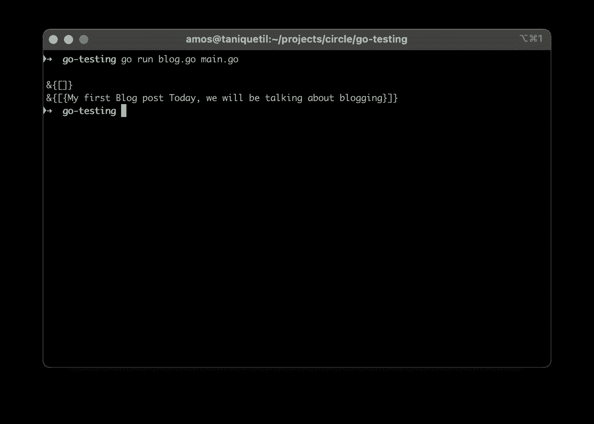
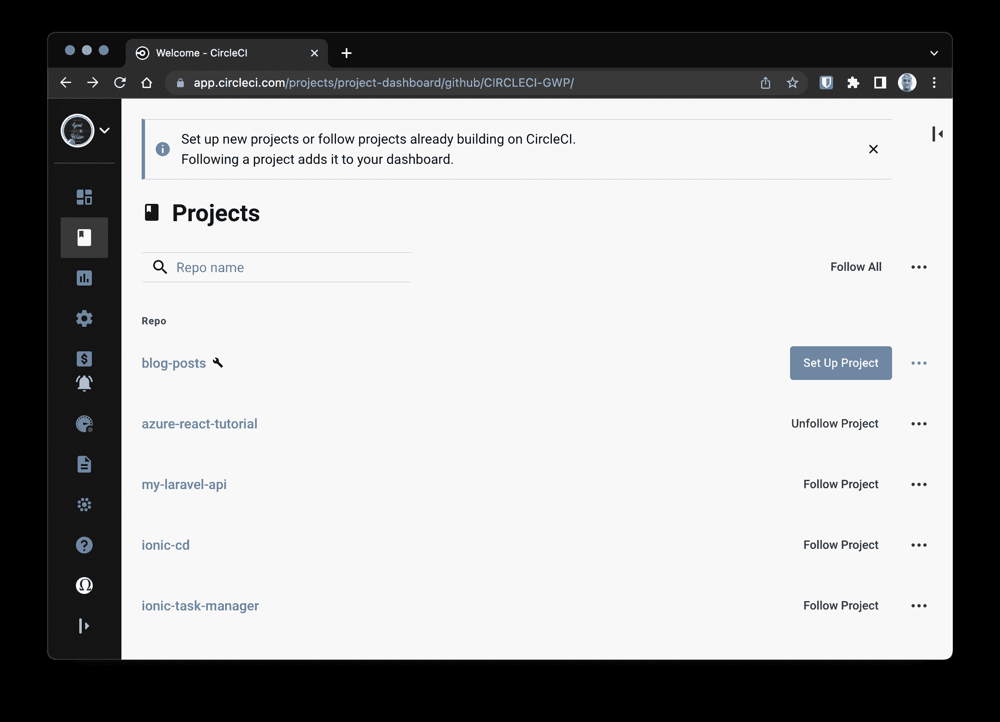
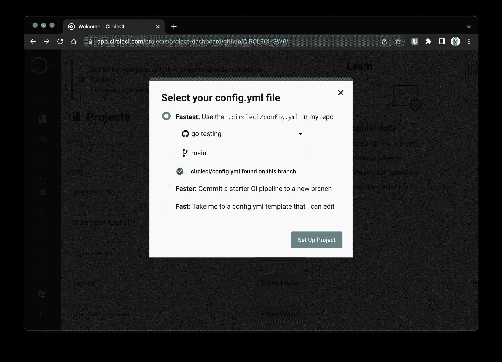
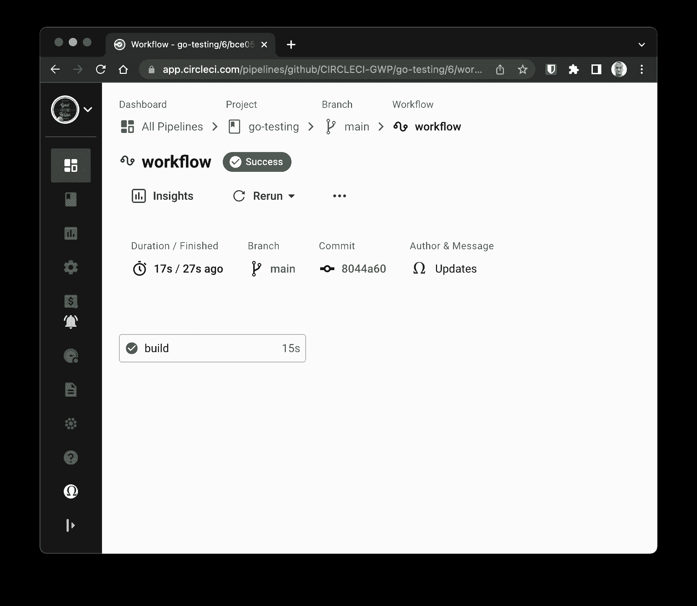

# Go 应用的持续集成| CircleCI

> 原文：<https://circleci.com/blog/continuous-integration-for-go-applications/#2022-04-06T05:00:00-07:00>

> 本教程涵盖:
> 
> 1.  设置 Go 博客应用程序
> 2.  添加和运行测试
> 3.  自动化测试

Go 是一种由 Google 支持的开源编程语言，它使构建简单、可靠、高效的软件变得容易。Go 在网络服务器上的效率和友好的语法使它成为了 [Node.js](https://nodejs.org) 的有用替代品。所有的网络应用都需要经过充分测试的特性，在 Go 中开发的也不例外。在本教程中，我们将构建*和*测试一个简单的 Go 博客。

## 先决条件

要遵循本教程，需要做一些事情:

1.  编程基础知识
2.  安装到您的系统上(您可以在这里找到安装指南)。
3.  一个[圆](https://circleci.com/signup/)的账户
4.  一个 [GitHub](https://github.com/) 。账户

> 我们的教程是平台无关的，但是使用 CircleCI 作为例子。如果你没有 CircleCI 账号，请在 注册一个免费的 [**。**](https://circleci.com/signup/)

一旦满足了所有这些要求，您就可以开始本教程了。

## 设置一个简单的 Go 博客项目

要设置 Go 项目，请创建项目文件夹。导航到文件夹的根目录，并输入:

```
mkdir go-testing
cd go-testing 
```

接下来，使用`go mod`命令初始化根目录下的项目:

```
go mod init go-testing 
```

这将用包名`go-testing`初始化项目。你可以使用任何你想要的包名，只要它遵循[标准包命名约定](https://golang.org/doc/effective_go.html#names)。。

现在，为应用程序的入口点创建一个`main.go`文件:

```
// go-testing/main.go

package main

import "fmt"

func main(){
  fmt.Println("Good to Go!")
} 
```

这段代码将字符串`Good to Go!`打印到 CLI 界面。通过在 CLI 上运行以下命令来运行此代码:

```
go run main.go 
```

## 创建博客模型

在这一步中，您将为一个示例博客创建一个模型(用面向对象编程的术语来说)。这个模型创建了一个`blog`的新实例，并向其中添加了文章。

在项目的根目录下，创建一个名为`blog.go`的新的`Go`文件。把这个粘贴进去:

```
// go-testing/blog.go

package main

type Article struct {
	Title string `json:"title"`
	Body  string `json:"body"`
}

type Blog struct {
	Articles []Article
}

func New() *Blog {
	return &Blog{}
}

func (b *Blog) SaveArticle(article Article) {
	b.Articles = append(b.Articles, article)
}

func (b *Blog) FetchAll() []Article {
	return b.Articles
} 
```

这段代码包含两种数据类型和三个函数，工作原理如下:

*   `Article` `struct`类型包含属性`Title`和`Body`。它分别使用`json`绑定到`title`和`body`。
*   `Blog`是代表博客本身的`struct`类型。它由一组`Article`数据类型组成。
*   `New()`是实例化一个新的`Blog`的方法。换句话说，它返回了一个新的`Blog`实例。
*   `SaveArticle`方法向博客的文章集合中添加一篇新文章。
*   `FetchAll`是一个在数组中检索`Blog`实例中所有`Article`数据类型的方法。

要测试您刚刚创建的博客模型，请将`main.go`中的所有内容替换为:

```
// go-testing/main.go

package main

import (
	"fmt"
)

func main() {

	blog := New()

	fmt.Println(blog)

	blog.SaveArticle(Article{"My first Blog post", "Today, we will be talking about blogging"})

	fmt.Println(blog)

} 
```

这段代码创建了一个打印在`stdout`上的新博客实例。`SaveArticle`方法保存新的文章实例，博客再次打印到`stdout`。既然项目中有不止一个`Go`文件，那么使用这个命令来运行这两个文件:

```
go run blog.go main.go 
```

在您的 CLI 上打印出了`blog`实例。



`blog`实例的第一份打印输出为空。第二次打印输出发生在我们添加了一篇文章之后，因此它包含了那篇文章。

## 向 Go 项目添加测试

是时候添加一些测试了。您将添加测试脚本，断言`SaveArticle`和`FetchAll`方法按预期工作。

在项目的根目录下创建一个测试文件`blog_test.go`，并将它粘贴到:

```
// go-testing/blog_test.go

package main

import "testing"

func TestSaveArticle(t *testing.T) {

	blog := New()

	blog.SaveArticle(Article{"My title", "My Post Body"})

	if blog.Articles[0].Title != "My title" {
		t.Errorf("Item was not added")
	}
}

func TestFetchAllArticles(t *testing.T) {

	blog := New()

	blog.SaveArticle(Article{"My title", "My Post Body"})

	articles := blog.FetchAll()

	if len(articles) == 0 {
		t.Errorf("Fetch All fails")
	}
} 
```

在这段代码中，`testing`包(可以在`Go`的标准库中找到)被导入。然后编写两个函数分别测试`SaveArticle`和`FetchAll`方法。

`TestSaveArticle`创建一个新的`Blog`实例并保存一个`Article`。然后检查标题，确保保存的文章包含在博客中。如果没有保存的文章，错误将导致测试失败。

`TestFetchAllArticles`创建一个新的`Blog`实例并保存一个`Article`。然后，它调用`FetchAll`来检索文章，并检查博客是否包含任何文章。如果没有文章，错误表明`FetchAll`未能返回新文章。

## 在本地运行测试

使用详细标志`-v`运行这些测试以获得更多信息。输入以下内容:

```
go test -v 
```

命令完成后，您将在 CLI 上看到一条消息。


这个屏幕截图显示两个测试成功运行并通过了测试。添加`-v`标志显示关于每个测试如何运行的具体反馈，而不仅仅是通常的总结。

## 用 CircleCI 自动化测试

您的下一个任务是自动化测试过程，以便在代码被推送到远程存储库时测试能够运行。使用 CircleCI 设置测试自动化包括三个步骤:

1.  添加 CircleCI 管道配置以自动化测试过程
2.  创建一个远程存储库，并将项目代码推送到那里
3.  将存储库作为项目添加到 CircleCI 上

首先创建构建管道配置文件来包含您的配置脚本。

在项目的根目录下，创建一个名为`.circleci`的文件夹和一个`config.yml`文件。在`config.yml`内部进入如下配置:

```
version: 2.1
jobs:
  build:
    working_directory: ~/repo
    docker:
      - image: cimg/go:1.15.10
    steps:
      - checkout
      - restore_cache:
          keys:
            - go-mod-v4-{{ checksum "go.sum" }}
      - run:
          name: Install Dependencies
          command: go get ./...
      - save_cache:
          key: go-mod-v4-{{ checksum "go.sum" }}
          paths:
            - "/go/pkg/mod"
      - run:
          name: Run tests
          command: go test -v 
```

在上面的脚本中，`Go`的 CircleCI Docker 映像作为测试环境被拉进来。然后将项目代码从项目的远程存储库中签出。在依赖项被安装和缓存之后，测试脚本(`go test -v`)运行。

提交对项目的更改，然后[将项目推送到 GitHub](https://circleci.com/blog/pushing-a-project-to-github/) 。

接下来，转到 CircleCI 仪表板上的 Add Projects 页面。



点击**设置项目**开始。



在设置项目页面上，点击**fast**以指示 CircleCI 您将在您的分支上使用配置文件。然后点击**设置项目**完成。构建应该会成功执行。



您可以单击构建来查看部署的详细步骤。

## 结论

正如我们在本教程中所展示的，Go 提供了一个开箱即用的测试套件。使用 Go 可以通过优化收益和减少工作负载成本来更容易地实践[测试驱动开发(TDD)](https://circleci.com/blog/how-to-test-software-part-ii-tdd-and-bdd/) 。这让您和您的团队有更多的时间为您的应用程序开发功能

编码快乐！

* * *

Fikayo Adepoju 是 LinkedIn Learning(Lynda.com)的作者、全栈开发人员、技术作者和技术内容创建者，精通 Web 和移动技术以及 DevOps，拥有 10 多年开发可扩展分布式应用程序的经验。他为 CircleCI、Twilio、Auth0 和 New Stack 博客撰写了 40 多篇文章，并且在他的个人媒体页面上，他喜欢与尽可能多的从中受益的开发人员分享他的知识。你也可以在 Udemy 上查看他的视频课程。

[阅读 Fikayo Adepoju 的更多帖子](/blog/author/fikayo-adepoju/)