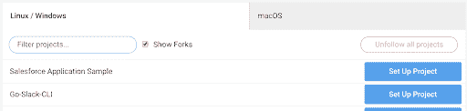
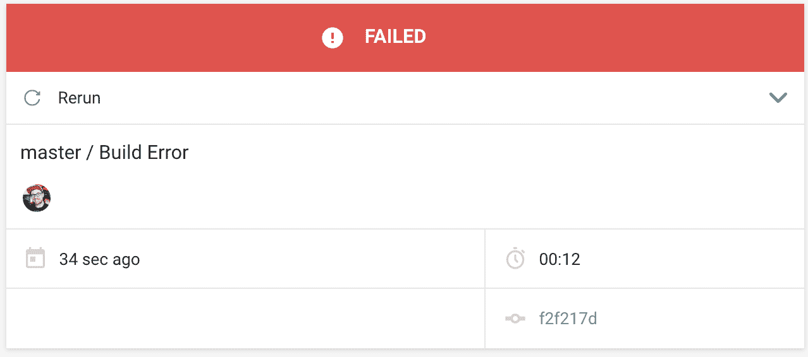
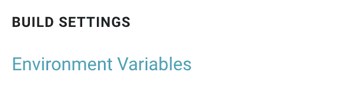
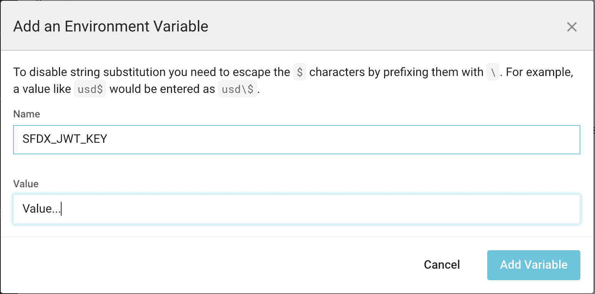

# Salesforce 应用程序的持续集成| CircleCI

> 原文：<https://circleci.com/blog/continuous-integration-for-salesforce-applications/#2020-08-11T05:00:00-07:00>

**来自发布者**的说明:*这篇文章由 Gabriel smell 于 2020 年 8 月 11 日更新，添加了新的 [Salesforce SFDX Apex orb](https://circleci.com/developer/orbs/orb/circleci/salesforce-apex) 。*

好消息，Salesforce 应用程序开发人员！🎉我们通过 CircleCI 简化了构建、测试和部署您的 Salesforce 应用程序的过程。现在，您可以借助我们与 Salesforce 的集成创建一个自动化开发管道: [Salesforce SFDX CLI orb](https://circleci.com/developer/orbs/orb/circleci/salesforce-sfdx) 和新的 [Salesforce SFDX Apex orb](https://circleci.com/developer/orbs/orb/circleci/salesforce-apex) 。

Salesforce SFDX CLI orb 已更新，专门关注 SFDX CLI。我们创建了一个新的 orb，Salesforce SFDX Apex orb，专注于测试和部署您的应用程序的流程。

本文将向您展示如何在 CircleCI 上快速启动并运行自动化开发管道。我们将利用 Salesforce 提供的 [ebikes-lwc](https://github.com/trailheadapps/ebikes-lwc) 示例应用程序以及我们新的 [Salesforce SFDX Apex orb](https://circleci.com/developer/orbs/orb/circleci/salesforce-apex) 。如果您完全不熟悉 Salesforce 应用程序开发，此存储库也是开始学习的好地方。或者，如果您有自己的 Salesforce 应用程序，您可以使用它来代替 ebikes-lwc 示例应用程序。

## 什么是 CI 渠道？

对于第一次来 CircleCI 的人，我想就[持续集成](https://circleci.com/continuous-integration/)如何改进您的开发工作流程做一个[快速概述](https://circleci.com/docs/about-circleci/#section=welcome)。

CircleCI 帮助您更快地构建、测试和发布代码。CircleCI 管道允许您对应用程序进行更改，并在部署之前快速测试这些更改。如果你的测试失败了，CircleCI 会马上通知你。一旦您对代码有了信心，您就可以手动或自动地将这些更改部署到您的用户。

## 设置

在我们开始创建 [CI 管道](https://circleci.com/blog/what-is-a-ci-cd-pipeline/)之前，我们有一些设置任务要完成:

1.  第一个很简单，我们需要[为您的帐户启用开发中心](https://developer.salesforce.com/docs/atlas.en-us.sfdx_setup.meta/sfdx_setup/sfdx_setup_enable_devhub.htm)。这允许您创建和管理临时组织，这是在安全、可任意使用的环境中测试应用程序所必需的。

2.  我们需要做的下一件事是创建我们自己的自签名 SSL 证书和私钥。当使用 Salesforce CLI 进行身份验证时，您通常会启动浏览器窗口并登录，但是在我们没有人工交互的 CI 环境中，我们需要一种替代的身份验证方法。

    对于我们基于 JWT 的授权，我们将创建一个证书，Salesforce 将持有我们的证书，CircleCI 将持有我们的私钥。我们一会儿会回到这个话题。按照此处的说明[创建您的证书和密钥。](https://developer.salesforce.com/docs/atlas.en-us.sfdx_dev.meta/sfdx_dev/sfdx_dev_auth_key_and_cert.htm)

3.  最后，在我们开始管道之前，我们必须创建一个连接的应用程序。连接的应用程序是我们在云环境中连接到 Salesforce 实例的方式。这将允许我们利用我们在上一步中创建的证书向 JWT 进行身份验证。

    您可以在 Salesforce 网站[这里](https://developer.salesforce.com/docs/atlas.en-us.sfdx_dev.meta/sfdx_dev/sfdx_dev_auth_connected_app.htm)按照步骤创建连接应用。您将看到，在此步骤中，我们将使用 Salesforce 存储我们的`server.crt`文件。稍后，我们将向 CircleCI 添加服务器密钥。一定要记下创建的应用程序给出的消费者键值。

此时，是时候开始准备我们的项目了。如果你已经有了一个项目，你可以从它开始。否则，从克隆我们之前提到的 [ebikes-lwc](https://github.com/trailheadapps/ebikes-lwc) 例子开始。我们最终想要一个由 GitHub 或 BitBucket 等 VCS 提供商托管的 Salesforce 应用程序项目。

一旦我们在 GitHub 或 BitBucket 上托管了一个项目，我们就可以开始组装管道了。

## 将项目添加到 CircleCI

我们的项目还没有完成，我们需要添加一个 CircleCI 配置文件，但是我们马上就会添加。我们还需要先做最后一点准备工作。

[使用 CircleCI 授权您的 VCS](https://circleci.com/vcs-authorize/) 并登录。一旦你在你的[仪表板](https://circleci.com/dashboard)，点击 **[添加项目](https://app.circleci.com/projects/project-dashboard/github/circleci/)** ，这应该呈现一个来自你的账户的项目列表。点击**为您的 Salesforce 应用程序设置项目**。



在下一页，您可以忽略默认值。我们一会儿会回到这个话题。点击**开始建造**。


在下一页，你会马上看到我们的工作失败了，但是不要担心！那是可以预料的。我们还没有将我们的[配置文件](https://circleci.com/docs/configuration-reference/)添加到我们的集成中，也没有设置我们的[环境变量](https://circleci.com/docs/env-vars/)。



## 添加环境变量

让我们将所需的[环境变量](https://circleci.com/docs/env-vars/#setting-an-environment-variable-in-a-project)添加到这个新添加的项目中。在屏幕左侧的导航栏中，是您添加到 CircleCI 的项目列表，旁边有一个嵌齿轮。单击我们的 Salesforce 应用程序旁边的齿轮进入设置页面。


从那里你可以点击位于**构建设置**下的**环境变量**。



我们必须添加两个秘密来进行身份验证。

| 环境变量 | 价值 |
| --- | --- |
| JWT 钥匙 | 该值必须包含私有 server.key 文件的 base64 编码值。 |
| SFDX _ 消费者密钥 | Salesforce 的已连接应用程序的消费者密钥。 |

消费者密钥在之前的步骤中生成。只需添加一个名为`SFDX_CONSUMER_KEY`的新环境变量和来自 Salesforce 的值。

要获得 Base64 编码的 JWT 密钥，请导航到包含您之前创建的自签名证书文件的目录，并输入以下命令:`base64 server.key`。一旦有了 base64 编码的值，复制它并将其添加到项目环境变量中的`SFDX_JWT_KEY`键下。



## 添加您的配置

这就是所有需要的设置！概括地说，到目前为止，您已经:

*   为您的 Salesforce 帐户启用开发中心
*   创建了一个连接应用程序
*   使用您连接的应用启用 JWT 身份验证
*   跟踪 CircleCI 的项目
*   添加了所需的环境变量

此时，CircleCI 能够通过 Salesforce 进行身份验证。这将允许我们在配置中使用 SFDX Apex orb 命令。

在项目存储库的主目录中，添加一个顶级的`.circleci`文件夹，并在其中创建一个`config.yml`文件。当新的变更被推送到您的存储库时，CircleCI 会自动寻找这个文件。这将作为每次更新要执行的操作的蓝图。如果你不熟悉 CircleCI 配置，我强烈推荐你看看我们的[入门](https://circleci.com/docs/getting-started/)信息。

一旦您创建了您的`config.yml`文件，让我们开始从 [SFDX Apex orb](https://circleci.com/developer/orbs/orb/circleci/salesforce-sfdx) 复制包含的使用示例。

```
version: 2.1
  orbs:
    apex: circleci/salesforce-apex@x.y
  jobs:
    install_authenticate:
      docker:
        - image: cimg/node:14.5
      steps:
        - checkout
        - apex/setup:
           defaultusername: user@email.com
        - run:
            name: Run your SFDX commands here
            command: |
              echo "You now have access to the sfdx cli and may execute commands against it. https://developer.salesforce.com/docs/atlas.en-us.sfdx_cli_reference.meta/sfdx_cli_reference/cli_reference.htm"
  workflows:
    basic-test:
      jobs:
        - install_authenticate 
```

## 配置细分

我们来分析一下。

```
version: 2.1
 orbs:
   sfdx: circleci/salesforce-apex@x.y 
```

访问“orbs”需要 circle ci config 2.1 版。这应该是默认设置，但是明确设置配置的版本总是一个好主意，特别是因为将来会更新。

节允许我们定义和导入我们的 orb 包。在这个例子中，我们只需要`circleci/salesforce-apex`球体。你可以看到我们将它作为`apex`导入，我们将能够在配置的其他地方引用它。

另外，注意在我们的 import 语句的末尾有一个`@x.y`版本标签。这是一个占位符值。我鼓励你访问 [orb 注册中心](https://circleci.com/developer/orbs)，不仅查看最新的文档，还确保你导入的是最新版本的 orb。

orb 是永远版本化的，所以您可以导入一个完全版本化的版本，比如`1.0.0`。但是，我们建议使用次要版本，这样您可以自动获取补丁发布。

### 乔布斯

在 orb 导入下面，您会发现我们的`jobs`节，其中有一个名为`install_authenticate`的作业。

```
 jobs:
    install_authenticate: 
```

这是我们在配置文件中手动定义的作业。您的工作可以命名为任何名称，根据您的工作流程有多个工作并不罕见。在此工作流中，我们将展示如何在单个作业中安装 CLI 工具并对其进行身份验证。

### Docker 图像

CircleCI 提供了各种各样的[预建 Docker 图像](https://circleci.com/docs/circleci-images/)。在这种情况下，我们将利用`cimg/node:14.5`图像。此映像提供了预安装的`nodejs`，允许我们安装 Salesforce CLI 的节点版本，而无需单独安装节点和 npm。

```
 docker:
        - image: cimg/node:14.5 
```

### 步伐

[步骤](https://circleci.com/docs/jobs-steps/#steps-overview)是我们希望按顺序执行的可执行命令的集合。

```
 - checkout
        - apex/setup:
           defaultusername: user@email.com 
```

*   **check out:**circle ci 自带的一个内置命令，它将从您的存储库中获取源代码。这不是集成所必需的，但通常是任何项目的第一步。
*   **apex/setup:** 由 circleci/salesforce-apex orb 提供的 orb 命令，它将安装最新的单机版 CLI，然后使用已设置的凭据向 salesforce 进行身份验证。

从这一点开始，您可以利用 orb 中的其他命令，或者使用其他命令直接与 SFDX 交互。这里有一个例子:

```
 - run:
         name: Check Auth List
         command: sfdx force:auth:list 
```

### 工作流程

工作流是 CircleCI 的一个特性，它允许您编排我们想要运行的作业和运行顺序。我们的工作流程中只有一项任务。在我们的例子中，我们希望它在每次提交时运行，所以我们不包括任何过滤器。我们将创建一个名为`basic-test`的工作流，并列出我们的`install_authenticate`作业。

```
 workflows:
    basic-test:
      jobs:
        - install_authenticate 
```

## 你还可以用 Salesforce SFDX Apex orb 做什么？

我们想听听 Salesforce 开发人员的意见！发微博给@CircleCI ，告诉我们你是如何使用我们的宝珠的。