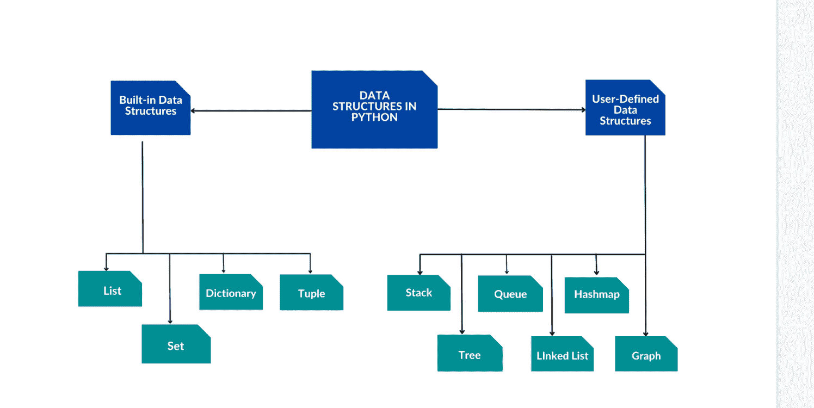
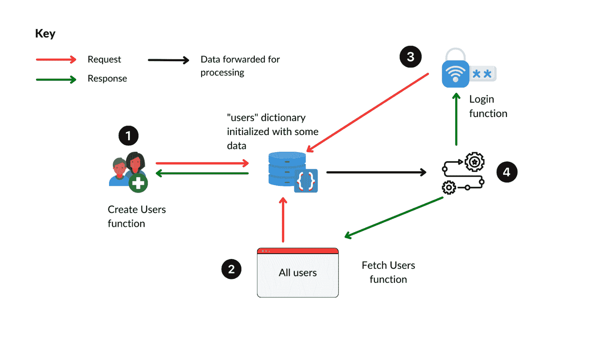
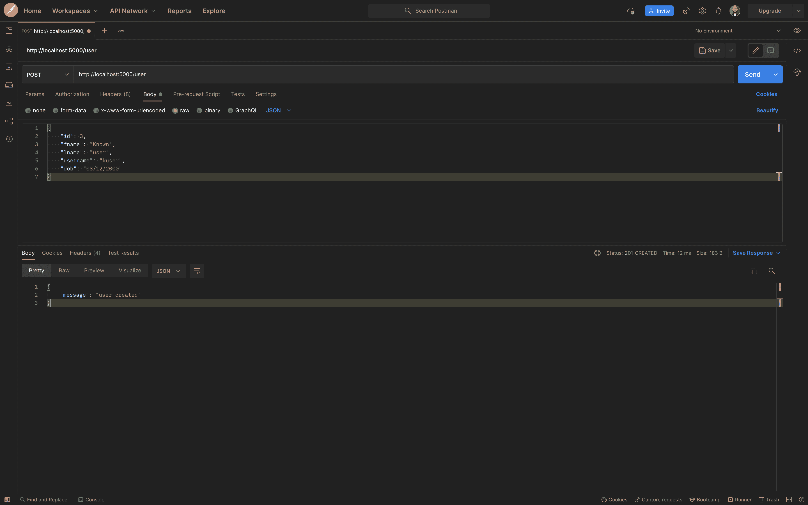
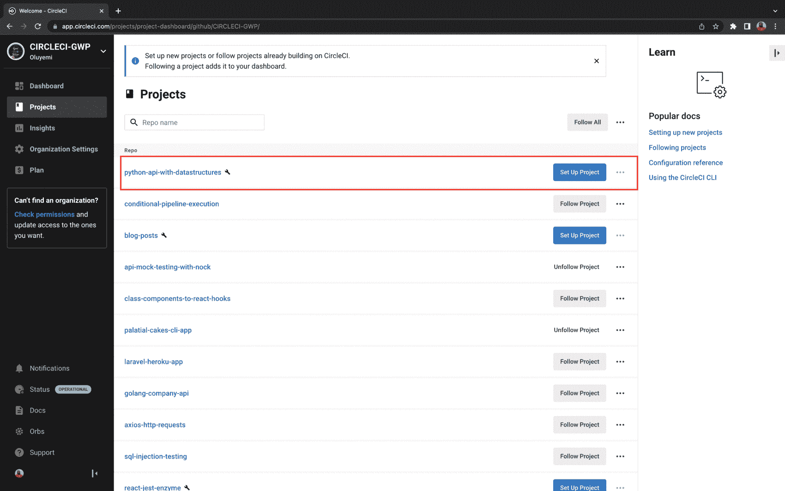
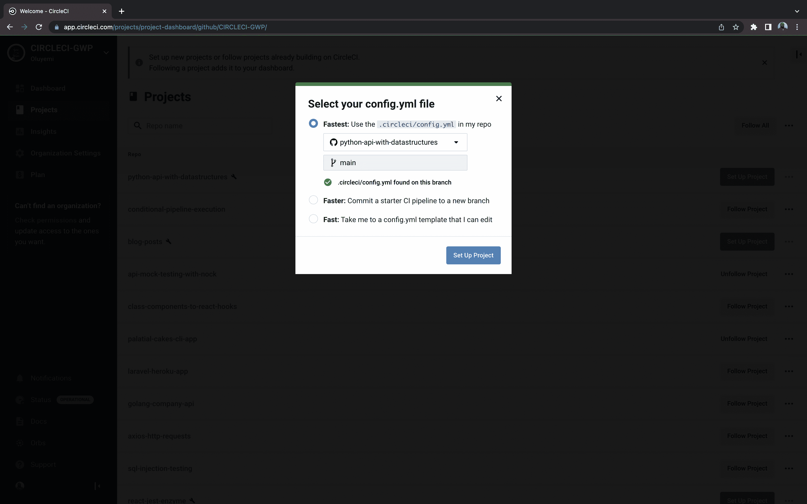

# 有效 Python 应用程序的数据结构

> 原文：<https://circleci.com/blog/data-structures-for-python-applications/#2022-06-06T09:00:00-07:00>

> 本教程涵盖:
> 
> 1.  什么是 Python 数据结构以及如何使用它们
> 2.  如何实现由 Python 数据结构支持的 API
> 3.  如何自动化 Python API 的测试

因为计算机依赖数据来执行指令，所以计算总是需要数据交互。在现实世界的应用程序中，数据量可能是巨大的，因此开发人员必须始终如一地设计方法，以编程的方式快速有效地访问数据。

对于专门开发工具和系统的团队来说，对数据结构的深刻理解是一个很大的优势。以最佳方式组织数据可最大限度地提高效率，并使数据处理变得简单无缝。在本教程中，您将了解 Python 中的数据结构，如何使用它们来构建高效、高性能的应用程序，以及如何使用[持续集成](https://circleci.com/continuous-integration/)来自动测试您的 Python 应用程序。

## 先决条件

完成本教程需要以下项目:

> 我们的教程是平台无关的，但是使用 CircleCI 作为例子。如果你没有 CircleCI 账号，请在 注册一个免费的 [**。**](https://circleci.com/signup/)

## 什么是数据结构？

数据结构是一种组织和管理内存中数据的方法，可以有效地对数据执行操作。使用不同的数据类型构建数据结构和定义保存数据的变量有一些最佳实践。

## 为什么需要 Python 数据结构？

随着系统复杂性的增长，数据也在增长。如今，处理大量数据经常会导致处理器速度问题、数据搜索和排序效率低下，以及处理多个用户请求时的问题。这些问题对性能至关重要，必须加以解决，以实现任何系统的最高效率。

数据结构用来决定一个程序或系统如何运行。按顺序搜索阵列中的数据将会非常耗时且耗费资源。这可以通过使用诸如散列表的数据结构来解决。

数据抽象隐藏了数据结构的复杂细节，因此客户端程序不必知道实现细节。这是通过[抽象数据类型](https://www.cse.iitd.ac.in/~pkalra/csl101/Python-ADT.pdf)完成的，它为您的应用程序提供了抽象。

## Python 中的数据结构概述

Python 提供了内置的数据结构，比如列表、字典、集合和元组。Python 用户可以创建自己的数据结构，并最终控制它们的实现方式。栈、队列、树、链表和图形都是用户定义的数据结构的例子。

本教程将重点介绍列表和字典，以及开发人员如何使用它们来优化应用程序中的数据存储和检索。

下一节的重点是使用列表和字典的优化操作来存储、处理和检索数据结构中的数据。

## 列表

列表是元素的有序集合。因为列表是可变的，所以它们的值可以改变。项目是包含在列表中的值。

**注:***Python 数据结构的类型决定了它的可变性。可变对象可以改变它们的状态或内容，而不可变对象不能。*

使用方括号来表示 Python 列表。下面是一个空列表的示例:

`categories = [ ]`

逗号(`,`)用于分隔列表中的项目:

`categories = [ science, math, physics, religion ]`

列表还可以包含列表项目:

`scores = [ [23, 45, 60] , [67, 69, 90] ]`

`index`，仅仅是值在列表中的位置，是用来访问列表中的元素的。以下是如何访问列表中各种项目的示例:

`categories = [ science, math, physics, religion ]`

输出:

```
categories [0]  # science
categories [1]  # math
categories [2]  # physics 
```

您还可以使用负索引来访问从列表末尾开始的项目。例如，要到达前面列表中的最后一项:

`categories [-1] # religion`

您可以添加、删除和修改列表中的项目，因为列表是可变的。

要更改列表中项的值，请引用该项的位置，然后使用赋值运算符:

`categories [ 0 ] = “geography” # modifies the lists, replacing “science” with “geography”`

要向列表中添加新项目，请使用`append()`方法，该方法将项目添加到列表的末尾:

`categories .append( “linguistics” )`

您可以在列表上使用的另一个方法是`insert()`，它在列表中的随机位置添加项目。其他列表对象包括`del()`、`pop()`、`clear()`和`sort()`。

## 字典

字典是 Python 内置的`key-value`对数据类型的集合。与列表不同，字典是由关键字索引的，关键字可以是字符串、数字或元组。通常，字典键可以是任何不可变的类型。

字典的键必须是不同的。花括号`{}`用来表示字典。

键使得使用字典和存储各种类型的数据变得简单，包括列表甚至其他字典。您可以使用字典的键对字典进行访问、删除和其他操作。关于字典要记住的一件重要事情是，用一个已经存在的键存储数据将会覆盖以前与那个键相关联的值。

下面是一个使用字典的例子:

`student = { “name”: “Mike”, “age”: 24, “grade”: “A” }`

要访问上述字典中的项目:

`student[ ‘name’ ] # Mike`

向字典中添加数据就像 Dict[key] = value 一样简单:

`student[ ‘subjects’ ] = 7`

Python 字典方法有`len()`、`pop()`、`index()`、`len()`、`popitem()`。

下面的常用方法允许它从字典中返回值。

```
dict.items()     # return key-value pairs as a tuple
dict.keys()      # returns the dictionary's keys
dict.get(key)  # returns the value for the specified key and returns None if the key cannot be found. 
```

下图显示了内置和用户定义的不同类型的 Python 数据结构。



在本教程的下一节中，您将使用刚刚学到的知识创建一个简单的 API，它将允许您存储、操作和检索数据结构中的数据。

## API 流程图和存储

现在您已经知道了什么是列表和字典，您可以使用它们来创建一个 API 端点，它具有登录功能，并且数据只存储在数据结构中。您可以观察数据如何在应用程序中流动，以及如何在 API 中使用数据结构。



这个 API 图显示了一个数据存储，它是一个 Python 字典。它是用示例用户数据初始化的，因为这允许您充分探索数据结构的功能。步骤被标记为`1`到`4`以显示通过 API 的数据流。

**步骤一**让用户通过输入他们的`first name`、`last name`、`username`和`date of birth`来创建账户。这些细节都保存在`users`字典里。

**第二步**检索系统中的所有用户。在发送回数据之前，它会从嵌套字典转换为排序列表。

**第三步**用一个`Id`和一个`username`认证一个用户。

**第四步**是数据结构在向客户端发回响应之前进行实际处理的地方。

既然您已经知道了 API 是如何工作的，那么您就可以将数据结构放到实际的应用程序中了。

## 用数据结构实现 API

用数据结构实现由以下步骤组成:

*   设置 API 框架
*   正在初始化用户
*   创建用户
*   正在检索用户

### 设置 API 框架

为了继续本教程，我鼓励您克隆应用程序。这样，您可以浏览应用程序并理解教程中没有完整记录的部分。

```
git clone https://github.com/CIRCLECI-GWP/python-api-with-datastructures

cd python-api-with-datastructures 
```

要安装 Python 依赖项，您需要使用以下命令设置虚拟环境:

**视窗操作系统**

```
py -3 -m venv venv;

venv\Scripts\activate; 
```

**Linux/macOS**

```
python3 -m venv venv

source venv/bin/activate 
```

从 requirements.txt 文件安装需求:

```
pip install -r requirements.txt 
```

要启动 API，请运行:

```
python main.py 
```

设置和启动 API 框架的工作非常出色！下一步是修改您的路由并创建一个链表来处理用户验证和数据转换。

### 正在初始化用户

考虑到您的应用程序状态仅在服务器运行时持续，您将创建一个用户字典，该字典将用示例数据进行初始化。为此，在 Flask 应用程序配置之后，手动将数据添加到用户字典的`main.py`文件中。

修改后的字典应该是这样的:

```
# main.py

users = {
   1: {"fname": "John", "lname": "Doe", "username": "John96", "dob":    "08/12/2000"},
   2: {
       "fname": "Mike",
       "lname": "Spencer",
       "username": "miker5",
       "dob": "01/08/2004",
   },
} 
```

现在，即使您的服务器停止运行，当您测试您的端点或创建新的应用程序数据时，您也将始终有内存中的数据可供参考。

### 创建用户

初始化用户数据字典后，创建一个`create user`函数来创建用户。使用请求库，因为这将是一个 API 请求，用户凭证将通过提交进入。

使用请求库- `data = request.get_json()`中的`get_json()`方法解析传入的 JSON 请求数据，并将其存储在一个变量中。任何系统都不应该允许重复记录，您的 API 也不例外。因此，在创建新用户时，请确保新用户的详细信息与任何可用记录都不匹配。如果相同的数据已经可用，则通知用户并暂停该过程。复制这段代码并粘贴到`main.py`文件中:

```
# main.py
@app.route("/user", methods=["POST"])
def create_user():

   data = request.get_json()

   if data["id"] not in users.keys():
       users[data["id"]] = {
           "fname": data["fname"],
           "lname": data["lname"],
           "username": data["username"],
           "dob": data["dob"],
       }
   else:
       return jsonify({"message": "user already exists"}), 401

   return jsonify({"message": "user created"}), 201 
```

这段代码首先通过在用户字典的关键字中搜索相似的 id 来确定用户`id`是否已经存储在用户数据存储中。检查`id`的可用性不是程序化的；相反，您可以在生产中检查用户的电子邮件。

如果检查通过，新的用户信息将被输入到字典中，使用惟一的用户 id 作为键。当根据用户 id 存储字典时，这种模式会产生一个嵌套字典。

Flask 包含一个名为`jsonify`的函数，允许您将数据序列化为 JSON 格式，您将使用它来格式化发送回客户端的消息。

## 正在检索用户

获取用户可以像返回`users`字典一样简单，但是有一种更好的方法。相反，为什么不按降序返回所有用户，把最近创建的用户放在最上面呢？

不幸的是，在 Python 3 中字典不再是可排序的，所以它们不能被排序。相反，您可以使用以下代码片段:

```
# main.py
@app.route("/users", methods=["GET"])
def get_users():

   all_users = []

   for key in users:
       all_users.append(users[key])
       users[key]["id"] = key

   all_users.sort(key=lambda x: x["id"], reverse=True)

   return jsonify(users), 200 
```

这将在前面的代码块中创建一个空列表，然后遍历`users`字典值，将每个值追加到列表中。此外，每个用户都需要一个惟一的标识符，所以在列表中添加一个`id`是一个好主意。

记住追加到列表之后，你就有了一个字典列表，你不能通过把你的嵌套字典转换成字典列表来欺骗 Python。这就是为什么您应该使用 lambda 函数将 id 指定为 sort 方法的键。结果是一个按照用户的`id`值降序排列的字典列表。

最后，在创建用户并实现一个按顺序检索用户的功能后，添加认证功能- `/user/login` -将会非常好。

```
# main.py
app.route("/users/login", methods=["POST"])
def login_user():

   data = request.get_json()

   id = data["id"]
   username = data["username"]

   if id in users.keys():
       if users[id]["username"] == username:
           return jsonify(f"Welcome, you are logged in as {username}"), 200

   return jsonify("Invalid login credentials"), 401 
```

在使用`id`和`username`之前，通过将发布的 id 与记录进行比较，确保这样的用户存在。如果存在匹配，您可以验证用户名。如果用户输入了有效的登录信息，请让他们登录，并显示一条带有他们的用户名的欢迎消息。相比之下，失败的登录只会显示一条消息，通知他们登录失败。

开始测试您刚刚创建的三个端点:`create a user`、`log them in`和`retrieve all users added`。如果出现任何问题，您总是可以参考位于克隆存储库中的`main.py`文件。

### 创建用户的 API 调用



### 用户登录的 API 调用


### 检索所有用户的 API 调用


使用在列表和字典中存储数据的能力，您可以验证 API 是否按预期工作。

## 为您的 API 编写测试

> 没有经过测试的代码已经被破坏了，这可能是乏味和耗时的，但是向应用程序中添加测试从来都不是真正的损失。教程的这一部分包括对您刚刚创建的 API 端点的用户创建、多用户创建、登录和用户检索的测试。我将指导您使用 Python 应用程序测试工具`Pytest`测试您的端点。您将编写的第一个测试是创建一个用户:

```
# tests/test_app.py
def test_create_user(client):

    response = client.post(
        "/user",
        json={
            "id": 4,
            "fname": "James",
            "lname": "Max",
            "username": "Maxy",
            "dob": "08/12/2000",
        },
    )

    assert response.headers["Content-Type"] == "application/json"
    assert response.status_code == 201 
```

这个片段中的代码创建了一个新用户，id 为`4`，名字为`James`，姓氏为`Max`。然后，它断言响应的内容类型是 JSON，并且对于创建的资源，状态代码是`201`。

接下来创建一个测试，以验证该测试可以获取创建的用户:

```
 def test_fetch_users(client):

    response = client.get("/users")

    assert response.headers["Content-Type"] == "application/json"
    assert response.status_code == 200 
```

该测试验证端点是否返回 JSON 响应，以及成功请求的状态代码是否为`200`。这两个测试只是一个开始；在文件`tests/test_app.py`的根目录下有更多的测试。从命令行运行`pytest`来执行您的测试。


通过测试验证了从 Python 数据结构创建的 API 端点的行为方式与使用实际数据库的 API 端点的行为方式相同。

既然您的测试已经在本地通过，那么将它们与您的持续集成环境集成，以确保部署到 GitHub 存储库的更改不会破坏应用程序。对于教程的这一部分，我们将使用 CircleCI 作为 CI 环境。

## 与 CircleCI 集成

要将 CircleCI 配置添加到您的项目中，请在项目文件夹的根目录下创建一个名为`.circleci`的新目录。在该目录中，创建一个名为`config.yml`的文件。将此配置添加到`.circleci/config.yml`文件中:

```
version: 2.1
orbs:
  python: circleci/python@1.5.0
jobs:
  build-and-test:
    docker:
      - image: cimg/python:3.10.2
    steps:
      - checkout
      - python/install-packages:
          pkg-manager: pip
      - run:
          name: Run tests
          command: pytest
workflows:
  sample:
    jobs:
      - build-and-test 
```

这个 CircleCI 配置是如何配置 CircleCI 来运行测试的简单示例。它指定您正在使用 Python Docker 映像，然后使用`pip`包管理器安装 Python 包，并使用`pytest`命令运行您的测试。

[使用 Git 提交所有更改过的文件](https://git-scm.com/docs/git-commit)，使用[将您的更改](https://docs.github.com/en/get-started/using-git/pushing-commits-to-a-remote-repository)推送到现有的 GitHub 存储库中。

## 设置 CircleCI

现在您已经有了远程 GitHub 分支的代码，您可以设置 CircleCI 来运行您的测试。进入 [CircleCI 仪表盘](https://app.circleci.com/dashboard)并选择**项目**选项卡。在列表中找到您的存储库。对于本教程，它是`python-api-with-datastructures`存储库。



选择**设置项目**选项。因为您已经将 CircleCI 配置推送到了远程存储库，所以您只需要键入包含该配置的分支的名称，然后单击**设置项目**。



坐下来，看着您的测试在 CircleCI 中执行。


您的测试成功通过，这只能意味着一件事:是时候庆祝了！

## 结论

通过学习本教程，您已经对 Python 数据结构、为什么需要它们以及如何在 Python 中使用列表和字典数据结构有了深入的了解。您还学会了只使用数据结构来编写端点。您为 API 端点编写了测试，以避免破坏现有的更改。您学习了如何集成 CircleCI，并观察了 CircleCI 在 CI 平台上执行您的测试。

一如既往，我很高兴为您创建本教程，我希望您会发现它很有价值。直到下一个，继续学习，继续建设！

* * *

Waweru Mwaura 是一名软件工程师，也是一名专门研究质量工程的终身学习者。他是 Packt 的作者，喜欢阅读工程、金融和技术方面的书籍。你可以在[他的网页简介](https://waweruh.github.io/)上了解更多关于他的信息。

[阅读更多 Waweru Mwaura 的帖子](/blog/author/waweru-mwaura/)