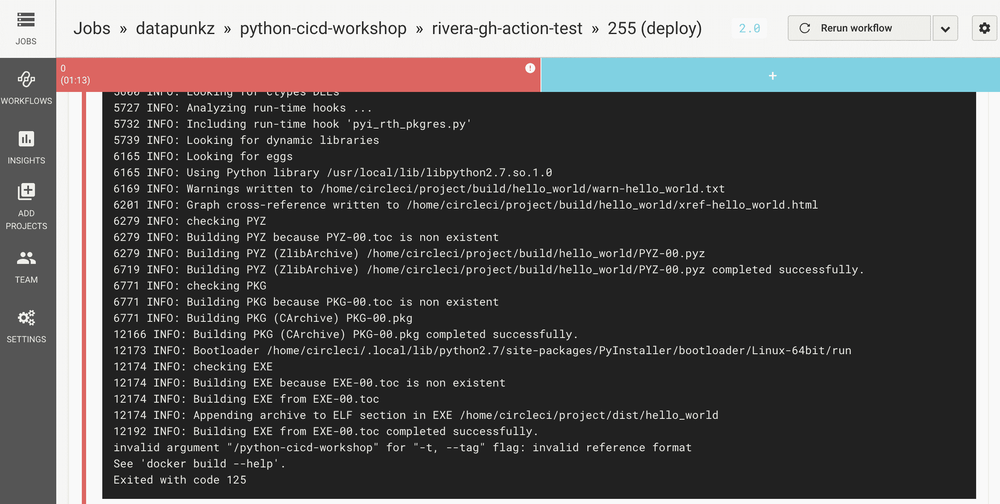

# 使用 SSH 访问调试 CI/CD 管道

> 原文：<https://circleci.com/blog/debugging-ci-cd-pipelines-with-ssh-access/#2021-10-07T09:00:00-07:00>

在 AWS re:invent 和 KubeCon 等行业活动中，我与许多开发人员进行了交流。开发人员经常讲述阻碍他们快速有效工作的事情。许多涉及与系统管理员、SREs 或 DevOps 同事的令人沮丧的互动。我听过好几次的一个故事涉及到这样一段对话:

**dev:** *嘿，SRE 队。我的构建失败了，我不知道构建节点中的应用程序发生了什么。它在 CI/CD 平台上失败了，但是构建脚本在我的开发环境中运行良好。我可以通过 SSH 访问平台上的构建节点，以便实时调试吗？*

SRE: *一小时后怎么样？*

**dev:** *一个小时？我需要完成这个，这样我就可以开始为下一个版本开发新功能了。您能否授予我访问构建节点的权限，以便我可以在构建失败的实际资源上进行调试？*

**SRE:** *我们的 CI/CD 平台没有 SSH 访问，给你我的管理员凭证是违反安全的。*

有时对话会继续:

**dev:** *我们安装的 SSH 插件怎么样了？这让我们可以向构建器节点发送控制台命令，这样我们就可以在系统日志中捕获响应。*

**SRE:** *安全部门根据 [CVE-2017-2648](https://nvd.nist.gov/vuln/detail/CVE-2017-2648) 将其标记为易受攻击，这使得中间人攻击成为可能。安全部门禁止它在我们的 CI/CD 平台上使用。我们没有进入节点的 SSH 功能来帮助您实时调试。抱歉。*

它以开发人员的想法结束:

如果我只使用单元测试和堆栈跟踪日志，我将永远无法调试这个版本。我也可能是在猜测。

虽然这个对话是一个概括，但它是基于我在职业生涯中经历的和在活动中听到的真实互动和情况。这是非常常见的情况，大多数团队都经历过类似的事情。

当我从 CircleCI 用户那里听到这个故事时，我有一个很好的解决方案:一个有用且强大的 SSH 调试功能。这个特性允许开发人员在构建失败的资源上对构建进行故障排除和调试。让我告诉你它是如何工作的。

## 访问管道作业

在资源上和开发人员正常开发环境之外的环境中调试代码会带来挑战，会消耗宝贵的时间。如果没有使开发人员能够访问失败的构建并对其进行故障排除的特性，CI/CD 平台本身就会成为开发人员和 SRE 团队的巨大障碍。由于不能通过 SSH 访问构建节点，开发人员不得不求助于在构建实际失败的 CI/CD 环境之外调试失败的构建。他们必须尝试在其开发环境中复制 CI/CD 环境，以准确识别问题，然后尝试仅使用应用程序、堆栈跟踪和系统日志来解决问题。这种情况对所有相关人员来说都是巨大的时间浪费。

SSH 调试允许开发人员在发生故障的资源上轻松、安全地实时调试失败的构建。使用 CircleCI，SSH 调试还为开发人员提供了自助机制，使他们能够安全地访问执行环境，而不必依赖其他团队。这对开发人员和运营团队来说都是巨大的时间节省。

## 对失败的管道作业进行故障排除

当您使用 CircleCI 时，使用 SSH 访问构建作业很容易。我将通过一个常见的构建失败场景来展示如何对失败的构建作业进行故障排除。这里有一个示例`config.yml`供我们在这个场景中使用:

```
version: 2.1
workflows:
  build_test_deploy:
    jobs:
      - build_test
      - deploy:
          requires:
            - build_test
jobs:
  build_test:
    docker:
      - image: cimg/python:3.10.0
    steps:
      - checkout
      - run:
          name: Install Python Dependencies
          command: |
            pip install --user --no-cache-dir -r requirements.txt
      - run:
          name: Run Tests
          command: |
            python test_hello_world.py
  deploy:
    docker:
      - image: cimg/python:3.10.0
    steps:
      - checkout
      - setup_remote_docker:
          docker_layer_caching: false
      - run:
          name: Build and push Docker image
          command: |       
            pip install --user --no-cache-dir -r requirements.txt          
            ~/.local/bin/pyinstaller -F hello_world.py
            echo 'export TAG=0.1.${CIRCLE_BUILD_NUM}' >> $BASH_ENV
            echo 'export IMAGE_NAME=python-cicd-workshop' >> $BASH_ENV
            source $BASH_ENV
            docker build -t $DOCKER_LOGIN/$IMAGE_NAME -t $DOCKER_LOGIN/$IMAGE_NAME:$TAG .
            echo $DOCKER_PWD | docker login -u $DOCKER_LOGIN --password-stdin
            docker push $DOCKER_LOGIN/$IMAGE_NAME 
```

示例`config.yml`指定了一个双作业工作流管道，该管道测试代码，基于应用程序构建 Docker 映像，并将该映像发布到 [Docker Hub](https://hub.docker.com) 。要将新映像发布到 Docker Hub，该作业需要 Docker Hub 凭据。这些凭证是高度敏感的，并且在`$DOCKER_LOGIN`和`$DOCKER_PWD`安全环境变量中被安全地表示。这些变量被设置为[项目级环境变量](https://circleci.com/docs/env-vars/#setting-an-environment-variable-in-a-project)。如果`$DOCKER_LOGIN`和`$DOCKER_PWD`环境变量在项目级不存在，这个构建将在**构建**和**推送 Docker 映像**步骤失败。

### 识别我们失败的工作



失败的作业日志显示失败发生在 Docker 构建过程的开始，如该日志条目所示。

```
invalid argument "/python-cicd-workshop" for "-t, --tag" flag: invalid reference format
See 'docker build --help'.
Exited with code 125 
```

现在我们知道了管道中的问题所在，我们可以轻松地使用 SSH 访问重新运行这个失败的构建。当使用 SSH 访问重新运行作业时，管道将再次运行并失败，就像以前一样。但是这一次，运行时节点保持活动状态，并向用户提供有关如何访问失败的构建资源的详细信息。

### 使用 SSH 重新运行作业

要获得对失败构建的 SSH 访问，请从 CircleCI 仪表板中重新运行失败的作业。

1.  登录 CircleCI 仪表板
2.  点击**失败的**作业
3.  单击仪表板右上角的向下按钮，然后选择**使用 SSH 重新运行作业**


该图显示了开发人员使用 SSH 访问资源时必须使用的访问细节的示例。


SSH 访问详细信息在构建结束时提供:

```
ssh -p 64535 100.27.19.200 
```

## 访问执行环境

现在我们可以通过 SSH 访问执行环境，我们可以对我们的构建进行故障排除了。如前所述，日志条目表明该问题与部署步骤的 Docker 构建部分有关。错误消息的`invalid argument "/python-cicd-workshop"`部分告诉我`"/python-cicd-workshop"`中缺少 Docker 用户名。

Docker 图像名称在`config.yml`文件的这一行中定义，由环境变量组成:

```
docker build -t $DOCKER_LOGIN/$IMAGE_NAME -t $DOCKER_LOGIN/$IMAGE_NAME:$TAG . 
```

我们知道 Docker 映像构建失败是因为一个不合适的映像名称，并且我们知道该名称是由环境变量组成的。这表明失败与不正确或不存在的环境变量有关。打开一个终端，通过 SSH 进入执行环境。我们想运行一个命令来测试我们关于环境变量的假设是否正确:

```
$ printenv |grep DOCKER_LOGIN 
```

`printenv |grep DOCKER_LOGIN`命令告诉系统显示`$DOCKER_LOGIN`环境变量及其值。这个命令的输出将告诉我们是否设置了`$DOCKER_LOGIN`变量。如果命令没有返回值，那么我们知道系统在构建的初始执行时没有设置`$DOCKER_LOGIN`变量。在这种情况下，没有返回值。那是我们失败的原因。

## 修复构建

我们现在已经验证了我们丢失了`$DOCKER_LOGIN`环境变量。我们可以通过使用 CircleCI 仪表板将缺失的`$DOCKER_LOGIN`和`$DOCKER_PWD`变量添加到项目中来修复构建。由于这些变量的值非常敏感，因此必须在 CircleCI 平台上定义并安全存储它们。您可以按照以下说明设置变量:

1.  点击左侧菜单中 CircleCI 仪表板上的**添加项目**
2.  在项目列表中找到并点击项目名称，点击**设置项目**
3.  点击 CircleCI 仪表盘右上方的**项目**重心
4.  在构建设置部分，点击**环境变量**
5.  点击**添加变量**

在`Add an Environment Variable`对话框中，定义该构建所需的环境变量:

*   名称:`DOCKER_LOGIN`值:`Your Docker Hub User Name`
*   名称:`DOCKER_PWD`值:`Your Docker Hub Password`

正确设置这些环境变量对于构建成功完成至关重要。

## 重新运行生成

既然我们已经为构建设置了所需的环境变量，我们可以重新运行失败的构建来测试我们的更改是否有效。转到 CircleCI 仪表板，点击**重新开始**开始项目的重建。等待您的构建成功完成。


## 包扎

在这篇文章中，我强调了对 CI/CD 管道进行 SSH 调试的必要性。我展示了 CircleCI 的 SSH 特性的强大功能，以及任何用户如何安全、轻松地访问他们的执行环境，并实时调试失败的构建。该特性使开发人员能够快速识别和修复他们的不完整构建，以便他们可以将时间和注意力集中到构建用户需要的新的和创新的特性上。