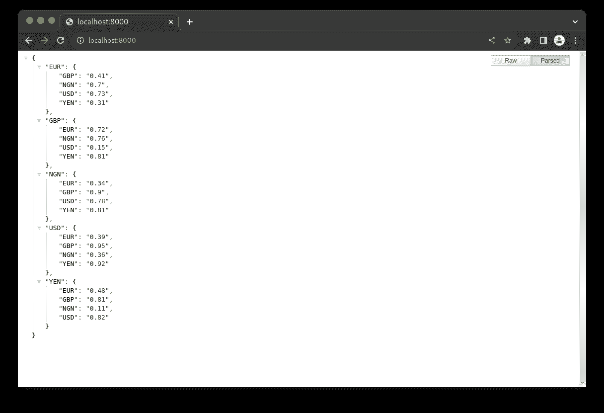
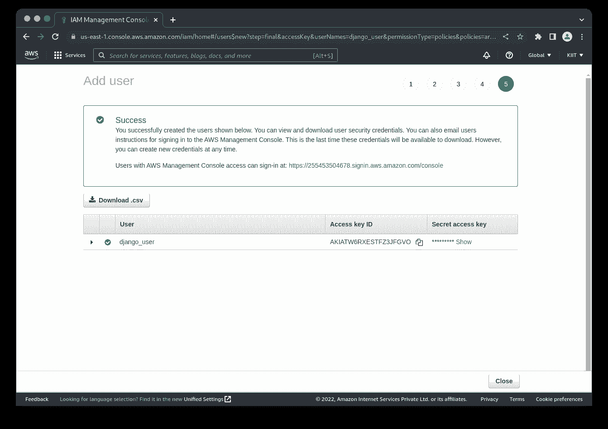
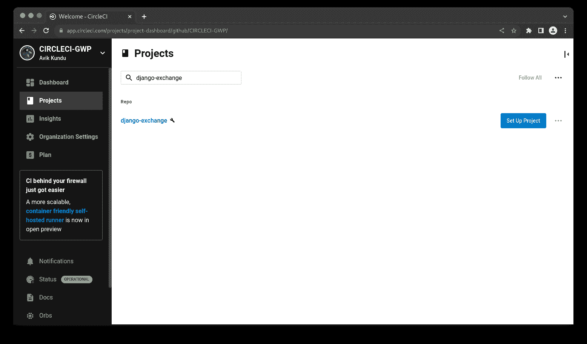
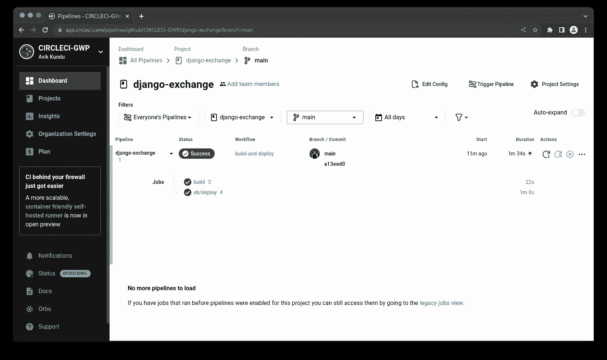

# 将 Django 应用部署到 AWS Elastic Beanstalk | CircleCI

> 原文：<https://circleci.com/blog/deploy-django-apps-to-aws/#2022-11-15T04:00:00-08:00>

> 本教程涵盖:
> 
> 1.  在 AWS 上设置 Django 应用程序
> 2.  使用弹性 Beanstalk 命令行界面
> 3.  创建连续部署管道

您的软件开发团队有大量的工具可供他们使用。一些旧工具正在以新的方式使用，这激发了更多新工具的产生。例如，JavaScript 已经从一种用于增加网站交互性的语言发展成为一种满足前端和后端需求的全栈语言。JavaScript 为 Express、Nest.js 和许多其他技术铺平了道路。

正如开发团队现在可以用 JavaScript 构建 API 一样，他们也可以构建由 Python 支持的 web 应用程序。这得到了 Flask 和 Django 等成熟框架的支持。越来越多的工具提供商正在他们的服务中增加对基于 Python 的应用程序的支持。

在本文中，我将指导您将 Django 应用程序部署到 AWS Elastic Beanstalk。我们将使用 circle ci[AWS Elastic Beanstalk](https://circleci.com/developer/orbs/orb/circleci/aws-elastic-beanstalk#jobs)orb 来处理认证和部署。

AWS Elastic Beanstalk 帮助您在 Amazon 云中部署和管理应用程序，而不必了解运行这些应用程序的基础设施。弹性 Beanstalk 降低了管理复杂性，而不会限制选择或控制。您只需上传您的应用程序，Elastic Beanstalk 就会自动处理容量供应、负载平衡、伸缩和应用程序健康监控等细节。

## 先决条件

除了对 Django 和 Python 有一个基本的了解之外，您还需要这些东西来从本教程中获得最大的收益:

> 我们的教程是平台无关的，但是使用 CircleCI 作为例子。如果你没有 CircleCI 账号，请在 注册一个免费的 [**。**](https://circleci.com/signup/)

## 克隆演示项目

通过运行以下命令克隆示例 Django 项目:

```
git clone https://github.com/CIRCLECI-GWP/django-exchange-api exchangeRateApi 
```

接下来，转到上一个命令创建的新文件夹的根目录。通过运行以下命令设置项目:

```
cd exchangeRateApi

pip install -r requirements.txt

python manage.py runserver 
```

默认情况下，您的申请将送达`http://127.0.0.1:8000/`。您可以在该端点查看 JSON 响应。



## 审查部署策略

既然您已经在本地运行了应用程序，那么回顾一下您的部署策略是一个好主意。除了包含配置文件来设置 CircleCI 的部署之外，不需要对项目代码进行任何更改。

以下是部署策略步骤的列表:

1.  将应用程序部署到 Elastic Beanstalk
2.  创建一个配置文件以在 CircleCI 上构建应用程序
3.  将项目推送到 GitHub 上的存储库中
4.  在 CircleCI 建立项目
5.  提供 Amazon 凭证并使用 AWS Elastic Beanstalk orb 进行身份验证

## 将应用部署到 Elastic Beanstalk

在项目目录中，创建一个名为`.ebextensions`的新目录。

```
mkdir .ebextensions 
```

在`.ebextensions`目录中，创建一个名为`django.config`的新文件，并将其添加到:

```
option_settings:
  aws:elasticbeanstalk:container:python:
    WSGIPath: exchangeRateApi.wsgi:application 
```

WSGIPath 从包含您的 [wsgi.py](https://wsgi.readthedocs.io/en/latest/) 脚本的目录开始。它将用于启动您的应用程序。

接下来，使用以下命令初始化您的 EB CLI 存储库:

```
eb init -p python-3.8 exchangeRatesApi 
```

如果您在安装`awsebcli`时没有提供**访问 id** 和**密钥**，您将看到类似如下的错误:

```
ERROR: The current user does not have the correct permissions.
Reason: Operation Denied. The security token included in the request is invalid. 

You have not yet set up your credentials or your credentials are incorrect You must provide your credentials. 
```

提供有效的`aws-access-id`和`aws-secret-key`来完成设置过程。如果您还没有，可以按照下一节中的步骤操作。

### 添加具有编程访问权限的用户

转到 [AWS 添加用户](https://us-east-1.console.aws.amazon.com/iam/home#/users%24new?step=details)页面。选择用户名和 AWS 访问类型。


选择**访问键-编程访问**，使用 CLI 访问您的 Beanstalk 环境。

接下来，选择用户的权限。


前面的截图显示了在 AWS Elastic Beanstalk 上管理应用程序的最低要求。

点击**下一个**两次，创建新用户。

您将收到一条成功消息以及您的用户凭据。该页面只显示一次，因此，记下**访问密钥 ID** 和**秘密访问密钥**。这些将在本教程的后面使用。您可以下载包含凭据的 CSV 文件。



使用这些凭证来验证`awsebcli`并继续部署过程。

### 创造新环境

使用以下命令创建新环境:

```
eb create django-env 
```

这创建了一个名为`django-env`的弹性 Beanstalk 环境；大约需要五分钟。该过程完成后，您可以通过运行以下命令找到新环境的域:

```
eb status 
```

域名是`CNAME`属性的值。

一旦应用程序被部署，将`CNAME`属性添加到`exchangeRateApi/settings.py`中的`ALLOWED_HOSTS`设置中。

```
ALLOWED_HOSTS = ['127.0.0.1', 'localhost','INSERT_YOUR_CNAME_HERE'] 
```

接下来，部署变更。因为您使用 git 进行版本控制，所以您需要在运行`eb deploy`之前提交您的更改。

```
git add .
git commit -m "Add EBS config"
eb deploy 
```

现在，再次运行`eb status`命令。这一次，健康状态应该是**绿色**。将`CNAME`属性粘贴到您的浏览器中，以查看您的 API。


## 创建 CircleCI 配置

在项目的根目录下，创建一个名为`.circleci`的新文件夹。在该文件夹中，创建一个名为`config.yml`的新文件，并添加以下内容:

```
version: 2.1

orbs:
  python: circleci/python@2.0.3
  eb: circleci/aws-elastic-beanstalk@2.0.1

jobs:
  build:
    description: "Setup Django application and run tests"
    executor: python/default
    steps:
      - checkout
      - python/install-packages:
          pkg-manager: pip
      - run:
          name: "Run tests"
          command: python manage.py test

workflows:
    build-and-deploy:
      jobs:
        - build
        - eb/deploy:
            context: aws-credentials
            application-name: exchangeRatesApi
            environment-name: django-env
            platform-version: python-3.8
            requires:
              - build 
```

这个配置使用 CircleCI 提供的两个 orb。`python` orb 提供了对 Python 环境(安装了 pip)的访问，该环境用于在将更新部署到 AWS 之前对其进行测试。所有这些都发生在`build`工作中。`eb` orb 将变更部署到您在前面的步骤中创建的环境中。

在工作流完成运行`build`作业之后，来自`eb` orb 的`deploy`作业部署变更。`requires`键确保`build`任务首先运行。为作业指定了应用程序名称、环境名称和平台版本。名为`aws-credentials`的[上下文](https://circleci.com/docs/contexts)被传递给作业。您将在本教程的后面部分创建此上下文。

提交并将您的更改推送到 git:

```
git add .

git commit -am "Add CircleCI configuration"

git push origin main 
```

## 添加 AWS 凭据的上下文

从您的 CircleCI 仪表板，进入**组织设置**页面。选择**上下文**，然后点击**创建上下文**按钮。为您的上下文输入一个唯一的名称。您的上下文出现在安全性设置为`All members`的列表中。这意味着组织中的任何人都可以在运行时访问该上下文。正如本教程的`.circleci/config.yml`配置中所指定的，上下文名称应该是`aws-credentials`。


接下来，选择`aws-credentials`上下文。


点击**添加环境变量**按钮，输入变量名和值。然后点击**添加变量**按钮保存。`aws-credentials`上下文需要 3 个环境变量:

*   `AWS_ACCESS_KEY_ID`
*   `AWS_SECRET_ACCESS_KEY`
*   `AWS_DEFAULT_REGION`

`AWS_DEFAULT_REGION`的值在项目的`.elasticbeanstalk/config.yml`文件中指定，在`global`部分下。

## 将应用程序连接到 CircleCI

接下来，您需要在 GitHub 上建立一个存储库，并将项目链接到 CircleCI。查看[将项目推送到 GitHub](https://circleci.com/blog/pushing-a-project-to-github/) 以获取指示。

登录您的 CircleCI 帐户。如果你注册了你的 GitHub 账户，你所有的库都可以在你项目的仪表盘上看到。



点击`django-exchange`项目旁边的**设置项目**。

系统将提示您编写新的配置文件，或者在项目中使用现有的配置文件。选择现有的分支，并输入您的代码在 GitHub 上所在的分支的名称。点击**设置项目。**

您的第一个工作流将开始运行并成功完成。



要确认您的工作流程是否成功，您可以使用`CNAME`属性在浏览器中打开新部署的应用程序。

## 结论

在本教程中，我向您展示了如何使用 GitHub、CircleCI 和 AWS Elastic Beanstalk 为 Django API 设置 CI/CD 管道。使用您在这里学到的知识，您可以实现 Python 项目自动化部署的最佳实践。这为您的团队创造了机会，如果他们觉得他们不能在自动化部署的项目中使用他们选择的编程语言。

本教程的全部代码可以在 GitHub 上找到。

* * *

Oluyemi 是一名拥有电信工程背景的技术爱好者。出于对解决用户日常遇到的问题的浓厚兴趣，他冒险进入编程领域，并从那时起将他的问题解决技能用于构建 web 和移动软件。Oluyemi 是一名热衷于分享知识的全栈软件工程师，他在世界各地的几个博客上发表了大量技术文章和博客文章。作为技术专家，他的爱好包括尝试新的编程语言和框架。

[阅读更多 Olususi Oluyemi 的帖子](/blog/author/olususi-oluyemi/)