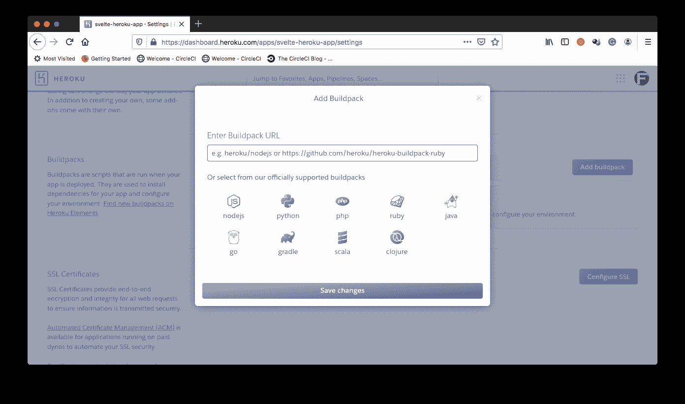
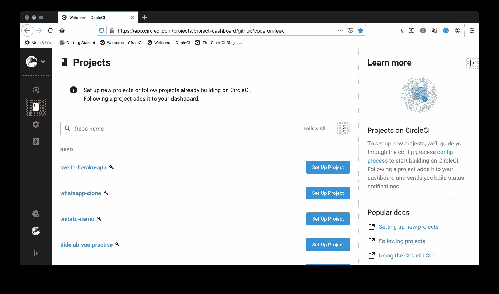
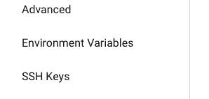
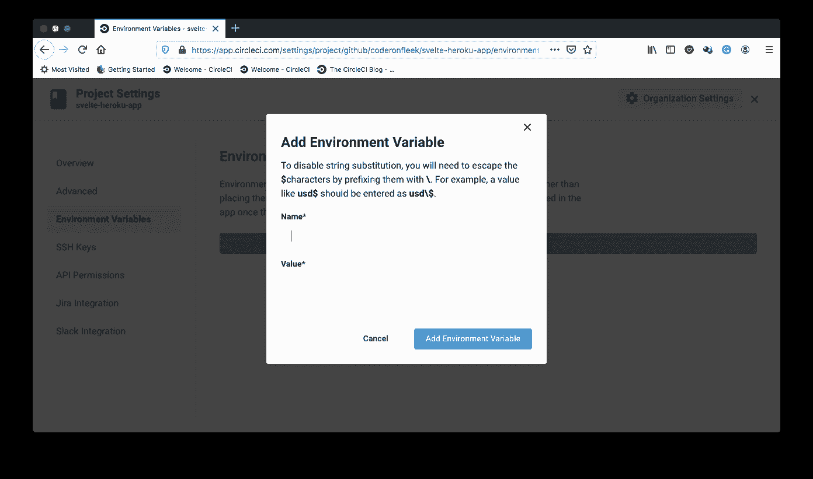
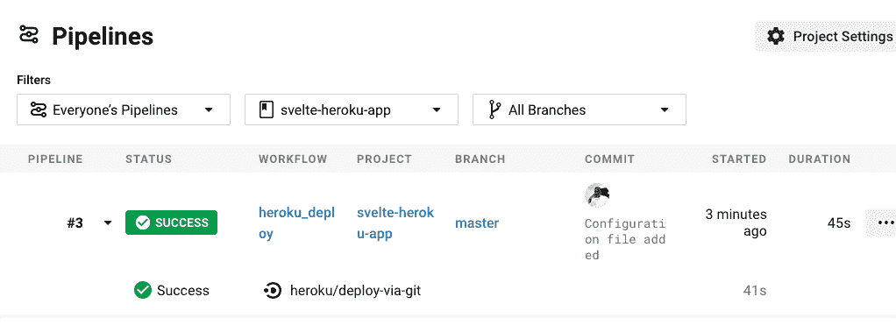
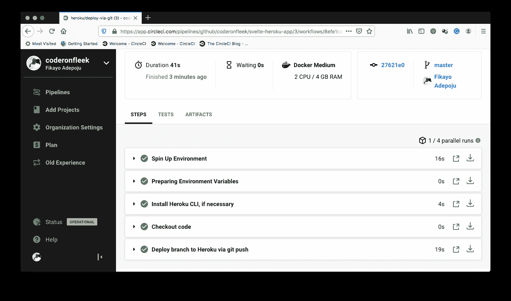
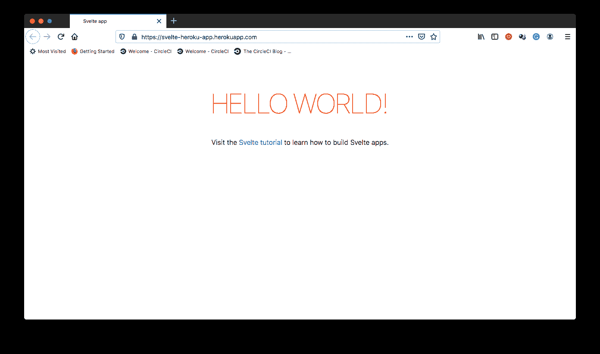

# 将一个苗条的应用程序自动部署到 Heroku | CircleCI

> 原文：<https://circleci.com/blog/deploy-svelte-to-heroku/#2020-07-23T14:00:00-07:00>

随着 [React](https://reactjs.org/) 、 [Vue](https://vuejs.org/) 和 [Angular](https://angular.io/) 成为 Javascript 前端框架的中心，许多人认为我们已经达到了 Javascript 框架的平衡。然后是[svelet](https://svelte.dev/)通过解决其他前端框架解决的相同问题，以一种独特的方式，再次扰乱了框架空间。与其他框架不同，Svelte 不使用虚拟 DOM 在浏览器中更新 DOM。相反，它在构建步骤中编译高效的 Javascript 代码，在状态发生变化时高效地更新您的 DOM。在本教程中，我们将创建一个自动连续部署(CD)管道，将我们的苗条应用程序部署到 [Heroku](https://heroku.com/) 。

## 先决条件

要完成本教程，需要做一些事情:

1.  Javascript 的基础知识
2.  系统上安装的 [Node.js](https://nodejs.org)
3.  英雄的叙述
4.  一个[圆](https://circleci.com/signup/)的账户
5.  GitHub 的一个账户

所有这些安装和设置，让我们开始教程。

## 创建一个苗条的项目

首先，我们需要创建我们的苗条项目。在系统中选择一个适当的位置，并运行以下命令来创建一个新项目:

```
npx degit sveltejs/template svelte-heroku-app 
```

这个命令的`svelte-heroku-app`部分是我想要保存项目脚手架的文件夹名。你可以使用任何你喜欢的名字。

这个命令将立即开始搭建一个新的苗条项目。一旦搭建过程完成，进入项目的根目录(`cd svelte-heroku-app`)并运行`npm install`来安装所需的包。安装完成后，运行以下命令启动服务器，为开发模式下的应用程序提供服务:

```
npm run dev 
```

这将在`http://localhost:5000/`地址为应用程序提供服务(`5000`是默认端口，除非它在使用中，然后将使用另一个端口代替)。


我们现在有了一个实用的苗条应用程序。

## 设置 Heroku 以部署苗条的应用程序

要设置 Heroku 应用程序，我们需要登录我们的帐户并创建一个新的应用程序。


接下来，我们需要获得我们的应用程序的名称(对于上面创建的应用程序，这将是`svelte-heroku-app`)和我们帐户的 API 密钥。API 密匙可以在 Heroku **账户设置**部分找到。我们稍后将需要这两个值(应用程序名称和 API 密钥)来在 CircleCI 上创建[环境变量](https://circleci.com/docs/env-vars/)，以便部署到 Heroku。

当我们打开 Heroku 帐户时，我们需要做的最后一件事是安装必要的构建包。构建包是在部署应用程序时运行的脚本。本教程需要两个构建包:

1.  `heroku/nodejs`:所有 Node.js 应用程序都需要
2.  Heroku buildpack 静态包。

**注意** : *`heroku/heroku-buildpack-static`是需要的，因为一个苗条的应用程序是通过一个完全由静态文件组成的`public`文件夹提供的，这将帮助我们在 Heroku 平台上提供静态文件。*

进入你的 Heroku 应用程序**设置**页面，向下滚动到**构建包**部分(你可能已经看到已经添加的`heroku/nodejs`构建包)。点击**添加构建包**。



对于每个构建包(`heroku/nodejs`和`heroku/heroku-buildpack-static`)，在文本字段中输入标识符/URL，然后点击**保存更改**。

**注意:** *如果已经添加了`heroku/nodejs` buildpack，只需添加`heroku/heroku-buildpack-static` buildpack 即可。*

在对两个构建包都做了这些之后，您将会在 buildpacks 部分看到这两个包。

现在我们已经完成了 Heroku 上所有需要的设置。

## 在 CircleCI 建立苗条项目

我们的下一个任务是在 CircleCI 建立我们的苗条项目。从[将你的项目推送到 GitHub](https://circleci.com/blog/pushing-a-project-to-github/) 开始。

接下来，转到 CircleCI 仪表板上的**添加项目**页面。



点击**设置项目**开始。


接下来，点击**手动添加**。您会得到提示，要么下载管道的配置文件，要么开始构建。


点击**开始建造**。这个构建将会失败，因为我们还没有设置配置文件。我们稍后再做。

我们需要在 CircleCI 控制台上做的最后一件事是为我们刚刚添加的项目设置环境变量。这将使它能够对我们的 Heroku 应用程序进行身份验证访问，以进行部署。

点击**管道**页面上的**项目设置**(右上角)进入您的项目设置(确保您的项目是当前选择的项目)。


在这个页面上，点击侧面菜单上的**环境变量**。



在**环境变量**页面中，点击**添加环境变量**。



添加以下环境变量:

*   `HEROKU_APP_NAME`:这是您的 Heroku 应用程序的名称(在本例中为`svelte-heroku-app`)
*   您的 Heroku 帐户 API 密钥。

**注** : *如前所述，这可以在你的 Heroku 账户的账户标签下的账户设置下找到。*

添加完成后，您现在已经在 CircleCI 控制台上为部署到 Heroku 做好了一切准备。

## 使用 CircleCI Heroku orb 部署苗条应用程序

CircleCI orbs 是 YAML 配置的可重用包，它将重复的配置压缩成一行代码。它们使开发人员能够在抽象出所有样板文件的情况下轻松使用强大的管道功能。

在本练习中，我们将使用 CircleCI 的 orb for Heroku 来编写一个管道配置，以将我们的苗条站点部署到 Heroku。

但在此之前，我们需要创建一个文件来指导我们的 Heroku Buildpack 静态包如何部署和服务我们的应用程序。在项目的根目录下，创建一个名为`static.json`的新文件，并输入以下代码:

```
{
  "root": "public/",
  "https_only": true
} 
```

这里最重要的配置参数是`root`属性。一个苗条的应用程序是通过一个`public`文件夹提供的。因此，`root`属性用于指向该文件夹，以便主机提供适当的代码。`https_only`旨在确保我们的应用始终通过安全协议提供服务。

现在我们可以编写部署脚本了。在 Svelte 项目的根目录下，创建一个名为`.circleci`的文件夹，并在其中创建一个名为`config.yml`的文件。在`config.yml`文件中，输入以下代码:

```
version: 2.1
orbs:
  heroku: circleci/heroku@0.0.10
workflows:
  heroku_deploy:
    jobs:
      - heroku/deploy-via-git 
```

在上面的配置中，我们引入了 Heroku orb ( `circleci/heroku@0.0.10`),它自动为我们提供了一组强大的 Heroku 任务和命令。其中一项工作是`heroku/deploy-via-git`，它将应用程序直接从 GitHub repo 部署到 Heroku 帐户。这项工作已经负责安装 Heroku CLI、安装项目依赖项、运行构建脚本和部署应用程序。它还获取我们的环境变量，以便顺利部署到我们的 Heroku 应用程序。

现在，是我们一直在等待的时候了:*部署点*。让我们提交对我们的苗条项目所做的所有更改，并推动我们的 repo 来触发部署。



要查看部署的幕后情况，您可以点击`heroku/deploy-via-git`查看构建。



关于我们的 Svelte 应用程序已经成功部署的官方确认，请访问站点`https://[APP_NAME].herokuapp.com`的默认 Heroku 地址。对于这个练习，它将是`https://svelte-heroku-app.herokuapp.com/`。



厉害！

我们现在在 Heroku 上有了一个苗条的应用程序。

## 结论

我们已经能够使用 CircleCI orbs 成功地将一个苗条的应用程序部署到 Heroku，以构建一个自动化的连续部署管道。现在，我们需要做的就是将更新部署到我们的应用程序中，然后推送我们的代码，所有的更改都会自动部署。本练习还演示了 CircleCI orbs 如何简化部署设置。

查看 [CircleCI orbs registry](https://circleci.com/developer/orbs) 中适合您的编程语言和部署选择的 orbs。

编码快乐！

* * *

Fikayo Adepoju 是 LinkedIn Learning(Lynda.com)的作者、全栈开发人员、技术作者和技术内容创建者，精通 Web 和移动技术以及 DevOps，拥有 10 多年开发可扩展分布式应用程序的经验。他为 CircleCI、Twilio、Auth0 和 New Stack 博客撰写了 40 多篇文章，并且在他的个人媒体页面上，他喜欢与尽可能多的从中受益的开发人员分享他的知识。你也可以在 Udemy 上查看他的视频课程。

[阅读 Fikayo Adepoju 的更多帖子](/blog/author/fikayo-adepoju/)