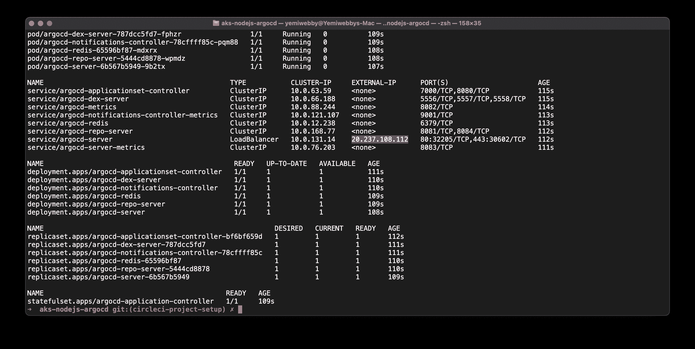
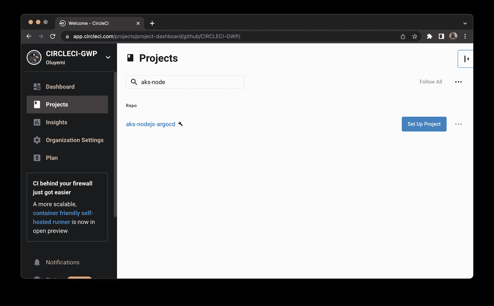
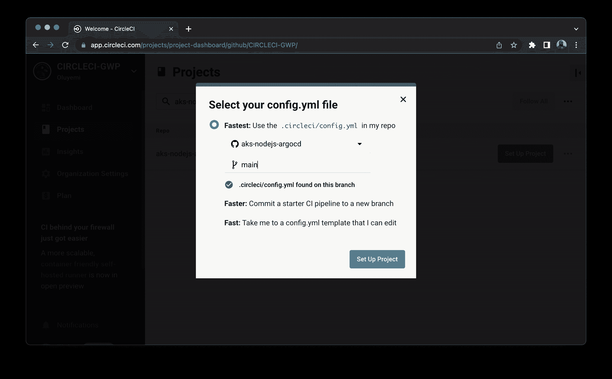
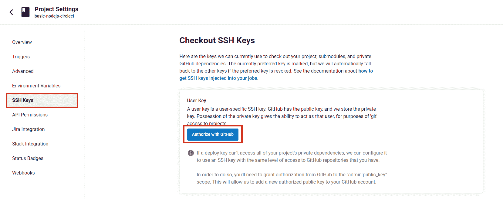
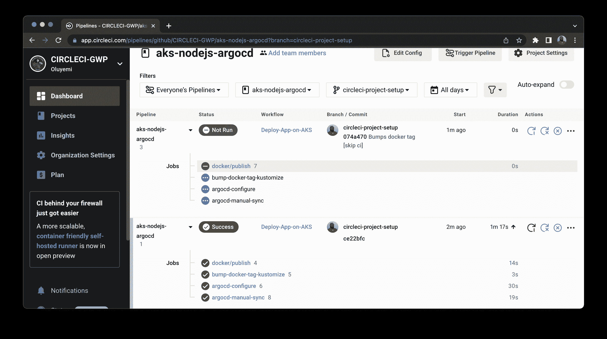
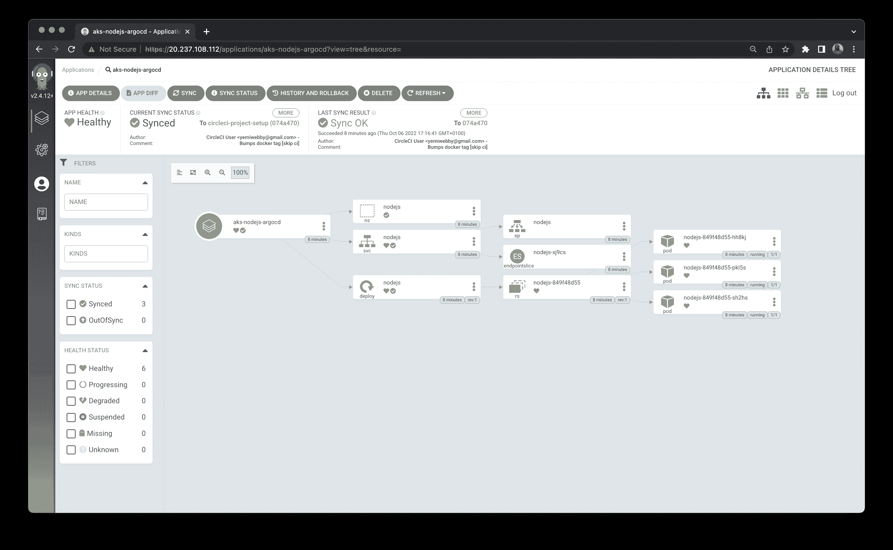
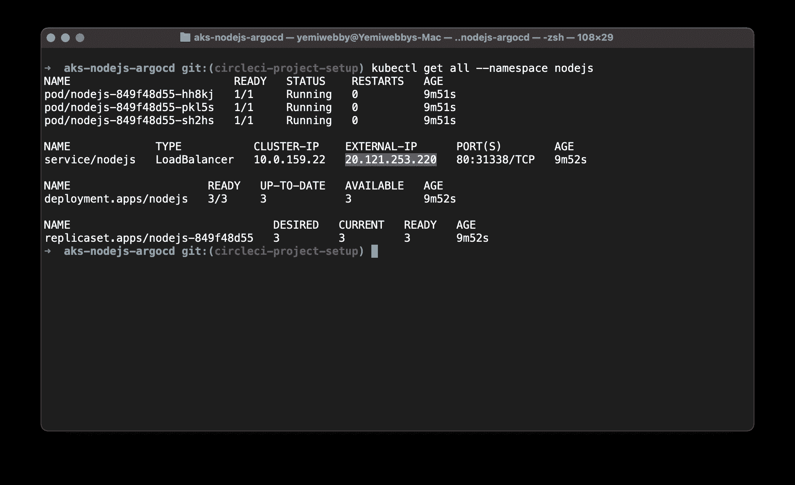
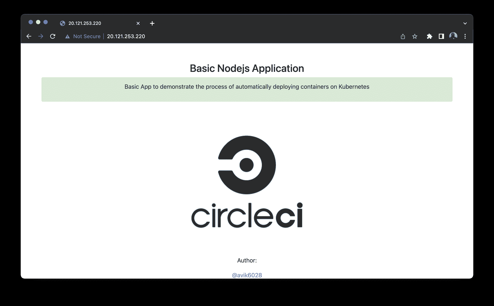

# 使用 CI/CD 在 Kubernetes 上部署 web 应用程序

> 原文：<https://circleci.com/blog/deploy-to-kubernetes-with-argocd/#2022-10-21T09:00:00-07:00>

> 本教程涵盖:
> 
> 1.  在 Azure Kubernetes 服务上部署 Node.js 应用程序
> 2.  使用 orbs(YAML 配置的可重用包)创建持续集成管道
> 3.  自动化 ArgoCD 以将最新的应用程序版本部署到 Kubernetes 集群

GitOps 通过允许开发人员使用单一的事实来源(通常是 Git 存储库)来声明性地管理基础设施和代码，使软件管理和操作现代化。许多开发团队和组织已经采用 GitOps 过程来改进软件应用程序的创建和交付。

要让 GitOps 计划成功，像 Kubernetes 这样的编排系统是至关重要的。开发软件所需的大量不兼容技术使得 Kubernetes 成为管理基础设施的关键工具。没有 Kubernetes，实现基础设施即代码(IaC)的过程是低效的，甚至是不可能的。幸运的是，Kubernetes 的广泛采用使得实现 GitOps 的工具得以创建。

这些工具之一， [ArgoCD](https://argoproj.github.io/cd/) ，是一个 Kubernetes-native 连续部署(CD)工具。它可以通过从 g it 存储库而不是外部 CD 解决方案中提取代码更改来直接将代码更改部署到 Kubernetes 资源中。其中许多解决方案仅支持基于推送的部署。使用 ArgoCD 使开发人员能够从一个统一的平台控制应用程序更新和基础设施设置。它处理 GitOps 过程的后期阶段，确保新的配置被正确地部署到 Kubernetes 集群。

在本教程中，您将学习如何使用 CI/CD 管道和 ArgoCD 在 Azure Kubernetes Service (AKS)上部署 Node.js 应用程序。

## 先决条件

要跟随本教程，您首先需要一些东西。

占:

安装在您系统上的这些工具:

> 我们的教程是平台无关的，但是使用 CircleCI 作为例子。如果你没有 CircleCI 账号，请在 注册一个免费的 [**。**](https://circleci.com/signup/)

完成所有先决条件后，您就可以进入下一部分了。

## 克隆 Node.js 应用程序

在本教程中，主要重点是在 Kubernetes 上部署应用程序。你可以直接[将](https://docs.github.com/en/repositories/creating-and-managing-repositories/cloning-a-repository) [Node.js 应用](https://github.com/CIRCLECI-GWP/aks-nodejs-argocd)克隆到你的 GitHub，并继续剩下的过程。

要克隆项目，请运行:

```
git clone https://github.com/CIRCLECI-GWP/aks-nodejs-argocd.git 
```

该存储库中有两个分支:

*   `main`分支只包含 Node.js 应用程序代码
*   分支包含应用程序代码以及您将创建的所有 YAML 文件

检查到`main`分支。

Node.js 应用程序位于`app.js`文件中，包含:

```
const express = require("express");
const path = require("path");
const morgan = require("morgan");
const bodyParser = require("body-parser");
/* eslint-disable no-console */
const port = process.env.PORT || 1337;
const app = express();
app.use(morgan("dev"));
app.use(bodyParser.json());
app.use(bodyParser.urlencoded({ extended: "true" }));
app.use(bodyParser.json({ type: "application/vnd.api+json" }));
app.use(express.static(path.join(__dirname, "./")));
app.get("*", (req, res) => {
  res.sendFile(path.join(__dirname, "./index.html"));
});
app.listen(port, (err) => {
  if (err) {
    console.log(err);
  } else {
    console.log(`App at: http://localhost:${port}`);
  }
});
module.exports = app; 
```

这段代码的关键是端口号，这是应用程序将要运行的地方，对于本教程来说是`1337`。

通过首先安装依赖项，您可以在本地运行应用程序。在项目的根目录中，键入:

```
npm install 
```

然后使用以下命令运行应用程序:

```
node app.js 
```

应用程序现在应该在地址`http://localhost:1337`启动并运行。

## 容器化 Node.js 应用程序

要部署 Kubernetes 的应用程序，您需要将其容器化。要使用 Docker 作为容器运行时工具来容器化应用程序，您将创建一个 [Dockerfile](https://docs.docker.com/engine/reference/builder/) 。Dockerfile 是一个文本文档，它包含用户可以在命令行上调用的所有命令来组合一个图像。

在项目的根目录下创建一个新文件，命名为`Dockerfile`。复制文件中的以下内容:

```
# Set the base image to use for subsequent instructions
FROM node:alpine
# Set the working directory for any subsequent ADD, COPY, CMD, ENTRYPOINT,
# or RUN instructions that follow it in the Dockerfile
WORKDIR /usr/src/app
# Copy files or folders from source to the dest path in the image's filesystem.
COPY package.json /usr/src/app/
COPY . /usr/src/app/
# Execute any commands on top of the current image as a new layer and commit the results.
RUN npm install --production
# Define the network ports that this container will listen to at runtime.
EXPOSE 1337
# Configure the container to be run as an executable.
ENTRYPOINT ["npm", "start"] 
```

如果您已经安装了 [Docker](https://docs.docker.com/get-docker/) ，那么您可以在本地构建并运行容器进行测试。在本教程的后面，您将学习如何使用 CircleCI orbs 自动完成这个过程。

要构建和标记容器，请输入:

```
docker build -t aks-nodejs-argocd:latest . 
```

通过从终端运行以下命令，确认映像已成功创建:

```
docker images 
```

然后使用以下命令运行容器:

```
docker run -it -p 1337:1337 aks-nodejs-argocd:latest 
```

应用程序现在应该在地址`http://127.0.0.1:1337`启动并运行。

提交并[推送](https://circleci.com/blog/pushing-a-project-to-github/)对 GitHub 库的更改。

## 为部署配置 Kubernetes 清单

要在 Kubernetes 上部署容器，您必须配置 Kubernetes，以包含运行应用程序所需的所有设置。Kubernetes 使用 [YAML](https://yaml.org/) 进行配置。

在项目的根目录下创建一个名为`manifests`的目录。然后在新创建的文件夹中创建这些文件:

*   `namespace.yaml`
*   `deployment.yaml`
*   `service.yaml`
*   `kustomization.yaml`

在 Kubernetes 中，[名称空间](https://kubernetes.io/docs/concepts/overview/working-with-objects/namespaces/)提供了一种在单个集群中隔离资源组的机制。`namespace.yaml`的内容:

```
apiVersion: v1
kind: Namespace
metadata:
  name: nodejs
  labels:
    name: nodejs 
```

这个文件将在 Kubernetes 集群中创建一个名为`nodejs`的名称空间。所有资源都将在这个名称空间中创建。

[Kubernetes 部署](https://kubernetes.io/docs/concepts/workloads/controllers/deployment/)管理集群上运行的无状态服务。他们的目的是保持一组相同的 pod 运行，并以受控的方式升级它们——默认情况下执行滚动更新。`deployment.yaml`的内容:

```
apiVersion: apps/v1
kind: Deployment
metadata:
  name: nodejs
  namespace: nodejs
  labels:
    app: nodejs
spec:
  replicas: 3
  selector:
    matchLabels:
      app: nodejs
  template:
    metadata:
      labels:
        app: nodejs
    spec:
      nodeSelector:
        "beta.kubernetes.io/os": linux
      containers:
        - name: aks-nodejs-argocd
          image: aks-nodejs-argocd
          ports:
            - name: http
              containerPort: 1337 
```

这段代码的关键是`containerPort`。这是应用程序运行的地方，也是在 Kubernetes 集群的名称空间中提取和部署`container-image`的地方。

[Kubernetes 服务](https://kubernetes.io/docs/concepts/services-networking/service/)是一个抽象，它定义了一组逻辑 pod 和访问它们的策略。您需要 Kubernetes 服务类型`LoadBalancer`来使外部世界可以访问部署。
`service.yaml`的内容有:

```
apiVersion: v1
kind: Service
metadata:
  name: nodejs
  namespace: nodejs
  labels:
    app: nodejs
spec:
  type: LoadBalancer
  ports:
    - port: 80
      targetPort: 1337
  selector:
    app: nodejs 
```

这段代码的关键是`targetPort`、`port`和`type`:

*   `targetPort`是集装箱港口
*   `port`是应用程序将要运行的地方
*   `type`是服务的类型

要在 Kubernetes 集群上部署最新版本的应用程序，必须定制资源来维护更新的信息。你可以使用 [Kustomize](https://kustomize.io/) ，这是一个定制 Kubernetes 配置的工具。

`kustomization.yaml`的内容是:

```
apiVersion: kustomize.config.k8s.io/v1beta1
kind: Kustomization
resources:
  - deployment.yaml
  - service.yaml
  - namespace.yaml
namespace: nodejs
images:
  - name: aks-nodejs-argocd
    newName: aks-nodejs-argocd
    newTag: v1 
```

这段代码的关键是`newName`和`newTag`，作为持续集成过程的一部分，它们将使用最新的 Docker 图像信息进行更新。

提交并[推送](https://circleci.com/blog/pushing-a-project-to-github/)这些文件到您之前克隆的 GitHub 库的`main`分支。

## 启动 Azure Kubernetes 服务(AKS)群集

在本教程中，您将在 [AKS](https://azure.microsoft.com/en-us/services/kubernetes-service/#overview) 集群上部署应用程序。要创建 AKS 集群，Azure CLI 应该[连接到您的 Azure 帐户](https://docs.microsoft.com/en-us/cli/azure/authenticate-azure-cli)。

要使用 Azure CLI 启动 AKS 群集，请使用以下命令创建资源组:

```
az group create --name NodeRG --location eastus 
```

启动双节点集群:

```
az aks create --resource-group NodeRG --name NodeCluster --node-count 2 --enable-addons http_application_routing 
```

**注意:** *如果您之前在系统中生成了任何 SSH 密钥，那么您需要在这个命令中添加可选的`--generate-ssh-keys`参数。如果缺少 SSH 公钥和私钥文件，这会自动生成它们。密钥存储在`~/.ssh`目录中。*

AKS 群集将需要 10 到 15 分钟才能启动。

## 在 AKS 集群中安装 ArgoCD

一旦集群启动并运行，您就可以在集群内部安装 ArgoCD。您将使用 ArgoCD 部署您的应用程序。

要安装该应用程序，请使用 Azure CLI。使用以下命令配置`kubectl`连接到 AKS:

```
az aks get-credentials --resource-group NodeRG --name NodeCluster 
```

要安装 ArgoCD，请使用以下命令:

```
kubectl create namespace argocd
kubectl apply -n argocd -f https://raw.githubusercontent.com/argoproj/argo-cd/stable/manifests/install.yaml 
```

ArgoCD 将安装在`argocd`名称空间中。要获取命名空间中的所有资源，请输入:

```
kubectl get all --namespace argocd 
```

### 公开 ArgoCD API 服务器

默认情况下，ArgoCD API 服务器不会向外部 IP 公开。因为在本教程中您将从 internet 访问应用程序，所以您需要通过服务类型负载平衡器向 ArgoCD 服务器提供外部 IP。

将 argocd-server 服务类型更改为 LoadBalancer:

```
kubectl patch svc argocd-server -n argocd -p '{"spec": {"type": "LoadBalancer"}}' 
```

**注意:** *你也可以使用 Kubectl 端口转发来连接 API 服务器而不暴露服务。使用此命令:`kubectl port-forward svc/argocd-server -n argocd 8080:443`*

您现在可以使用`https://localhost:8080`访问 API 服务器。

## 访问 ArgoCD 门户网站

一旦您使用外部 IP 公开了 ArgoCD API 服务器，您现在就可以使用您生成的外部 IP 地址访问门户了。

ArgoCD 安装在`argocd`名称空间中。使用此命令获取命名空间中的所有资源:

```
kubectl get all --namespace argocd 
```

复制`service/argocd-server`对应的`External-IP`。



您可以在`http://<EXTERNAL-IP>`访问应用程序。
对我来说，那是`http://20.237.108.112/`


要登录门户，您需要用户名和密码。用户名默认设置为`admin`。

要获取密码，请执行以下命令:

```
kubectl -n argocd get secret argocd-initial-admin-secret -o jsonpath="{.data.password}" | base64 -d; echo 
```

使用此用户名/密码组合登录 ArgoCD 门户。

## 为 ArgoCD 配置 Kubernetes 清单

要配置 ArgoCD 在 Kubernetes 上部署您的应用程序，您必须设置 ArgoCD，使用 [YAML](https://yaml.org/) 进行配置，以声明的方式连接 Git 存储库和 Kubernetes。

除此之外，您还可以从 Web 门户或使用 ArgoCD CLI 设置 ArgoCD。因为本教程遵循 GitOps 原则，所以我们使用 Git 库作为唯一的事实来源。因此，使用 YAML 文件的声明性方法效果最好。

ArgoCD 的关键特性和功能之一是通过手动或自动策略将应用程序部署到 Kubernetes 集群。

首先，在项目的根目录下创建一个名为`argocd`的目录。在新目录下创建一个新文件，并将其命名为`config.yaml`。

### 手动同步策略

使用此策略通过 CI/CD 管道手动同步应用程序。每当进行代码更改时，就会触发 CI/CD 管道，并调用 ArgoCD 服务器 API 来根据您将提交的更改启动同步过程。要与 ArgoCD 服务器 API 通信，您可以使用 ArgoCD CLI。您也可以使用适用于各种编程语言的 SDK 之一。

为 ArgoCD 设置手动同步策略，将其粘贴到`config.yaml`:

```
apiVersion: argoproj.io/v1alpha1
kind: Application
metadata:
  name: aks-nodejs-argocd
  namespace: argocd
spec:
  destination:
    namespace: nodejs
    server: "https://kubernetes.default.svc"
  source:
    path: manifests
    repoURL: "https://github.com/Lucifergene/aks-nodejs-argocd"
    targetRevision: circleci-project-setup
  project: default 
```

### 自动同步策略

ArgoCD 能够在检测到 Git 中所需清单与集群中实时状态之间的差异时，自动同步应用程序。

自动同步的一个好处是 CI/CD 管道不再需要直接访问 ArgoCD API 服务器来执行部署。取而代之的是，管道使用跟踪 Git repo 中的清单更改来提交和推送 Git 存储库。

如果要设置为自动同步策略，需要将其粘贴到`config.yaml`中

```
apiVersion: argoproj.io/v1alpha1
kind: Application
metadata:
  name: aks-nodejs-argocd
  namespace: argocd
spec:
  destination:
    namespace: nodejs
    server: "https://kubernetes.default.svc"
  source:
    path: manifests
    repoURL: "https://github.com/Lucifergene/aks-nodejs-argocd"
    targetRevision: circleci-project-setup
  project: default
  syncPolicy:
    automated:
      prune: false
      selfHeal: false 
```

提交并[将这些文件](https://circleci.com/blog/pushing-a-project-to-github/)到您之前克隆的 GitHub 库的`main`分支中。

## 创建持续集成管道

本教程的目的是展示如何通过 CircleCI 的[持续集成](https://circleci.com/continuous-integration/) (CI)和 ArgoCD 的[持续部署](https://circleci.com/blog/a-brief-history-of-devops-part-iv-continuous-delivery-and-continuous-deployment/) (CD)在 Kubernetes 上部署应用程序。CI 管道应该触发构建容器的过程，将其推送到 Docker Hub，CD 应该在 Kubernetes 上部署应用程序。

要创建 CI 管道，您将使用与您的 GitHub 帐户集成的 CircleCI。CircleCI 配置名为`config.yml`，位于项目根文件夹的`.circleci`目录中。配置的路径是`.circleci/config.yml`。

`config.yml`的内容是:

```
version: 2.1

orbs:
  docker: circleci/docker@2.1.1
  azure-aks: circleci/azure-aks@0.3.0
  kubernetes: circleci/kubernetes@1.3.0

jobs:
  argocd-manual-sync:
    docker:
      - image: cimg/base:stable
    parameters:
      server:
        description: |
          Server IP of of ArgoCD
        type: string
      username:
        description: |
          Username for ArgoCD
        type: string
      password:
        description: |
          Password for ArgoCD
        type: string
    steps:
      - run:
          name: Install ArgoCD CLI
          command: |
            URL=https://<< parameters.server >>/download/argocd-linux-amd64
            [ -w /usr/local/bin ] && SUDO="" || SUDO=sudo
            $SUDO curl --insecure -sSL -o /usr/local/bin/argocd $URL
            $SUDO chmod +x /usr/local/bin/argocd
      - run:
          name: ArgoCD CLI login
          command: argocd login << parameters.server >> --insecure --username << parameters.username >> --password << parameters.password >>
      - run:
          name: Manual sync
          command: argocd app sync $APP_NAME
      - run:
          name: Wait for application to reach a synced and healthy state
          command: argocd app wait $APP_NAME

  argocd-configure:
    executor: azure-aks/default
    parameters:
      cluster-name:
        description: |
          Name of the AKS cluster
        type: string
      resource-group:
        description: |
          Resource group that the cluster is in
        type: string
    steps:
      - checkout
      - run:
          name: Pull Updated code from repo
          command: git pull origin $CIRCLE_BRANCH
      - azure-aks/update-kubeconfig-with-credentials:
          cluster-name: << parameters.cluster-name >>
          install-kubectl: true
          perform-login: true
          resource-group: << parameters.resource-group >>
      - kubernetes/create-or-update-resource:
          resource-file-path: argocd/config.yaml

  bump-docker-tag-kustomize:
    docker:
      - image: cimg/base:stable
    steps:
      - run:
          name: Install kustomize
          command: |
            URL=https://github.com/kubernetes-sigs/kustomize/releases/download/kustomize/v4.5.2/kustomize_v4.5.2_linux_amd64.tar.gz
            curl -L $URL | tar zx
            [ -w /usr/local/bin ] && SUDO="" || SUDO=sudo
            $SUDO chmod +x ./kustomize
            $SUDO mv ./kustomize /usr/local/bin
      - checkout
      - run:
          name: Bump Docker Tag
          command: |
            cd manifests
            kustomize edit set image $APP_NAME=$DOCKER_LOGIN/$APP_NAME:$CIRCLE_SHA1
      - add_ssh_keys:
          fingerprints:
            - "$SSH_FINGERPRINT"
      - run:
          name: Commit & Push to GitHub
          command: |
            git config user.email "$GITHUB_EMAIL"
            git config user.name "CircleCI User"
            git checkout $CIRCLE_BRANCH           
            git add manifests/kustomization.yaml
            git commit -am "Bumps docker tag [skip ci]"
            git push origin $CIRCLE_BRANCH

workflows:
  Deploy-App-on-AKS:
    jobs:
      - docker/publish:
          image: $DOCKER_LOGIN/$APP_NAME
          tag: $CIRCLE_SHA1,latest
      - bump-docker-tag-kustomize:
          requires:
            - docker/publish
      - argocd-configure:
          cluster-name: $CLUSTER_NAME
          resource-group: $RESOURCE_GROUP
          requires:
            - bump-docker-tag-kustomize
      # Paste the following only when you opt for the ArgoCD manual-sync-policy:
      - argocd-manual-sync:
          server: $ARGOCD_SERVER
          username: $ARGOCD_USERNAME
          password: $ARGOCD_PASSWORD
          requires:
            - argocd-configure 
```

CI 工作流由三个作业组成:

*   `docker/publish`构建容器并将其推送到 Docker Hub。
*   `bump-docker-tag-kustomize`更新 Docker 图像标签并生成一个合并的 Kubernetes 配置文件。
*   `argocd-configure`在 AKS 集群上应用 ArgoCD 配置。
*   `argocd-manual-sync`仅当您选择手动同步策略时才需要。对于自动同步，您可以从文件中忽略该作业。

在这个工作流程中，我们广泛使用了 [CircleCI orbs](https://circleci.com/orbs/) 。orb 是可参数化、可重用的配置元素的开源、可共享包，包括作业、命令和执行器。orb 已被直接使用或用于创建自定义作业。

提交并[推送](https://circleci.com/blog/pushing-a-project-to-github/)对 GitHub 库的更改。

## 在 CircleCI 建立项目

将应用程序部署到 AKS 的下一步是将 GitHub 存储库中的应用程序连接到 CircleCI。

进入你的 [CircleCI 仪表盘](https://app.circleci.com/)，选择左边面板的项目选项卡。点击包含代码(`aks-nodejs-argocd`)的 GitHub 库的**设置项目**按钮。



当提示选择您的 config.yml 文件时，单击**最快**选项并键入`main`作为分支名称。CircleCI 会自动定位`config.yml`文件。点击**设置项目**。



工作流将运行，但很快会显示一个`Failed`的`status`。这是因为您需要设置一个用户密钥并配置环境变量。

要设置用户密钥，请转到项目设置，然后在左侧面板中单击 **SSH 密钥**。在用户密钥部分，点击**用 GitHub** 授权。CircleCI 需要用户密钥，以便在工作流执行期间代表存储库所有者将更改推送到您的 GitHub 帐户。



要配置环境变量，点击**环境变量**。选择**添加环境变量**选项。在下一个屏幕上，键入环境变量和您想要分配给它的值。


文件中使用的环境变量有:

*   `APP_NAME`:容器镜像名(aks-nodejs-argocd)
*   `ARGOCD_PASSWORD` : ArgoCD 门户密码
*   `ARGOCD_SERVER` : ArgoCD 服务器 IP 地址
*   `ARGOCD_USERNAME` : ArgoCD 门户用户名(管理员)
*   `AZURE_PASSWORD` : Azure 账号密码
*   `AZURE_USERNAME` : Azure 账号用户名
*   `CLUSTER_NAME` : AKS 集群名(NodeCluster)
*   `DOCKER_LOGIN`:坞站枢纽用户名
*   `DOCKER_PASSWORD`:坞站集线器密码
*   `GITHUB_EMAIL` : GitHub 账号邮箱
*   `RESOURCE_GROUP` : AKS 资源组(NodeRG)
*   `SSH_FINGERPRINT`:用于将更新的 Docker 标签推送到 GitHub 的用户密钥的 SSH 指纹

要定位 **SSH 指纹**，进入**项目设置**，从侧边栏选择 **SSH 密钥**。向下滚动到**用户密钥**部分并复制密钥。

重新运行工作流。这次`status`会显示`Success`。



您还会发现另一个将`status`作为`Not Run`的管道。这是因为您已经通过在提交消息中包含`[skip ci]`明确指示 CircleCI 跳过管道。当 CircleCI 向 GitHub 提交更新后的配置文件时，`[skip ci]`防止了工作流的自触发循环。

## 在 ArgoCD 仪表板上监控应用程序

当工作流重新运行时，显示`Success`的`status`表示应用程序已经部署在 AKS 集群上。

要观察和监视当前在 AKS 集群上运行的资源，请登录 ArgoCD 门户网站。

在本教程的前面部分，您学习了如何获取 ArgoCD 服务器 IP、用户名和密码以登录门户。登录后，您将进入应用程序页面。


单击应用程序名称。您将被重定向到一个页面，该页面包含 AKS 集群上运行的所有资源及其实时状态的树视图。



## 在 AKS 上访问应用程序

要访问该应用程序，您需要群集的外部 IP 地址。您可以使用 Azure CLI 来查找`External-IP`。

使用以下命令配置`kubectl`连接到 AKS:

```
az aks get-credentials --resource-group NodeRG --name NodeCluster 
```

您在`nodejs`名称空间中创建了所有的资源。要获取该命名空间中的所有资源，请使用以下命令:

```
kubectl get all --namespace nodejs 
```

复制`service/nodejs`对应的`External-IP`。



您可以在`http://<EXTERNAL-IP>`访问应用程序。我的情况，那就是`http://20.121.253.220/`。



## 结论

在本教程中，您学习了如何在 Kubernetes 集群上使用 ArgoCD 按照 GitOps 实践连续部署您的应用程序。这包括配置自动化 CI 渠道。正确配置管道后，对应用程序代码的任何更改都会在应用程序 URL 上立即更新。告别在 Kubernetes 上手动配置和部署应用。

另外，您可以更改环境变量的值，以便为类似的应用程序使用 CircleCI 配置文件。

本教程的完整源代码也可以在 GitHub 上找到[。](https://github.com/CIRCLECI-GWP/aks-nodejs-argocd)

* * *

Avik Kundu 是 Red Hat 的一名软件工程师。他是全栈开发人员、开源贡献者和精通 DevOps 和云的技术内容创建者。他是 AWS 社区构建者和 Microsoft Learn 学生大使。他写过关于媒体、开发和 Opensource.com 的各种工具和技术的文章和教程。他喜欢学习新技术，并在公共场合分享他的知识。

[阅读更多 Avik Kundu 的帖子](/blog/author/avik-kundu/)