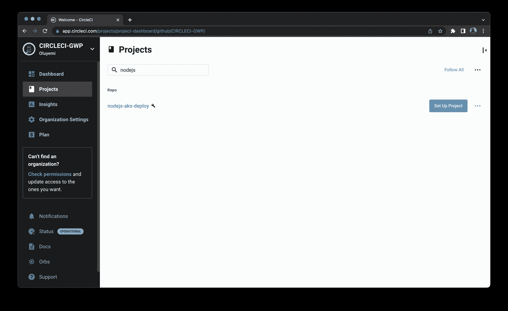
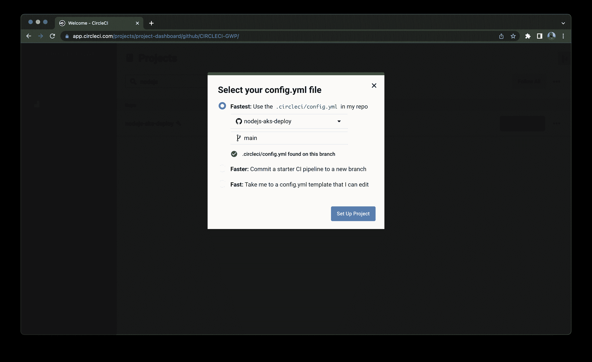
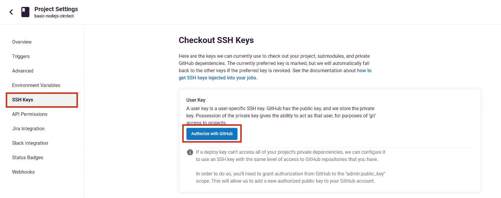
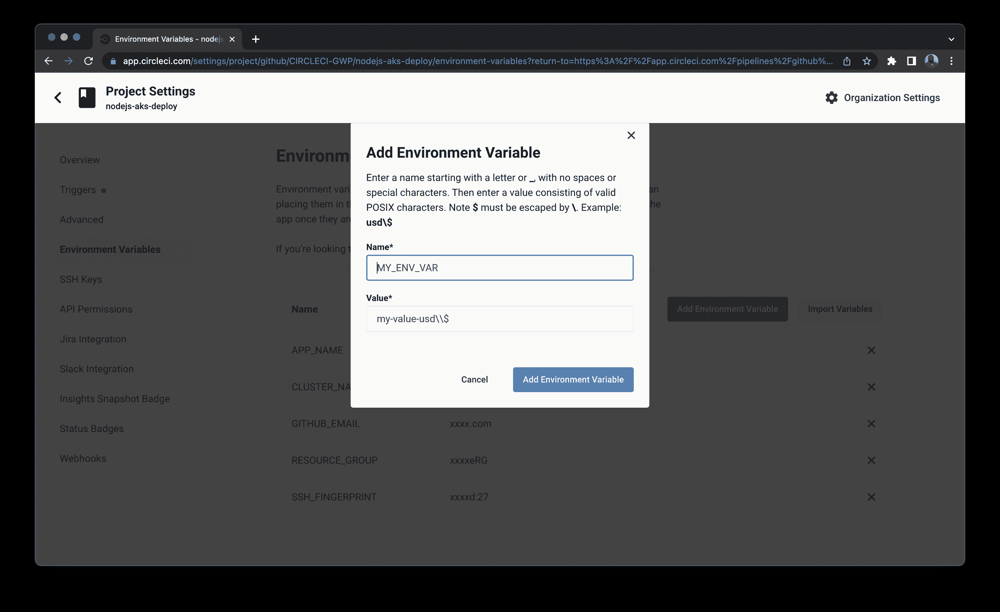
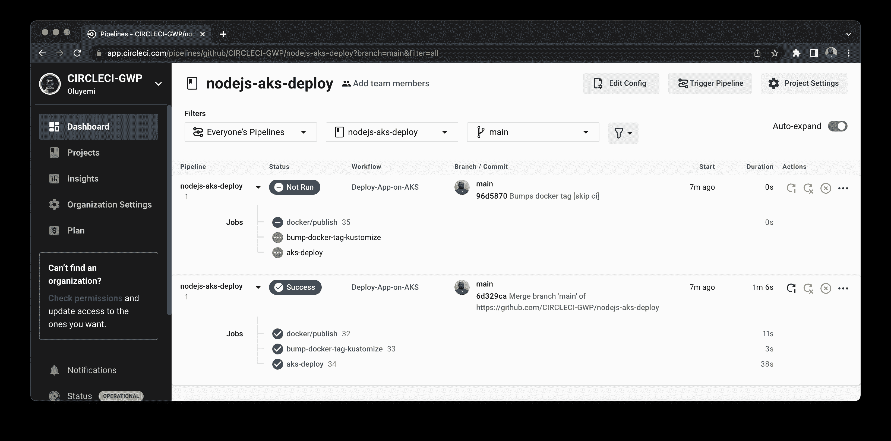
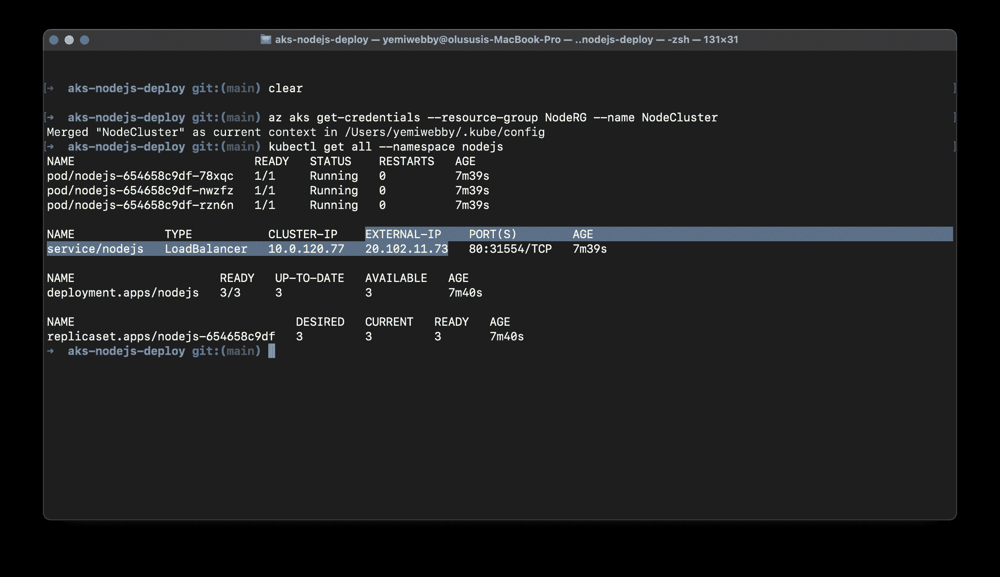
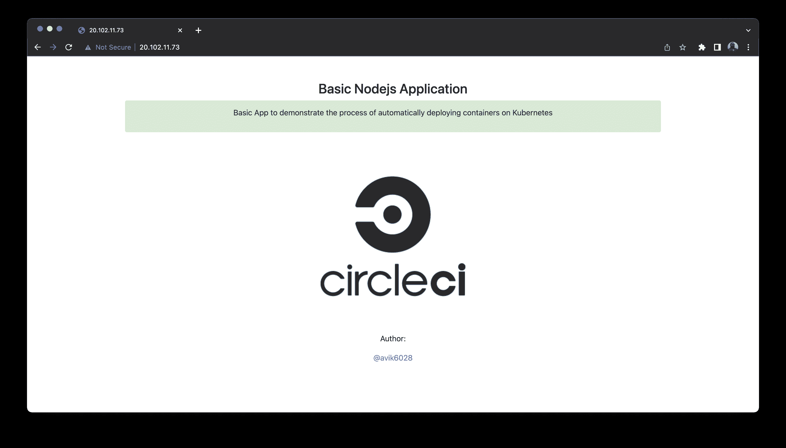

# 通过持续集成在 Kubernetes 上部署 web 应用程序| CircleCI

> 原文：<https://circleci.com/blog/deploy-web-apps-on-kubernetes-with-ci/#2022-07-29T09:00:00-07:00>

> 本教程涵盖:
> 
> 1.  使用 circleci orbs 创建持续集成管道
> 2.  将代码推送到 repo 后触发管道
> 3.  在 Azure Kubernetes 服务上部署 Node.js 应用程序

容器和微服务彻底改变了应用程序在云上的部署方式。自 2014 年推出以来， [Kubernetes](https://kubernetes.io/) 已经成为容器编排工具的事实标准。

在本教程中，您将学习如何使用[持续集成和持续部署(CI/CD)](https://circleci.com/continuous-integration/) 在 [Azure Kubernetes 服务](https://azure.microsoft.com/en-us/services/kubernetes-service/#overview) (AKS)上部署 [Node.js](https://nodejs.org/) 应用程序。您将使用 [CircleCI orbs](https://circleci.com/orbs/) 创建一个 CI/CD 管道，它们是 [YAML](https://circleci.com/blog/what-is-yaml-a-beginner-s-guide/) 配置的可重用包，将重复的配置片段压缩到一行代码中。在您推送 [GitHub](https://github.com/) 资源库中的代码后，您的管道将被自动触发。使用这种自动化，您将始终拥有在 Kubernetes 集群上运行的最新版本的应用程序。

## 先决条件

要跟随本教程，您首先需要一些东西:

完成所有先决条件后，您可以进入下一部分。

## 克隆 Node.js 应用程序

在本教程中，您主要关注的是在 Kubernetes 上部署应用程序。因此，您可以直接[将](https://docs.github.com/en/repositories/creating-and-managing-repositories/cloning-a-repository) [Node.js 应用程序](https://github.com/Lucifergene/aks-nodejs-deploy)克隆到您的 GitHub，并继续剩余的过程。

要克隆项目，请运行:

```
git clone https://github.com/CIRCLECI-GWP/nodejs-aks-deploy.git 
```

这个存储库包含 Node.js 应用程序代码以及我们将在本教程中创建的所有 YAML 文件。

Node.js 应用程序位于`app.js`文件中。

```
const express = require("express");
const path = require("path");
const morgan = require("morgan");
const bodyParser = require("body-parser");

/* eslint-disable no-console */

const port = process.env.PORT || 1337;
const app = express();

app.use(morgan("dev"));
app.use(bodyParser.json());
app.use(bodyParser.urlencoded({ extended: "true" }));
app.use(bodyParser.json({ type: "application/vnd.api+json" }));

app.use(express.static(path.join(__dirname, "./")));

app.get("*", (req, res) => {
  res.sendFile(path.join(__dirname, "./index.html"));
});

app.listen(port, (err) => {
  if (err) {
    console.log(err);
  } else {
    console.log(`App at: http://localhost:${port}`);
  }
});
module.exports = app; 
```

这段代码的关键是应用程序将要运行的**端口号**，也就是`1337`。

通过首先安装依赖项，您可以在本地运行应用程序。在项目的根目录中，键入:

```
npm install 
```

然后使用以下命令运行应用程序:

```
node app.js 
```

应用程序现在应该在地址`http://localhost:1337`启动并运行。

现在，在你的 GitHub 帐户上为这个项目创建一个新的存储库，并将项目推送到你刚刚创建的存储库中。

## 容器化 Node.js 应用程序

要将应用程序部署到 Kubernetes，您必须首先[容器化](https://circleci.com/blog/benefits-of-containerization/)它。使用 Docker 作为容器运行时工具，创建一个[Docker 文件](https://docs.docker.com/engine/reference/builder/)。Dockerfile 是一个文本文档，它包含用户可以在命令行上调用的所有命令来组合一个图像。

在项目的根目录下创建一个新文件，命名为`Dockerfile`。复制文件中的以下内容:

```
# Set the base image to use for subsequent instructions
FROM node:alpine

# Set the working directory for any subsequent ADD, COPY, CMD, ENTRYPOINT,
# or RUN instructions that follow it in the Dockerfile
WORKDIR /usr/src/app

# Copy files or folders from source to the dest path in the image's filesystem.
COPY package.json /usr/src/app/
COPY . /usr/src/app/

# Execute any commands on top of the current image as a new layer and commit the results.
RUN npm install --production

# Define the network ports that this container will listen to at runtime.
EXPOSE 1337

# Configure the container to be run as an executable.
ENTRYPOINT ["npm", "start"] 
```

如果您已经安装了 [Docker](https://docs.docker.com/get-docker/) ，那么您可以在本地构建并运行容器进行测试。

在本教程的后面，您将学习如何使用 CircleCI orbs 来自动化这个过程。

要构建和标记容器，您可以键入:

```
docker build -t nodejs-aks-app:latest . 
```

通过从终端运行以下命令，确认映像已成功创建:

```
docker images 
```

然后使用以下命令运行容器:

```
docker run -it -p 1337:1337 nodejs-aks-app:latest 
```

应用程序现在应该在地址`http://127.0.0.1:1337`启动并运行。

提交并[推送](https://circleci.com/blog/pushing-a-project-to-github/)对 GitHub 库的更改。

## 为部署配置 Kubernetes 清单

要在 Kubernetes 上部署容器，您需要配置 Kubernetes，以包含运行应用程序所需的所有设置。Kubernetes 使用 [YAML](https://yaml.org/) 进行配置。

在项目的根目录下创建一个名为`manifests`的目录。

然后，在新创建的文件夹中创建以下文件:

*   `namespace.yaml`
*   `deployment.yaml`
*   `service.yaml`
*   `kustomization.yaml`

在 Kubernetes 中，[名称空间](https://kubernetes.io/docs/concepts/overview/working-with-objects/namespaces/)提供了一种在单个集群中隔离资源组的机制。
`namespace.yaml`文件的内容如下:

```
apiVersion: v1
kind: Namespace
metadata:
  name: nodejs
  labels:
    name: nodejs 
```

这个文件将在 Kubernetes 集群中创建一个名为`nodejs`的名称空间。所有资源都将在这个名称空间中创建。

[Kubernetes 部署](https://kubernetes.io/docs/concepts/workloads/controllers/deployment/)管理集群上运行的无状态服务。他们的目的是保持一组相同的 pod 运行，并以受控的方式升级它们——默认情况下执行滚动更新。`deployment.yaml`的内容如下:

```
apiVersion: apps/v1
kind: Deployment
metadata:
  name: nodejs
  namespace: nodejs
  labels:
    app: nodejs
spec:
  replicas: 3
  selector:
    matchLabels:
      app: nodejs
  template:
    metadata:
      labels:
        app: nodejs
    spec:
      nodeSelector:
        "beta.kubernetes.io/os": linux
      containers:
        - name: nodejs-aks-app
          image: nodejs-aks-app
          ports:
            - name: http
              containerPort: 1337 
```

以下是这段代码的要点:

*   `containerPort`是应用程序将要运行的端口。
*   容器`image`是 Docker 映像，它将被拉入并部署到 Kubernetes 集群上的上述名称空间中。

[Kubernetes 服务](https://kubernetes.io/docs/concepts/services-networking/service/)是一个抽象概念，它定义了一组逻辑 pod 和访问它们的策略。您需要一个类型为`LoadBalancer`的 Kubernetes 服务，以使外部世界可以访问部署。`service.yaml`的内容如下:

```
apiVersion: v1
kind: Service
metadata:
  name: nodejs
  namespace: nodejs
  labels:
    app: nodejs
spec:
  type: LoadBalancer
  ports:
    - port: 80
      targetPort: 1337
  selector:
    app: nodejs 
```

以下是这段代码的要点:

*   `targetPort`是集装箱港口。
*   `port`是应用程序将要运行的地方。
*   `type`是服务的类型(本例中为`LoadBalancer`)。

要在 Kubernetes 集群上部署最新版本的应用程序，必须定制资源来维护更新的信息。这由定制 Kubernetes 配置的工具 [Kustomize](https://kustomize.io/) 管理。`kustomization.yaml`的内容如下:

```
apiVersion: kustomize.config.k8s.io/v1beta1
kind: Kustomization
resources:
  - deployment.yaml
  - service.yaml
  - namespace.yaml
namespace: nodejs
images:
  - name: nodejs-aks-app
    newName: nodejs-aks-app
    newTag: v1 
```

这里的要点是，在持续集成过程中，`newName`和`newTag`将自动更新最新的 Docker 映像信息。

将这些文件提交并推送到您之前克隆的 GitHub 存储库中。

## 启动 Azure Kubernetes 服务(AKS)群集

现在，您已经准备好在 [AKS](https://azure.microsoft.com/en-us/services/kubernetes-service/#overview) 集群上部署应用程序了。要创建 AKS 群集，您需要在计算机上安装 Microsoft Azure 帐户和 Azure CLI。[CLI 应该连接到你的 Azure 账户](https://docs.microsoft.com/en-us/cli/azure/authenticate-azure-cli)。

完成后，您可以在 Azure CLI 的帮助下启动 AKS 集群。

使用以下命令创建资源组:

```
az group create --name NodeRG --location eastus 
```

使用以下命令启动双节点集群:

```
az aks create --resource-group NodeRG --name NodeCluster --node-count 2 --enable-addons http_application_routing 
```

**注意:** *如果您之前在系统中生成了任何 SSH 密钥，那么您需要在上面的命令中添加一个可选参数`--generate-ssh-keys`。如果缺少 SSH 公钥和私钥文件，这将自动生成它们。密钥将存储在`~/.ssh`目录中。*

AKS 群集将需要 10-15 分钟才能启动。

## 创建持续集成管道

本教程的目的是展示如何通过 [CI/CD 管道](https://circleci.com/blog/what-is-a-ci-cd-pipeline/)在 Kubernetes 上部署应用程序。管道应该触发构建容器的过程，将其推送到 Dockerhub 并部署到集群上。

要创建 CI/CD 管道，您将使用与您的 GitHub 帐户集成的 CircleCI。CircleCI 配置文件(`config.yml`)位于项目根文件夹的`.circleci`目录中。配置的路径是`.circleci/config.yml`。

以下是`config.yml`的内容:

```
version: 2.1

orbs:
  docker: circleci/docker@2.1.1
  azure-aks: circleci/azure-aks@0.3.0
  kubernetes: circleci/kubernetes@1.3.0

jobs:
  aks-deploy:
    executor: azure-aks/default
    parameters:
      cluster-name:
        description: |
          Name of the AKS cluster
        type: string
      resource-group:
        description: |
          Resource group that the cluster is in
        type: string
    steps:
      - checkout
      - run:
          name: Pull Updated code from repo
          command: git pull origin $CIRCLE_BRANCH
      - azure-aks/update-kubeconfig-with-credentials:
          cluster-name: << parameters.cluster-name >>
          install-kubectl: true
          perform-login: true
          resource-group: << parameters.resource-group >>
      - kubernetes/create-or-update-resource:
          resource-file-path: manifests/$APP_NAME.yaml
          resource-name: kustomization/$APP_NAME

  bump-docker-tag-kustomize:
    docker:
      - image: cimg/base:stable
    steps:
      - run:
          name: Install kustomize
          command: |
            URL=https://github.com/kubernetes-sigs/kustomize/releases/download/kustomize/v4.5.2/kustomize_v4.5.2_linux_amd64.tar.gz
            curl -L $URL | tar zx
            [ -w /usr/local/bin ] && SUDO="" || SUDO=sudo
            $SUDO chmod +x ./kustomize
            $SUDO mv ./kustomize /usr/local/bin
      - checkout
      - run:
          name: Bump Docker Tag
          command: |
            cd manifests
            kustomize edit set image $APP_NAME=$DOCKER_LOGIN/$APP_NAME:$CIRCLE_SHA1
            kustomize build . > $APP_NAME.yaml
      - add_ssh_keys:
          fingerprints:
            - "$SSH_FINGERPRINT"
      - run:
          name: Commit & Push to GitHub
          command: |
            git config user.email "$GITHUB_EMAIL"
            git config user.name "CircleCI User"
            git checkout $CIRCLE_BRANCH           
            git add manifests/$APP_NAME.yaml
            git add manifests/kustomization.yaml
            git commit -am "Bumps docker tag [skip ci]"
            git push origin $CIRCLE_BRANCH

workflows:
  Deploy-App-on-AKS:
    jobs:
      - docker/publish:
          image: $DOCKER_LOGIN/$APP_NAME
          tag: $CIRCLE_SHA1,latest
      - bump-docker-tag-kustomize:
          requires:
            - docker/publish
      - aks-deploy:
          cluster-name: $CLUSTER_NAME
          resource-group: $RESOURCE_GROUP
          requires:
            - bump-docker-tag-kustomize 
```

CI 工作流由三个作业组成:

*   `docker/publish`构建容器并将其推送到 Docker Hub。
*   `bump-docker-tag-kustomize`更新 Docker 图像标签并生成一个合并的 Kubernetes 配置文件。
*   `aks-deploy`在 AKS 集群上应用配置文件。

这个工作流程大量使用了 [CircleCI orbs](https://circleci.com/orbs/) ，它们是开源的、可共享的可参数化可重用配置元素包，包括作业、命令和执行器。orb 可以直接使用，也可以用来创建定制作业。

提交并将更改推送到您的 GitHub 存储库。

## 在 CircleCI 建立项目

将应用程序部署到 AKS 的下一步是将 GitHub 存储库中的应用程序连接到 CircleCI。

进入你的 [CircleCI 仪表盘](https://app.circleci.com/)，选择左边面板的项目选项卡。点击包含代码的 GitHub 库对应的**设置项目**按钮。在本教程中，回购被命名为`nodejs-aks-deploy`。



当系统提示您选择 config.yml 文件时，选择**最快**选项并键入`main`作为分支名称。CircleCI 会自动定位`config.yml`文件。点击**设置项目**。



工作流将开始运行，但很快会将`status`显示为`Failed`。这是因为您仍然需要设置一个用户密钥，并在 CircleCI 项目设置中配置环境变量。

要设置用户密钥，请从项目设置页面的左侧面板中选择 **SSH 密钥**选项。在用户密钥部分，点击**用 GitHub** 授权。在工作流执行期间，CircleCI 代表存储库所有者使用用户密钥将更改推送到您的 GitHub 帐户。



要配置环境变量，请从项目设置页面的左侧面板中选择**环境变量**选项。选择**添加环境变量**。接下来，键入环境变量和您希望为其赋值的值。



文件中使用的环境变量有:

*   `APP_NAME`是容器图像名称(`nodejs-aks-app`)。
*   `AZURE_PASSWORD`是您的 Azure 帐户密码。
*   `AZURE_USERNAME`是您的 Azure 帐户用户名。
*   `CLUSTER_NAME`是 AKS 集群名称(`NodeCluster`)。
*   `DOCKER_LOGIN`是您的 Docker Hub 用户名。
*   `DOCKER_PASSWORD`是您的 Docker Hub 密码。
*   `GITHUB_EMAIL`是您的 GitHub 帐户电子邮件地址。
*   `RESOURCE_GROUP`是 AKS 资源组(`NodeRG`)。
*   `SSH_FINGERPRINT`是用于将更新的 Docker 标签推送到 GitHub 的用户密钥的 SSH 指纹。

**注意:** *要找到`SSH_FINGERPRINT`，进入项目设置，从侧边栏选择 **SSH 按键**。向下滚动到用户密钥部分，然后复制密钥。只有在点击**授权 GitHub** 按钮后，该键才会显示。*

现在，您可以重新运行工作流。这次的`status`是`Success`。



您还会发现另一个将`status`作为`Not Run`的管道。发生这种情况是因为在提交消息中包含术语`[skip ci]`明确指示 CircleCI 在向 GitHub 提交更新的配置文件时跳过管道。这保护了工作流免于永无止境的自触发循环。

## 在 AKS 上访问应用程序

当工作流重新运行时收到成功消息`status`,意味着应用程序已经部署在 AKS 集群上。要访问该应用程序，您需要群集的外部 IP 地址。

要找到`External-IP`，可以再次使用 Azure CLI。

使用以下命令配置`kubectl`连接到 AKS:

```
az aks get-credentials --resource-group NodeRG --name NodeCluster 
```

您在`nodejs`名称空间中创建了所有资源，所以使用下面的命令来获取名称空间中的所有资源:

```
kubectl get all --namespace nodejs 
```

复制`service/nodejs`对应的`External-IP`。



您可以在`http://<EXTERNAL-IP>`访问应用程序。对我来说，那就是`http://20.102.11.73/`。



## 结论

恭喜你！您已经到达教程的结尾。在本教程中，您了解了如何开发一个自动化的 CI 管道，用于在 Kubernetes 集群上持续部署您的应用程序。一旦正确配置了管道，对应用程序代码所做的任何更改都会立即反映在应用程序 URL 上。不再需要在 Kubernetes 上手动配置和部署应用程序。您可以更改环境变量的值，以便将 CircleCI 配置文件用于类似的应用程序。

本教程的完整源代码也可以在[示例库](https://github.com/CIRCLECI-GWP/nodejs-aks-deploy)中找到。

* * *

* * *

Avik Kundu 是 Red Hat 的一名软件工程师。他是全栈开发人员、开源贡献者和精通 DevOps 和云的技术内容创建者。他是 AWS 社区构建者和 Microsoft Learn 学生大使。他写过关于媒体、开发和 Opensource.com 的各种工具和技术的文章和教程。他喜欢学习新技术，并在公共场合分享他的知识。

[阅读更多 Avik Kundu 的帖子](/blog/author/avik-kundu/)