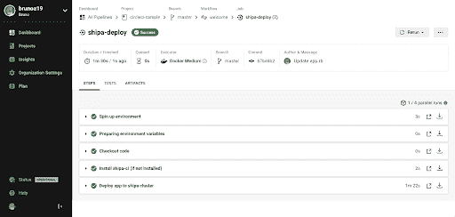

# 使用 Shipa | CircleCI 从 CI 渠道向 Kubernetes 部署应用程序

> 原文：<https://circleci.com/blog/deploying-apps-to-k8s-with-shipa/#2021-03-09T09:00:00-08:00>

Kubernetes 可以为开发组织带来一系列的优势。正确使用 Kubernetes 可以显著提高生产力，让您能够更好地利用您的云支出，并提高应用程序的稳定性和可靠性。另一方面，如果你没有很好地利用 Kubernetes，你的潜在好处就会变成缺点。作为一名开发人员，当您关注于快速交付高质量的代码时，这可能会变得非常令人沮丧。以对象为中心的应用程序架构的学习曲线和管理、脚本编写、集成到多个 CI 系统和管道中，以及管理基础架构都会降低您的工作效率。根据 Tidelift 和 New Stack 进行的[调查，开发人员只有 32%的时间花在编写新代码或改进现有代码上。另外的 68%花费在会议、代码维护、测试、安全问题等等。](https://thenewstack.io/how-much-time-do-developers-spend-actually-writing-code/)

如果开发人员能够充分利用 Kubernetes 的优势，同时避免其缺陷，会怎么样？在本教程中，我们将展示 CircleCI 和 Shipa 如何共同帮助团队从 Kubernetes 中获得最佳表现。它是如何工作的？CircleCI 通过可定制的管道最大化速度，而 [Shipa](https://www.shipa.io/) 则简化了 Kubernetes。这种结合让开发人员有更多的时间去做他们最擅长的事情:快速开发高质量的软件，而不改变他们的工作方式。您的平台工程团队可以管理、保护和交付一个强大的 Kubernetes 平台，使整个开发组织受益。

## 先决条件

对于本例，我们假设您有:


## 入门指南

在本教程中，我们将使用 CircleCI 和 [Shipa orb](https://circleci.com/developer/orbs/orb/shipa/shipa) 向 Kubernetes 集群交付我们的应用程序。[orb](https://circleci.com/orbs/)是可重用的代码片段，有助于自动化重复的过程，加速项目设置，并使其易于与 Shipa 等第三方工具集成。

本教程的应用程序源代码可从[这里](https://github.com/brunoa19/circleci-sample)获得。

## 在 CircleCI 上设置环境变量

为了让 CircleCI 成功地连接到 Shipa 并通过 CircleCI Shipa orb 交付应用程序代码，我们需要在 CircleCI 项目中设置这些环境变量:

*   这是您的应用程序的名称。在管道运行之前，按照以下说明在 Shipa 上创建应用程序:https://learn . Shipa . io/docs/application # creating-an-application
*   **SHIPA_CA** 这是您用来连接到 SHIPA 目标实例的客户端证书。您可以通过运行以下命令检索您的证书:

```
cat ~/.shipa/certificates/<instance-name>/ca.crt | base64 
```

*   **SHIPA_USER** 这是您用来登录 SHIPA 的用户名

*   **SHIPA_PASSWORD** 这是您用来登录 SHIPA 的密码

*   **SHIPA_SERVER** 这是 SHIPA 目标实例的地址。您可以通过运行以下命令来获取该地址:

```
shipa target list 
```

要定义这些[环境变量](https://circleci.com/docs/env-vars/#setting-an-environment-variable-in-a-project)，请转到项目的设置页面。点击左侧栏中的**环境变量**，然后**添加变量**。

## 建立 Shipa

对于本教程，您需要在 Shipa 上创建一个[应用程序。更多信息参见](https://learn.shipa.io/docs/application#creating-an-application)[Shipa](https://learn.shipa.io/docs/setup)入门。

这里有一个如何在 Shipa 上设置我们的应用程序的快速示例。

首先，我们在 Shipa 上启用 Ruby 平台，这样我们的示例 Ruby 代码就可以部署了:

```
shipa platform add ruby 
```

然后，我们创建将从 CircleCI 接收应用程序代码的应用程序:

```
shipa app create circleci ruby -t shipa-admin-team -o shipa-pool 
```

我们在示例项目中使用的应用程序名称是`circleci`，但是您可以给它起一个最适合您的名字。只要确保在`SHIPA_APP_NAME`变量中传递正确的名称。

## 设置 CircleCI 管道

使用 CircleCI Shipa orb，我们将:

*   查看我们的应用程序代码
*   设置 Shipa
*   通过 Shipa 部署应用程序

对于 CircleCI 和 Shipa orb 来说，我们需要在名为`.circleci`的文件夹中创建一个`config.yml`文件。这是我们正在使用的`config.yml`。

```
# Use the latest 2.1 version of CircleCI pipeline process engine. See: https://circleci.com/docs/configuration-reference/
version: 2.1
# Use a package of configuration called an orb.
orbs:
  # Declare a dependency on the welcome-orb
  shipa: shipa/orb@0.6.0
# Orchestrate or schedule a set of jobs
jobs:
  shipa-deploy:
    executor: shipa/default
    steps:
      - checkout
      - shipa/install
      - shipa/app-deploy
workflows:
  # Name the workflow "welcome"
  welcome:
    # Run the welcome/run job in its own container
    jobs:
      - shipa-deploy 
```

## 使用 Shipa 部署

现在我们需要运行 CircleCI 管道，并等待它完成。



管道完成后，我们的应用程序就成功部署了，并且可以从 Shipa CLI 通过在您的终端中键入以下命令来使用:

```
shipa app list 
```

您还可以从 Shipa 仪表板上看到部署的应用程序。


从这里，开发者和运营商都可以访问与我们的`circleci`应用相关的大量信息，包括:

*   日志
*   审计线索
*   网络策略
*   CNAME 管理
*   监控信息
*   集成到事件管理工具中
*   应用程序依赖关系图

## 结论

使用 Shipa orb 与 CircleCI 集成，开发人员可以专注于应用程序代码，而开发人员和平台工程师可以专注于控件和护栏。