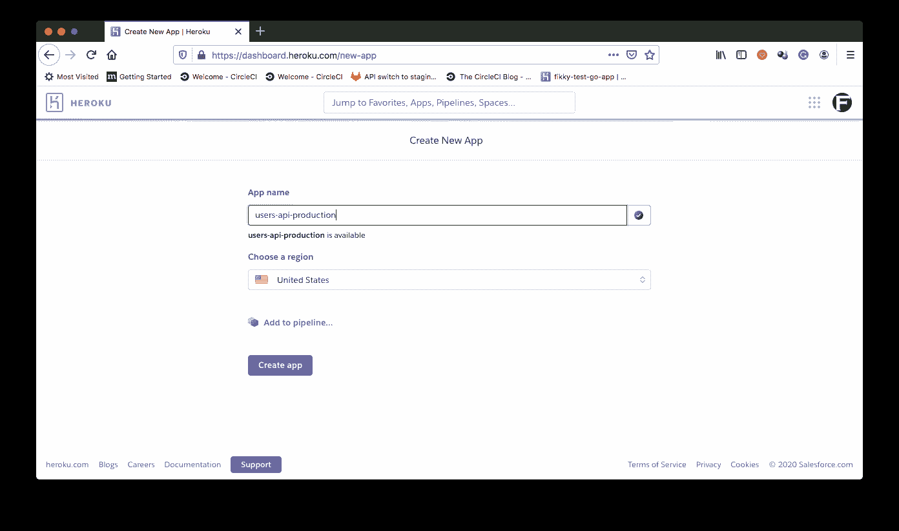

# 使用基于批准的工作流进行部署| CircleCI

> 原文：<https://circleci.com/blog/deploying-with-approvals/#2022-08-19T12:00:00-07:00>

当涉及到将特性部署到生产服务器时，大多数组织都使用非常严格的指导方针。很多时候，生产部署需要团队领导或工程经理的批准。在本教程中，我将向您展示如何[将 API 部署到由您团队中的批准者授权的试运行和生产环境](https://circleci.com/blog/deploy-an-api-to-multiple-environments/)。我们将创建一个工作流，将 API 部署到试运行环境中，然后使用 Postman CLI 工具 Newman 运行自动化测试。如果测试通过，API 就可以部署了。在团队成员提供批准后，将运行部署作业来将 API 部署到生产环境中。如果作业未获批准，API 将不会部署到生产环境中。

## 先决条件

要完成本教程，您需要:

1.  系统上安装的 [Node.js](https://nodejs.org/en/)
2.  Postman for Desktop 安装在您的系统上(您可以在这里下载它
3.  英雄的叙述
4.  一个[圆](https://circleci.com/signup/)的账户
5.  GitHub 的一个账户

当这些项目被安装和设置后，我们就可以开始教程了。

## 克隆 API 项目

首先，您需要克隆 API 项目。我们将使用一个简单的 Node.js API 应用程序，它有一个根端点和另外两个端点，用于创建和获取用户。通过运行以下命令克隆项目:

```
git clone --single-branch --branch base-project https://github.com/CIRCLECI-GWP/deploy-api.git 
```

克隆过程完成后，转到项目的根目录并安装依赖项:

```
cd deploy-api
npm install 
```

接下来，运行应用程序:

```
npm start 
```

应用程序将开始监听默认端口`3000`。

打开 Postman 并向`http://localhost:3000/users/get`端点发出一个`GET`请求。这应该会返回一个用户数组。


我们的 API 已经可以部署了。

## 在 Heroku 上设置`staging`和`deploy`环境

下一个任务是创建部署环境。您将为`staging`(应用程序的更新将被部署，用于测试)和`deploy`(生产环境)创建一个。在本教程中，我们将在 Heroku 上创建这些环境，但是您可以使用您喜欢的托管平台。

进入你的 Heroku 账户仪表盘，点击**新建**，然后**创建新应用**。在应用创建页面上，创建`staging`应用环境。


现在，重复相同的过程来创建生产应用程序。



现在已经为部署应用程序设置好了环境。最后，在 Heroku 上，从**账户设置**页面上的**账户**选项卡中获取 API 密钥。

## 用 Postman 集合设置 API 测试

在它被部署到`staging`环境之后，我们希望对 API 进行测试。对于本教程，我们将使用 Postman 来设置可以自动化的 API 测试。

第一步是使用 Postman 为 API 请求创建一个专用环境。

在 Postman 桌面上，单击**管理环境**齿轮图标(位于右上角)。**管理环境**对话框显示任何已经存在的环境。点击**添加**创建新环境。

在“新环境”对话框中，输入新环境的名称。将登台环境 API 基本 URL ( `https://users-api-staging.herokuapp.com`)作为环境变量(`api_url`)填入。您在`INITIAL VALUE`中输入的内容会被复制到`CURRENT VALUE`中。保持那样；使用`CURRENT VALUE`超出了本教程的范围。


点击**添加**完成环境创建。使用屏幕右上角的下拉菜单切换到新环境。

### 创建收藏

下一步是为您将要测试的 API 的用户端点创建一个 Postman 集合。

点击左侧边栏中的**收藏**。然后点击**新收藏**。

在**新收藏**对话框中，填写您收藏的名称(`Users`)。如果您想添加有关该收藏的更多信息，也可以添加说明。


点击**创建**完成集合设置。新收藏会立即显示在左侧栏的**收藏**下。

### 向集合中添加请求

现在是时候向您的集合添加请求了。我们的 API 由两个端点组成:

*   (GET):获取用户配置文件列表
*   `{{api_url}}/users/create` (POST):创建新的用户配置文件

您将为每个端点添加一个请求。若要开始，请单击集合旁边的弹出菜单(箭头图标)。

点击**添加请求**。在**新请求**对话框中，为`{{api_url}}/users/get`端点创建一个请求。点击**保存到用户-API-集合**将其保存到您之前创建的集合中。


现在请求已经创建，加载了一个新的请求选项卡。使用您创建的`api_url`变量，在地址栏(`{{api_url}}/users/get`)中输入请求的端点。确保选择**获取**作为请求方法。点击**保存**。

接下来，为`{{api_url}}/users/create`端点创建一个请求。我们需要获得随机值，以便`POST`请求可以创建测试用户。为此，我们需要一个`Pre-request`剧本。

打开**预请求脚本**选项卡，添加以下脚本:

```
let random = +new Date();

pm.globals.set("name", `Test-User-${random}`); 
```

这个脚本使用当前时间戳为每个触发的请求随机创建名称。随机变量`name`被设置为请求实例的全局变量。

现在用动态`name`变量编写请求体。


动态的`name`参数将被用于对`/users/create`端点的每个请求。

### 添加测试

是时候向您刚刚创建的请求添加一些测试了。

单击`{{api_url}}/users/get`请求(在左侧栏中)以确保它已被加载。点击**测试**选项卡。在窗口中，添加:

```
pm.test("Request is successful with a status code of 200", function () {
  pm.response.to.have.status(200);
});

pm.test("Check that it returns an array", function () {
  var jsonData = pm.response.json();
  pm.expect(jsonData).to.be.an("array");
}); 
```

第一个测试检查请求是否成功返回，状态代码为`200`。第二个测试确保它也返回一个数组。

点击用户创建请求**测试**选项卡进行添加:

```
pm.test("User creation was successful", function () {
  pm.expect(pm.response.code).to.be.oneOf([200, 201, 202]);
});

pm.test("Confirm response message", function () {
  var jsonData = pm.response.json();
  pm.expect(jsonData.message).to.eql("User successfully registered");
}); 
```

第一个测试通过断言状态代码`200`、`201`或`202`来检查用户创建是否成功。第二个测试确保返回正确的响应消息。

**注意:** *每当您对此集合中的任一请求进行更改时，请务必点击**保存**。*

## 用 Newman 配置自动化测试

接下来，我们将使用 Postman 的 CLI 工具 Newman 来自动化测试的运行方式。

首先，您的收藏需要一个公共 URL。此链接将指向您在邮递员服务上托管的收藏版本。使用此链接而不是将您的收藏导出为`json`的主要优点是，只要您登录 Postman，您的收藏的更改将始终可用。当您在桌面上登录时，Postman 会将您所有的本地收藏同步到您的 Postman 帐户。如果你需要一个邮差账户，[登录页面](https://identity.getpostman.com/signup/)会引导你创建一个。

要获取您的公共 URL，请从您的收藏弹出菜单中单击**共享**。您收藏的公共链接显示在**获取链接**选项卡下。


使用此链接，您不再需要导出和移动收藏文件。您确实需要在环境文件更新时将其导出，但是这种情况不太常见。

点击**管理环境**图标，下载你的邮递员环境。点击**下载**获取文件。文件名类似于`User-API-Tests.postman_environment.json`(取决于您如何命名环境)。将此环境文件添加到项目的根目录。

接下来，通过运行以下命令，在项目的根目录下安装 Newman CLI 工具:

```
npm install --save-dev newman 
```

将`package.json`中的测试脚本替换为:

```
"scripts": {
    ...
    "test": "npx newman run [YOUR_COLLECTION_PUBLIC_URL] -e ./[YOUR_ENVIRONMENT_FILENAME].json"
} 
```

这个测试脚本使用`npx`对集合的 URL 运行`newman`。集合 URL 使用环境的文件名来指定测试运行的位置。将值`[YOUR_COLLECTION_PUBLIC_URL]`和`[YOUR_ENVIRONMENT_FILENAME]`分别替换为*您的*集合公共 URL 和环境文件名。Newman 针对请求运行集合中定义的测试，并挑选任何已经定义的请求前脚本。

您的测试是为自动化而设置的。

## 将您的项目连接到 CircleCI

从将你的项目推送到 GitHub 开始。

**注意** : *克隆的项目可能会抛出一个关于已经被初始化为 git repo(或者已经包含远程 repo)的错误。如果发生这种情况，运行`rm -rf .git`删除任何现有的`git`工件。然后用`git init`重新初始化。*

在您提交了所有更改之后，转到 CircleCI 仪表板上的**添加项目**页面来添加项目。


点击**设置项目**。


在设置页面上，点击 **Use Existing Config** 以指示您正在手动设置配置文件，并且不使用显示的示例。接下来，您会得到一个提示，要么下载管道的配置文件，要么开始构建。


点击**开始建造**。这个构建将会失败，因为我们还没有设置配置文件。我们将在下一步中这样做。

在离开 CircleCI 控制台之前，您需要设置环境变量，以便将应用程序部署到 Heroku 上的两个环境(登台和生产)中。

从**管道**页面，选择您的应用程序，然后点击**项目设置**。


从**项目设置**侧菜单中，点击**环境变量**，然后点击**添加环境变量**。


添加这些变量:

*   `HEROKU_STAGING_APP_NAME`:暂存环境的 Heroku 应用程序名称(在本例中为`users-api-staging`)
*   `HEROKU_PRODUCTION_APP_NAME`:生产环境的 Heroku 应用程序名称(在本例中为`users-api-production`)
*   你的 Heroku API 密钥

现在，您已经准备好部署到 Heroku 上的临时环境和生产环境了。

## 配置一个`stage`->-`test`->-`approve`->-`deploy`工作流

正如本教程开始时所承诺的，我们的目标是创建一个基于审批的工作流，其中应用程序:

1.  部署到暂存环境
2.  在分段地址上测试(如果测试通过)
3.  该流程等待团队成员点击 CircleCI 控制台中的批准按钮
4.  `deploy`作业被触发，并将应用程序部署到生产环境中。

我们的下一个任务是编写执行这些步骤的部署管道脚本。首先在项目的根目录下创建一个名为`.circleci`的文件夹。在刚刚创建的文件夹中添加一个名为`config.yml`的配置文件。输入以下代码:

```
jobs:
  stage:
    executor: heroku/default
    steps:
      - checkout
      - heroku/install
      - heroku/deploy-via-git:
          app-name: $HEROKU_STAGING_APP_NAME

  test:
    working_directory: ~/repo
    docker:
      - image: circleci/node:10.16.3
    steps:
      - checkout
      - run:
          name: Update NPM
          command: "sudo npm install -g npm@5"
      - restore_cache:
          key: dependency-cache-{{ checksum "package-lock.json" }}
      - run:
          name: Install Dependencies
          command: npm install
      - save_cache:
          key: dependency-cache-{{ checksum "package-lock.json" }}
          paths:
            - ./node_modules
      - run:
          name: Run tests
          command: npm run test

  deploy:
    executor: heroku/default
    steps:
      - checkout
      - heroku/install
      - heroku/deploy-via-git:
          app-name: $HEROKU_PRODUCTION_APP_NAME
orbs:
  heroku: circleci/heroku@0.0.10
version: 2.1
workflows:
  stage_test_approve_deploy:
    jobs:
      - stage
      - test:
          requires:
            - stage
      - hold:
          type: approval
          requires:
            - test
      - deploy:
          requires:
            - hold 
```

这是一个很好的剧本，对吧？让我分解一下，补充一些细节。我们从创建 3 个`jobs`开始:

*   `stage`:从 repo 中签出项目代码，并使用 Heroku CircleCI orb 将应用程序部署到临时环境中。
*   `test`:安装需要安装`newman` CLI 的项目依赖项。然后它运行`package.json`中的`test`脚本，调用`newman`来运行集合中针对刚刚部署的临时应用程序的测试。
*   `deploy`:将应用程序部署到 Heroku 上的生产环境中。

接下来，`heroku`球被拉进来:

```
orbs:
  heroku: circleci/heroku@0.0.10 
```

orb 是抽象常见任务的可重用管道包。我们使用的 orb 抽象了安装和设置`heroku` CLI 工具来部署应用程序的过程。

最后，脚本定义了`stage_test_deploy`工作流。该工作流运行`stage`作业。一旦该作业成功运行，`test`作业就会对刚刚部署的应用程序运行测试。如果`test`作业成功，意味着暂存应用程序上的所有测试都通过了，那么工作流将运行一个特殊的`hold`作业。`hold`作业暂停工作流，等待批准后再继续。这个`hold`任务可以取任何你喜欢的名字。这个作业的重要特点是它的`type`设置为`approval`。此类型表示它是一个中间作业，这意味着它的主要功能是暂停工作流，直到批准完成。

有权批准的组织成员单击 CircleCI 控制台上的批准按钮。点击会导致`deploy`作业继续，将应用程序部署到生产环境中。

**注意:** *任何对项目存储库具有写权限的人都可以批准作业。通过在批准作业的后续作业中使用[受限上下文](https://circleci.com/docs/contexts/#restricting-a-context)，您可以进一步限制谁能够运行特定作业。虽然具有写访问权限的任何人都可以发布批准，但只有当批准者在上下文的安全组中时，后续作业才会运行。*

是时候测试我们的工作流程了。提交所有更改并将代码推送到远程存储库以运行管道脚本。

当前活动的`job`正在运行，而其他的在等待。


一旦`test`作业完成，您将看到`hold`作业暂停工作流进行审批。


点击`hold`任务打开批准对话框。


点击**批准**继续工作流程。工作流将恢复，并且`deploy`作业将运行以将应用程序推向生产。

要查看流程中的步骤及其持续时间，只需单击工作流(`stage_test_deploy`)链接。


您还可以单击每个构建来了解它如何运行的详细信息。


干得好！您的辅导项目已获批准。

## 结论

在本教程中，我们已经展示了 CircleCI 如何在自动化[持续集成](https://circleci.com/continuous-integration/)流程中轻松实现批准结构。如果批准是部署流程的一部分，您可以将在此学到的知识应用于其他工作流，甚至更复杂的场景。如需进一步了解该主题，请阅读[在 CI/CD 管道中实施访问控制策略](https://circleci.com/blog/access-control-cicd/)和[向 CI 管道添加批准作业](https://circleci.com/blog/adding-approval-jobs-to-your-ci-pipeline/)。

编码快乐！

* * *

Fikayo Adepoju 是 LinkedIn Learning(Lynda.com)的作者、全栈开发人员、技术作者和技术内容创建者，精通 Web 和移动技术以及 DevOps，拥有 10 多年开发可扩展分布式应用程序的经验。他为 CircleCI、Twilio、Auth0 和 New Stack 博客撰写了 40 多篇文章，并且在他的个人媒体页面上，他喜欢与尽可能多的从中受益的开发人员分享他的知识。你也可以在 Udemy 上查看他的视频课程。

[阅读 Fikayo Adepoju 的更多帖子](/blog/author/fikayo-adepoju/)