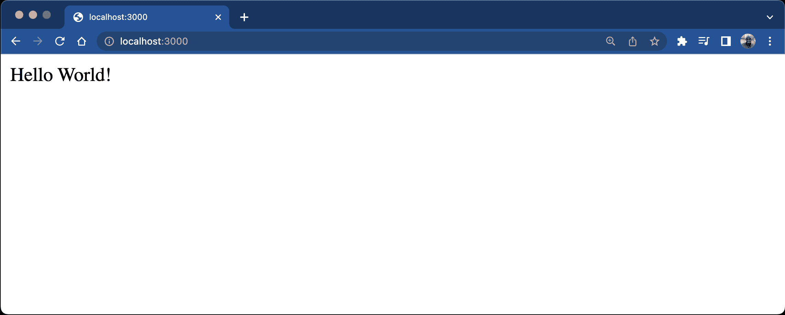
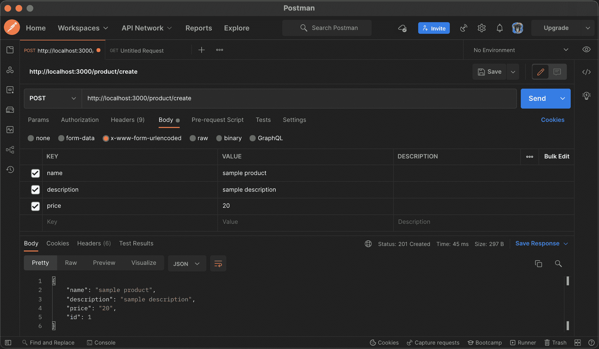
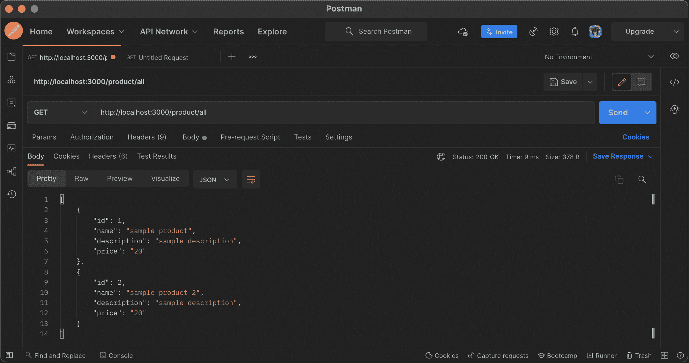
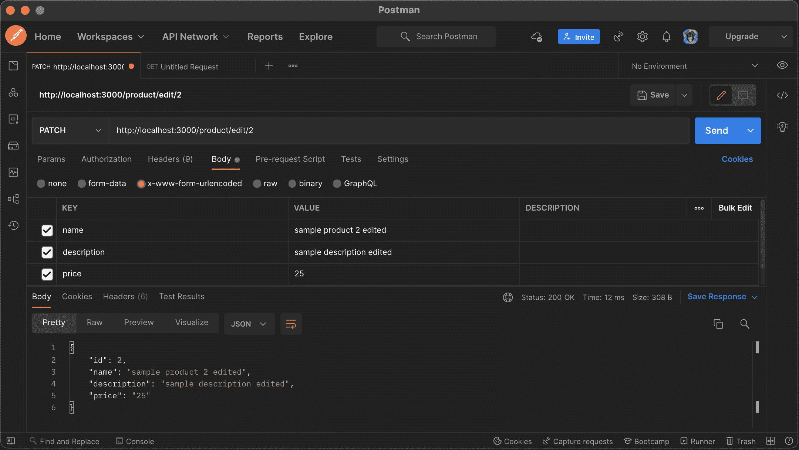
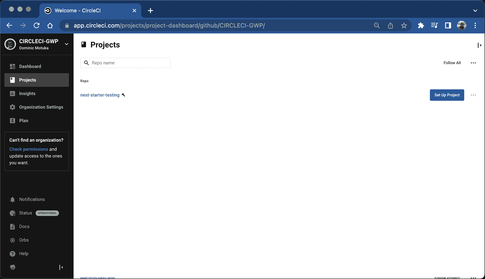
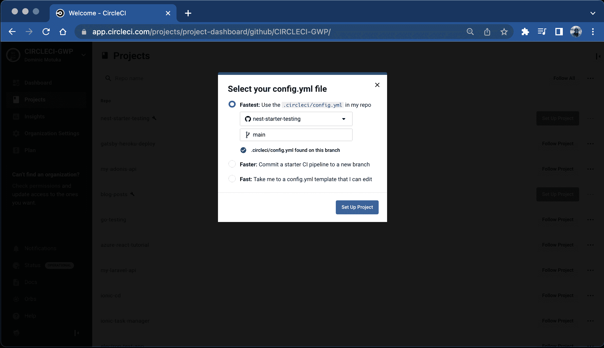
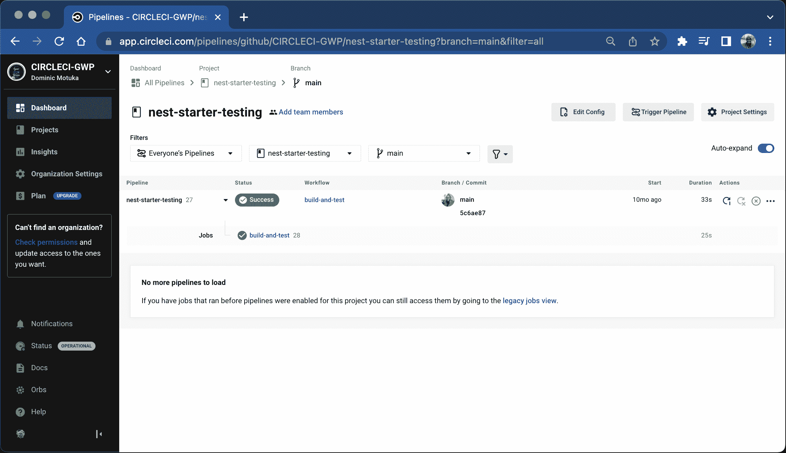
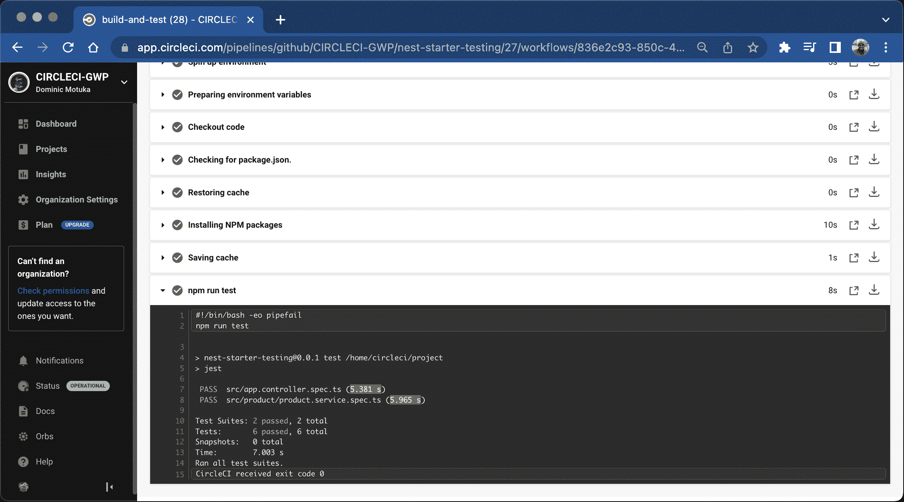

# Nest.js APIs | CircleCI 持续集成入门

> 原文：<https://circleci.com/blog/getting-started-with-nestjs-and-automatic-testing/#2022-04-14T12:00:00-07:00>

> 本教程涵盖:
> 
> 1.  设置和连接 Nest.js 应用程序
> 2.  使用 Nest.js 应用程序创建产品
> 3.  编写、运行和自动化测试

Nest.js 是一个用 TypeScript 构建的可伸缩、高效的服务器端 Node.js 框架。创建 Nest.js 是为了向 Node.js 开发环境提供一种结构化设计模式。它的灵感来自于 [Angular.js](https://angular.io/) ，并在引擎盖下使用了 [Express.js](https://expressjs.com/) 。Nest.js 与大多数 Express.js 中间件兼容。

在本教程中，我将带领您使用 Nest.js 构建一个 RESTful API。本教程将让您熟悉 Nest.js 的基本原理和构建块。我还将演示为每个 API 端点编写测试的推荐方法。我将通过向您展示如何使用 CircleCI 自动化测试过程来结束本教程。

## 先决条件

要想从本教程中获得最大收益，您需要具备以下几点:

> 我们的教程是平台无关的，但是使用 CircleCI 作为例子。如果你没有 CircleCI 账号，请在 注册一个免费的 [**。**](https://circleci.com/signup/)

我们在本文中构建的 RESTful API 将提供端点来创建带有名称、描述和价格的产品。我们将编辑、删除和检索单个产品，还将检索保存在数据库中的整个产品列表。

本教程使用 MySQL 作为首选的关系数据库，并将其与 [TypeORM](https://github.com/typeorm/typeorm) 结合使用。但是 Nest.js 是数据库不可知的，所以您可以选择使用您喜欢的任何数据库。你可以在这里找到更多关于数据库和 Nest.js [的细节。](https://docs.nestjs.com/techniques/database)

## 设置 Nest.js 应用程序

运行以下命令创建新的应用程序:

```
nest new nest-starter-testing 
```

运行`nest`命令后，会提示您选择一个包管理器。选择`npm`并按回车键开始安装 Nest.js。该过程在`nest-starter-testing`文件夹中创建一个新项目，并安装其所需的所有依赖项。在运行应用程序之前，使用`npm`安装一个[验证库](https://www.npmjs.com/package/class-validator)，您将在本教程的后面使用它。

```
npm install class-validator --save 
```

进入应用程序文件夹，使用命令启动应用程序:

```
// move into the project
cd nest-starter-testing

// start the server
npm run start:dev 
```

这将在默认的`3000`端口上启动应用程序。在您喜爱的浏览器中导航至`http://localhost:3000`进行查看。



## 配置 Nest.js 并将其连接到数据库

TypeORM 是一个流行的对象关系映射器(ORM ),用于 TypeScript 和 JavaScript 应用程序。为了便于与 Nest.js 应用程序集成，您需要为它安装一个附带的包，以及 MySQL 的 Node.js 驱动程序。为此，通过按 CTRL + C 停止应用程序运行，然后运行以下命令:

```
npm install --save @nestjs/typeorm typeorm mysql 
```

当安装过程完成时，您可以将`TypeOrmModule`导入到应用程序的根目录中。

## 更新 TypeScript 根模块

Nest.js 的构建块，模块是用`@Module`修饰的 TypeScript 文件。模块提供了 Nest.js 用来组织应用程序结构的元数据。`./src/app.module.ts`中的根模块是顶层模块。Nest.js 建议将一个大型应用程序分解成多个模块。它有助于维护应用程序的结构。

要创建与数据库的连接，打开`./src/app.module.ts`文件并用以下代码替换其内容:

```
import { Module } from '@nestjs/common';
import { AppController } from './app.controller';
import { AppService } from './app.service';
import { TypeOrmModule } from '@nestjs/typeorm';
import { join } from 'path';

@Module({
  imports: [
    TypeOrmModule.forRoot({
      type: 'mysql',
      host: 'localhost',
      port: 3306,
      username: DB_USER,
      password: DB_PASSWORD,
      database: 'test_db',
      entities: [join(__dirname, '**', '*.entity.{ts,js}')],
      synchronize: true,
    }),
  ],
  controllers: [AppController],
  providers: [AppService],
})
export class AppModule {} 
```

**注** : *用你的证件*代替`DB_USER`和`DB_PASSWORD`。

我们通过将`TypeOrmModule`导入到根`AppModule`中并指定连接选项，建立了与数据库的连接。其中包括数据库详细信息和实体文件的存储目录。我将在下一节更详细地介绍实体文件。

## 配置数据库连接

在本教程开始的先决条件中，我提到了 MySQL 下载页面。下载后，您需要配置数据库，使其适用于此应用程序。

在您的终端中，通过运行以下命令登录 MySQL:

```
mysql -u root -p 
```

输入您在 MySQL 安装过程中设置的密码。现在运行:

```
ALTER USER 'root'@'localhost' IDENTIFIED WITH mysql_native_password BY 'password'; 
```

用您的密码替换“密码”。

该命令为 MySQL 的 Node.js 驱动程序设置首选身份验证。要创建数据库，请运行:

```
CREATE DATABASE test_db; 
```

## 为 Nest.js 应用程序创建产品模块、服务和控制器

现在您已经配置了数据库连接，我们将开始为应用程序创建更多的结构。

### 生成模块

首先为`Product`生成一个模块。这将是一个新模块，用于对与产品相关的所有项目进行分组。首先运行以下命令:

```
nest generate module product 
```

上面的命令将在`src`目录下创建一个新的`product`文件夹，在`product.module.ts`文件中定义`ProductModule`，并通过导入新创建的`ProductModule`自动更新`app.module.ts`文件中的根模块。`./src/product/product.module.ts`文件暂时为空，如下所示:

```
import { Module } from '@nestjs/common';
@Module({})
export class ProductModule {} 
```

### 创建实体

为了为 Nest.js 应用程序创建合适的数据库模式，TypeORM 支持创建实体。实体是映射到特定数据库表的类。在这种情况下，它是产品表。

按照 Nest.js 应用程序的正确结构，在`src/product`文件夹中创建一个新文件，并将其命名为`product.entity.ts`。然后将这段代码粘贴到其中:

```
import { PrimaryGeneratedColumn, BaseEntity, Column, Entity } from 'typeorm';

@Entity()
export class Product extends BaseEntity {
  @PrimaryGeneratedColumn()
  id: number;

  @Column()
  name: string;

  @Column()
  description: string;

  @Column()
  price: string;
} 
```

使用从`typeorm`模块导入的装饰器，我们为产品表创建了四列。其中包括唯一标识产品的主键列。

## 创建数据传输对象

数据传输对象(DTO)有助于为进入应用程序的数据创建和验证正确的数据结构。例如，当您从前端向 Node.js 后端发送 HTTP POST 请求时，您需要从表单中提取发布的内容，并将其解析为后端代码可以轻松使用的格式。DTO 帮助指定从请求体中提取的对象的形状，并提供了一种轻松插入验证的方法。

要为该应用程序设置 DTO，请在`src/product`目录中创建一个新文件夹，并将其命名为`dto`。接下来，在新创建的文件夹中创建一个文件，并将其命名为`create-product.dto.ts`。使用以下内容:

```
import { IsString } from 'class-validator';

export class CreateProductDTO {
  @IsString()
  name: string;

  @IsString()
  description: string;

  @IsString()
  price: string;
} 
```

这里，我们定义了一个表示`CreateProductDTO`的类，还添加了一些验证来确保字段的数据类型是**字符串**。接下来，我们将创建一个存储库来帮助将数据直接保存到应用程序数据库中。

## 创建自定义存储库

通常，像 TypeORM 这样的 ORM 中的存储库主要作为持久层。它包含的方法有:

这有助于与应用程序的数据库进行通信。在本教程中，我们将为我们的产品实体创建一个扩展 TypeORM 基本存储库的自定义存储库，并为特定查询创建一些自定义方法。首先导航到`src/product`文件夹，创建一个名为`product.repository.ts`的新文件。完成后，将以下内容粘贴到其中:

```
import { Repository, EntityRepository } from 'typeorm';
import { Product } from './product.entity';
import { CreateProductDTO } from './dto/create-product.dto';

@EntityRepository(Product)
export class ProductRepository extends Repository<Product> {

  public async createProduct(
    createProductDto: CreateProductDTO,
  ): Promise<Product> {
    const { name, description, price } = createProductDto;

    const product = new Product();
    product.name = name;
    product.description = description;
    product.price = price;

    await product.save();
    return product;
  }

  public async editProduct(
    createProductDto: CreateProductDTO,
    editedProduct: Product,
  ): Promise<Product> {
    const { name, description, price } = createProductDto;

    editedProduct.name = name;
    editedProduct.description = description;
    editedProduct.price = price;
    await editedProduct.save();

    return editedProduct;
  }
} 
```

从上面的代码中，我们定义了两个方法:

*   `createProduct()`:该方法将`createProductDto`类作为参数，该类将用于提取 HTTP 请求的主体。然后我们析构`createProductDto`，用这些值创造一个新产品。
*   `editProduct`:在这里，需要编辑的产品的详细信息被传递给这个方法，根据客户端的新值，指定的详细信息将被相应地更新并保存在数据库中。

## 生成 Nest.js 服务

服务，也称为提供者，是 Nest.js 中的另一个构建块，被归类到关注点分离原则下。它旨在处理和抽象复杂的业务逻辑，并返回适当的响应。Nest.js 中的所有服务都用`@Injectable()` decorator 修饰，这使得将服务注入任何其他文件变得容易，比如控制器和模块。

使用以下命令为产品创建服务:

```
nest generate service product 
```

运行上面的命令后，您将在终端上看到以下输出:

```
CREATE /src/product/product.service.spec.ts (467 bytes)
CREATE /src/product/product.service.ts (91 bytes)
UPDATE /src/product/product.module.ts (167 bytes) 
```

`nest`命令在`src/product`文件夹中创建了两个新文件。这些是:

*   `product.service.spec.ts`文件将用于为将在产品服务文件中创建的方法编写单元测试。
*   `product.service.ts`文件保存了应用程序的所有业务逻辑。

`nest`命令还导入了新创建的服务，并将其添加到了`product.module.ts`文件中。

接下来，您将使用创建和检索所有产品的方法填充`product.service.ts`文件，以及获取、更新和删除特定产品的细节。打开文件并用以下内容替换其内容:

```
import { Injectable, NotFoundException } from '@nestjs/common';
import { InjectRepository } from '@nestjs/typeorm';
import { Product } from './product.entity';
import { CreateProductDTO } from './dto/create-product.dto';
import { ProductRepository } from './product.repository';

@Injectable()
export class ProductService {
  constructor(
    @InjectRepository(ProductRepository)
    private productRepository: ProductRepository,
  ) {}

  public async createProduct(
    createProductDto: CreateProductDTO,
  ): Promise<Product> {
    return await this.productRepository.createProduct(createProductDto);
  }

  public async getProducts(): Promise<Product[]> {
    return await this.productRepository.find();
  }

  public async getProduct(productId: number): Promise<Product> {
    const foundProduct = await this.productRepository.findOne(productId);
    if (!foundProduct) {
      throw new NotFoundException('Product not found');
    }
    return foundProduct;
  }

  public async editProduct(
    productId: number,
    createProductDto: CreateProductDTO,
  ): Promise<Product> {
    const editedProduct = await this.productRepository.findOne(productId);
    if (!editedProduct) {
      throw new NotFoundException('Product not found');
    }
    return this.productRepository.editProduct(createProductDto, editedProduct);
  }

  public async deleteProduct(productId: number): Promise<void> {
    await this.productRepository.delete(productId);
  }
} 
```

在这里，我们导入了应用程序所需的模块，并创建了单独的方法来:

*   创建新产品:`createProduct()`
*   获取所有创建的产品:`getProducts()`
*   检索单个产品的详细信息:`getProduct()`
*   编辑特定产品的详细信息:`editProduct()`
*   删除单个产品:`deleteProduct()`

值得注意的是，我们将之前创建的`ProductRepository`注入到这个服务中，以便轻松地与数据库进行交互和通信。以下是显示这一点的文件片段:

```
 ...

  constructor(
    @InjectRepository(ProductRepository)
    private productRepository: ProductRepository,
  ) {}

  ... 
```

只有当我们也将`ProductRepository`导入到产品模块中时，这才起作用。我们将在教程的后面做这件事。

## 生成 Nest.js 控制器

Nest.js 中控制器的职责是接收和处理来自应用程序客户端的传入 HTTP 请求，并根据业务逻辑返回适当的响应。路由机制由附着在每个控制器顶部的装饰器`@Controller()`控制，通常决定哪个控制器接收哪个请求。要为我们的项目创建新的控制器文件，请从终端运行以下命令:

```
nest generate controller product --no-spec 
```

您将看到以下输出。

```
CREATE /src/product/product.controller.ts (103 bytes)
UPDATE /src/product/product.module.ts (261 bytes) 
```

因为我们不会为这个控制器编写测试，所以我们使用了`--no-spec`选项来指示`nest`命令不要为控制器生成`.spec.ts`文件。打开`src/product/product.controller.ts`文件，将其代码替换为:

```
import {
  Controller,
  Post,
  Body,
  Get,
  Patch,
  Param,
  Delete,
} from '@nestjs/common';
import { ProductService } from './product.service';
import { CreateProductDTO } from './dto/create-product.dto';
import { Product } from './product.entity';

@Controller('product')
export class ProductController {
  constructor(private productService: ProductService) {}

  @Post('create')
  public async createProduct(
    @Body() createProductDto: CreateProductDTO,
  ): Promise<Product> {
    const product = await this.productService.createProduct(createProductDto);
    return product;
  }

  @Get('all')
  public async getProducts(): Promise<Product[]> {
    const products = await this.productService.getProducts();
    return products;
  }

  @Get('/:productId')
  public async getProduct(@Param('productId') productId: number) {
    const product = await this.productService.getProduct(productId);
    return product;
  }

  @Patch('/edit/:productId')
  public async editProduct(
    @Body() createProductDto: CreateProductDTO,
    @Param('productId') productId: number,
  ): Promise<Product> {
    const product = await this.productService.editProduct(
      productId,
      createProductDto,
    );
    return product;
  }

  @Delete('/delete/:productId')
  public async deleteProduct(@Param('productId') productId: number) {
    const deletedProduct = await this.productService.deleteProduct(productId);
    return deletedProduct;
  }
} 
```

在这个文件中，我们导入了必要的模块来处理 HTTP 请求，并将之前创建的`ProductService`注入到控制器中。这是通过构造函数使用已经在`ProductService`中定义的函数来完成的。接下来，我们创建了这些异步方法:

*   `createProduct()`方法用于处理客户端发送的 POST HTTP 请求，以创建新产品并将其保存在数据库中。
*   `getProducts()`方法从数据库中获取完整的产品列表。
*   `getProduct()`方法将`productId`作为参数，并使用它从数据库中检索具有唯一`productId`的产品的详细信息。
*   `editProduct()`方法用于编辑特定产品的详细信息。
*   `deleteProduct()`方法也接受惟一的`productId`来标识特定的产品并从数据库中删除它。

这里需要注意的另一件重要事情是，我们定义的每个异步方法都有一个元数据装饰器作为 HTTP 动词。它们接受一个前缀，Nest.js 使用这个前缀来进一步标识和指向应该处理请求并做出相应响应的方法。

例如，我们创建的`ProductController`有一个前缀`product`和一个名为`createProduct()`的方法，该方法接受前缀`create`。这意味着任何指向`product/create` ( `http://localhost:3000/product/create`)的`GET`请求都将由`createProduct()`方法处理。这个过程对于在这个`ProductController`中定义的其他方法也是一样的。

## 更新产品模块

现在已经创建了控制器和服务，并使用`nest`命令将其自动添加到`ProductModule`中，我们需要更新`ProductModule`。打开`./src/product/product.module.ts`并用以下代码更新其内容:

```
import { Module } from '@nestjs/common';
import { ProductController } from './product.controller';
import { ProductService } from './product.service';
import { TypeOrmModule } from '@nestjs/typeorm';
import { ProductRepository } from './product.repository';

@Module({
  imports: [TypeOrmModule.forFeature([ProductRepository])], // add this
  controllers: [ProductController],
  providers: [ProductService],
})

export class ProductModule {} 
```

这里，我们将`ProductRepository`类传递给了`TypeOrm.forFeature()`方法。这将允许使用`ProductRepository`类。

应用程序现在已经准备好了，我们可以运行它来测试到目前为止创建的所有端点。从终端运行以下命令:

```
npm run start:dev 
```

这将在`http://localhost:3000`启动应用程序。此时，您可以使用类似于 [Postman](https://circleci.com/blog/testing-an-api-with-postman/) 的工具来测试 API。Postman 是一个测试工具，用于在部署到生产环境之前确认和检查 API 的行为。

## 使用 Nest.js 应用程序创建产品



用产品的`name`、`description`和`price`创建一个到`http://localhost:3000/product/create`端点的 POST HTTP 请求。

### 获取所有产品



对`http://localhost:3000/product/all`进行 GET HTTP 请求调用，以检索创建的产品的完整列表。

### 获取产品


为了检索单个产品的详细信息，我们向`http://localhost:3000/product/2`端点发送了一个 GET HTTP 请求。请注意，`2`是我们感兴趣的产品的唯一`productId`。你也可以尝试其他值。

### 编辑产品

向`http://localhost:3000/product/edit/2`端点发送补丁 HTTP 请求，更新用`2`的`productId`标识的产品详情。



## 为 Nest.js 应用程序编写测试

既然我们的 API 如预期的那样工作，在这一节中，我们将把重点放在为之前创建的`ProductService`类中定义的方法编写测试上。感觉只测试应用程序的这一部分比较合适，因为它处理大部分业务逻辑。

Nest.js 带有内置的测试基础设施，这意味着我们不必在测试方面设置太多配置。尽管 Nest.js 与测试工具无关，但它提供了开箱即用的集成。Jest 将提供 assert 函数和 test-double 工具来帮助模仿。

目前，`product.service.spec.ts`文件的代码是:

```
import { Test, TestingModule } from '@nestjs/testing';
import { ProductService } from './product.service';

describe('ProductService', () => {
  let service: ProductService;

  beforeEach(async () => {
    const module: TestingModule = await Test.createTestingModule({
      providers: [ProductService],
    }).compile();
    service = module.get<ProductService>(ProductService);
  });

  it('should be defined', () => {
    expect(service).toBeDefined();
  });
}); 
```

我们将添加更多的测试，使其完全覆盖所有在`ProductService`中定义的方法。

## 为“创建”和“获取”产品方法编写测试

请记住，我们并没有使用测试驱动的开发方法来启动这个项目。因此，我们将编写测试来确保`ProductService`中的所有业务逻辑接收到适当的参数并返回预期的响应。首先，打开`product.service.spec.ts`文件并用以下内容替换其内容:

```
import { Test, TestingModule } from '@nestjs/testing';
import { ProductService } from './product.service';
import { ProductRepository } from './product.repository';
import { NotFoundException } from '@nestjs/common';

describe('ProductService', () => {
  let productService;
  let productRepository;
  const mockProductRepository = () => ({
    createProduct: jest.fn(),
    find: jest.fn(),
    findOne: jest.fn(),
    delete: jest.fn(),
  });

  beforeEach(async () => {
    const module: TestingModule = await Test.createTestingModule({
      providers: [
        ProductService,
        {
          provide: ProductRepository,
          useFactory: mockProductRepository,
        },
      ],
    }).compile();
    productService = await module.get<ProductService>(ProductService);
    productRepository = await module.get<ProductRepository>(ProductRepository);
  });

  describe('createProduct', () => {
    it('should save a product in the database', async () => {
      productRepository.createProduct.mockResolvedValue('someProduct');
      expect(productRepository.createProduct).not.toHaveBeenCalled();
      const createProductDto = {
        name: 'sample name',
        description: 'sample description',
        price: 'sample price',
      };
      const result = await productService.createProduct(createProductDto);
      expect(productRepository.createProduct).toHaveBeenCalledWith(
        createProductDto,
      );
      expect(result).toEqual('someProduct');
    });
  });

  describe('getProducts', () => {
    it('should get all products', async () => {
      productRepository.find.mockResolvedValue('someProducts');
      expect(productRepository.find).not.toHaveBeenCalled();
      const result = await productService.getProducts();
      expect(productRepository.find).toHaveBeenCalled();
      expect(result).toEqual('someProducts');
    });
  });
}); 
```

首先，我们从`@nestjs/testing`模块导入了`Test`和`TestingModule`包。这提供了方法`createTestingModule`，它创建了一个测试模块，该模块将作为测试中前面定义的模块。在这个`testingModule`中，`providers`数组由`ProductService`和一个`mockProductRepository`组成，用来模仿使用工厂定制的`ProductRepository`。

然后，我们创建了测试套件的两个不同组件，以确保我们可以创建产品并检索产品列表。

让我们再添加几个脚本来测试在应用程序中检索和删除单个产品的功能。仍然在`product.service.spec.ts`文件中，通过在我们现有的测试脚本下面添加以下代码来更新它:

```
import { Test, TestingModule } from '@nestjs/testing';
import { ProductService } from './product.service';
import { ProductRepository } from './product.repository';
import { NotFoundException } from '@nestjs/common';

describe('ProductService', () => {
  ...
  describe('getProduct', () => {
    it('should retrieve a product with an ID', async () => {
      const mockProduct = {
        name: 'Test name',
        description: 'Test description',
        price: 'Test price',
      };
      productRepository.findOne.mockResolvedValue(mockProduct);
      const result = await productService.getProduct(1);
      expect(result).toEqual(mockProduct);
      expect(productRepository.findOne).toHaveBeenCalledWith(1);
    });

    it('throws an error as a product is not found', () => {
      productRepository.findOne.mockResolvedValue(null);
      expect(productService.getProduct(1)).rejects.toThrow(NotFoundException);
    });
  });

  describe('deleteProduct', () => {
    it('should delete product', async () => {
      productRepository.delete.mockResolvedValue(1);
      expect(productRepository.delete).not.toHaveBeenCalled();
      await productService.deleteProduct(1);
      expect(productRepository.delete).toHaveBeenCalledWith(1);
    });
  });
}); 
```

为了获得特定的产品，我们简单地创建了一个带有一些默认细节的`mockProduct`,并验证了我们可以检索和删除产品。

查看 GitHub 上的[获取完整的测试脚本。](https://github.com/CIRCLECI-GWP/nest-starter-testing/blob/master/src/product/product.service.spec.ts)

## 在本地运行测试

在运行测试之前，您应该删除为位于`src/app.controller.spec.ts`中的`AppController`创建的测试文件，如果您希望为其编写测试，您可以稍后手动创建该文件。现在，继续运行测试，使用:

```
npm run test 
```

输出将是这样的:

```
> nest-starter-testing@0.0.1 test /Users/dominic/workspace/personal/circleci-gwp/nest-starter-testing
> jest
 PASS  src/app.controller.spec.ts
 PASS  src/product/product.service.spec.ts

Test Suites: 2 passed, 2 total
Tests:       6 passed, 6 total
Snapshots:   0 total
Time:        3.148 s
Ran all test suites. 
```


## 自动化测试

现在，您已经用 Nest.js 构建了一个完整的 RESTful API，并对其业务逻辑进行了测试。接下来，您需要添加配置文件来设置[与 CircleCI 的持续集成](https://circleci.com/continuous-integration/)。持续集成有助于确保代码的更新不会破坏任何现有的功能。一旦测试被推送到 GitHub 存储库，它就会自动运行。

首先，创建一个名为`.circleci`的文件夹，并在其中创建一个名为`config.yml`的新文件。打开新文件并将以下代码粘贴到其中:

```
version: 2.1
orbs:
  node: circleci/node@3.0.0
jobs:
  build-and-test:
    executor:
      name: node/default
    steps:
      - checkout
      - node/install-packages
      - run:
          command: npm run test
workflows:
  build-and-test:
    jobs:
      - build-and-test 
```

这里，我们指定了要使用的 CircleCI 版本，并使用 CircleCI [Node orb](https://circleci.com/developer/orbs/orb/circleci/node) 来设置和安装 Node.js。最后一个命令是实际的测试命令，它运行我们的测试。

### 在 CircleCI 建立项目

通过将[导航到此页面](https://circleci.com/signup/)，在 CircleCI 上创建一个帐户。接下来，如果您是任何组织的一部分，您将需要选择您希望工作的组织来用 CircleCI 设置您的存储库。

一旦你进入项目页面，找到我们之前在 GitHub 上创建的项目，点击**设置项目**。



这将显示一个配置页面，允许您选择想要使用的 CircleCI 配置文件。这默认为位于主分支`.circleci/config.yaml`的配置。

现在点击**设置项目**。



按照提示，点击**手动添加**，因为我们已经包含了配置文件。您将看到您的管道开始自动运行并通过。



这个构建只有一个任务:`build-and-test`。作业中的所有步骤都在一个单元中执行，要么在一个新容器中执行，要么在一个虚拟机中执行。


您也可以点击工单查看步骤。步骤是在作业期间运行的可执行命令的集合


单击这些步骤会显示更多详细信息。例如，点击`npm run test`步骤。



所有测试都成功运行，并且显示出与本地运行测试时类似的输出。随后，你要做的就是给你的项目增加更多的特性，编写更多的测试，推送到 GitHub。持续集成管道将自动运行，测试将被执行。

## 使用 Nest.js 构建自己的 RESTful API

Nest.js 鼓励并加强 web 应用程序的优秀结构。它帮助您的团队组织工作并遵循最佳实践。在本教程中，我们学习了如何使用 Nest.js 构建 RESTful APIs，并使用 Postman 测试功能。最后，我们编写了几个测试，并使用 CircleCI 自动化了它们。

在本教程中，我们重点测试了`ProductService`。如果您想进一步探索，您可以将获得的知识应用到应用程序的其他部分。

该应用程序的完整源代码[在 GitHub](https://github.com/CIRCLECI-GWP/nest-starter-testing) 上。

要了解如何向 NestJS GraphQL 项目添加单元和集成测试，并使用 CircleCI 自动化测试过程，请访问[NestJS graph QL 项目的持续集成](https://circleci.com/blog/testing-nestjs-graphql/)博客文章。

* * *

Oluyemi 是一名拥有电信工程背景的技术爱好者。出于对解决用户日常遇到的问题的浓厚兴趣，他冒险进入编程领域，并从那时起将他的问题解决技能用于构建 web 和移动软件。Oluyemi 是一名热衷于分享知识的全栈软件工程师，他在世界各地的几个博客上发表了大量技术文章和博客文章。作为技术专家，他的爱好包括尝试新的编程语言和框架。

[阅读更多 Olususi Oluyemi 的帖子](/blog/author/olususi-oluyemi/)