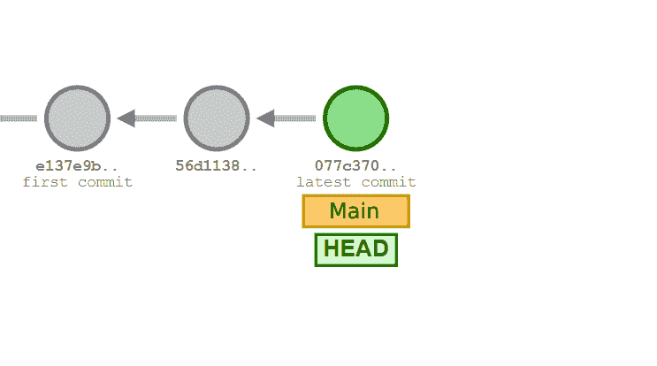
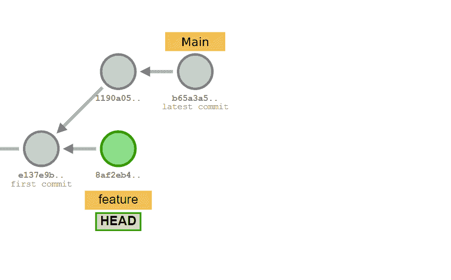
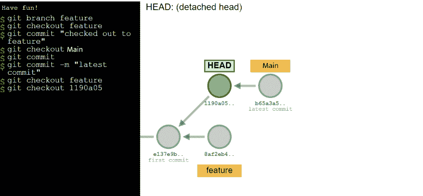
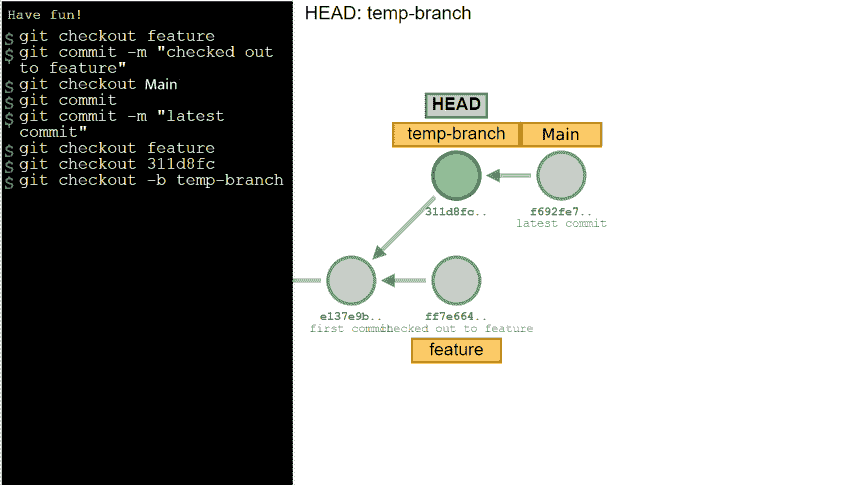
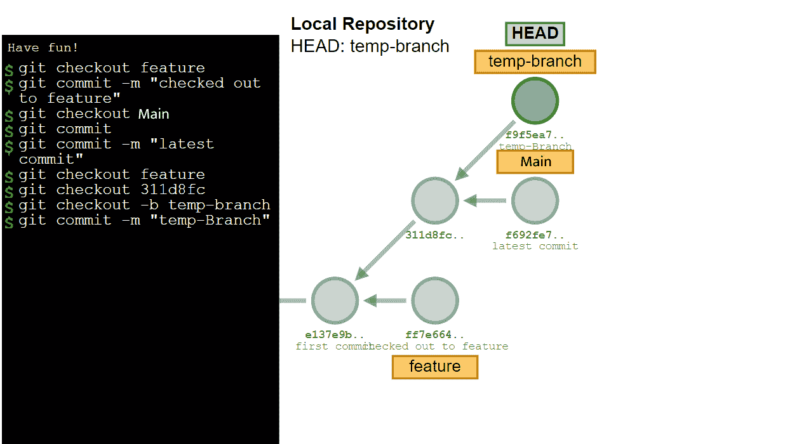
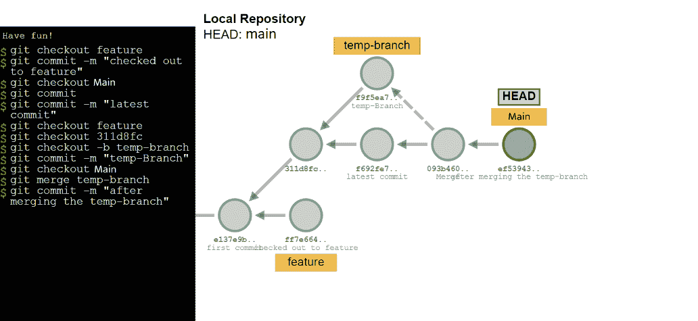

# 从 Git 分离头状态| CircleCI 中恢复

> 原文：<https://circleci.com/blog/git-detached-head-state/#2021-10-22T04:00:00-07:00>

2005 年 Git 作为源代码管理系统的引入从根本上改变了软件开发的过程。Git 允许开发人员维护代码更改或提交的历史，如果出现问题，可以在几秒钟内恢复到以前的提交。它通过允许分支来保持不同特性的代码分离，并无缝合并不同人的提交，从而使协作变得更加容易。它速度快，可伸缩，比旧版本控制工具如 Apache Subversion (SVN)和 Concurrent Versions System (CVS)拥有更多的命令和灵活性。

然而，学习 Git 比学习 SVN 或 CVS 更复杂。复杂的命令和不太直观的用户界面有时会导致不需要的状态，包括称为分离头的状态。在本文中，我们将探讨什么是 Git 分离头状态以及导致它的一些情况。然后，我们将演示如何在一个分离的头中保存或放弃更改，以便您可以从这种情况中快速恢复。

## 头分离是什么意思？

在 Git 中，HEAD 指的是当前签出分支的最新提交。然而，在一个*分离的* HEAD 状态中，HEAD 不指向任何分支，而是指向一个特定的提交或远程存储库。

下图是正常状态下的 Git 头，指向主分支中的最新提交。



在此图中，HEAD 指向当前分支中每个提交的最新提交和当前签出分支。

头也是多分支工作时的常见状态。



在这种情况下，您有两个分支，主分支和功能分支。因为您被检出到特征分支，所以 HEAD 指向那里。您可以使用以下 Git 命令创建这个场景:

```
git branch feature
git checkout feature
git commit -m “checked out to feature”
git checkout Main
git commit
git commit -m “Latest commit”
git checkout feature 
```

在上面的两个图中，HEAD 指向当前签出分支中最近的提交，这是它的正常状态。在 Git 中，您还可以检查特定的提交，这将导致分离的 HEAD 状态。继续上一个场景，如果您检查主分支上的第一个提交，您将看到 HEAD 现在被分离。



在这种情况下，HEAD 不指向任何分支—它引用提交。

## 可能导致分离磁头状态的场景

你会发现自己处于一种超然的状态，主要是通过两种情况:

1.  签出特定的安全哈希算法 1 (SHA-1)提交哈希
2.  不先提取就签出到远程分支

我们已经演示过，如果您签出 SHA-1 提交散列，您将处于分离头状态。导致分离头的另一种情况是检查远程分支。如果您检出到只读的源(主)分支，您将处于分离的 HEAD 状态。

其他一些情况也可能导致头部分离。例如，检查一个特定的标签名或在任何给定的分支上添加`^0`会导致分离的 HEAD 状态。

## 如何在分离的头中保存更改

如果你发现自己是一个超脱的头部状态，并且很快意识到，那么你可以通过检查之前的分支来快速恢复。但是，如果您错误地处于分离的 HEAD 状态，然后执行 commits over commits，该怎么办呢？如果您在分离的 HEAD 状态下提交，这是否意味着您的更改没有被保存？

一点也不。这只是意味着你目前没有附属于任何分支，因此，你的头是分离的。如果您想保留您在分离的 HEAD 状态下所做的更改，您可以通过三个简单的步骤来解决这个问题:创建一个新的分支，提交更改，以及合并更改。

### 创建新分支

要保存在分离的 HEAD 状态下提交的更改，首先需要创建一个新的分支。



从上面描述的场景继续，您创建一个名为`temp-branch`的新分支。当您创建分支并检查到它时，头部不再分离。

### 提交更改

在签出到新的分支之后，您可以提交更改，Git 将保留这些更改。



### 合并更改

现在，您检查到您想要更改的分支。在这种情况下，您希望将更改合并到主分支。因此，您首先需要检查主分支，然后合并来自`temp-branch`的更改并添加最终的提交消息。



通过这些简单的步骤，您已经成功地保存了您的更改并从 Git 分离头状态中恢复。

## 如何放弃分离头中的更改

如果要放弃分离的 HEAD 状态中的更改，只需签出到现有的或以前的分支。分离的 HEAD 状态上的提交不会影响您现有的分支，Git 会将它们存档。

下图显示了一种情况，在进入分离头状态后，您进行了两次不想保留的提交。然后，你去总分行结账。虚线圆圈表示这些提交不再是任何分支的一部分，Git 将删除它们。


注意，一旦 Git 删除了分离的 HEAD 状态提交，就没有办法恢复它们了。但是，如果它们没有被删除，您可以检查到 SHA-1 提交散列，创建一个分支，并将其合并到所需的分支以保留更改。

## 结论

Git 是一个有价值的开发工具，比 CVS 和 Subversion 等老版本工具更受欢迎。也就是说，掌握它可能会更加复杂和具有挑战性，有时会导致混乱的情况，例如分离的头部状态。

如果您发现自己处于分离的 HEAD 状态，请记住，您总是可以通过创建并检出到一个新的分支，然后提交并合并所需分支中的更改来保存您的更改。如果您不想保存更改，您可以简单地签出到任何分支，Git 会删除这些提交。

还有，Git 2.23 有一个新命令，`git switch`。这不是一个新特性，而是`git checkout`的替代命令，因此您可以在分支之间切换并创建一个新分支。要从一个分支切换到另一个分支，使用`git switch branchName`创建一个新分支，然后使用`git switch -c branchName`命令切换到该分支。

尽管在分离的 HEAD 状态下找到您的代码并不理想，但是您可以使用这些方法来移动或删除您的提交，并快速使您的项目回到正轨。