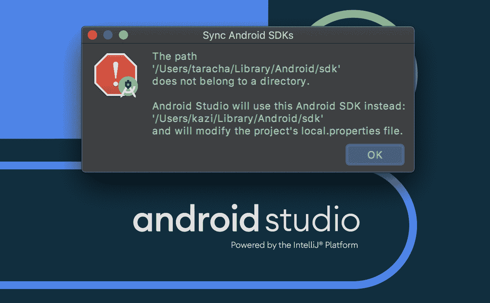
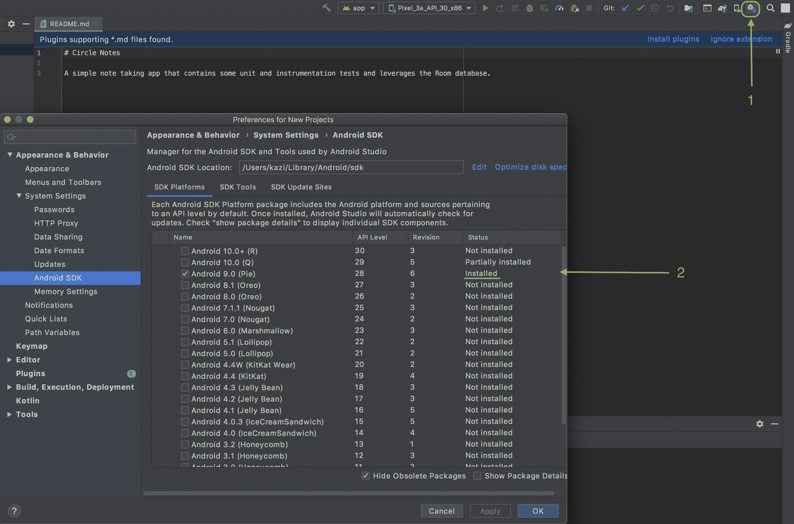
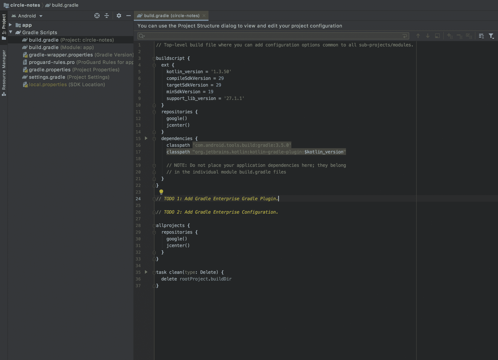
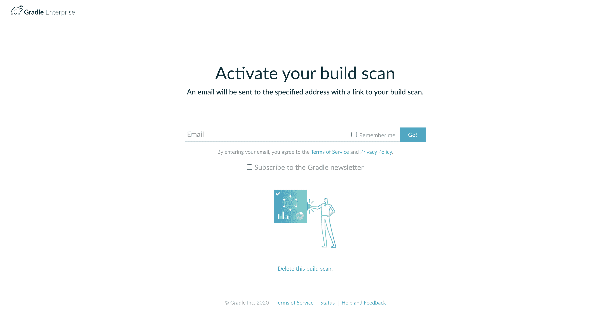
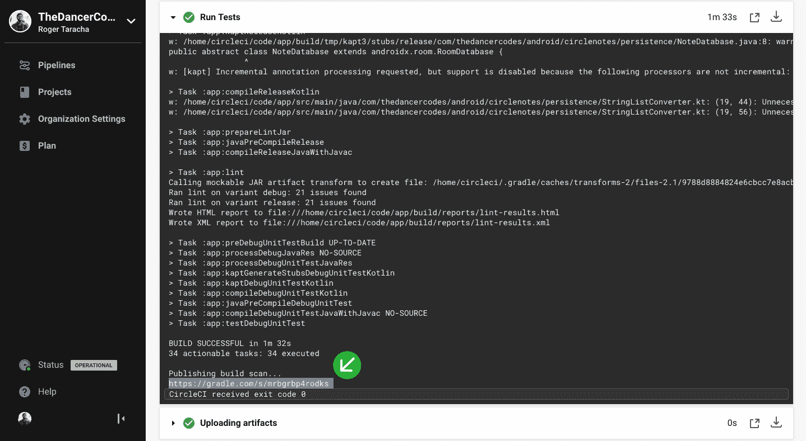
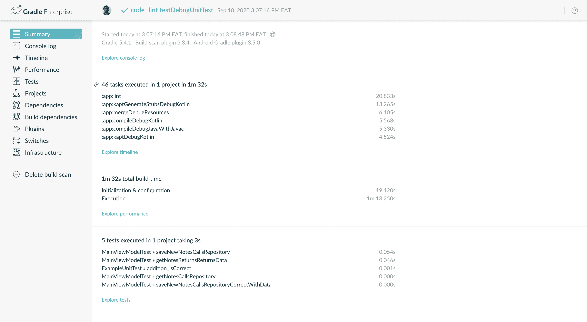
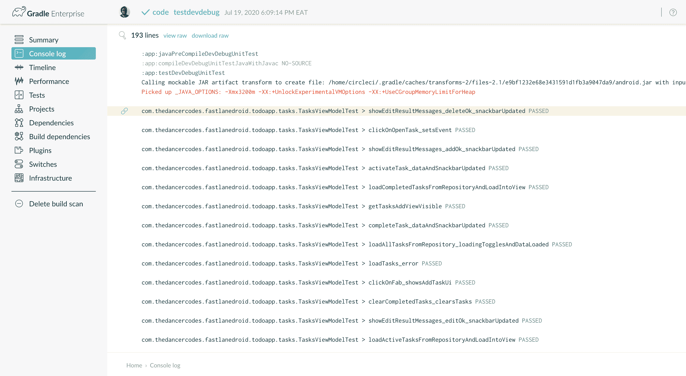
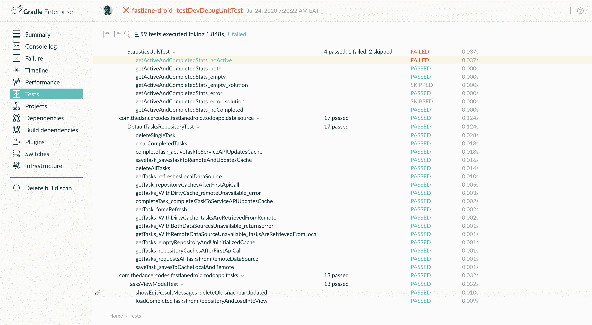
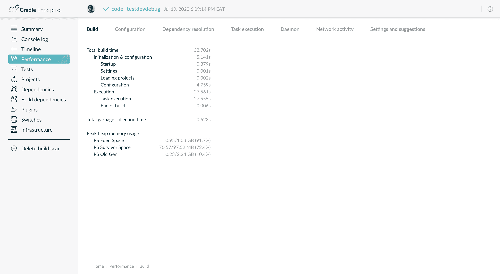
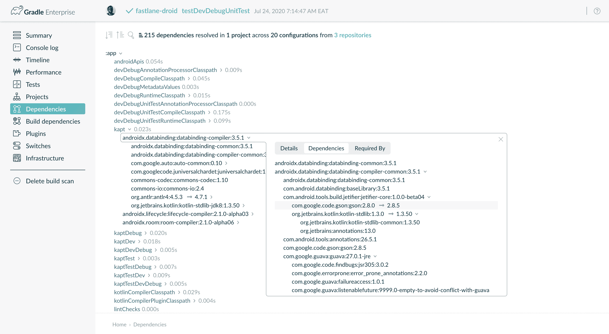

# 在 Android 项目中使用 Gradle build 扫描

> 原文：<https://circleci.com/blog/gradle-build-scans-for-android-projects-local-and-ci-builds/#2021-04-05T15:00:00-07:00>

一个[构建扫描](https://scans.gradle.com/)是一个 Android 构建的可共享的集中记录，它提供了对发生了什么及其原因的洞察。构建扫描的一些好处是:

*   他们帮助开发人员理解他们的构建每天是如何被使用的
*   它们为您提供每个开发人员和 CI 构建的深入的任务级数据、性能指标和可视化
*   开发人员可以使用构建扫描，通过发现和修复构建问题来显著提高构建速度和可靠性
*   他们通过允许开发人员共享构建扫描链接来指出问题或寻求帮助，从而创建协作

## 先决条件

要完成本教程，需要做一些事情:

1.  对 [Gradle 构建工具](https://gradle.org/)的基本理解
2.  如何在 [CircleCI](https://circleci.com/docs/language-android/) 上建立 Android 项目的知识
3.  了解 [Android 构建流程](https://developer.android.com/studio/build)。

如果在继续之前需要进一步阅读，请参考 Gradle 上的前一篇文章[使用构建缓存](https://circleci.com/blog/turbocharging-your-android-gradle-builds-using-build-cache/)加速您的 Android Gradle 构建。

## 构建应用程序

为了简洁起见，我们不会从头开始构建应用程序。相反，您将在一个初始项目的基础上进行构建。点击或`git clone https://github.com/CIRCLECI-GWP/circle-notes.git`下载启动项目[。我们将使用构建扫描](https://github.com/CIRCLECI-GWP/circle-notes/releases/tag/v1.0)[文档](https://docs.gradle.com/enterprise/gradle-plugin/#getting_set_up)。

步骤:

*   一旦本地有了项目，就在 Android Studio 中打开它。如果出现提示，在同步 Android SDKs 对话框中点击**确定**。



*   点击 **1** 并确认 **2** 被选中。这意味着已经安装了 API 级别 28。如果不是，点击复选框，然后**应用**和**确定**。否则，点击**确定**。



*   点击 Android Studio 上的运行按钮。


*   模拟器将启动，应用程序将运行。

 </blog/media/2020-07-19-circle-notes.mp4> 

## 正在设置

首先，我们将应用 Gradle Enterprise Gradle 插件。因为我们的项目使用 Gradle 版本`5.4.1`，我们将使用`com.gradle.build-scan`作为插件 ID。

插件必须在项目的`build.gradle`文件中应用。



```
// TODO 1: Add Gradle Enterprise Gradle Plugin.
plugins {
  id "com.gradle.build-scan" version "3.3.4"
}

// TODO 2: Add Gradle Enterprise Configuration.
gradleEnterprise {

} 
```

**注意** : *在本教程剩余部分的代码片段和截图中，我已经删除了‘TODO’行。*

## 连接到 scans.gradle.com

因为我们没有设置 Gradle Enterprise 服务器，我们的构建扫描将发布到`scans.gradle.com`。

您需要同意 https://gradle.com/terms-of-service.的服务条款(TOS)。您可以通过将以下内容添加到您的版本中来同意 TOS:

```
plugins {
    id "com.gradle.build-scan" version "3.3.4"
}

gradleEnterprise {
    buildScan {

        // Connecting to scans.gradle.com by agreeing to the terms of service
        termsOfServiceUrl = "https://gradle.com/terms-of-service"
        termsOfServiceAgree = "yes"
    }
} 
```

**注意** : *不同意您的构建中的 TOS 意味着每次您试图将构建扫描发布到`scans.gradle.com`时，系统都会提示您这么做。*

## 控制何时发布构建扫描

事实证明，在您应用插件后，构建扫描不会自动发布。但是，对于本教程，我们希望发布每个构建。我们可以通过使用`publishAlways()`指令来做到这一点:

```
plugins {
    id "com.gradle.build-scan" version "3.3.4"
}

gradleEnterprise {
    // configuration
    buildScan {

        // Connecting to scans.gradle.com by agreeing to the terms of service
        termsOfServiceUrl = "https://gradle.com/terms-of-service"
        termsOfServiceAgree = "yes"

        // Publishing a build scan for every build execution
        publishAlways()
    }
} 
```

确保在对`build.gradle`文件进行更改后同步项目。


## 生成本地生成扫描

要生成本地构建扫描，请在 Android Studio CLI 中运行以下 gradle 任务:

```
./gradlew assembleDebug --scan 
```

在命令后添加`--scan`会发布按需扫描。

在`assemble Gradle`任务完成运行后，您将在 CLI 中看到构建扫描链接输出。


这个项目使用 JDK8 运行良好。如果你运行的是 JDK 10 或以上版本，可能需要在 app 层面对这三个文件:`gradle/wrappper/gradle-wrapper.properties`、`build.gradle`、`settings.gradle`做一些修改。

您可以在本教程中使用一个例子: [Pull Request](https://github.com/CIRCLECI-GWP/circle-notes/pull/1) 。这些更改确保您的目标是最新版本的 gradle (6.7)，并更新构建扫描插件以与 gradle 6.7 一起工作。

单击链接打开构建扫描。



输入您的电子邮件以激活构建扫描。扫描将发送到您的电子邮件收件箱。

**注意** : *选中**记住我**复选框，你的电子邮件地址可以保存 90 天。*


恭喜你！您已经生成了本地生成扫描。

## 生成 CI 构建扫描

生成持续集成(CI)构建扫描取决于您如何设置您的构建。在这部分教程中，我将向您展示如何使用`circle-notes`项目设置 CI 构建扫描。使用这个项目，每当我们向主分支提交变更时，就会触发构建扫描。无论构建是失败还是成功，都会触发构建。

本教程的 starter 项目中已经提供了`config.yml`文件。您需要在 Circle CI 上设置此项目，以触发 CI 构建。

如果你是第一次这样做，点击**设置项目**，然后**使用现有配置**。然后点击**开始建造**。

我们所做的任何更改都会触发一个工作流，其中运行`unit test`和`lint`作业。


点击 **build** 查看详情。



当您在浏览器中打开构建扫描链接时，系统会提示您激活构建扫描。(就像本地生成的一样。)当您激活它时，您应该会看到属于 **lint** 和**单元测试**任务的构建扫描。



恭喜你！您已经生成了 CI 构建扫描。

## 如何使用构建扫描

在这一节中，我将强调您可以使用构建扫描做的几件事情。

### 1.共享控制台日志

生成扫描包括由生成产生的控制台输出。该版本使用的许多工具(如编译器)会将诊断信息写入控制台日志。

使用左侧导航菜单访问**控制台日志**部分。点按任意线条以高亮显示它，或者按住 shift 键点按以高亮显示线条块。



您会注意到浏览器的当前位置已经更新。通过与同事共享该 URL，您可以将他们引向您希望他们看到的确切控制台输出。构建扫描的许多方面都可以直接链接，使共享和协作更加容易。

### 2.查看和共享测试执行结果

测试是软件开发的基石。构建扫描可视化测试结果，包括测试持续时间、日志输出和结果。

使用左侧导航菜单访问**测试**部分。单击任何失败的测试，查看控制台输出和错误跟踪。



构建扫描的链接使得开发人员几乎可以毫不费力地与他们的团队和其他同事共享本地构建的测试结果。这种简单的协作使得解决测试失败更加有效和快速。

### 3.分析构建性能

构建扫描的一个主要好处是它们提供了对构建性能的广泛洞察。许多构建在不同的机器上会有不同的表现。深入的性能洞察让用户能够优化构建的每个角落。

从左侧导航菜单中点击**性能**。



性能的每个方面都有一个选项卡。第一个**构建**选项卡显示了高级构建时间细分和内存信息。

**配置**选项卡分解了在构建中配置项目所花费的时间。该细分交互地突出了构建期间使用的最慢的脚本、插件和生命周期回调。优化这些速度较慢的物品，使你的构建速度更快。

**任务执行**选项卡根据结果对构建任务进行分组，并提供它们的简明分类。使用这个高级视图来理解特定构建的增量构建和构建缓存覆盖率。专用的**时间线**部分(可从左侧导航菜单中获得)提供了可视化任务执行的另一个视图。单击任务名称以获取更多详细信息。时间线部分清楚地显示了构建的并行利用。

**网络活动**标签列出了构建过程中产生的网络请求，可以用来识别缓慢的依赖库或特别麻烦的请求。

### 4.了解您的依赖关系

每次构建扫描都提供了在构建期间解析的每个依赖项配置的交互式可视化。您可以按名称或解决方法的类型搜索版本中所有项目的依赖项。



## 结论

本教程完成！您学习了如何:

*   生成本地和 CI 构建扫描
*   在线查看版本扫描信息
*   创建一个脚本，为所有生成启用生成扫描

使用您所学到的知识来优化构建，并提高团队的生产力和绩效。

* * *

Taracha 是一个创造者，他的使命是帮助公司用最简单的方式解决复杂的问题。他关心寻找他热爱的愿景&事业，并利用技术帮助这些公司解决他们的挑战。

他有超过 6 年的本地移动应用程序开发经验&大约 4 年的 web 应用程序开发经验。

他目前是 Premise Data 的高级软件工程师，负责新产品功能的开发和部署，对开发人员生产力工程领域特别感兴趣。