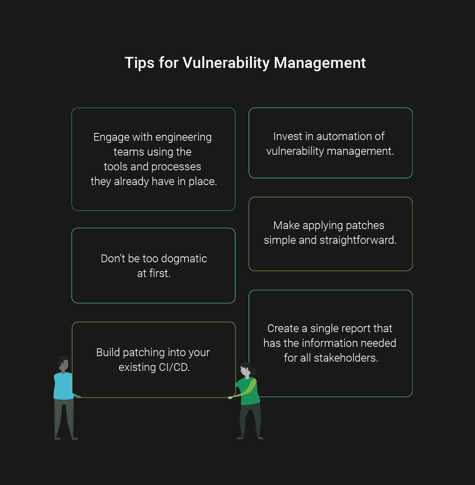

# 利用 Docker 和 CI/CD - Kubernetes | CircleCI 进行漏洞管理

> 原文：<https://circleci.com/blog/how-to-do-vulnerability-management-with-docker-and-ci-cd/#2020-08-05T02:14:00-07:00>

在软件包、软件库、操作系统和基础设施中不断发现漏洞。漏洞管理是对软件漏洞进行扫描、分类、优先排序和修补的持续过程。为了稳定和安全，所有现代技术堆栈现在都需要这种周期性的维护和更新。

这是安全性遵从的核心方面之一。在过去的几年里，CircleCI 通过了 [FedRAMP 认证](https://circleci.com/blog/modernizing-federal-devops-circleci-becomes-first-continuous-integration-tool-with-fedramp-authorization/)和 [SOC 2 Type II 合规性](/blog/continuous-integration-that-you-can-trust/)，这两项认证都让我们与需要我们漏洞管理流程细节的审计员进行了配对。

虽然漏洞管理是一项绝对必要的基本安全实践，但它通常也是乏味且重复的。这使得它成为自动化和优化的首选。构建足够严格的流程以满足审计员的要求，而不增加我们团队和工程组织的大量开销，这是一个有趣的挑战。

从更个人的角度来说，当 Docker 的 DevSecOps 好处最终为我所用的时候，我就完成了这个挑战。

在这篇文章中，我将向您介绍我们开发的漏洞管理流程，该流程旨在满足审计人员的要求，并与我们团队对 CI/CD、Docker 和 Kubernetes 的使用保持一致。

## 使用 Docker 技术堆栈打补丁

一点背景:CircleCI 的栈是基于 Docker 的。已经有许多文章讨论了这与传统的基于服务器的架构有何不同，以及这如何影响开发和开发。它还会影响安全性，尤其是对这个帖子来说，影响漏洞管理。

Docker 镜像是不可变的，包含自己的基础设施包和库，这意味着你不能在传统意义上“给服务器打补丁”来“修补”一个。取而代之的是，创建并部署一个具有更新的依赖关系的新映像，并淘汰旧映像。

由此得出的第一个推论是，修补将导致更多部署，映像所有者和 SRE 团队需要了解并能够处理这些部署。我们利用现有的稳定管道进行持续部署，这意味着额外的部署对我们的运营影响极小。

其次，Docker 可以将修补的维护成本分散到更多的工程组织中。在传统的基于服务器的环境中，管理员或 sre 维护服务器并部署补丁程序。在 CircleCI，开发团队负责维护他们的 Docker 映像，因此也负责为它们应用安全补丁。一些开发团队可能需要适应与他们使用的 Docker 映像相关的安全维护工作。

第三，许多法规遵从性专业人员和审计人员不太熟悉这种技术体系的工作方式及其对漏洞管理的影响。留出时间与他们一起了解这些工具如何影响修补流程非常重要。

## 草拟一份计划

安装漏洞扫描器本身并不能保护任何东西。与所有安全工具一样，为了获得任何好处，这些工具需要应用到我们的系统中。

当我们开始这个过程时，我们知道我们的计划会是这样的:

1.  了解实际情况有多糟糕，并在运行中获取一些高优先级补丁。
2.  开始为拥有 Docker 图像的团队提供更紧密的反馈环。
3.  围绕票据生成和报告重新审视工具和构建自动化。
4.  找到一种方法来帮助团队优化和调整他们的修补流程。

贯穿整个工作的一个核心原则是使用工程团队每天都在使用的工具和界面向他们提供反馈:这是一种比使用基于分心的方法(如 Slack、提醒、电子邮件、会议和报告)更有效的方法。

## 通用起点:电子表格

我们需要做的第一件事是掌握项目的规模和范围，并能够对原始数据进行排序和过滤，以了解我们的情况。

所以我们从许多项目开始的地方开始:电子表格。

我们跑了。csv 导出到电子表格中，添加了用于汇总的公式和一些简单的 AppScript 代码，以进行一些数据清理和协调。我们希望了解当前在我们的实时系统中运行的不同映像和容器，它们有哪些漏洞，以及存在哪些修补节奏；只是在制作任何门票或与任何开发团队交谈之前已经存在的东西。哪些服务有正式的所有者，我们需要为哪些服务寻找所有者？来自工具的数据是什么样的？对我们来说，首先在电子表格中手动查看这些数据是很重要的，这样当我们自动化时，我们就能理解来自扫描仪的数据。

这一步提供了很多细节，让我们对数据中的一些不一致和复杂之处有了初步的了解。另一组重要的信息是没有列出任何官方团队所有者的图像和容器的数量。

然后是分配票证的时间，首先关注具有关键漏洞的映像。我们手动生成第一轮门票，并将其分配给各个团队。因为一些图片没有列出所有者，我们做了一些有根据的猜测，然后观察这些门票是否被转移到其他球队。

收到这些门票的一些团队不习惯从其他团队获得门票，更不用说从安全团队获得门票了。起初我们遇到了一些阻力——开发团队以前没有负责 Docker 映像维护的任务，他们担心这会花费多少时间。我们与这些团队合作来帮助部署初始补丁，这给了我们一个机会来讨论打补丁的重要性，以及它将如何成为一件更常规的事情。

在此阶段发生的另一组对话是与我们的审计人员进行的。在推出我们政策的第一稿后，我们意识到我们的修补时间表太激进了(事实证明审计员已经想到了这一点，但没有推后)。开发团队跟不上。我们意识到，制定合理的政策并付诸实施比过于激进和不断制造例外要好。我们与我们的审计员合作，将政策更新到现实的水平..对于我们来说，这是关于我们的过程成熟度的重要一课。一旦我们有了可重复的过程，我们可以在以后收紧时间框架。

我们在这个阶段学到的一件事是避免完美。如果一个特定的团队处于水深火热之中，一张票在几个团队之间被踢来踢去，或者一个特定的补丁出现了技术问题，不要阻止自己。在补丁和团队中尽你所能取得进步。

## 使用 CI/CD 划分和自动化工作负载

我们取得了可以取得的初步进展，并进入了下一阶段。这是导致服务定期修补的最大变化。这也是作为一名开发人员，Docker 的好处真正吸引我的地方。

在传统的基于服务器的基础架构中，测试环境独立于生产环境，这些环境需要独立的修补程序和更多基于任务的开销来发现是否有任何特定的修补程序导致问题。

因为 Docker 映像在一个明确定义的部署单元中包含了它们的软件依赖关系，所以扫描 CI/CD 管道中的映像变得很简单。通过包含软件依赖性的自动化测试，可以使用现有测试快速试用和验证补丁。

> 通过将其集成到 CI/CD 管道中，漏洞修补将不必是我们每个月都要做的一件大事。它将被融入我们发布软件的方式中。

对于那些计划在你的团队中采用这种方法的人来说，要知道这首先会引起痛苦。即使你的团队在 CI/CD 方面很棒，任何时候你在你的构建管道中增加一个步骤，导致构建中断，否则就会通过，人们会感到沮丧。你必须和他们合作才能回到绿色。这没问题，但要做好准备。任何有一段时间没有打补丁的系统都将需要明显更多的时间来清理，因此在打补丁的最初阶段，请确保与团队和管理层进行协调。将事情部署到服务组，并准备在最初几轮修补发生时，为特定服务提供临时例外或短期禁用。

这一阶段的核心原则是嵌入开发过程的快速反馈循环有助于团队使其成为持续活动的一部分，而不是需要大块的单独跟踪工作。这使得团队更容易遵守。

## 自动化生产扫描

尽管 CI/CD 集成改变了游戏规则，但它本身不足以进行漏洞管理。它在捕捉由新部署引起的漏洞方面做得很好，但漏洞的挑战之一是它们总是在现有软件中被发现。今天可能会出现一个漏洞，它会影响昨天通过所有测试并投入生产的代码。CI/CD 只是拼图的一半；生产环境扫描是另一半。

换句话说，为了与团队沟通的效率，与 CI/CD 的集成是无可匹敌的。但是为了全面了解您的漏洞，需要进行产品扫描。

回到我们去过的电子表格…

…但不会太久。电子表格对于获得数据的概览非常有用，但是如果您想要开始生成票证并报告您的漏洞管理进展情况，您将需要比电子表格所能容纳的更多的分析。因此，我们构建了一个集成管道，为安全团队自动化了最大的手工工作。这意味着从生产漏洞扫描器中取出数据，并将其放入票证中。正如我之前强调的，让安全团队使用他们已经在日常使用的工具与工程团队会面是一个非常好的主意，所以让我们的程序将数据转化为票证是至关重要的。

这不仅仅是一个简单的连接器。从漏洞扫描器获取数据并将其转换为票证的过程涉及复杂的细节，需要我们使用真正的编程语言。我选择在 Clojure 中实现这种自动化，因为这是 CircleCI 的主要开发语言，在做技术决策时，考虑维护是很重要的。这必然包括考虑让公司里的其他人来维护工具。

乍一看，这种集成听起来非常简单:从 prod 漏洞扫描器中取出数据，对其进行转换，并制作标签。著名的遗言。

这种集成需要牢记许多挑战:

我们需要更新现有的票证，这样开放的票证就不会重复。我们在吉拉添加了一个 vuln-mgmt-id 来跟踪图像/门票身份映射

随着时间的推移，源 API 和目标 API 都发生了显著的变化。为了解决这个问题，我们围绕集成的 API 构建了抽象层，包括吉拉和扫描工具。

该服务必须将所有不同发行版、库和工具的奇怪数据标准化，使之保持一致。从“适度”到“中等”(容易)，再到每个供应商都有不同的“固定版本”(更难)。

为了解决这一问题，我们构建了一个数据标准化层，该层将严重性标准化，在子包中删除重复的 CVE(常见漏洞和暴露),并解析许多不同的字符串格式以获得修复版本。我们还标准化了包信息，以便向团队提供明确的要求，告诉他们应该在票证细节中修补哪个版本。

**在吉拉工程项目和团队变更时，如何将船票分配到正确的目的地。**我们创建了一个灵活的团队分配配置，包括正则表达式和部分匹配。团队分配中的另一个关键学习是，如果配置匹配多个团队或零个团队，则抛出一个错误。这将通知安全团队是否需要任何额外的配置。

这需要相当多的工作，但却产生了一个简单的命令行应用程序，它可以读取最新的信息，生成详细的票证，并在几分钟内将它们分配给团队。

此阶段的关键原则是投资自动化，消除安全团队的重复和易错工作。像灵活的团队配置这样的事情每周都节省时间，因为团队分配或未知容器的小变化经常发生。

## 生产报告

关于安全工作，要记住的一件关键事情是，仅仅做正确的事情是不够的；你必须能够表明你在做正确的事情。报告的目标是创建一个涵盖所有人(高管、团队经理、审计员)需求的单一报告。这不仅节省了工作，而且有助于确保每个人对事物的状态有相同的理解。

由于 Docker 的漏洞管理不同于传统的修补，我们必须与我们的审计员合作，以便他们能够了解我们是如何分配工作的，并利用我们生成的报告。传统上，系统管理员团队是打补丁的人，这是我们的审计员习惯看到的。这需要一些工作来解释，在我们的例子中，整个组织的每个工程团队都要打补丁。经过一番反复之后，我们在报告中添加了一些额外的细节，并能够设计出一种满足 FedRAMP 审计员和内部利益相关者需求的报告格式。

此阶段的主要原则是调查并找出一份令所有相关方满意的报告，然后自动生成该报告。

## 优化修补

与各个团队合作，优化他们的修补方式。确保这是合作而不是命令。目标是帮助他们将补丁安装到现有工作流中，而不是创建新的工作流。请记住，工程团队更熟悉他们的流程，并且会有一些关于如何以安全团队可能没有想到的方式进行优化的好主意。

这里最有成效的三种技术是自动化集成测试、共享基础映像和软版本规范。

1.  自动化集成测试，一般来说应该是 CI 管道的一部分，允许更快更有信心地应用补丁。因为补丁自动运行完整的集成测试套件来检测由补丁引起的问题，所以这允许需要更少人力的补丁查看方法。
2.  共享的基本 Docker 映像允许具有相似基础架构和软件需求的服务基于一个公共映像。常见更新的收集在一个映像中完成，然后推广到所有特定的服务。这让大多数开发团队可以简单地将最新的共享作为任何补丁的第一步。
3.  通过简单地指定包的主要版本或主要+次要版本，并让包管理器作为预定 Docker 映像构建的一部分自动更新到最新版本，就可以完成软版本规范。如果计划的构建每周运行一次，并且消除了许多对持续修补的人工干预。这种自动化版本碰撞存在一些操作风险，因此如果开始这种级别的自动化，进行彻底的集成测试并首先在不太关键的服务上进行测试是非常重要的。

*这一阶段的核心原则是使贴片更容易。对安全团队来说，对漏洞进行深入分析和优先排序既昂贵又耗时。错误地将高严重性漏洞标记为在环境中不适用也有很大的风险。如果补丁流程简单明了，团队将简单地应用补丁并使一切变得更容易。*

## 漏洞管理提示

**(或者，如何与审计员、Docker 和 CI/CD 系统合作)**

1.  使用工程团队已有的工具和流程与他们合作。
2.  一开始不要太教条。
3.  在您现有的 CI/CD 中构建补丁。
4.  投资漏洞管理的自动化。
5.  创建包含所有利益相关者所需信息的单一报告。
6.  使应用补丁简单明了。

## 结束语

在推出漏洞管理时，很容易陷入早期关注并进入救火模式。请记住，这不仅仅是一轮修补、一个关键漏洞或一个团队或映像。这是一种一致的可重复自动化，可持续提高安全性，同时最大限度地减少对工程和安全团队工作流程的影响。

