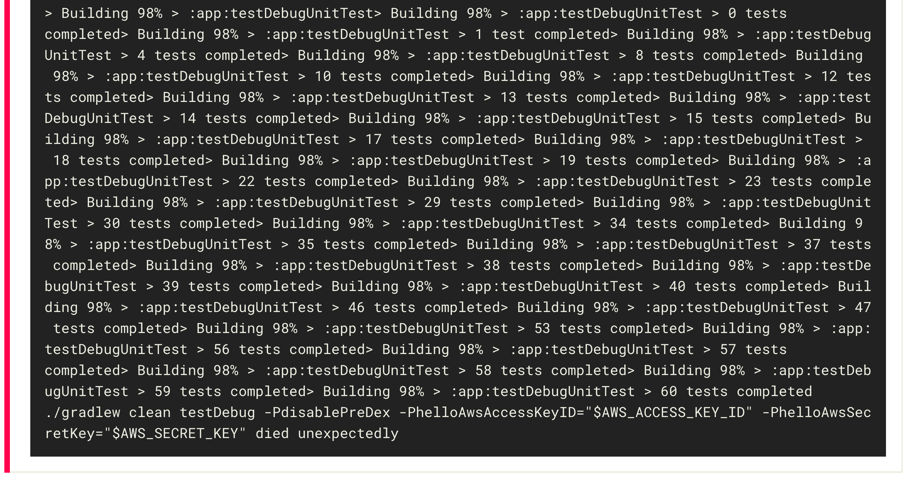

# 如何处理 Java OOM 错误

> 原文：<https://circleci.com/blog/how-to-handle-java-oom-errors/#2017-12-06T07:18:00-08:00>

**来自出版商的说明:**您已经找到了我们的一些旧内容，这些内容可能已经过时和/或不正确。尝试在[我们的文档](https://circleci.com/docs/)或[博客](https://circleci.com/blog/)中搜索最新信息。

* * *

试图在一个 [CI](https://circleci.com/continuous-integration/) 环境中控制 Java 的内存使用可能是一种黑暗的艺术。

由于 Java/Android 项目有丰富的构建框架可用——Java、Gradle、Maven(更不用说 Kotlin 和它自己的工具生态系统了)——很难控制内存的去向以及如何限制内存。您可以设置各种不同的环境变量来管理内存使用，它们都具有相似的名称和语法。这些变量以一种最初可能没有多大意义的方式相互作用。默认情况下，CircleCI 上的项目构建在具有 4GB RAM 的虚拟环境中。这个 RAM 由项目中运行的所有进程共享:数据库、测试、各种工具/框架，以及贪婪的 Java 虚拟机(JVM)。

在没有任何内存限制的情况下，众所周知，Java 虚拟机会以大块的形式预先分配大量内存，这有时会导致您在 CircleCI 和其他 CI 平台上看到的内存不足(OOM)错误。此外，CircleCI 运行在具有大量 RAM 的虚拟机上，使用 [cgroups](https://en.wikipedia.org/wiki/Cgroups) 为每个单独的构建分配一块馅饼。当 JVM 询问它的主机它可以使用多少 RAM 时，它看到的是整个饼图，而不是分配给它的构建的特定 cgroup 的 RAM。

最后，当 OOM 错误确实出现时，它们通常只不过是一个`exit code 137`错误，隐藏在一个长长的构建日志的底部。是什么导致了这些类型的错误，减轻这些错误的最好方法是什么？让我们看看设置 JVM 内存限制的不同方法。您可以参考这个方便的图表来查看这些不同的环境变量是如何相互作用的。

数字表示优先顺序，即 0 优先，3 优先。

| Java 环境变量 | Java 语言（一种计算机语言，尤用于创建网站） | 格拉德勒 | 专家 | 科特林 | 莱因 |
| _ JAVA _ 选项 | 0 | 0 | 0 | 0 | 0 |
| JAVA _ 工具 _ 选项 | 2 | 3 | 2 | 2 | 2 |
| JAVA_OPTS | 不 | 2 | 不 | 一 | 不 |
| JVM_OPTS | * | 不 | 不 | 不 | * |
| LEIN_JVM_OPTS | 不 | 不 | 不 | 不 | 一 |
| 梯度光学 | 不 | 一 | 不 | 不 | 不 |
| MAVEN_OPTS | 不 | 不 | 一 | 不 | 不 |
| CLI 参数 | 一 | 不 | 不 | 不 | 不 |

****** lein 会将 JVM_OPTS 的值传递给它所衍生的 Java 进程；然而，这个 env 变量不影响 lein 本身(为此，使用 LEIN_JVM_OPTS)，也不会影响任何直接启动的单独 Java 进程(为此，使用 _JAVA_OPTIONS 或 JAVA_TOOL_OPTIONS)*

_JAVA_OPTIONS
这是最强大的 JAVA 环境变量。它由 JVM 直接读取，并覆盖任何其他 Java 环境变量，以及您在命令行上传递的任何参数(例如，java -Xmx512m -Xms64m)。出于这个原因，通常不推荐使用 _ JAVA _ OPTIONS——更集中的方法通常也能很好地完成工作。

同样值得注意的是`_JAVA_OPTIONS`是特定于 Oracle 的，所以它并不适用于所有情况。例如，对于 IBM 的 Java 工具，您需要使用`IBM_JAVA_OPTIONS`。

*JAVA _ TOOL _ OPTIONS*
[这个](https://docs.oracle.com/javase/8/docs/platform/jvmti/jvmti.html#tooloptions)是设置 JAVA 内存限制的安全选择。所有 Java 虚拟机都可以读取它，并且很容易被覆盖，要么使用命令行参数，要么使用更具体的环境变量，这取决于您的构建工具。而且[比`_JAVA_OPTIONS`](https://bugs.openjdk.java.net/browse/JDK-4971166) 更擅长处理报价。

JAVA_OPTS
有些令人误解的是，JAVA_OPTS 实际上并不被 JVM 读取，而是被各种常见的基于 JAVA 的工具/语言用来将内存限制传递给 JVM。

JVM_OPTS
JVM_OPTS 是 Clojure 特有的:lein 用它向 JVM 传递内存限制。然而，它实际上并不影响 lein 自己的可用内存——为此，您将需要 LEIN_JVM_OPTIONS。再者，它不是 Java 原生识别的，所以不能用它直接把内存限制传递给 Java；为此，请参见 _JAVA_OPTIONS_ 或 JAVA_TOOL_OPTIONS。

*GRADLE_OPTS*
可以预见，这个变量用于为 GRADLE 项目设置内存限制。它优先于任何用于设置 JVM 内存限制的通用 env 变量——除了 _JAVA_OPTIONS。_

*MAVEN_OPTS*
您可以使用 MAVEN_OPTS 为用 Apache Maven 构建的项目设置 Java 内存限制。像 GRADLE_OPTS 一样，这将覆盖 JAVA_TOOL_OPTIONS，但不会覆盖 _JAVA_OPTIONS。_

## 调试 OOM 错误

当谈到调试不透明的 OOM 错误时，您最好的选择是寻找那个`exit code 137`。让我们以 Gradle builds 为例。当构建在 Docker 上使用太多内存并被 Linux OOM killer 终止时，Gradle 会产生令人困惑的错误消息。

Gradle 通过为构建过程启动子过程来工作。当一个构建使用太多内存时，通常是子进程的错误，而不是父进程的错误。子进程被终止，父进程被告知两个进程都以代码 137 退出。错误消息可能会说“意外的进程退出，代码为 137”，或者您可能会看到“Gradle build daemon 意外消失”(退出代码 1)，或者甚至只是”。/gradlew 意外死亡”，根本没有任何退出代码。这些错误消息都没有提到“内存”、“cgroup”、“docker”或“oom killer”这样的词，所以诊断这个问题真的很难。

不过，现在已经有帮助了:Java 有了一个新的(有点)能力,可以读取你构建的 Docker 容器的 cgroup 内存限制，而不是(错误地)读取整个机器的总内存。这些新选项应该可以让 JVM 更容易地使用机器上的“大部分”内存，而不会溢出。

总之，最好确保您的`-Xmxn`最大大小足够让您的 Java/Gradle/Maven 应用程序构建、测试和部署，但又足够小，让其他进程充分共享您的 CircleCI 构建容器中的剩余内存！

当然，如果有必要的话，我们可以随时[提高你项目的 RAM](https://circleci.com/docs/configuration-reference/#resource_class) 。

### 延伸阅读: