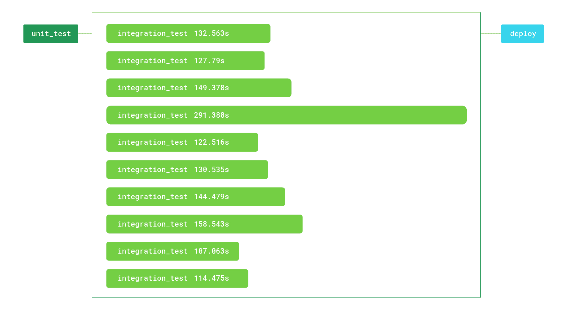
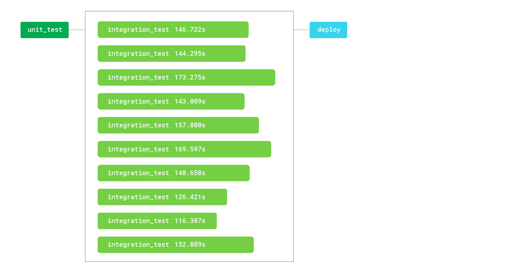

# 带 CircleCI 的智能 CI/CD:测试拆分- CircleCI

> 原文：<https://circleci.com/blog/intelligent-ci-cd-with-circleci-test-splitting/#2019-10-18T12:02:00-07:00>

在 CircleCI，我们的团队每天都在努力为工程生产力构建最佳的高性能平台。有一些我们熟知的功能:工作流、orb 和一流的 Docker 支持。但 CircleCI 团队也在幕后努力优化，以使软件开发更快、更智能、更安全——我们意识到我们的客户可能不知道这些方式。为此，我们想带您了解我们平台的一些鲜为人知的方面。我们将向您展示它们是做什么的，它们是如何工作的，并为您提供让 CircleCI 的内置智能为您工作的提示。今天的帖子是关于测试分裂的。

### 速度和利润的智能测试拆分

对开发人员效率最重要的贡献之一是开发人员是否能尽快得到他们需要的信息——测试结果可能是最重要的。开发人员花在等待测试运行上的任何时间都不是花在编写下一段代码上的时间，更不用说等待和失去他们正在工作的上下文的成本了。快速反馈就是一切。

您知道 CircleCI 可以[智能拆分测试](https://circleci.com/docs/parallelism-faster-jobs/)以更快地获得您的测试结果吗？

测试和测试套件的长度变化很大。如果您天真地将测试拆分成不同的任务，您可能会花费大量的时间等待，因为您需要等到组中的最后一个任务完成后才能继续。出于这个原因，测试拆分非常重要。

CircleCI 具有内置的平台智能，可以根据您的并行性水平将您的长测试和短测试分组在一起，以最大限度地减少您的测试套件的总时间。我们挖掘您跑步的历史持续时间数据，以优化最短的可能套件。现在，我们的[性能计划](/pricing/)中的客户可以从测试分割中获得更多，因为他们不受容器的限制:他们可以同时运行 10、20 甚至 40 个测试分组，而不必为访问 40 个容器付费。

让我们看一个例子。假设您有一个单元测试工作和一系列集成测试。您已经设置了您的工作流，以便当该作业完成时，集成测试作业以 10 倍的并行度运行。这些包括一些运行时间长得多的测试，因为它们包括启动浏览器或与数据库对话等步骤。如果您天真地将它们分割成每个容器相同数量的测试，那么您很容易就会陷入这样一种情况:您有许多完成的工作单元(例如，因为它们每个都花了一分钟)，并且一个任务必须运行 10 倍长的时间，因为您碰巧将最长的测试组合到一个任务中。相反，如果你把这些按时间展开，整个单位的工作现在需要接近 1 分钟，而不是 10 分钟。

有了这个改变，你的测试套件就增加了 10 倍。

我们还可以分享 CircleCI 测试套件中的一个真实例子。这里有一组测试，分组在相同测试号(但测试长度不同)的簇中，随机分布在 10 个容器中。该图中的每个条形代表一组随机的测试:

下面是这些相同的测试，根据我们的历史运行数据重新分组，以优化相似的运行时间:

在随机分布的情况下，最快的一组测试记录为 107 秒，最慢的为 219 秒。

启用智能测试分割后，最快的分组达到了 116 秒，但最慢的却飙升到了 173 秒。

这意味着总的来说，我们已经将传播从 184 秒减少到 57 秒。

并且:CircleCI 可以自动为你做到这一点。当您启用测试分割时，CircleCI 将不断动态地重新平衡您的测试分割，以最大限度地减少您等待结果所花费的时间。

### 如何充分利用测试拆分

CircleCI 自动从您的测试文件中为您拆分测试。但是在你的控制范围内有一些事情可以优化你的测试分割:

1.  **启用 CircleCI 的[测试元数据集合](https://circleci.com/docs/collect-test-data/)以启用测试拆分。**几乎所有的测试框架都允许您将测试结果输出到一组 XML 文件或 cumber JSON 文件中。如果您的套件可以生成这些文件类型，我们将解析这些结果(例如:您运行了多少次测试，失败了多少次)，并使用计时数据来优化未来的运行。此外，您还将获得额外的特性，比如 CircleCI UI 中的格式化故障数据。关于从你的测试数据中扩展洞察力的例子，请看[这篇博文](/blog/how-to-output-junit-tests-through-circleci-2-0-for-expanded-insights/)。

2.  **打开定时数据分割。**我们所有的[测试分割方法](https://circleci.com/docs/parallelism-faster-jobs/#splitting-by-timings-data)在任务间动态地自动分配你的测试。按时间划分是我们优化测试结构的最明智的方法，以最快的速度通过测试(阅读[这篇博文](/blog/how-to-boost-build-time-with-test-parallelism/)中 Amio 团队使用 Gradle 设置测试的例子)。一旦您启用了按时间划分，CircleCI 将从以前的运行中查找时间数据，并预测运行每个测试需要多长时间，然后分配测试以最小化获得结果所需的总时间。

3.  不要编写依赖于排序的测试。这是一个超越自动测试分割的最佳实践。结构良好的测试是相互独立的。不推荐编写跨测试的依赖关系，因为这会妨碍您利用并行性或重新排序。

4.  保持你的测试文件小而有条理。相反，进行有用的测试分组。保持它们较小，以便我们可以根据需要调整它们来优化您的测试。小工作单元是组织和优化的关键。例如，对于 Rails 或 Ruby 测试文件，CircleCI 会对文件进行重新排序，但不会对这些文件中的测试进行重新排序。如果所有内容都在一个文件中，我们就无法对您的套件进行太多优化。此外，一个大的单个测试文件可能表明代码组织得同样糟糕。如果你不能分割它们，你的代码文件太大了。

5.  优化您的测试以节约成本。在 CircleCI，我们会竭尽全力尽快为您提供反馈和测试结果。但是请记住，您可以通过将更多的测试覆盖推向更简单的测试来减少总花费的时间，比如单元测试，这样运行起来更便宜更快。一旦你做到了这一点，CircleCI 仍然可以并行化这些测试，总体时间的减少将会带来回报。想了解更多关于经济测试的背景信息，请看[这篇博文](/blog/path-to-production-how-and-where-to-segregate-test-environments/)。

### 出于好奇:我们为什么要建造这个？

我们最初在 CircleCI 1.0 中构建了测试计时。在 CircleCI 的早期版本中，所有并行任务都是同步运行的。因此，当测试阶段开始时，直到上一步的所有并行任务完成后才开始。然后，测试阶段将会运行。如果你有 10 个容器，即使 9 个容器已经完成了，只要最后一个容器还在测试中，你也有可能支付 10 个容器的时间。

你可以想象，这并不理想。当我们最初构建智能测试分割时，是为了节省客户的资金，并优化他们已经分配的容量的使用。这也节省了时间，减少了价值交付的关键路径。现在有了 CircleCI 2.0，所有的任务都是独立的，因此不再需要为你没有使用的资源付费。如果您的某项任务完成，我们会将该容量返还给虚拟机池，这样您就不会被收费。虽然从成本角度来看，这种方法肯定是一种改进，但是长期运行的任务仍然会阻碍开发人员获得结果。所以测试分割仍然是尽快获得开发人员反馈的好方法。

解决长时间运行的问题不仅仅是拥有快速的计算机，而是以一种尽可能快地获得结果的方式优化所有资源。

我们为 CircleCI 的智能自动优化更加努力地帮助您充分利用 CI/CD 管道而感到自豪。请关注 CircleCI 使用数据和智能从您的构建中获取更多价值的其他方式，这将在本系列的剩余部分中很快推出。