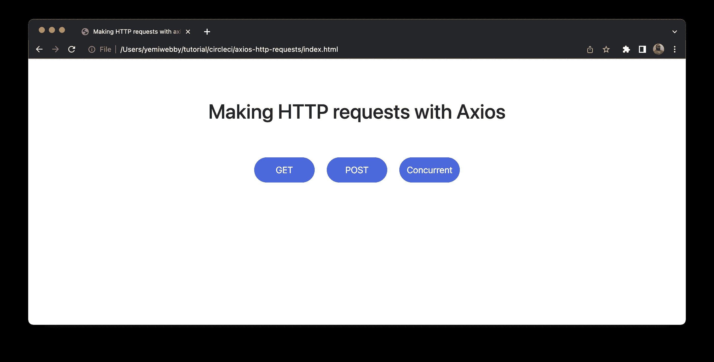
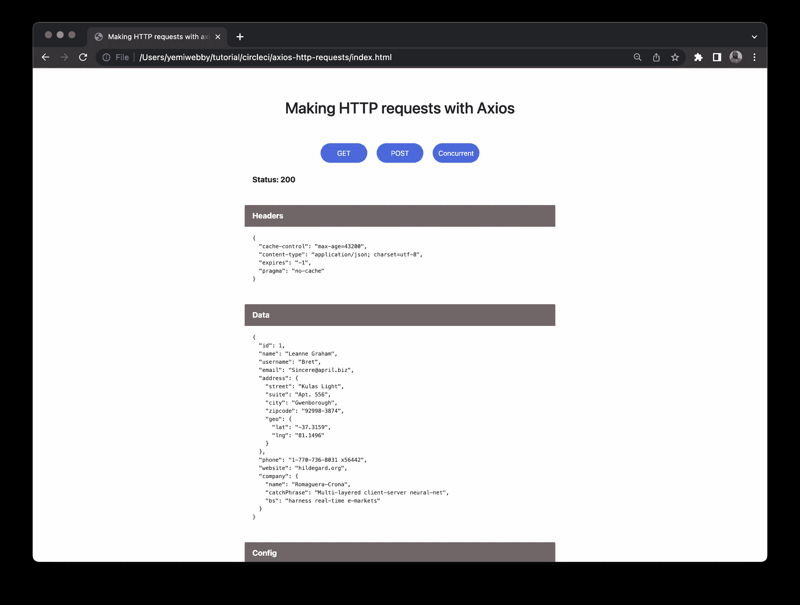
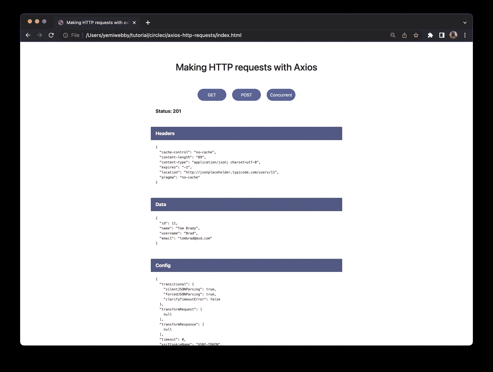
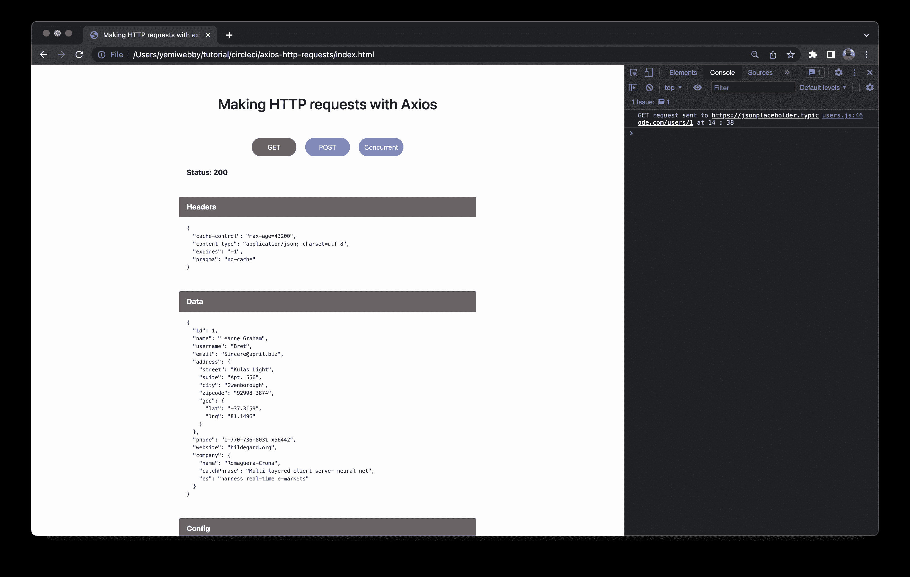
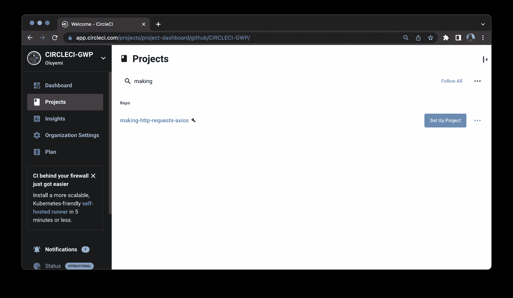
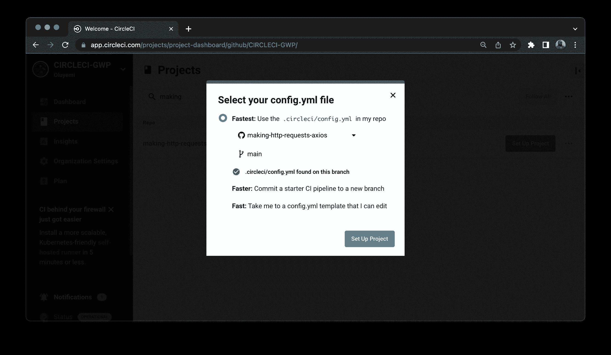
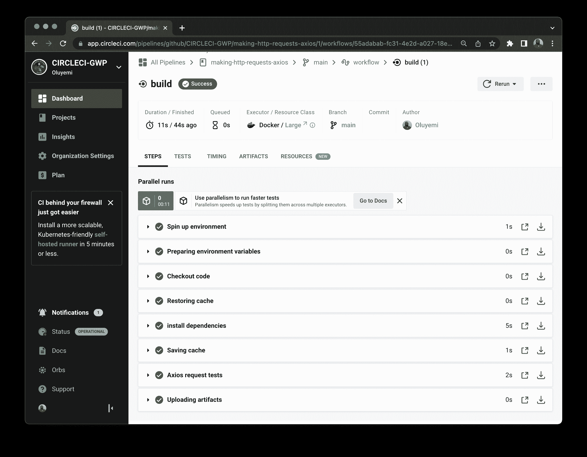
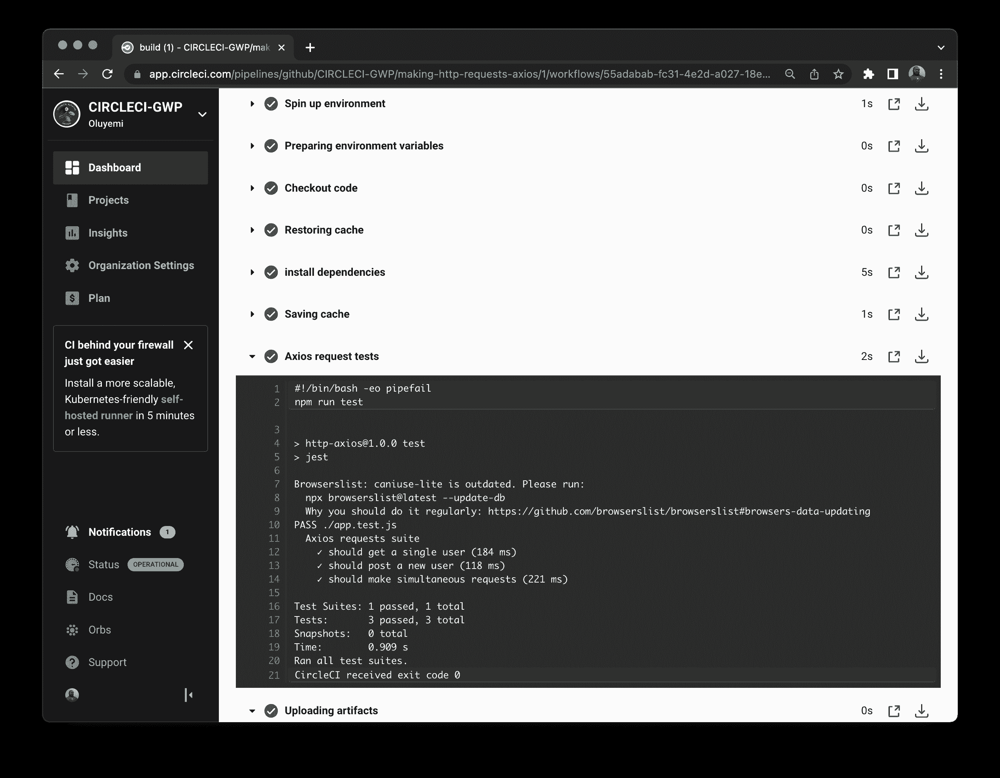

# 使用 Axios | CircleCI 发出 HTTP 请求

> 原文：<https://circleci.com/blog/making-http-requests-with-axios/#2022-05-19T00:00:00-07:00>

> 本教程涵盖:
> 
> 1.  为什么要用 Axios？
> 2.  生成 Axios POST 和 GET 请求
> 3.  测试请求

[Axios](https://axios-http.com/docs/intro) 是一个基于 promise 的 HTTP 库，开发者可以向自己或第三方服务器请求获取数据。它提供了不同的请求方式，如`GET`、`POST`、`PUT/PATCH`和`DELETE`。在本教程中，我将解释 Axios 如何与应用程序交互，描述 Axios 请求和响应的结构，如何向 API 发出请求，以及如何使用 CircleCI 为您的请求编写测试。

## 先决条件

要跟随教程，请确保您已经:

## Axios 是如何工作的？

Axios 的工作原理是在浏览器上用 NodeJS 和 XMLHttpRequests 发出 [HTTP](https://developer.mozilla.org/en-US/docs/Glossary/HTTP) 请求。如果请求成功，您将收到一个包含所请求数据的`response`。如果`request`失败，你会得到一个错误。您还可以`intercept`请求和响应，并转换或修改它们。在本教程的后面部分，我将对此进行更详细的介绍。

此图展示了 Axios 如何与应用程序交互。

[轴互动](//images.ctfassets.net/il1yandlcjgk/7xb1Wrf0mc36khVQrWRAnl/aaf1d51710bf02a728d4669934c97451/2023-02-17-axios-operation.png)

Axios 决定是向浏览器还是向 NodeJS 发出请求。然后，它确定发出 API 请求的正确方式，并将转换后的响应返回给发出服务器请求的客户机。

## Axios 请求和响应配置

在 Axios 中发出一个基本请求很容易，因为唯一需要的选项是`url`。但是，您可以根据想要发出的请求类型配置其他选项。

下面是一个请求示例:

```
const axios = require('axios');

const res = await axios.get(url, {
//We can add more configurations in this object
   params: {
  //This is one of the many options we can configure
   }
});

// This is the second configuration option
const res = await axios({
    method: 'get',
    url://Endpoint goes here,
    params:{

    }
}); 
```

Axios 为配置您的请求提供了极大的灵活性。您可以决定用 JavaScript [点符号](https://developer.mozilla.org/en-US/docs/Web/JavaScript/Reference/Operators/Property_accessors)格式调用 Axios。或者您可以使用[对象文字](https://developer.mozilla.org/en-US/docs/Web/JavaScript/Reference/Operators/Object_initializer#object_literal_notation_vs_json)格式将所有的 Axios 请求属性捆绑到一个对象中，用作发出 Axios 请求的属性。

Axios 支持几种方法，并且允许它们发出请求。它们包括:

*   `request`
*   `get`
*   `delete`
*   `head`
*   `options`
*   `post`
*   `put`
*   `patch`

下一个代码片段展示了如何使用 Axios 将一个示例`GET`请求发送给一个`Todos`示例 API。

```
axios({
  method: "get",
  url: "https://jsonplaceholder.typicode.com/todos",
  params: {
    _limit: 5,
  },
}); 
```

### Axios 响应

一旦你用 Axios 发送了一个请求，你期望得到一个响应。这个片段显示了 Axios 响应的数据结构:

```
{
  // `data` is the response that was provided by the server
  data: {},

  // `status` is the HTTP status code from the response
  status: 200,

  // `statusText` is the status message from the response
  statusText: 'OK',

  // `headers` are the HTTP headers that the server responded with
  headers: {},

  // `config` is the config that was provided to `axios` for the request
  config: {},

  // `request` is the request that generated the response
  request: {}
} 
```

在这个响应中，您会得到:

*   您期望的数据的对象
*   服务器发回的状态代码
*   状态文本
*   响应标题
*   Axios 设置的配置对象
*   用于生成响应的请求对象

然后，您可以根据需要的数据在客户端应用程序上使用响应。

这是不是感觉很多理论知识？如果是这样，继续下一节，我将向您展示如何使用 Axios 发出 HTTP 请求。

## 发出 Axios HTTP 请求

在本节中，您将发出`GET`和`PUT`请求，并观察并发请求。您将使用一个免费的“假”API: [JSONPlaceholder](https://jsonplaceholder.typicode.com/) 。

您还将使用一个应用程序来帮助您提出请求，并更好地了解正在发生的事情。

但是在开始之前，您需要为教程克隆 GitHub 存储库。运行这些命令:

```
git clone https://github.com/CIRCLECI-GWP/making-http-requests-axios

cd making-http-requests-axios 
```

现在您应该已经有了本教程所需的文件。下一步是安装 Axios 和 [Jest](https://www.npmjs.com/package/jest) 作为依赖项。运行以下命令:

```
npm install 
```

在浏览器上打开`index.html`文件，查看您的 Axios 演示网页。



目前，这些按钮没有任何作用。我们将在本教程的后面构建该功能。

每个请求有三个按钮。在发出 Axios 请求并将数据返回到浏览器后，单击按钮应该会显示响应。

在您克隆的存储库的`users.js`文件中，有一个事件监听器显示 Axios 返回的数据。这个文件还有一些函数，您可以使用它们来提出请求。从提出第一个`GET`请求开始。

### 发出 GET 请求

这个片段显示了您的请求应该是什么样子:

```
axios
  .get("https://jsonplaceholder.typicode.com/users/1")
  .then((response) => {
    displayOutput(response);
  })
  .catch((err) => console.log(err)); 
```

这个代码片段向 JSON API 发送一个`GET`请求。因为请求返回一个承诺，所以您将使用`.then()`块来处理响应。您还需要使用`.catch()`方法将任何错误记录到控制台。

将前面的代码片段添加到`users.js`文件中的`getUser()`函数并保存。

接下来，进入浏览器并点击`GET`按钮。在其下方，应该会出现新的内容，显示响应的详细信息。



造型和陈列已经完成。收到的 Axios 响应部分包括:

*   `status`部分，显示响应的状态代码。在本例中是`200`，这意味着请求成功了。
*   `headers`部分，包含服务器响应的所有 HTTP 头。
*   `data`部分，包含有效负载或从服务器请求的信息。在这种情况下，它是关于`user 1`的所有信息。
*   `config`部分，它包含为请求传递给 Axios 的所有配置。

如请求所示，Axios 的行为类似于传统的`fetch-API`库。考虑到这是一个`GET`请求，您不需要传递带有请求的主体。接下来，我将向您展示如何使用 Axios 在`POST`请求中做到这一点。

### 提出发布请求

post 请求略有不同，因为您将在请求中向服务器传递一些数据。在请求中，您将创建一个用户，并为该用户传递详细信息。该请求的代码片段将如下所示:

```
axios
  .post("https://jsonplaceholder.typicode.com/users", {
    id: 11,
    name: "Tom Brady",
    username: "Brad",
    email: "tombrad@asd.com",
  })
  .then((response) => displayOutput(response))
  .catch((err) => console.log(err)); 
```

Axios POST 请求在请求 URL 后使用一个对象来定义要为用户创建的属性。一旦操作完成，将会有来自服务器的响应。为了验证你的代码正在工作，回到应用浏览器窗口，点击 **POST** 按钮。这个片段是`users.js`文件中`postUser()`函数的一部分。



`POST`响应与`GET`请求略有不同:

*   `status`部分有一个状态代码`201`，这意味着一个资源已经被创建。在本例中，创建了一个新用户。
*   对于我们发送的数据的长度，`headers`部分有一个`‘content-length’`属性。它还指定了数据存储的位置:`location`。
*   `data`部分包含发送到服务器的信息。
*   `config`部分包含随请求一起发送的配置。这涉及到`method`、`url`和`data`被发送。

您可以验证在您的`POST`请求中定义的数据是作为创建的资源从服务器接收的准确响应。

在本节中，您学习了如何发出 Axios 请求，我描述了 Axios 请求的基本结构及其预期响应。在下一节中，我将解释如何在数据作为请求发送到 Axios 之前请求拦截来验证数据。

## Axios 请求和响应拦截器

Axios 中的拦截发生在请求在被`then()`或`catch()`代码块处理之前被拦截。例如，假设您想要检查通过客户端的所有请求是否都具有有效的 JWT 令牌。您将设置一个请求拦截器，以确保对服务器的所有调用都有有效的令牌。如果呼叫没有有效的令牌，系统的用户将不得不返回到登录页面并被重新认证。为了节省时间，我将带领您完成一个不太复杂的用例，为您当前的应用程序编写一个日志记录器。

记录器将记录何时发出请求、请求的 URL 以及触发请求的时间。使用以下代码片段:

```
axios.interceptors.request.use(
  (config) => {
    const today = new Date();
    console.log(
      `${config.method.toUpperCase()} request sent to ${
        config.url
      } at ${today.getHours()} : ${today.getMinutes()}`
    );
    return config;
  },
  (error) => {
    console.log(error);
  }
); 
```

Axios 将访问您的请求的`config`部分，以显示请求方法、URL 和时间。这个代码片段是示例项目的`interceptRequests()`函数中的`users.js`文件的一部分。为了观察 Axios 拦截器的行为，打开 [Chrome 浏览器控制台](https://developer.chrome.com/docs/devtools/open/)。单击获取 API 中第一个用户的`GET`方法



为了让拦截器工作，它们需要作为对`jsonplaceholder` API 的并发请求被调用。下一个代码片段展示了实现请求和响应的 Axios 方法:

```
const concurrentRequests = () => {
  interceptRequests();
  axios
    .all([
      axios.get("https://jsonplaceholder.typicode.com/users?_limit=5"),
      axios.get("https://jsonplaceholder.typicode.com/albums?_limit=5"),
    ])
    .then(
      axios.spread((users, albums) => {
        displayOutput(albums);
      })
    )
    .catch((err) => console.log(err));
}; 
```

Chrome DevTools 图像显示，当您发出任何请求时，您可以在 Axios 将其发送到 API 服务器之前对其进行修改或检查。Axios 拦截器不仅功能强大，还让开发人员能够控制请求及其响应的行为。

现在您已经学习了如何使用拦截器来修改或检查您的 Axios 请求和响应。干得好！您的下一个任务是为您的 Axios 实现编写测试。

## 测试 Axios 实现

测试是开发任何应用程序不可或缺的过程。测试有助于确保您的应用程序按预期工作，并且质量始终一致。在本节教程中，您将使用 Axios 的`node.js`版本。因为您已经在安装依赖项时安装了 Jest，所以您可以立即开始编写测试。

在根目录下，创建两个文件，分别命名为`app.js`和`app.test.js`。使用`app.js`进行请求，使用`app.test.js`进行测试。您需要重新创建`app.js`文件，以确保您可以访问使用`Node.js` Axios 的方法——而不是在您的`index.html`文件的`script`部分中定义的浏览器 Axios。

在`app.js`文件中，您可以使用`axios`在`Node.js`中发出请求。此方法使用与浏览器方法相同的请求结构:

```
const axios = require("axios");

const getUser = async () => {
  const getResponse = await axios
    .get("https://jsonplaceholder.typicode.com/users/1")
    .then((response) => response)
    .catch((err) => console.log(err));
  return getResponse;

  module.export = { getUser };
}; 
```

这个代码片段向前面使用的同一个 URL 发出请求，然后保存对`getResponse`变量的响应。然后，它返回响应，使其他可能需要它的方法或函数可以访问它——比如我们的测试。该代码片段导出该方法，使其可以在`app.js`文件之外访问。

要为此编写一个测试，将`getUser`方法导入到您的`app.test.js`测试文件中。然后如下所示编写您的测试:

```
const { getUser, postUser, concurrentRequests } = require("./app.js");

describe("Axios requests suite", () => {
  test("should get a single user", async () => {
    const response = await getUser();
    expect(response).not.toBeNull();
    expect(response.status).toBe(200);
    expect(response.data.address.street).toContain("Kulas");
  });
} 
```

使用这个测试和样本响应对象，您可以验证从 Axios 端点调用的数据是否被返回，以及您的 API 调用是否成功。要运行这个测试，请到您的终端并使用 Jest 命令`npm test`:

```
 PASS  ./app.test.js
  Axios requests suite
    ✓ should get a single user (144 ms)

Test Suites: 1 passed, 1 total
Tests:       1 passed, 1 total
Snapshots:   0 total
Time:        0.266 s, estimated 1 s
Ran all test suites. 
```

成功！现在您可以使用 Axios 为`POST`请求和并发请求编写更多的测试。

在同一个文件中，添加这些测试:

```
test("should post a new user", async () => {
  const response = await postUser();
  expect(response).not.toBeNull();
  expect(response.status).toBe(201);
  expect(response.data.username).toBe("Brad");
});

test("should make simultaneous axios requests", async () => {
  const response = await concurrentRequests();
  expect(response).not.toBeNull();
  expect(response.status).toBe(200);
}); 
```

完成后，重新运行您的测试。

```
npm run test 
```

再次，成功！


既然您已经编写了 Axios 请求并对它们进行了测试，那么您就可以为它们构建 CI 管道了。使用 CircleCI 这样的 [CI/CD](https://circleci.com/blog/what-is-a-ci-cd-pipeline/) 工具可以让每个人都知道什么时候变更会破坏管道并导致测试失败。这种反馈循环提供了成功软件开发过程中所需的洞察力和透明度。

## 与 CircleCI 集成

创建一个`.circleci`文件夹，并在其中创建一个名为`config.yml`的文件。这是 CircleCI 的配置文件。在文件中，添加以下配置:

```
version: 2.1
jobs:
  build:
    working_directory: ~/repo
    docker:
      - image: cimg/node:19.0.1
    steps:
      - checkout
      - restore_cache:
          key: dependency-cache-{{ checksum "package-lock.json" }}
      - run:
          name: install dependencies
          command: npm install
      - save_cache:
          key: dependency-cache-{{ checksum "package-lock.json" }}
          paths:
            - ./node_modules
      - run:
          name: Axios request tests
          command: npm run test
      - store_artifacts:
          path: ~/repo/axios-http-requests 
```

这个配置定义了您的`working_directory`，然后告诉 CircleCI 使用一个节点映像来执行您的测试。一旦设置好，它就检查项目的任何[存储的缓存](https://circleci.com/blog/config-best-practices-dependency-caching/)。如果有，需要在安装新的依赖项之前将其恢复。在安装新的依赖项、执行测试以及保存生成的任何工件之后，缓存被保存。

现在您需要保存配置文件，提交，然后[将更改推送到您的 GitHub 库](https://circleci.com/blog/pushing-a-project-to-github/)。然后，登录 [CirclecI 仪表盘](https://app.circleci.com/dashboard)。在**项目**部分找到教程的 GitHub 存储库。在我们的例子中，它被称为`making-http-requests-axios`。点击**设置项目**。



出现提示时，输入包含您的`config.yml`文件的分支的名称。对于本教程，它是`main`分支。然后，点击**设置项目**。



您已经成功构建了管道！点击`build`工作流程查看详细信息。



单击您想要了解更多详细信息的步骤；比如说`Axios requests tests`步。



CircleCI 会在您每次推送到`main`分支中的 GitHub 存储库时检测到变化。CircleCI 管道将再次执行，并确保您的测试套件运行，确保成功的[持续集成](https://circleci.com/continuous-integration/)过程。

我很高兴为你创建这个教程，我希望你觉得它很有价值。直到下次，继续编码！

* * *

Waweru Mwaura 是一名软件工程师，也是一名专门研究质量工程的终身学习者。他是 Packt 的作者，喜欢阅读工程、金融和技术方面的书籍。你可以在[他的网页简介](https://waweruh.github.io/)上了解更多关于他的信息。

[阅读更多 Waweru Mwaura 的帖子](/blog/author/waweru-mwaura/)