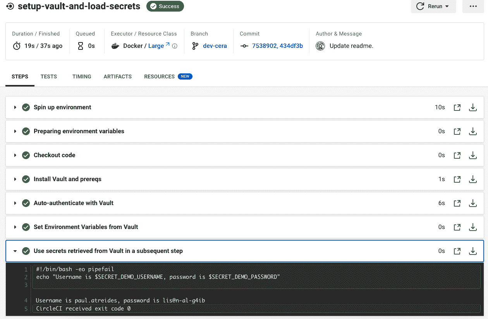

# 使用 OIDC - CircleCI 将 CircleCI 与 HashiCorp Vault 集成

> 原文：<https://circleci.com/blog/oidc-with-vault/#2023-02-02T23:00:00-08:00>

设计良好的机密管理是安全性和可用性之间微妙的平衡。在构建和部署时，机密必须容易被正确的用户访问，但同时它们也必须得到很好的保护，并且容易轮换。本文将介绍如何通过将 CircleCI 与 HashiCorp Vault 集成，并使用短期的 OpenID Connect (OIDC)身份验证令牌来检索机密，从而实现这一目标。

## 机密管理反模式

在过去，许多团队选择可用性而不是安全性。他们将秘密嵌入到 CI/CD 平台配置中，甚至将它们签入版本控制中，通常采用“一劳永逸”的方式。这需要很少的努力，而且通常是作为一种临时措施。但临时措施往往会变成永久性的，这些秘密往往比预期的时间长得多。他们成了潜在的攻击媒介——比如说，如果源代码泄露或一名工程师离开公司，他们能以多快的速度轮换？即使在有定期人工秘密轮换计划的团队中，轮换也经常会迟到、不完整，或者根本就没有发生。尽管这些秘密很容易获取，但该公司的安全态势却岌岌可危。

另一方面，一些团队在不方便的解决方案(如密码管理器)背后锁定了对秘密的所有访问，这些解决方案只能手动访问，或者在每次与服务交互时手动访问 MFA。这不仅降低了开发速度，而且具有讽刺意味的是，它还经常削弱安全性，因为许多工程师只是在本地复制凭证或使用后门帐户来绕过繁琐的官方流程。虽然秘密在理论上是非常安全的，但在实践中，它们经常被非法地存储在不安全的位置，开发人员的敏捷性受到阻碍。

OIDC 认证在这两个极端之间提供了一个折中的方法，既保持了可用性又保证了平台的安全性。CircleCI 的 OIDC 支持允许开发人员在其构建、测试和部署作业中使用短暂的身份验证令牌，从而消除了长期凭据中固有的风险。实现 OIDC 增强了安全性，并减少了项目的整个 CI/CD 管道中的摩擦，从而导致更快、更有效的开发。在之前的一篇博客文章中，我们已经介绍了 OIDC 的基础知识，以及如何使用 CircleCI OIDC 令牌通过 AWS 和 Google Cloud 进行认证。今天我们将讲述如何使用 OIDC 来认证 HashiCorp Vault。

## 什么是哈希公司金库？

HashiCorp Vault 是一个基于身份的秘密和加密管理系统。随着技术组织越来越多地转向 GitOps 和基础设施即代码实践，他们经常遇到如何安全地存储和访问信息的难题，这些信息太敏感而无法签入版本控制，并且应用太广泛而不能留在某人的工作站上。Vault 使开发人员和平台工程师能够在一个安全、集中的系统中方便地存储、访问和轮换机密。使用 OIDC 从 CircleCI 到 Vault 进行身份验证增加了一层安全性，因为您的工程师不再需要在 Vault 本身之外存储长期有效的凭据。

在本教程中，我们将介绍如何使用 CircleCI 的 OIDC 令牌对现有的 Vault 集群进行认证。

## 步骤 0:开始之前

开始时，您需要具备以下条件:

您还应该从 CircleCI UI 中收集以下信息:

*   您的组织名称和 ID:打开 CircleCI webapp 并在 [CircleCI web app](https://app.circleci.com/) 上导航至**组织设置** > **概述**以找到两者
*   您的项目 ID:打开 [CircleCI web app](https://app.circleci.com/) ，导航至您的项目页面，点击**项目设置** > **概述**
*   个人访问令牌:[参见这里的说明](https://circleci.com/docs/managing-api-tokens/#creating-a-personal-api-token)了解如何创建一个。

**注意:** *CircleCI 必须能够连接到您的 Vault 实例。如果该实例可以公开访问，您可以通过将 CircleCI 的 IP 范围列入白名单来限制访问，这样只有 CircleCI 机器可以发送流量。如果实例在专用网络上，您可以在专用网络内的 [CircleCI Runner](https://circleci.com/docs/runner-overview/) 上运行您的 Vault 认证作业。*

## 步骤 1:配置 Vault

您需要在 Vault 实例中启用 JWT 身份验证方法。登录到 Vault 并启用 JWT 验证方法:

```
export VAULT_ADDR="your vault instance address"
export VAULT_TOKEN="your vault token"
vault login $VAULT_TOKEN
vault auth enable jwt 
```

接下来，配置 JWT 身份验证方法以接受来自 CircleCI 组织的 OIDC 令牌:

```
vault write auth/jwt/config \
    oidc_discovery_url="https://oidc.circleci.com/org/<your org id>" \
    bound_issuer="https://oidc.circleci.com/org/<your org id>" 
```

使用以下命令验证配置:

```
curl --header "X-Vault-Token: $VAULT_TOKEN" "$VAULT_ADDR/v1/auth/jwt/config" | jq 
```

接下来，为您的存储库角色创建一个[存储库策略](https://developer.hashicorp.com/vault/docs/concepts/policies)。在本教程中，您将授予 CircleCI 对路径`secret/circleci-demo/`下所有秘密的读取权限

```
vault policy write circleci-demo-policy - <<EOF
# Grant CircleCI project <your project name> RO access to secrets under the 'secret/data/circleci-demo/*' path
path "secret/data/circleci-demo/*" { 
  capabilities = ["read", "list"] 
}
EOF 
```

使用以下命令验证策略创建:

```
vault policy read circleci-demo-policy 
```

在名为`circleci-demo`的 JWT 认证方法下为 CircleCI 创建一个 Vault 角色。该角色的属性告诉 Vault OIDC 令牌将来自哪里，应该向令牌持有者授予什么权限，以及应该包含在令牌中的任何附加声明。这些附加声明可用于存储库角色的`bound_claims`字段，以限制角色对特定项目和/或具有特定上下文访问权限的作业的访问权限。

在本教程中，您将使用`project_id`附加声明来限制对您的教程项目的访问。您可以在我们的 [OIDC 文档](https://circleci.com/docs/openid-connect-tokens/#format-of-the-openid-connect-id-token)中找到更多关于 CircleCI OIDC token 索赔的详细信息。

```
vault write auth/jwt/role/circleci-demo -<<EOF
{
  "role_type": "jwt",
  "user_claim": "sub",
  "user_claim_json_pointer": "true",
  "bound_claims": {
    "oidc.circleci.com/project-id": "<your project id>"
  },
  "policies": ["default", "circleci-demo-policy"],
  "ttl": "10m"
}
EOF 
```

使用以下命令验证角色创建:

```
vault read auth/jwt/role/circleci-demo 
```

最后，让我们创建一些从 CircleCI 访问的秘密。首先，启用安装在`secret/`的新秘密引擎:

```
vault secrets enable -version=2 -path=secret kv 
```

接下来，创造一些秘密:

```
vault kv put secret/circleci-demo/demo-secrets \
  username="paul.atreides" \
  password="lis@n-al-g4ib" 
```

验证新密码是使用以下命令创建的:

```
vault kv get secret/circleci-demo/demo-secrets 
```

## 步骤 2:配置 CircleCI

### 为 Vault 连接密码创建 CircleCI 上下文

我们可以将它们安全地存储在一个 [CircleCI context](https://circleci.com/docs/contexts/) 中，而不是将我们的 Vault 端点和角色名签入版本控制，因为它们可能会被无意中泄露。在本教程中，我们将使用 CircleCI CLI 创建和填充一个上下文。

**注意:** *如果您正在使用 CircleCI 独立组织(例如，如果您正在使用 GitLab 作为您的 VCS)，您将需要创建一个上下文并通过 CircleCI UI 而不是 CLI 填充变量[。](https://circleci.com/docs/contexts/#create-and-use-a-context)*

运行以下命令来设置 CircleCI CLI。出现提示时，输入您的个人访问令牌。

```
circleci setup 
```

配置完 CLI 后，使用下面的命令创建一个名为`circleci-vault-demo`的上下文。你的 VCS 应该是`gh` (Github)或者`bb` (Bitbucket)。

```
export CIRCLE_VCS=<your vcs>
export CIRCLE_ORG_NAME=<your org name>
circleci context create $CIRCLE_VCS $CIRCLE_ORG_NAME circleci-vault-demo 
```

验证新上下文是使用以下命令创建的:

```
circleci context list $CIRCLE_VCS $CIRCLE_ORG_NAME 
```

接下来，使用下面的命令将 Vault 连接机密添加到新上下文中。在每个命令后，系统会提示您输入密码，因此请务必准备好密码值。下表显示了示例值。

```
circleci context store-secret $CIRCLE_VCS $CIRCLE_ORG_NAME circleci-vault-demo VAULT_ADDR
circleci context store-secret $CIRCLE_VCS $CIRCLE_ORG_NAME circleci-vault-demo VAULT_ROLE 
```

| 上下文变量名 | 价值 |
| --- | --- |
| `VAULT_ADDR` | 您的 vault 实例的 URL，包括端口(例如`https://vault.example.com:8200`) |
| `VAULT_ROLE` | CircleCI 将承担的保险库角色(如果您遵循上述步骤，这将是`circleci-demo`) |

使用以下命令验证是否已经创建了机密:

```
circleci context show $CIRCLE_VCS $CIRCLE_ORG_NAME circleci-vault-demo 
```

### 编写一个 CircleCI 配置，使用 OIDC 向 Vault 进行身份验证

现在，我们将编写一个 CircleCI 配置文件，该文件使用 CircleCI OIDC 令牌对 Vault 进行身份验证，使用 [Vault 的自动身份验证功能](https://developer.hashicorp.com/vault/docs/agent/autoauth)来检索我们创建的机密，然后最终将它们作为环境变量导出，以便在 CircleCI 作业中使用。

在您为本教程创建的存储库中，在`.circleci/config.yml`处创建一个文件，并添加下面的代码。

```
version: 2.1
commands: 
  install-vault:
    steps:
      - run:
          name: Install Vault and prereqs
          command: |
            vault -h && exit 0 || echo "Installing vault"
            # only runs if vault command above fails
            cd /tmp
            wget https://releases.hashicorp.com/vault/1.12.2/vault_1.12.2_linux_amd64.zip
            unzip vault_1.12.2_linux_amd64.zip
            sudo mv vault /usr/local/bin        
            vault -h
  vault-auto-auth:
    description: "Use Vault auto auth to load secrets"
    steps:
      - run:
          name: Auto-authenticate with Vault
          command: |
            # Write the CircleCI provided value to a file read by Vault
            echo $CIRCLE_OIDC_TOKEN > .circleci/vault/token.json
            # Substitute the env vars in our context to render the Vault config file
            sudo apt update && sudo apt install gettext-base
            envsubst < .circleci/vault/agent.hcl.tpl > .circleci/vault/agent.hcl
            # This config indicates which secrets to collect and how to authenticate     
            vault agent -config=.circleci/vault/agent.hcl
      - run:
          name: Set Environment Variables from Vault
          command: |
            # In order to properly expose values in Environment, we _source_ the shell values written by agent
            source .circleci/vault/setenv
jobs:
  setup-vault-and-load-secrets:
    docker: 
      - image: cimg/base:2023.01
    steps:
      - checkout
      - install-vault
      - vault-auto-auth
      - run: 
          name: Use secrets retrieved from Vault in a subsequent step
          command: |
            echo "Username is $SECRET_DEMO_USERNAME, password is $SECRET_DEMO_PASSWORD"
workflows:
  vault: 
    jobs:
      - setup-vault-and-load-secrets:
          context:
            - circleci-vault-demo
# VS Code Extension Version: 1.5.1 
```

接下来，我们将使用下面的代码在`.circleci/vault/agent.hcl.tpl`创建一个模板化的 Vault agent 配置文件。该文件将告诉 Vault 代理要连接到哪个 Vault 服务器以及如何进行身份验证。

```
pid_file = "./pidfile"
exit_after_auth = true
vault {
  address = "${VAULT_ADDR}"
  retry {
    num_retries = -1
  }
}
auto_auth {
  method "jwt" {
    config = {
      role = "${VAULT_ROLE}"
      path = ".circleci/vault/token.json"
      remove_jwt_after_reading = false
    }
  }
  sink "file" {
    config = {
      path = "/tmp/vault-token"
    }
  }
}
template_config {
  exit_on_retry_failure = true
}
template {
  source      = ".circleci/vault/secrets.ctmpl"
  destination = ".circleci/vault/setenv"
} 
```

最后，我们将创建一个 Consul 模板，它将告诉 Vault 代理如何处理它检索到的秘密。在本教程中，我们将简单地将它们导出为环境变量，以便在管道中使用。用下面的代码在`.circleci/vault/secrets.ctmpl`创建一个文件。

```
# Export the secrets as env vars for use in this job 
# Also writes them to $BASH_ENV so that they'll be available as env vars in subsequent jobs for this pipeline
{{ with secret "secret/circleci-demo/demo-secrets" }}
    export SECRET_DEMO_USERNAME="{{ .Data.data.username }}"
    export SECRET_DEMO_PASSWORD="{{ .Data.data.password }}"
    echo "export SECRET_DEMO_USERNAME=\"{{ .Data.data.username }}\"" >> $BASH_ENV
    echo "export SECRET_DEMO_PASSWORD=\"{{ .Data.data.password }}\"" >> $BASH_ENV
{{ end }} 
```

推动你的改变。这将触发 CircleCI 的管道。从本地 repo 目录运行以下命令:

```
circleci open 
```

这将在 CircleCI webapp 中打开您的项目。如果一切都已正确配置，您应该看到最后一步打印从 Vault 中检索到的机密，如下所示:



## 结论

在本文中，我们介绍了如何使用 OIDC 身份验证从 CircleCI 安全地存储和访问 HashiCorp Vault 中的机密。OIDC 身份认证消除了在安全系统之外存储长期凭据的需要，在不影响开发速度的情况下增强了组织的安全态势。要了解 CircleCI 上 OIDC 认证的更多信息，请访问[我们的文档](https://circleci.com/docs/openid-connect-tokens/)或查看以下文章: