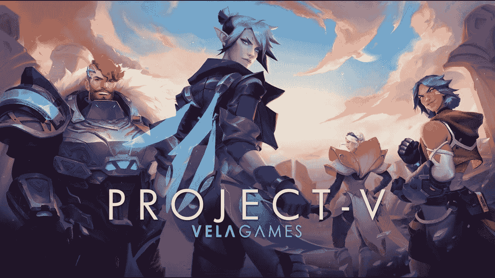
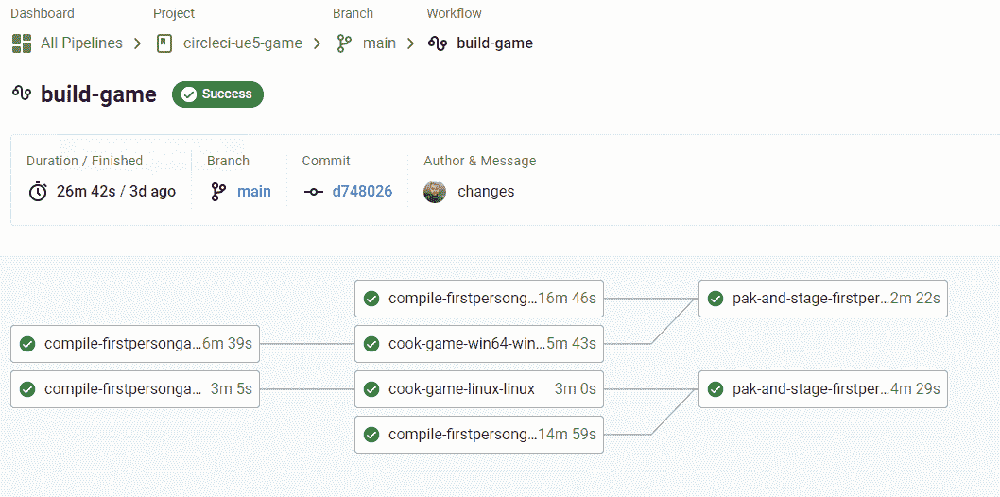
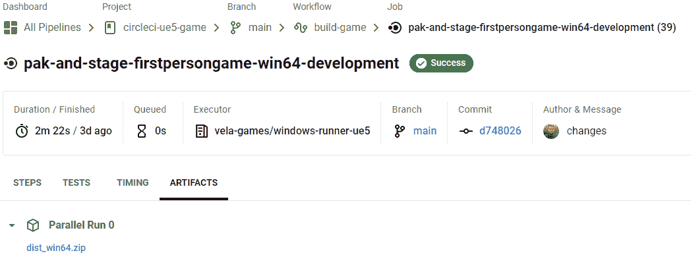

# 使用 BuildGraph 和 CircleCI | CircleCI 优化虚幻引擎构建

> 原文：<https://circleci.com/blog/optimize-unreal-engine-builds/#2022-09-29T05:00:00-07:00>

> 本教程涵盖:
> 
> 1.  创建构建图脚本来打包 Windows 和 Linux 的虚幻引擎项目
> 2.  将构建图脚本转换为 CircleCI 的动态配置
> 3.  使用 CircleCI 的自托管运行程序在 AWS 上并行执行虚幻引擎构建

在 [Vela Games](https://vela.games/) ，我们使用 CircleCI 构建 Project-V，这是我们新的多人在线合作(MOCO)游戏，融合了多人在线战斗竞技场(MOBA)游戏的团队合作和技能与大型多人在线(MMO)地牢运行的冒险。

在下面的教程中，我们将演示如何使用虚幻引擎的 BuildGraph 技术以及 CircleCI 的动态配置和自托管运行程序并行执行构建步骤，从而显著加快虚幻引擎游戏的构建时间。

**以下项目超出了本教程的范围**:

1.  如何[用虚幻引擎 5 源代码创建自定义亚马逊机器镜像(AMI)](https://docs.aws.amazon.com/AWSEC2/latest/UserGuide/AMIs.html#creating-an-ami)
2.  如何[根据无人认领任务的数量自动缩放自托管跑步者](https://circleci.com/blog/autoscale-self-hosted-runners-aws/)

本教程中显示的所有代码都可以在这个 [GitHub 资源库](https://github.com/vela-games/circleci-ue5-game)中获得。

## 背景

随着 Project-V 的开发在 2022 年快速发展，越来越多的人加入我们的团队，由于提交量和我们的管道结构，我们开始在 Jenkins CI 基础设施中遇到瓶颈。每个步骤(构建、烹饪、打包和游戏服务器部署)都是按顺序进行的，在某些情况下需要 2.5 个小时才能完成。



顺便提一下，我们也在用不同的技术开发游戏支持项目。Jenkins 的一些项目实现自动化的门槛比我们预期的要高，我们希望探索其他选项来降低工程师的复杂性，从而使他们能够更多地专注于开发产品，而不是构建流程自动化。

我们决定将詹金斯管道迁移到 CircleCI，以改善这些问题。我们首先关注 Project-V 的构建过程。我们的目标是通过将不同的阶段并行化并分散到不同的代理上，尽可能地减少游戏构建时间。

这导致我们利用虚幻引擎的[构建图技术](https://docs.unrealengine.com/5.0/en-US/buildgraph-for-unreal-engine/)以及 CircleCI 的[动态配置](https://circleci.com/docs/dynamic-config/)和[自托管跑步者](https://circleci.com/docs/runner-overview/)。有了这些，在最好的情况下，我们能够将构建时间减少 85%。

本教程在很大程度上基于我们所做的工作，并将向您展示如何利用[动态配置](https://circleci.com/docs/dynamic-config/)和[自托管运行器](https://circleci.com/docs/runner-overview/)，通过使用 BuildGraph 在多个运行器之间分配过程来加速您的虚幻引擎 5 项目的构建、烹饪和打包阶段。

## 先决条件

要完成本教程，您需要准备好以下物品:

1.  一个 [CircleCI 账户](https://circleci.com/signup/)。
2.  AWS 客户以及如何部署 EC2 实例的知识。
3.  Linux 和 Windows AWS AMIs 用[虚幻引擎 5 源代码](https://docs.unrealengine.com/5.0/en-US/downloading-unreal-engine-source-code/)。
4.  所有自助跑步者之间的快速共享储物空间。对于 OpenZFS ，我们使用了 [AWS FSx。](https://aws.amazon.com/fsx/openzfs/)
5.  一个虚幻的 Engine 5 项目。我们将使用虚幻引擎中包含的第一人称射击游戏示例。

## 什么是 BuildGraph？

BuildGraph 是包含在 Unreal Engine 中的基于脚本的构建自动化系统，它以 UE 项目中常见的构建块的图形为特色。

构建图脚本是用 XML 编写的，其中定义了相互依赖的节点。

每个节点由按顺序执行的任务组成，这些任务期待(取决于配置)输入并产生输出。使用标签定义输入和输出，其形式为`#MyTag`。

通过定义输入期望，BuildGraph 形成一个依赖图，它使用该依赖图来确定每个节点必须具有哪种依赖关系才能执行配置的任务；这些在使用共享存储的作业之间共享，因为每个节点可能运行在不同的物理节点上。

构建图脚本由以下元素创建:

*   **任务**是作为构建过程(编译、烹饪等)的一部分执行的动作。).
*   **节点**是被命名的有序任务序列，被执行以产生输出。在执行任务之前，节点可能依赖于其他节点先执行它们的任务。
*   代理是在同一台机器上执行的节点组(如果作为构建系统的一部分运行)。代理在本地构建时没有效果。
*   **触发器**是组的容器，只能在手动干预后执行。
*   **集合**是一组节点和命名输出，可以用一个名称引用。

在本教程中，我们将只使用任务、节点和代理。还有像`ForEach`这样的流控制节点和条件，我们将使用它们来使我们的脚本更加动态，并根据输入做不同的事情。

BuildGraph 与 UnrealBuildTool、AutomationTool 和编辑器深度集成，允许您跨不同平台编排游戏的编译、制作和打包。

在撰写本文时，有一个使用 BuildGraph 时的免责声明:

*   XML 脚本当前只能位于虚幻引擎目录中。
*   有一个 bug，BuildGraph 失败是因为产生的工件被假定为改变了，而实际上它们并没有改变。

由于这些限制，我们修补了 BuildGraph，以便在我们的游戏报告中使用 XML 脚本，并允许文件的“突变”。红点工作室的 June Rhodes 发现并修补了这些问题。

您可以在这个 [GitHub 库](https://github.com/vela-games/circleci-ue5-game)中找到 git 补丁。

## 动态配置

如果你已经使用了 CircleCI，但你不知道动态配置，那么你习惯于纯粹在 YAML 定义你的工作流程。

动态配置允许您在已经运行的工作流`setup`中定义您的完整工作流，您可以使用任何您想要的编程语言来完成，只要输出是一个可接受的 CircleCI YAML 定义。

一旦有了 YAML，就可以将它传递给 CircleCI API 的`/api/v2/pipeline/continue`端点来创建动态工作流。对于这一步，我们将使用[延续球](https://circleci.com/developer/orbs/orb/circleci/continuation)，因为它大大简化了过程。

我们将利用动态配置，根据 BuildGraph 在 XML 脚本中定义的内容来定义整个工作流。

**注意:** *要使用此功能，请通过选择**项目设置** > **高级** > **使用设置工作流启用动态配置**来启用它。*


## 自主跑步者

我们的另一个重要特性是自托管运行器，它允许您在自己的基础设施上运行 CircleCI 作业(在我们的例子中是 AWS 上的 EC2 实例)。我们的构建过程需要 CircleCI 的云平台上没有的非常大的资源类型，自托管运行程序允许我们访问我们需要的定制计算资源。

当使用自托管 runners 时，您有责任使用任何您需要的软件来构建您自己的基础架构，以使您的工作流成功运行。在我们的场景中，我们需要将虚幻引擎源代码打包到 AMI 中，我们将使用它来部署这些运行器。

如何用 UE 构建 AMI 不属于本教程的范围，但是我推荐使用 [Packer](https://www.packer.io/) 来构建 AMI。你可以在 [Epic Games 的网站](https://www.unrealengine.com/en-US/ue-on-github)上获取 UE 源码。有关于如何在虚幻引擎 GitHub 库上构建引擎的文档。

## 我们开始吧

对于本教程，我们将使用虚幻引擎附带的第一人称射击游戏示例。

我们将创建一个 BuildGraph 脚本来编译、烹饪和打包 Windows 和 Linux 上的项目；我们将利用它创建一个 Python 脚本，将 BuildGraph 转换为 CircleCI 动态配置。

构建图脚本将是所有核心管道逻辑的所有者，并将决定运行什么以及在哪里运行。我们将在动态配置的`setup`阶段运行 BuildGraph，使用一个特殊的标志来指示 BuildGraph 只将图形输出为 JSON。然后，我们将 JSON 作为参数传递给我们的 Python 层，并在 YAML 中输出最终的工作流。

最终结果将是一个包含游戏二进制文件的 ZIP 文件，它将作为工件上传到 CircleCI 上。

### 部署自托管运行程序

在本节中，我们将配置和部署自托管运行程序，我们的工作流将在这些运行程序上运行。这些人将负责构建、烹饪和打包我们的示例游戏。

首先，使用 [CircleCI CLI](https://circleci.com/docs/local-cli/) 或[自托管 runner web UI 为 Linux 和 Windows 实例分别创建一个资源类。](https://circleci.com/docs/runner-installation/)我们将使用命令行界面:

```
$ circleci runner resource-class create vela-games/linux-runner-test "For CircleCI Tutorial" --generate-token

 api:
     auth_token: f5dfdc41d7973864e9f625a897b755fea5ac17ecdf519732b81b87a309467bf20698fbdbc04a8b94
 +------------------------------+-----------------------+
 |        RESOURCE CLASS        |      DESCRIPTION      |
 +------------------------------+-----------------------+
 | vela-games/linux-runner-test | For CircleCI Tutorial |
 +------------------------------+-----------------------+ 
```

无论您选择哪个选项，在创建资源类之后，都会提供一个`auth_token`。在实例上配置代理时，您需要这样做。

接下来，部署配置资源类和`auth_token`的实例。

在 Vela，我们坚信基础设施即代码和 GitOps 驱动的工作流以及同行评审的变更。Terraform 与我们的意识形态完全一致，我们用它来部署我们的自托管跑步者。

我们正在开源一个例子，说明如何使用 Terraform 为这个场景部署自托管运行器。这在很大程度上基于我们在 Vela 内部使用的方法。你可以在 GitHub 上找到[库，欢迎你叉出来使用。](https://github.com/vela-games/tf-circleci-runners-example)

这个模块为每个 runner 资源类使用一个[自动缩放组](https://docs.aws.amazon.com/autoscaling/ec2/userguide/auto-scaling-groups.html)。这使得在需要时伸缩实例变得非常简单，因为只需定义一次启动配置，就可以在所有需要的 EC2 实例中重用它。如果您愿意，这也为您将来基于作业队列自动缩放运行程序奠定了基础。

BuildGraph 需要一个共享存储来在运行的作业之间共享工件。为此，我们选择将 [AWS FSx 用于 OpenZFS](https://aws.amazon.com/fsx/openzfs/) ，因为它为我们提供了:

*   能够通过 NFS 协议挂载文件系统，实现与操作系统无关的可访问性。这对我们很重要，因为我们将在 Windows 和 Linux 机器上构建
*   访问文件时的延迟非常低。这对于几乎即时的元数据操作非常有用，Unreal 执行这些操作是为了检查构建所需的文件。

当应用 Terraform 模块时，它将:

*   为您配置的每个资源类创建一个自动缩放组
*   默认情况下，部署自动扩展组，根据一个 [cron 表达式](https://github.com/vela-games/tf-circleci-runners-example/blob/main/modules/runner/main.tf#L108)执行一个预定的操作来扩大或缩小。我们这样做是为了在不希望管道运行时不运行实例，从而节省一些资金。
*   为 OpenZFS 文件系统部署一个 FSx，我们将使用它来拥有一个[共享 DDC](https://docs.unrealengine.com/5.0/en-US/derived-data-cache/) ，并为 BuildGraph 在运行的作业之间共享工件。
*   使用用户数据脚本部署每个 EC2 实例，该脚本将安装 CircleCI 代理并配置 FSx 挂载。在 Windows 的情况下，当我们运行管道时，它将创建一个 PowerShell 脚本来挂载 FSx。对于 Linux，FSx 将作为用户数据执行的一部分被挂载。

要使用 Terraform 模块，请确保创建一个`tfvars`文件，为您的部署和您的 [vpc_id](https://github.com/vela-games/tf-circleci-runners-example/blob/main/variables.tf#L10) 配置[subnet _ id](https://github.com/vela-games/tf-circleci-runners-example/blob/main/variables.tf#L10)。

每个资源类的`auth_tokens`必须被配置为 [circleci_auth_tokens](https://github.com/vela-games/tf-circleci-runners-example/blob/main/variables.tf*L33__;Iw!!Nhk69END!aBSNnLIYx2O0jwdVeKzousD7gSfvOOTn-WAKDf2Na2S7ASXwRArUoWi96Oz43LxeIvRXbHHznq8eRFDgON0GXe4%24) 映射中的一个映射。该值必须采用以下格式:

```
{
   "namespace/resource-class": "your-token"
 } 
```

将标记视为敏感值。在 Vela，我们使用 Terraform Cloud，并将`auth_token`地图配置为工作区的敏感变量。

在 [runners.auto.tfvars](https://github.com/vela-games/tf-circleci-runners-example/blob/main/runners.auto.tfvars) 文件中，您可以配置您想要部署的运行程序的列表。这是一个如何使用它的例子:

```
runners = [{
   name = "namespace/linux-resource-class"
   instance_type = "c6a.8xlarge"
   os = "windows"
   ami = "ami-id"
   root_volume_size = 2000
   spot_instance = true
   asg = {
     min_size = 0
     max_size = 10
     desired_capacity = 0
   }
   key_name = "key-name"
   scale_out_recurrence = "0 6 * * MON-FRI"
   scale_in_recurrence = "0 20 * * MON-FRI"
 },
 {
   name = "namespace/windows-resource-class"
   instance_type = "c6a.8xlarge"
   os = "linux"
   root_volume_size = 2000
   spot_instance = true
   ami = "ami-id"
   asg = {
     min_size = 0
     max_size = 10
     desired_capacity = 0
   }
   key_name = "key-name"
   scale_out_recurrence = "0 6 * * MON-FRI"
   scale_in_recurrence = "0 20 * * MON-FRI"
 }] 
```

确保`name`等于您之前创建的资源类名，因为这用于从映射中获取`auth_token`。

如果您决定不使用我们的 TF 模块来部署代理，[查看文档](https://circleci.com/docs/runner-installation/)了解如何安装。确保你有一个快速共享的存储解决方案，所有的运行者都可以连接到这个解决方案，在任务之间共享中间文件。

## 创建构建图脚本

如果你对这一部分不感兴趣，你可以在这里找到完整的脚本，然后进入教程的下一部分。

如前所述，我们将使用 UE 5.0 附带的第一人称射击游戏示例。您可以使用 UE 编辑器从头开始创建一个新项目，或者从 GitHub 中的[示例中获取。](https://github.com/vela-games/circleci-ue5-game)

现在我们已经运行了自托管的 runner 基础设施，我们可以继续创建 BuildGraph 脚本，它将处理我们管道上的所有工作。

该脚本的目标是:

*   为烹饪编译编辑器
*   使用编辑器二进制文件做饭
*   编译游戏
*   包装游戏

Linux 和 Windows 都会出现这种情况。我们将创建一些参数，我们可以传递到构建图表

在您的项目上创建一个名为`Tools`的新文件夹，并在其中创建一个`BuildGraph.xml`文件。

### 创建顶层节点

首先定义`root/top`节点:

```
<?xml version='1.0' ?>
<BuildGraph  xmlns:xsi="http://www.w3.org/2001/XMLSchema-instance" xsi:schemaLocation="http://www.epicgames.com/BuildGraph ./Schema.xsd" >
<BuildGraph/> 
```

在`<BuildGraph>`里面是我们所有的脚本将居住的地方。

### 创建一些输入选项

我们首先要包含一些`<Option>`节点，这些节点可以从 CLI 传入，可以用来在我们的脚本中做不同的事情。

这些选项的值可以使用一个[正则表达式](https://en.wikipedia.org/wiki/Regular_expression)来限制，它们可以有一个默认值。该值也可以是分号分隔的列表，您可以在`<ForEach>`节点中使用它来动态创建新节点。

```
<?xml version='1.0' ?>
<BuildGraph  xmlns:xsi="http://www.w3.org/2001/XMLSchema-instance" xsi:schemaLocation="http://www.epicgames.com/BuildGraph ./Schema.xsd" >

  <Option Name="ProjectRoot" Restrict=".*" DefaultValue="" Description="Path to the directory that contains the .uproject" />

  <Option Name="UProjectPath" Restrict=".*" DefaultValue="" Description="Path to the .uproject file" />

  <Option Name="ExecuteBuild" Restrict="true|false" DefaultValue="true" Description="Whether the build steps should be executed" />

  <Option Name="EditorTarget" Restrict="[^ ]+" DefaultValue="FirstPersonGameEditor" Description="Name of the editor target to be built, to be used for cooking" />
  <Option Name="GameTargets" Restrict="[^ ]*" DefaultValue="FirstPersonGame" Description="List of game targets to build, e.g. UE4Game" />

  <Option Name="GameTargetPlatformsCookedOnWin" Restrict="[^ ]*" DefaultValue="Win64" Description="List of the game target platforms to cook on win64 for, separated by semicolons, eg. Win64;Win32;Android"/>
  <Option Name="GameTargetPlatformsCookedOnLinux" Restrict="[^ ]*" DefaultValue="Linux" Description="List of the game target platforms to cook on linux for, separated by semicolons, eg. Win64;Win32;Android"/>
  <Option Name="GameTargetPlatformsBuiltOnWin" Restrict="[^ ]*" DefaultValue="Win64" Description="List of the game target platforms to build on win64 for, separated by semicolons, eg. Win64;Win32;Android"/>
  <Option Name="GameTargetPlatformsBuiltOnLinux" Restrict="[^ ]*" DefaultValue="Linux" Description="List of the game target platforms to build on linux for, separated by semicolons, eg. Win64;Win32;Android"/>

  <Option Name="GameConfigurations" Restrict="[^ ]*" DefaultValue="Development" Description="List of configurations to build the game targets for, e.g. Development;Shipping" />

  <Option Name="StageDirectory" Restrict=".+" DefaultValue="dist" Description="The path under which to place all of the staged builds" />

<BuildGraph/> 
```

我为每个选项添加了一个`Description`,这样你就可以对每个选项有一些了解。

正如您可能从创建的`<Option>`节点中看到的，在这个例子中，我们将为每个平台保持独立的编译-烹饪-打包过程。对于某些平台，UE 支持交叉编译，但这将演示我们如何为不同的自托管 runner 操作系统选择我们的作业应该在哪里运行。

### 创建属性

接下来我们将添加一些`<Property>`节点。这些就像变量，我们可以在脚本的不同阶段读取和写入。因为我们将使用`<ForEach>`来遍历我们创建的一些`<Option>`节点，我们将使用这些来聚合所有创建的标签。

```
<Property Name="GameBinaries" Value="" />
<Property Name="GameCookedContent" Value="" />
<Property Name="GameStaged" Value="" />
<Property Name="GamePatched" Value="" /> 
```

### 创建代理节点

一个`<Agent>`将定义一组将在特定类型的实例(Linux 或 Windows)上运行的节点

定义如下:

```
<Agent Name="Windows Build" Type="UEWindowsRunner">
<Agent/> 
```

`Name`和`Type`都可以是任意值。对于`Name`,我们将为它内部将要运行的内容设置一些解释性的东西。`Type`是这里最重要的东西，因为我们将使用它来确定这个`<Agent>`中的所有作业将在哪个自托管运行器资源类上运行。这将发生在我们的 Python 转换层上。

我们将把类型限制为:

*   意味着它可以在 Windows 上运行
*   意味着它运行在 Linux 上

我们将创建七个这样的`<Agent>`节点:

*   三个用于 Linux 构建(在 Linux 上编译、烹饪和打包)
*   三个用于 Windows 构建(在 Windows 上编译、烹饪和打包)
*   一个作为聚合，能够告诉 BuildGraph 运行所有作业

### 从 Windows 代理开始(构建、烹饪和打包)

在这一节中，我们将首先定义一个节点，该节点将编译我们的编辑器并将生成的输出标记为`#EditorBinaries`，这样我们就可以在以后使用它们来烹饪我们的资产。

在第二部分中，我们将使用`<ForEach>`遍历我们允许在 Windows 节点上构建的所有目标平台，并遍历我们针对游戏的每个配置(这可能是开发和/或发布)。

这些将(取决于我们的`<Option>`输入)创建多个节点，这些节点将为 windows 上的多种配置和平台并行编译游戏，并标记生成的输出以供依赖它们的后续作业共享。

由于我们的`<Agent>`中没有节点相互依赖，它们将并行运行。

```
<!-- Targets that we will execute on a Windows machine. -->
<Agent Name="Windows Build" Type="UEWindowsRunner">

  <!-- Compile the editor for Windows (necessary for cook later) -->
  <Node Name="Compile $(EditorTarget) Win64" Produces="#EditorBinaries">
    <Compile Target="$(EditorTarget)" Platform="Win64" Configuration="Development" Tag="#EditorBinaries" Arguments="-Project=&quot;$(UProjectPath)&quot;"/>
  </Node>

  <!-- Compile the game (targeting the Game target, not Client) -->
  <ForEach Name="TargetPlatform" Values="$(GameTargetPlatformsBuiltOnWin)">
    <ForEach Name="TargetConfiguration" Values="$(GameConfigurations)">
      <Node Name="Compile $(GameTargets) $(TargetPlatform) $(TargetConfiguration)" Produces="#GameBinaries_$(GameTargets)_$(TargetPlatform)_$(TargetConfiguration)">
        <Compile Target="$(GameTargets)" Platform="$(TargetPlatform)" Configuration="$(TargetConfiguration)" Tag="#GameBinaries_$(GameTargets)_$(TargetPlatform)_$(TargetConfiguration)" Arguments="-Project=&quot;$(UProjectPath)&quot;"/>
        <Tag Files="#GameBinaries_$(GameTargets)_$(TargetPlatform)_$(TargetConfiguration)" Filter="*.target" With="#GameReceipts_$(GameTargets)_$(TargetPlatform)_$(TargetConfiguration)"/>
        <SanitizeReceipt Files="#GameReceipts_$(GameTargets)_$(TargetPlatform)_$(TargetConfiguration)" />
      </Node>
      <Property Name="GameBinaries" Value="$(GameBinaries)#GameBinaries_$(GameTargets)_$(TargetPlatform)_$(TargetConfiguration);"/>
    </ForEach>
  </ForEach>
</Agent> 
```

我想强调的一点是，节点属性中的变量插值是允许的。

我们定义了第二个代理来在 Windows 上烹饪我们的资产:

```
<!-- Targets that we will execute on a Windows machine. -->
<Agent Name="Windows Cook" Type="UEWindowsRunner">
  <!-- Cook for game platforms (targeting the Game target, not Client) -->
  <ForEach Name="TargetPlatform" Values="$(GameTargetPlatformsCookedOnWin)">
    <Node Name="Cook Game $(TargetPlatform) Win64" Requires="#EditorBinaries" Produces="#GameCookedContent_$(TargetPlatform)">
      <Property Name="CookPlatform" Value="$(TargetPlatform)" />
      <Property Name="CookPlatform" Value="Windows" If="'$(CookPlatform)' == 'Win64'" />
      <Property Name="CookPlatform" Value="$(CookPlatform)" If="(('$(CookPlatform)' == 'Windows') or ('$(CookPlatform)' == 'Mac') or ('$(CookPlatform)' == 'Linux'))" />
      <Cook Project="$(UProjectPath)" Platform="$(CookPlatform)" Arguments="-Compressed" Tag="#GameCookedContent_$(TargetPlatform)" />
    </Node>
    <Property Name="GameCookedContent" Value="$(GameCookedContent)#GameCookedContent_$(TargetPlatform);"/>
  </ForEach>
</Agent> 
```

这里我们遍历了允许在 Windows 上烹饪的每一个平台，`Requires="#EditorBinaries"`意味着这个节点依赖于首先编译的 Windows 的编辑器。

对于其中的每一个，我们使用`<Cook>`任务来烹饪资产，并标记最终的输出以用于以后的打包。

我们定义了在 Windows 上打包的第三个也是最后一个代理:

```
<!-- Targets that we will execute on a Windows machine. -->
<Agent Name="Windows Pak and Stage" Type="UEWindowsRunner">
  <!-- Pak and stage the game (targeting the Game target, not Client) -->
  <ForEach Name="TargetPlatform" Values="$(GameTargetPlatformsBuiltOnWin)">
    <ForEach Name="TargetConfiguration" Values="$(GameConfigurations)">
      <Node Name="Pak and Stage $(GameTarget) $(TargetPlatform) $(TargetConfiguration)" Requires="#GameBinaries_$(GameTarget)_$(TargetPlatform)_$(TargetConfiguration);#GameCookedContent_$(TargetPlatform)" Produces="#GameStaged_$(GameTarget)_$(TargetPlatform)_$(TargetConfiguration)" >
        <Property Name="StagePlatform" Value="$(TargetPlatform)" />
        <Property Name="StagePlatform" Value="Windows" If="'$(StagePlatform)' == 'Win64'" />
        <Property Name="DisableCodeSign" Value="" />
        <Property Name="DisableCodeSign" Value="-NoCodeSign" If="('$(TargetPlatform)' == 'Win64') or ('$(TargetPlatform)' == 'Mac') or ('$(TargetPlatform)' == 'Linux')" />
        <Spawn Exe="c:\UnrealEngine\Engine\Build\BatchFiles\RunUAT.bat" Arguments="BuildCookRun -project=$(UProjectPath) -nop4 $(DisableCodeSign) -platform=$(TargetPlatform) -clientconfig=$(TargetConfiguration) -SkipCook -cook -pak -stage -stagingdirectory=$(StageDirectory) -compressed -unattended -stdlog" />
        <Zip FromDir="$(StageDirectory)\$(StagePlatform)" ZipFile="$(ProjectRoot)\dist_win64.zip" />
        <Tag BaseDir="$(StageDirectory)\$(StagePlatform)" Files="..." With="#GameStaged_$(GameTarget)_$(TargetPlatform)_$(TargetConfiguration)" />
      </Node>
      <Property Name="GameStaged" Value="$(GameStaged)#GameStaged_$(GameTarget)_$(TargetPlatform)_$(TargetConfiguration);"  />
    </ForEach>
  </ForEach>
</Agent> 
```

以类似于我们在编译阶段所做的方式，我们迭代通过我们允许在 Windows 上打包的每个平台，并且对于我们正在编译的每个配置，当我们需要编译的游戏时，我们打包熟的资产用于分发。

在编写的时候，没有 BuildGraph-native 任务来打包游戏，所以我们从`RunUAT`调用经典的`BuildCookRun`命令。

之后，我们使用`<Zip>`任务来压缩我们的最终结果，这就是我们将作为工件存储的内容。

我想在这里指出，使用`<Property>`来操纵依赖条件集的值:

```
<Property Name="StagePlatform" Value="$(TargetPlatform)" />
<Property Name="StagePlatform" Value="Windows" If="'$(StagePlatform)' == 'Win64'" /> 
```

在这个场景中，我们使用它来从`Win64`值转换到 ue 支持的`Windows,`。

### Linux 代理(构建、烹饪和打包)

为我们的 Linux 构建定义步骤的过程基本上是相同的。我们将更改`Tags`的名称、代理`Types,`以及我们在 Linux 代理上放置虚幻引擎的路径:

```
<!-- Targets that we will execute on a Linux machine. -->
<Agent Name="Linux Build" Type="UELinuxRunner">

  <!-- Compile the editor for Linux (necessary for cook later) -->
  <Node Name="Compile $(EditorTarget) Linux" Produces="#LinuxEditorBinaries">
    <Compile Target="$(EditorTarget)" Platform="Linux" Configuration="Development" Tag="#LinuxEditorBinaries" Arguments="-Project=&quot;$(UProjectPath)&quot;"/>
  </Node>

  <!-- Compile the game (targeting the Game target, not Client) -->
  <ForEach Name="TargetPlatform" Values="$(GameTargetPlatformsBuiltOnLinux)">
    <ForEach Name="TargetConfiguration" Values="$(GameConfigurations)">
      <Node Name="Compile $(GameTarget) $(TargetPlatform) $(TargetConfiguration)" Produces="#GameBinaries_$(GameTarget)_$(TargetPlatform)_$(TargetConfiguration)">
        <Compile Target="$(GameTarget)" Platform="$(TargetPlatform)" Configuration="$(TargetConfiguration)" Tag="#GameBinaries_$(GameTarget)_$(TargetPlatform)_$(TargetConfiguration)" Arguments="-Project=&quot;$(UProjectPath)&quot;"/>
        <Tag Files="#GameBinaries_$(GameTarget)_$(TargetPlatform)_$(TargetConfiguration)" Filter="*.target" With="#GameReceipts_$(GameTarget)_$(TargetPlatform)_$(TargetConfiguration)"/>
        <SanitizeReceipt Files="#GameReceipts_$(GameTarget)_$(TargetPlatform)_$(TargetConfiguration)" />
      </Node>
      <Property Name="GameBinaries" Value="$(GameBinaries)#GameBinaries_$(GameTarget)_$(TargetPlatform)_$(TargetConfiguration);"/>
    </ForEach>
  </ForEach>
</Agent>

<Agent Name="Linux Cook" Type="UELinuxRunner">
  <ForEach Name="TargetPlatform" Values="$(GameTargetPlatformsCookedOnLinux)">
    <Node Name="Cook Game $(TargetPlatform) Linux" Requires="#LinuxEditorBinaries" Produces="#GameCookedContent_$(TargetPlatform)">
      <Property Name="CookPlatform" Value="$(TargetPlatform)" />
      <Property Name="CookPlatform" Value="Windows" If="'$(CookPlatform)' == 'Win64'" />
      <Property Name="CookPlatform" Value="$(CookPlatform)" If="(('$(CookPlatform)' == 'Windows') or ('$(CookPlatform)' == 'Mac') or ('$(CookPlatform)' == 'Linux'))" />
      <Cook Project="$(UProjectPath)" Platform="$(CookPlatform)" Arguments="-Compressed" Tag="#GameCookedContent_$(TargetPlatform)" />
    </Node>
    <Property Name="GameCookedContent" Value="$(GameCookedContent)#GameCookedContent_$(TargetPlatform);"/>
  </ForEach>
</Agent>

<Agent Name="Linux Pak and Stage" Type="UELinuxRunner">
  <!-- Pak and stage the dedicated server -->
  <ForEach Name="TargetPlatform" Values="$(GameTargetPlatformsBuiltOnLinux)">
    <ForEach Name="TargetConfiguration" Values="$(GameConfigurations)">
      <Node Name="Pak and Stage $(GameTarget) $(TargetPlatform) $(TargetConfiguration)" Requires="#GameBinaries_$(GameTarget)_$(TargetPlatform)_$(TargetConfiguration);#GameCookedContent_$(TargetPlatform)"  Produces="#GameStaged_$(GameTarget)_$(TargetPlatform)_$(TargetConfiguration)">
        <Property Name="StagePlatform" Value="$(TargetPlatform)"/>
        <Property Name="DisableCodeSign" Value="" />
        <Property Name="DisableCodeSign" Value="-NoCodeSign" If="('$(TargetPlatform)' == 'Win64') or ('$(TargetPlatform)' == 'Mac') or ('$(TargetPlatform)' == 'Linux')" />
        <Spawn Exe="/home/ubuntu/UnrealEngine/Engine/Build/BatchFiles/RunUAT.sh" Arguments="BuildCookRun -project=$(UProjectPath) -nop4 $(DisableCodeSign) -platform=$(TargetPlatform) -clientconfig=$(TargetConfiguration) -SkipCook -cook -pak -stage -stagingdirectory=$(StageDirectory) -compressed -unattended -stdlog" />
        <Zip FromDir="$(StageDirectory)/$(StagePlatform)" ZipFile="$(ProjectRoot)/dist_linux.zip" />
        <Tag BaseDir="$(StageDirectory)/$(StagePlatform)" Files="..." With="#GameStaged_$(GameTarget)_$(TargetPlatform)_$(TargetConfiguration)" />
      </Node>
      <Property Name="GameStaged" Value="$(GameStaged)#GameStaged_$(GameTarget)_$(TargetPlatform)_$(TargetConfiguration);" />
    </ForEach>
  </ForEach>
</Agent> 
```

正如你所看到的，我们主要是把代理的`Type`改成了`UELinuxRunner`，并且把所有的路径都改成了它们的 Linux 对应物。

### 聚集剂

我们最后创建一个虚拟代理，我们将使用它来聚合我们前面定义的所有任务。我们将在我们的`setup`工作流中使用它来指示 BuildGraph 我们想要执行所有节点。

```
<Agent Name="All" Type="UEWindowsRunner">
  <!-- Node that we just use to easily execute all required nodes -->
  <Node Name="End" Requires="$(GameStaged)">
  </Node>
</Agent> 
```

### 完整的构建图脚本

概括地说，我们创建了一个构建图脚本，该脚本将生成以下步骤:

*   编译用于烹饪的 UE 编辑器
*   伪造游戏资产
*   编译游戏
*   将资产和二进制文件打包到一个可分发的

所有这些都适用于 Windows 和 Linux 平台。

您可以在我们的[库](https://github.com/vela-games/circleci-ue5-game/blob/main/Tools/BuildGraph.xml)中找到完整的构建图脚本。

## 翻译层

如果你更喜欢阅读代码而不是遵循本节教程，你可以在这里找到[翻译层的所有代码](https://github.com/vela-games/circleci-ue5-game/tree/main/Tools/buildgraph-to-circleci)。

现在我们有了 BuildGraph 脚本，我们需要找到一种方法将这个 XML 脚本转换成 CircleCI YAML 工作流。

为此，我们将创建一个 Python 转换层。在这里，我们将创建这些类:

1.  一个基类`Runner`,包含我们所有的流水线步骤和操作系统无关的代码。由于我们将在 Linux 和 Windows 上运行 BuildGraph，我们需要考虑到这两个操作系统使用不同的 shells，并且某些步骤会有所不同，比如设置和读取环境变量。
2.  一个继承自`Runner`的`UEWindowsRunner`类，将包含所有特定于 Windows 的代码
3.  一个继承自`Runner`的`UELinuxRunner`类，将包含所有特定于 Linux 的代码

如您所见，我们的类名与我们在构建图脚本中定义的`Agent Types`相同。这不是巧合；我们将使用`Reflection`来实例化这些类。

在`Tools`中创建一个`buildgraph-to-circleci`目录，并在其中创建:

*   一个`buildgraph-to-circleci.py`剧本
*   一个`common.py`剧本
*   一个`runners`目录和内部:
    *   `__init__.py` -公开 runners 目录中的类。
    *   这是我们的基类，包含了所有的 CircleCI 工作流逻辑
    *   `ue_linux_runner.py` -具有特定于操作系统的代码的 Linux 类
    *   `ue_windows_runner.py` -带有操作系统特定代码的 Windows 类

首先，在`common.py:`中创建一些常用函数

```
# common.py

# This will add support for multiline string in PyYAML
def yaml_multiline_string_pipe(dumper, data):
  text_list = [line.lstrip().rstrip() for line in data.splitlines()]
  fixed_data = "\n".join(text_list)
  if len(text_list) > 1:
      return dumper.represent_scalar('tag:yaml.org,2002:str', fixed_data, style="|")
  return dumper.represent_scalar('tag:yaml.org,2002:str', fixed_data)

# Will use this to sanitize job names, removing spaces with hyphens.
def sanitize_job_name(name):
  return name.replace(' ', '-').lower() 
```

这些是我们将在其他几个 Python 文件中使用的一些函数。一个是在 YAML 为最终的 CircleCI 工作流添加更好的多行字符串支持，另一个是通过用连字符替换空格来净化作业名称。

`buildgraph-to-circleci.py`是我们将在`setup`工作流中执行的主要脚本。这将接收 BuildGraph 导出的 JSON，遍历它，并使用反射实例化正确的 runner 类，最终生成`build-game`工作流的步骤:

```
#!/usr/bin/env python3

import json
import yaml
import argparse
import os
import sys
import importlib

from common import yaml_multiline_string_pipe, sanitize_job_name

# We create some arguments that we need to execute the script.
parser = argparse.ArgumentParser()
parser.add_argument("--json-graph", required=True, help="Path to Graph in JSON format")
parser.add_argument("--git-branch", default=os.getenv("CIRCLE_BRANCH", ""), help="Branch that triggered the pipeline")
parser.add_argument("--git-commit", default=os.getenv("CIRCLE_SHA1", ""), help="Commit that triggered the pipeline")
args = parser.parse_args()

if not args.git_branch or not args.git_commit:
  print("--git-branch and --git-commit are required. Or CIRCLE_BRANCH and CIRCLE_SHA1 variables should be defined")
  parser.print_help(sys.stderr)
  parser.exit(1)

graph = None

# Create an empty boilerplate object that we will fill with jobs for CircleCI
# We create a workflow named build-game
circleci_manifest = {
  'version': 2.1,
  'parameters': {
  },
  'jobs': {
  },
  'workflows': {
    'build-game': {
      'jobs': [
      ]
    }
  }
}

# Load the Exported JSON BuildGraph
with open(args.json_graph, "r") as stream:
    try:
        graph = json.load(stream)
    except Exception as exc:
        print(exc)

## Loop over the generated jobs
for group in graph["Groups"]:
  for node in group["Nodes"]:

    # Sanitize the node name BuildGraph gives us. Replacing spaces with hyphens and lowercase.
    sanitized_name = sanitize_job_name(node['Name'])

    # The End node is an additional node that buildgraph creates that depends on all nodes being executing, there's no actual logic here to execute
    # so we check if we should skip.
    if "end" in sanitized_name:
      continue

    # Using reflection load the runner class defined in the 'Agent Type' field on BuildGraph
    Class = getattr(importlib.import_module("runners"), group['Agent Types'][0])
    # The git branch is the only required parameter for our constructor.
    runner = Class(args.git_branch)

    # Generate the job for this Node
    steps = runner.generate_steps(node['Name'])

    # Add the job to our manifest
    circleci_manifest['jobs'][sanitized_name] = {
      'shell': runner.shell,
      'machine': True,
      'working_directory': runner.working_directory,
      'resource_class': runner.resource_class,
      'environment': runner.environment,
      'steps': steps
    }

    job = {
      sanitized_name: {
      }
    }

    # Set the dependencies for each job
    if node["DependsOn"] != "":
      if not 'requires' in job[sanitized_name]:
        job[sanitized_name]['requires'] = []

      # The depdencies are in a semicolon-separated list.
      depends_on = [sanitize_job_name(d) for d in node["DependsOn"].split(";")]
      job[sanitized_name]['requires'].extend(depends_on)

    # Add the job to the build-game workflow
    circleci_manifest['workflows']['build-game']['jobs'].append(job)

## Print the final YAML
yaml.add_representer(str, yaml_multiline_string_pipe)
yaml.representer.SafeRepresenter.add_representer(str, yaml_multiline_string_pipe)
print(yaml.dump(circleci_manifest)) 
```

我们的主脚本接收 JSON 格式的 BuildGraph 导出图的路径，并遍历它。图中的每个节点都有作业必须运行的`Agent Type`。我们获取它并实例化同名的 Python 类，然后调用`generate_steps`方法来获取我们将在工作流中执行的作业的步骤。

最后，它设置工作流中哪些作业相互依赖。

现在我们在`runners/runner.py`中创建我们的基础`Runner`类:

```
from common import sanitize_job_name

class Runner:
  def __init__(self):
    # This will determine the resource class the runner will use
    self.resource_class = ''
    # The location of the RunUAT script
    self.run_uat_subpath = ''
    # The prefix to read an environment variable in the OS
    self.env_prefix = ''
    # The prefix to assign a value to an environment variable
    self.env_assignment_prefix = ''
    # The shell the runner will be using
    self.shell = ''
    # Any environment variables we want to include in our job execution
    self.environment = {}
    # The path to unreal engine
    self.ue_path = ''
    # The working directory for the jobs
    self.working_directory = ''
    # The shared storage BuildGraph will use
    self.shared_storage_volume = ''
    # The name of the branch we are running
    self.branch_name = ''

  # These methods have to be overloaded/overriden by the classes that inherit Runner
  # they have to return the OS-specific way to execute these actions.
  def mount_shared_storage(self):
    raise NotImplementedError("Runners have to implement this")

  def create_dir(self, directory):
    raise NotImplementedError("Runners have to implement this")

  def pre_cleanup(self):
    raise NotImplementedError("Runners have to implement this")

  def self_patch_buildgraph(self):
    return f"git -C {self.ue_path} apply {self.env_prefix}CIRCLE_WORKING_DIRECTORY/Tools/BuildGraph.patch"

  def patch_buildgraph(self):
    self.self_patch_buildgraph()

  def generate_steps(self, job_name):
    return self.generate_buildgraph_steps(job_name)

  # These return all the steps to run for the job
  def generate_buildgraph_steps(self, job_name):
    sanitized_job_name = sanitize_job_name(job_name)
    filesafe_branch_name = self.branch_name.replace("/", "_")

    steps = [
      # Checkout our code
      "checkout",
      # Mount our shared storage
      {
        'run': {
          'name': 'Mount Shared Storage (FSx)',
          'command': self.mount_shared_storage()
        }
      },
      # Create a directory within our shared storage specific for our branch/commit combination.
      {
        'run': {
          'name': "Create shared directory for workflow",
          'command': f"""{self.create_dir(f"{self.shared_storage_volume}{filesafe_branch_name}/{self.env_prefix}CIRCLE_SHA1")}
          """
        }
      },
      # We do some cleanup previous to running BuildGraph
      {
        'run': {
          'name': "Cleanup old build",
          'command': self.pre_cleanup()
        }
      },
      # We patch BuildGraph
      {
        'run': {
          'name': "Apply BuildGraph patch",
          'command': self.patch_buildgraph()
        }
      },
      # Here we run our current BuildGraph node.
      # Environment variables used:
      # BUILD_GRAPH_ALLOW_MUTATION - To allow for file mutations
      # uebp_UATMutexNoWait - Allows UE5 to execute multiple instances of RunUAT
      # uebp_LOCAL_ROOT - The location of our Unreal Engine Build
      # BUILD_GRAPH_PROJECT_ROOT - The working location of our project
      #
      # We always run the same BuildGraph command calling the specific Node we have to run for the step. Then BuildGraph takes care of the rest.
      {
        'run': {
          'name': job_name,
          'command': f"""
            {self.env_assignment_prefix}BUILD_GRAPH_ALLOW_MUTATION=\"true\"
            {self.env_assignment_prefix}uebp_UATMutexNoWait=\"1\"
            {self.env_assignment_prefix}uebp_LOCAL_ROOT=\"{self.ue_path}\"
            {self.env_assignment_prefix}BUILD_GRAPH_PROJECT_ROOT=\"{self.env_prefix}CIRCLE_WORKING_DIRECTORY\"

            {self.ue_path}{self.run_uat_subpath} BuildGraph -Script=\"{self.env_prefix}CIRCLE_WORKING_DIRECTORY/Tools/BuildGraph.xml\" -SingleNode=\"{job_name}\" -set:ProjectRoot=\"{self.env_prefix}CIRCLE_WORKING_DIRECTORY\" -set:UProjectPath=\"{self.env_prefix}CIRCLE_WORKING_DIRECTORY/FirstPersonGame.uproject\" -set:StageDirectory=\"{self.env_prefix}CIRCLE_WORKING_DIRECTORY/dist\" -SharedStorageDir=\"{self.shared_storage_volume}{filesafe_branch_name}/{self.env_prefix}CIRCLE_SHA1\" -NoP4 -WriteToSharedStorage -BuildMachine
          """
        }
      }
    ]

    pak_steps = []

    # We check if we have the word 'pak' on our job name (this will come from our buildgraph script)
    # To know if we have to upload an artifact after running BuildGraph
    if "pak" in sanitized_job_name:
      suffix = ""
      if "win64" in sanitized_job_name:
        suffix = "_win64"
      elif "linux" in sanitized_job_name:
        suffix = "_linux"

      # We upload the produced artifact
      pak_steps.extend([
        {
          'store_artifacts': {
            'path': f'dist{suffix}.zip'
          }
        }
      ])

    steps.extend(pak_steps)
    return steps 
```

这个基类定义了所有需要传递的属性，比如虚幻引擎目录的位置，以及如何分配环境变量。它还定义了一些必须由继承的类覆盖的方法，例如，创建目录，Linux 和 Windows 中的命令略有不同。然后，`generate_buildgraph_steps`方法将输出相应的 CircleCI 工作流，该工作流将与 OS 无关。

现在我们有了与操作系统无关的代码，我们分别在`runners/ue_linux_runner.py`和`runners/ue_windows_runner.py`中创建 Linux 和 Windows 类。

```
# runners/ue_linux_runner.py
from .runner import Runner

class UELinuxRunner(Runner):
  def __init__(self, branch_name):
    Runner.__init__(self)
    self.branch_name = branch_name
    self.env_prefix = '$'
    self.env_assignment_prefix = 'export '
    self.environment = {
      'UE_SharedDataCachePath': '/data_fsx/SharedDDCUE5Test'
    }
    self.resource_class = 'vela-games/linux-runner-ue5'
    self.run_uat_subpath = '/Engine/Build/BatchFiles/RunUAT.sh'
    self.shell = '/usr/bin/env bash'
    self.shared_storage_volume = '/data_fsx/'
    self.ue_path = '/home/ubuntu/UnrealEngine'
    self.working_directory = f'/home/ubuntu/workspace/{branch_name.replace("/","-").replace("_", "-").lower()}'

  def patch_buildgraph(self):
    return f'{self.self_patch_buildgraph()} || true'

  def mount_shared_storage(self):
    return 'echo "Linux already mounted"'

  def create_dir(self, directory):
    return f"mkdir -p {directory}"

  def pre_cleanup(self):
    return """rm -rf *.zip
    rm -rf /home/ubuntu/UnrealEngine/Engine/Saved/BuildGraph/
    rm -rf $CIRCLE_WORKING_DIRECTORY/Engine/Saved/*
    rm -rf $CIRCLE_WORKING_DIRECTORY/dist
    """

# runners/ue_windows_runner.py
from .runner import Runner

class UEWindowsRunner(Runner):
  def __init__(self, branch_name):
    Runner.__init__(self)
    self.branch_name = branch_name
    self.env_prefix = '$Env:'
    self.env_assignment_prefix = '$Env:'
    self.environment = {
      'UE-SharedDataCachePath': 'Z:\\SharedDDCUE5Test'
    }
    self.resource_class = 'vela-games/windows-runner-ue5'
    self.run_uat_subpath = '\\Engine\\Build\\BatchFiles\\RunUAT.bat'
    self.shell = 'powershell.exe'
    self.shared_storage_volume = 'Z:\\'
    self.ue_path = 'C:\\UnrealEngine'
    self.working_directory = f'C:\\workspace\\{branch_name.replace("/","-").replace("_", "-").lower()}'

  def patch_buildgraph(self):
    return f"""{self.self_patch_buildgraph()}
    [Environment]::Exit(0)
    """

  # This script we are creating in the user-data on our TF module. See above in the tutorial
  def mount_shared_storage(self):
    return "C:\\mount_fsx.ps1"

  def create_dir(self, directory):
    return f"New-Item -ItemType 'directory' -Path \"{directory}\" -Force -ErrorAction SilentlyContinue"

  def pre_cleanup(self):
    return """Remove-Item -Force *.zip -ErrorAction SilentlyContinue
    Remove-Item -Force -Recurse \"C:\\UnrealEngine\\Engine\\Saved\\BuildGraph\\\" -ErrorAction SilentlyContinue
    Remove-Item -Force -Recurse \"$Env:CIRCLE_WORKING_DIRECTORY\\Engine\\Saved\\*\" -ErrorAction SilentlyContinue
    Remove-Item -Force -Recurse \"$Env:CIRCLE_WORKING_DIRECTORY\\dist\\\" -ErrorAction SilentlyContinue
    [Environment]::Exit(0)
    """ 
```

正如您所看到的，对于这两者，我们只使用特定于操作系统的操作来设置类属性和方法。基本的`Runner`级将负责重物的提升。

在`runners/__init__.py`内添加:

```
# runners/__init__.py
from .ue_linux_runner import UELinuxRunner
from .ue_windows_runner import UEWindowsRunner 
```

这是必需的，这样我们就可以在主脚本中导入类。

## 设置工作流程

现在我们有了翻译层，我们可以创建 CircleCI 配置文件来执行我们的管道！

在您的项目中创建`.circleci/config.yml`文件，并添加以下内容:

```
version: 2.1
setup: true
orbs:
  continuation: circleci/continuation@0.1.2

jobs:
  setup:
    machine: true
    resource_class: vela-games/your-linux-class
    steps:
      - checkout
      # Here we run BuildGraph only to "Compile" our BuildGraph script and export the JSON Graph
      # We then pass it down to our translation layer and redirect the output to a yml file that the continuation orb will send to CircleCI's API
      - run: |
          /home/ubuntu/UnrealEngine/Engine/Build/BatchFiles/RunUAT.sh BuildGraph -Target=All -Script=$PWD/Tools/BuildGraph.xml -Export=$PWD/ExportedGraph.json
          ./Tools/buildgraph-to-circleci/buildgraph-to-circleci.py --json-graph $PWD/ExportedGraph.json > /tmp/generated_config.yml
      - continuation/continue:
          configuration_path: /tmp/generated_config.yml

workflows:    
  setup:
    jobs:
      - setup 
```

这将在 Linux 自托管运行程序上运行`setup`作业。在其中，我们:

1.  运行 BuildGraph，以我们的聚合节点为目标，使用`-Export`参数，我们指示它只将结果图作为 JSON 文件输出。
2.  将导出的图形传递给`buildgraph-to-circleci.py`翻译脚本，我们将输出重定向到一个临时文件。
3.  使用[延续](https://circleci.com/developer/orbs/orb/circleci/continuation) orb 传递生成的 YAML 工作流。



当工作流程完成时，您将能够从`pak`任务的 Artifacts 选项卡下载构建的游戏:



## 概述

在本教程中，我们演示了如何通过创建一个从 BuildGraph 的 JSON 图形转换到 CircleCI 的 YAML 定义的层来集成 Unreal Engine 的 BuildGraph 自动化系统和 CircleCI，以及如何使用 CircleCI 的自托管 runner 产品作为作业执行者。

正如我们在简介中提到的，与常规的`BuildCookRun`脚本相比，这可以实现更快的并行构建。

为此，我们:

1.  使用 Terraform 在 AWS 上部署自托管跑步者和 FSx(共享存储解决方案)
2.  创建了一个 BuildGraph 脚本来编译、制作和打包 Windows 和 Linux 平台上的游戏
3.  创建了一个 Python 转换层，将 BuildGraph JSON 图转换为 CircleCI 工作流定义
4.  使用动态配置来动态创建我们的构建工作流

我们希望你可以使用同样的技术，它允许我们减少高达 85%的构建时间，作为你的下一个虚幻引擎项目的构建自动化的基础，或者加速一个现有项目的开发。

## 我们是谁？

Vela Games 是一个独立的娱乐软件工作室，创造原创 IP 和引人入胜的合作游戏，将玩家放在第一位。总部设在都柏林，由世界一流的人才组成的国际团队，我们正在为世界各地的玩家开发我们的第一个流派定义的多人游戏。

我们正在寻找有才华、有抱负的个人[加入我们的团队](https://vela.games/careers/)，帮助我们为即将发布的多人合作竞技游戏 Project-V 构建基础设施。这是一个在一个有趣的协作环境中从事前沿项目和磨练技能的绝佳机会。