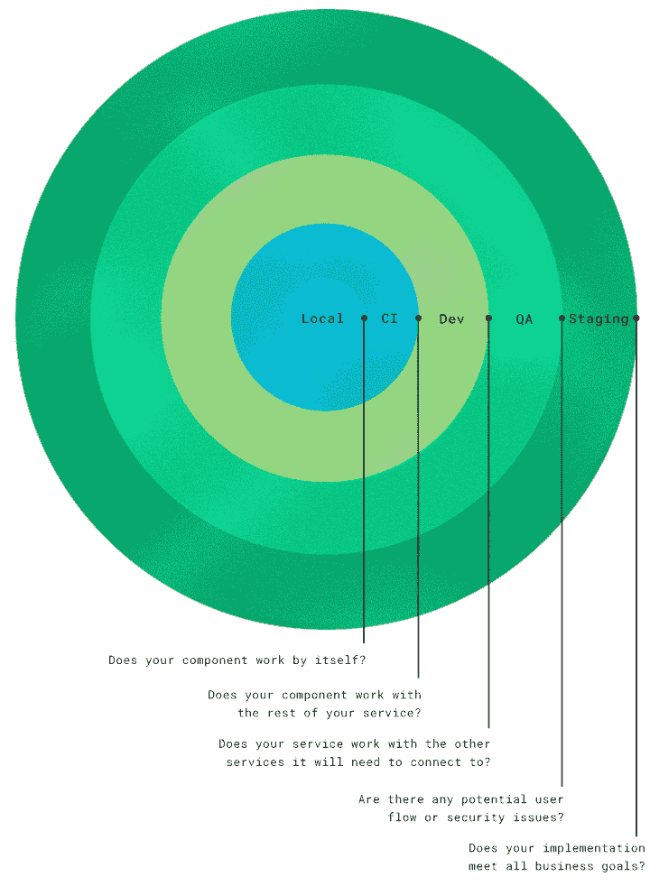

# 如何以及在哪里隔离测试环境

> 原文：<https://circleci.com/blog/path-to-production-how-and-where-to-segregate-test-environments/#2021-02-24T08:19:00-08:00>

## 学习如何以及在哪里隔离测试环境

将一个新工具引入一个组织不是一件简单的事情。采用 CI/CD 工具或任何其他工具应该在您的组织内进行一段时间的研究、分析和调整。

在我的[上一篇文章](https://circleci.com/blog/what-tools-do-you-need-to-do-devops/)中，我解释了任何成功的工具采用的先驱是如何与人相关的:有目的地一致，获得一些“之前”的度量来支持你的评估，以及适当地设置期望。我建议您重新阅读这篇文章，以便在进行任何工具更改之前为您的团队做好充分准备。

下一步是关于分析:准确推断出你最需要解决的管道问题。通过检查你的开发过程(我将称之为你的“生产之路”)，你可以找出你最大的问题来自哪里。只有当您知道您试图集中解决什么问题时，您才能做出合理的工具决策。

检查生产路径的目标是创建清晰的阶段，作为检查点。为了从一个阶段进入下一个阶段，构建必须通过这些质量关。将使用各种测试来分离这些门。一旦测试通过，质量就有了保证，构建就可以继续了。

更喜欢看它的实际操作？观看视频，[了解如何以及在哪里隔离测试环境](https://www.youtube.com/watch?v=S_Exu9X-mfU)。

这些管道阶段或执行环境被开发人员承担的越来越大的责任范围所分隔，从他们的本地笔记本电脑到团队空间，再到应用程序的整个代码库。随着责任范围的扩大，犯错的成本也就越高。这就是为什么我们在将一个构建传递到每一个连续的级别之前进行增量测试。

更重要的是，每个阶段需要不同类型的测试。当您从试运行阶段转移到生产阶段时，测试会从轻量级转移到重载级。资源成本也随着每个阶段而增加。重型测试只能发生在更像生产的环境中，包括完整的技术堆栈或外部依赖。为了正确地进行这些测试，还有更多的东西需要旋转，它们需要更昂贵的机器。因此，如果您能够在早期环境中进行尽可能多的测试，这是非常有益的，因为早期环境的成本要低得多。

在我们继续之前总结一下，职责分离的生产方式的好处是:
**1。通过将开发和测试分成几个阶段，调试更快更容易**。您可以更早地发现问题，反馈循环也更快。
**2。通过保持尽可能少的类似生产的环境(一到两个就好)来节省资源**。

我想提到的是，如果你的过程看起来不完全像我下面描述的那样，那也没关系。也许现在不会，或者永远不会。你可能有不同的目的，需要不同的流程。这里的目标是让您了解您的管道可能包含哪些阶段、测试和质量关。看到可能性应该有助于发现您的开发和测试工作流程中缺少了什么。此外，您的组织可能会使用与我在这里使用的不同的术语，这也没关系。这里重要的是考虑责任的级别，以及如何用测试来区分这些级别。

## 不同类型的测试环境

**-单元/组件测试:**这些测试涵盖了最小可能的组件、单元或功能。它们是运行起来最便宜和最快的测试，因为它们不需要大量的依赖或模仿。这些应该早做，让他们不碍事。
**-集成测试:**这些测试检查前一阶段的每个单元与其他组件、单元和功能的工作情况。从更广泛的意义上来说，它可以测试服务(比如 API)如何相互集成。
**-UI 层测试:**这是基于浏览器的自动化测试，测试基本的用户流程。它建立起来很昂贵，运行起来也很慢，所以应该在管道的后期进行。

现在让我们来谈谈这些测试如何适应软件开发管道。每个测试都有特定的角色和位置。

注意:这个例子使用了一个微服务应用程序，它允许我们分别测试和部署每个服务。

### 局部环境

这个环境是私有的，仅限于单个开发人员和他们的笔记本电脑。这种环境是最容易进行更改和测试您自己的实现的环境。

我们这里说的“本地”，其实只是一个“个人环境”。它可以在您的笔记本电脑上运行，但是如果应用程序太大而无法在您的本地笔记本电脑上运行，您也可以轻松地使用云环境。这里的关键是，它是一个较小规模的实例，是您自己的，您可以在开发过程中测试和调试您的实现，而不会干扰团队中的其他开发人员。因为您的本地环境中没有任何东西对其他人可见，所以您的团队可以同意将 Git 预推送挂钩集成到您的 repo 中，以确保使用本地环境，并在代码被推送到远程或共享的存储库之前运行自动化测试。

**测试:**在从本地环境迁移之前，我推荐的测试是单元测试、与模拟组件的集成测试，以及尽可能的 UI 测试。您在这个环境中可以做的测试越多，您在集成环境中取得成功的空间就越大。

**职责范围:**这里的范围只包括您正在构建的东西的实现或功能。你的组件能自己工作吗？表面积相对较小。但是，这是合并到共享环境之前的最后一个环境。因此，您需要负责任地进行测试，这样您就不会破坏共享的环境并阻碍其他人的积极开发。

### CI 环境

这是最短命的环境；它与建筑同在。它是在构建被触发时创建的，并在构建完成后被拆除。也是最不稳定的环境。作为一名开发人员，我将代码签入 CI 环境。由于其他开发人员可能会同时进行部署，CI 环境中有许多并发的部署活动。因此，配置项可能并且经常会中断。没关系——它注定会坏掉的。关键是当它发生时要修复它。

如果您不能在本地环境中启动整个应用程序(这是非常可能的)，CI 环境将是您能够进行浏览器驱动测试的第一个环境。您还可以进行在本地环境中无法进行的任何 UI 测试。

在这种环境中，您应该使用模拟外部服务和数据库来保持快速运行。

我建议像这样自动化 CI 环境的生命周期:当您合并代码时，CI 环境会自动加速，运行该代码，告诉您它是否安全，然后自行关闭。使用 Docker 自动启动环境将节省时间，自动化构建和环境创建的整个过程使团队成员更容易更频繁地提交。

从 CI 环境中获得的最大收益取决于您可以提高它的速度，因为这将决定您的反馈循环的长度。如果您的整个应用程序需要大约 30 分钟来启动和部署，那么您可能需要考虑进行部分部署。由于 CI 环境变化很快，您应该嘲笑大多数外部服务。请记住，您只是在测试核心组件的集成，而不是任何外部服务。

测试:单元测试，模拟组件的集成测试，模拟数据的 UI 测试

**职责范围:**在这里，您关心的是您要将代码合并到的共享代码库。您的组件与您的服务的其余部分一起工作吗？

### 发展环境

开发环境是与其他开发人员共享的环境。在这种环境下，应用程序中的每项服务每次都会得到部署。这些环境非常不稳定，因为每时每刻都有来自不同团队的不断变化。这里需要注意的是，您的集成和基于浏览器的测试现在可能会失败，即使它们在 CI 环境中通过了。这是因为它们现在已经与外部服务完全集成，其他服务也正在开发中。

尽管 CI 环境只是为您的团队(或者您产品的一个服务)准备的，并且可以在构建之间被拆除，但是这个开发环境是为您的整个产品代码库准备的。如果您选择合并到一个只属于您团队的开发环境中，那么与合并到所有团队共享的完整开发环境中相比，影响范围会更小。在开发环境中，现在需要系统健康检查监控，因为这是一个快速移动的环境，有许多不同的组件。由于它位于生产路径的中间，当这个环境中断时，它会对随后的环境产生不利影响——如果开发环境中断，这里的失败会阻止所有的更改，并且没有代码可以继续前进。

在开发环境中，有些外部服务会被模仿，有些不会，这取决于每个服务对您测试的内容有多重要，以及连接到那个外部服务的成本。如果您在这里使用模拟数据，请确保有足够的测试数据可用。

组织中的每个人都可以看到这个环境；任何开发人员都可以登录并将其作为应用程序运行。所有开发人员都可以使用这个环境进行测试和调试。

**测试:**单元测试，模拟组件集成测试，模拟数据 UI 测试，系统健康检查。

**职责范围:**范围扩大到与其他服务的集成。您的服务与它需要连接的其他服务一起工作吗？

### 质量保证环境

这是该场景中第一个手动部署的环境。它是手工部署的，因为 QA 团队需要根据变更的结构决定哪些特性值得他们自己测试。他们可能会选择一个堆叠的变更(变更 A、B 和 C ),并分别测试它们。在这种情况下，他们测试变更 A，一旦他们确定变更 A 按预期工作，他们就可以继续测试变更 B，当它抛出错误时，他们知道问题是由变更 B 引起的。否则，在只测试变更 C 的情况下，如果它抛出错误，就会阻碍 C、B 和 A 的进度。

QA 环境是一个受控的集成环境。在这里，QA 团队控制着即将到来的变化；相比之下，在开发环境中，任何变化都可能随时发生。构建现在与它将在应用程序中与之交互的服务集成在一起。

在此环境中，我们现在拥有与生产环境中相同的基础架构和应用程序。我们使用生产数据的一个代表性子集，足够接近生产数据来进行测试。QA 工程师或测试人员知道他们应该把测试的重点放在什么地方。我建议在这个阶段进行手动部署，这样可以在一个隔离的环境中测试小的变化，以帮助识别 bug。

如果在测试中不使用生产或类似生产的数据，QA 测试可能会错过很多。如果可能的话，使用真实的外部服务，这样 QA 可以捕捉到可能发生的真实问题。QA 环境越接近生产，您对测试结果的信心就越高。和往常一样，你必须权衡这种保证和成本。根据应用程序的功能，您仍然可以模仿一些外部服务，而不会产生不良影响。

**测试:**这个阶段是开放式探索性测试和安全性测试的适当时机。在这个阶段，你不仅希望发现技术问题，还希望发现潜在的用户流问题。

现在，您已经完成了所有种类的充分测试。是否存在任何潜在的用户流量或安全问题？在迁移到试运行环境之前，您还有什么需要解决的吗？

### 暂存环境

这是生产前的最后一个环境。试运行的目的是拥有一个与生产环境几乎完全相同的环境。当您将某些东西部署到产品化阶段，并且它工作正常时，您可以合理地确信该版本不会在生产中失败并导致停机。所有环境都有助于您发现潜在问题；筹备是信心的最后检查。在这种情况下，拥有与生产中几乎相同的数据量非常重要。这使您能够进行负载测试，并在生产中测试应用程序的可伸缩性。

应该将生产就绪代码部署到此环境中；同样，几乎与生产中相同。基础设施、数据库和外部服务集成应该与生产中的完全相同。维护和建设的成本将会很高——唯一更高的成本是不去做，以及中断生产。规模可以更小，但您的设置和配置必须相同。

这是生产前测试实施、迁移、配置和业务需求的最后一道关口。我想强烈建议您在进入试运行阶段之前获得业务签署。否则，做出改变将会非常昂贵。当你进行开发时，请确保拥有产品或所请求特性的人完全理解你在构建什么。从头到尾都保持一致。

测试:这个环境可以用来完成迄今为止我们所有测试中最繁重的工作:系统测试、负载测试、性能测试和安全性测试。

考虑到环境的重要性，如果在以前的环境中已经完成了其他核心应用程序功能和内部集成测试，那将是最有利的。

此时，要问的问题是:您的实现满足所有业务目标吗？

### 如何充分利用你的生产之路

*   使路径对每个人可见。
    *   使用生成监控
    *   允许所有开发人员访问预生产环境
*   构建和环境可能会中断。快速修复它，并尽可能保持绿色。
    *   如果你知道如何修复构建，就修复它。
    *   如果由于调试和实现的原因，某个构建修复需要一段时间，请先恢复该构建以取消阻止其他开发。
*   当一个构建在早期阶段被破坏时，不要将其提升到后期环境。
*   编写[可靠的](https://circleci.com/blog/preserve-build-integrity-prevent-problems-deterministic-builds/)，自动化测试。
    *   如果你的测试毫无理由地失败了，你不能信任他们，这条管道也不会为你工作。当这个管道可见时，并且当测试结果被准确地表示时，它是值得信任的。这就是为整个团队提供价值的方式。

## 创建您自己的集成测试环境

我刚刚与你分享了一个理想的生产途径。但是这里的理想可能对您或您的组织来说并不理想:您可能能够利用一个更轻量级的过程，这取决于您的组织和应用程序。但是我分享这个的意图是给你一个新的视角，通过它来看你自己的生产和测试实践之路。通过将您的质量关口与我概述的进行比较，您可以看到您可能遗漏了什么，因此您可以添加必要的控制，交付高质量的产品，并节省成本。

最后一点:你的整个生产路径，不管看起来像什么，都应该对组织中从事开发的每个人可见。每个在本地环境中实现代码的开发人员都应该能够了解代码将如何部署到生产环境中。在我之前的文章中，我谈到了 DevOps 意味着关心你的代码如何通过管道到达客户。其中一部分意味着要知道它将要通过的质量关。只有意识到他们的代码是如何被部署的，开发人员才能在进入下一阶段之前对减少错误产生最大的影响。

阅读更多信息: