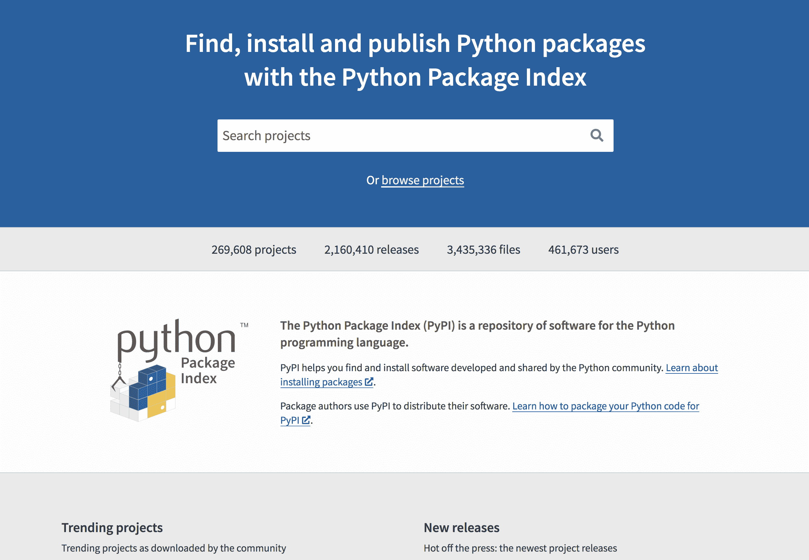
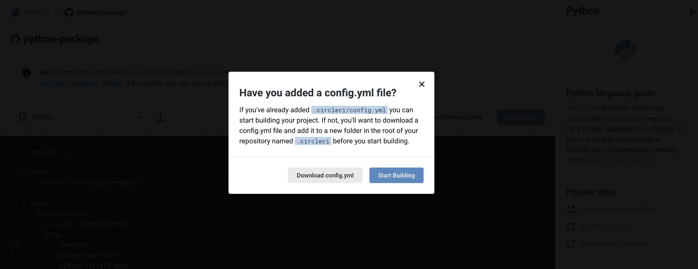
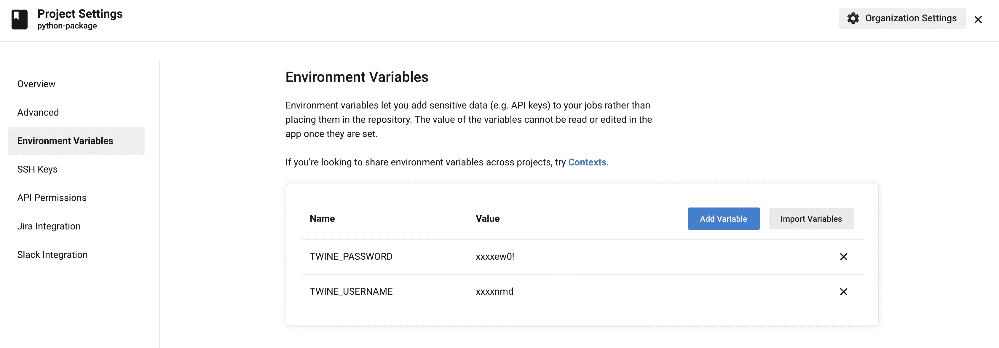
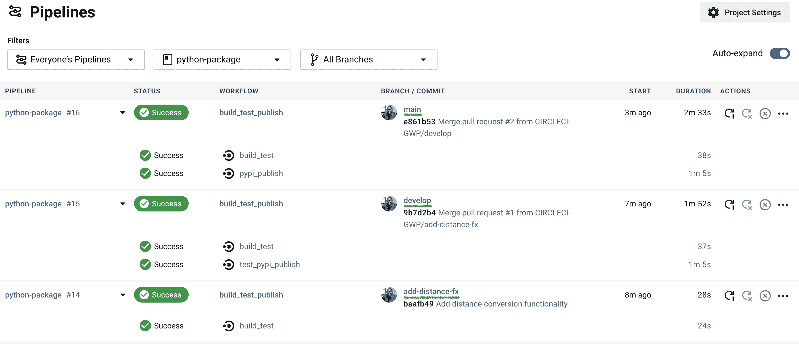

# 发布 Python 包| CircleCI

> 原文：<https://circleci.com/blog/publishing-a-python-package/#2021-03-16T13:00:00-07:00>

对于许多软件工程师和开发人员来说，使用标准库或内置对象是不够的。为了节省时间和提高效率，大多数开发人员都是在他人工作的基础上进行开发的。无论编码问题是什么，很可能有另一个程序员已经为它创建了一个解决方案。通常不需要重复解决问题的过程。这个原则被称为不重复自己或[干](https://en.wikipedia.org/wiki/Don%27t_repeat_yourself)。

超出标准库的代码通常在个人、团队甚至整个编码社区之间共享。如果你解决了一个编码问题，你可以把它作为开源代码库公开，让其他开发者从中受益。这些代码集合被称为包。

在本教程中，我们将构建一个简单的 Python 包，并为它创建一个[持续集成(CI)管道](https://circleci.com/blog/what-is-a-ci-cd-pipeline/)。

如果你使用的是流行的编程语言，比如 JavaScript 或 Python，那么会有工具可以发布你的开源包。对于 JavaScript，可以使用节点包管理器( [NPM](https://www.npmjs.com/) )。对于 Python，可以使用 Python 包索引，也称为( [PyPI](https://pypi.org/) )。在本教程中，我们将使用 PyPI。

## 先决条件

要完成本教程，您需要:

1.  Python 编程语言的基础知识
2.  Python 安装在您的系统上。如果你还没有，你可以[下载](https://www.python.org/downloads/)
3.  一个[圆](https://circleci.com/signup/)的账户
4.  GitHub 的一个账户
5.  test.pypi.org 和 pypi.org[的](https://pypi.org/account/register/)[账户](https://test.pypi.org/account/register/)

**注意:***test.pypi.org和[pypi.org](http://pypi.org)都要求您验证您的电子邮件地址。未经确认，您将无法发布包。本教程后面的步骤要求[test.pypi.org](http://test.pypi.org)和[pypi.org](http://pypi.org)的用户名和密码相似。例如，添加示例*

## 创建 Python 包

正如我在介绍中提到的，如果标准 Python 库中没有您需要的功能，那么很可能有一个包可以提供它。在 pypi.org 上有成千上万种包装可供选择。您可以搜索您需要的功能，或者从流行或新的包中选择。



我们的第一个任务是创建一个简单的转换包，它可以在短时间内演示包的功能。我们创建的包将允许程序员转换以下值:

*   温度(摄氏和华氏之间)
*   距离(公里和英里之间)
*   和其他人，如果你想添加他们

使用典型的包维护工作流作为我们的模型，我们将随着时间的推移提供更新，以扩展包的有用性并提高安全性。我们将使用变更日志来跟踪更新并通知用户变更。稍后会详细介绍。

### 项目结构

在系统中选择一个位置并创建一个项目:

```
python-package
├── convrsn
│   ├── __init__.py
│   └── temperature.py
├── .gitignore
└── setup.py 
```

该项目具有:

*   名为`python-package`的基本文件夹(您可以使用任何您喜欢的名称)
*   名为`convrsn`的模块/库文件夹(这是实际的包)
*   包文件夹中名为`temperature.py`的 Python 文件

确保模块/库文件夹名称是唯一的名称，未被测试 Python 包索引[test.pypi.org](http://test.pypi.org)或 Python 包索引[pypi.org](http://pypi.org)中的现有包使用，进行搜索查询以确认您想要使用的名称的可用性。

随着项目的创建和命名，我们可以开始构建将温度从`fahrenheit`转换到`celsius`并返回的功能。该逻辑将包含在文件`temperature.py`中。

复制这段代码并粘贴到`./convrsn/temperature.py`文件中:

```
def c2f(celcius):
    return (float(celcius) * 9/5) + 32

def f2c(fahrenheit):
    return (float(fahrenheit) - 32) * 5/9 
```

接下来，将这段代码复制到`__init__.py`文件中:

```
from .temperature import c2f, f2c 
```

将此代码复制到`setup.py`，然后使用您的信息更新`author`和`author_email`:

```
from setuptools import setup, find_packages

VERSION = '0.0.1'
DESCRIPTION = 'A conversion package'
LONG_DESCRIPTION = 'A package that makes it easy to convert values between several units of measurement'

setup(
    name="convrsn",
    version=VERSION,
    description=DESCRIPTION,
    long_description=LONG_DESCRIPTION,
    author="<Your Name>",
    author_email="<your email>",
    license='MIT',
    packages=find_packages(),
    install_requires=[],
    keywords='conversion',
    classifiers= [
        "Development Status :: 3 - Alpha",
        "Intended Audience :: Developers",
        'License :: OSI Approved :: MIT License',
        "Programming Language :: Python :: 3",
    ]
) 
```

要完成这一步，可以使用 GitHub。Python 的 gitignore [模板。将内容复制到这个项目的`.gitignore`文件中。](https://github.com/github/gitignore/blob/master/Python.gitignore)

代码应该类似于这个的[。](https://github.com/CIRCLECI-GWP/python-package/tree/setup)

通过运行以下命令克隆它:

```
git clone -b setup --single-branch https://github.com/CIRCLECI-GWP/python-package.git 
```

### 构建包文件

在我们开始这一步之前，我应该提到我正在使用 Python3。根据您的 Python 安装，您可能需要使用`python3`而不是`python`，如示例所示。

在您的终端(项目的根目录)中运行:

```
python setup.py sdist bdist_wheel 
```

该命令创建一个源分发和一个可共享的轮子，可以在[pypi.org](https://pypi.org/)上发布。

为了测试这一点，创建一个虚拟 Python 环境。

**注意:** *使用不同的位置来防止模块间的名称冲突。*

然后，使用车轮分配装置安装`convrsn`组件。根据您的 Python 安装，您可能需要使用`pip3`。

运行:

```
pip install <relative-path>/python-package/dist/convrsn-0.0.1-py3-none-any.whl 
```

创建一个名为`test.py`的 python 脚本文件，并输入:

```
from convrsn.temperature import f2c, c2f

print(f"{f2c(32)}")  # Result should be 0.0
print(f"{c2f(0)}")  # Result should be 32.0 
```

要进行测试，请在虚拟 Python 环境中运行脚本。


我们的 Python 包已经可以发布了。

## 发布 Python 包

在本教程的这一步，我们将遵循现实生活中的软件包创建者和维护者可能使用的工作流程。首先，我们将首先向 test.pypi.org 发布我们的包，以确保一切正常。当我们准备好向我们的软件包用户发布时，我们将继续前往 pypi.org 的。

Python Packaging Authority (PYPA)有一个漂亮的包来帮助解决这个问题，这个包叫做`twine`。我们将安装`twine`，然后发布到 test.pypi.org。您将被要求输入您的站点凭据。

在您的终端中，导航到您的包的根文件夹并运行:

```
pip install twine
twine upload --repository testpypi dist/* 
```


在一个单独的 Python 虚拟环境中，pip 安装包。当你运行`pip install <package-name>`，`pip`在 pypi.org 的[上的官方 Python 包索引中搜索包文件。](https://pypi.org/)

运行`test.py`脚本:

```
pip install --index-url https://test.pypi.org/simple convrsn
python3 test.py 
```

以下是我的执行方式。


成功！现在我们可以用 CircleCI 自动化发布过程。

## 使用 CircleCI 自动发布包

众所周知，CircleCI 非常适合自动化脚本。事实证明，它对于创建包发布的可重复过程也是很棒的。我们将创建一个能够:

*   从测试 PyPI 升级到 PyPI
*   维护检查(如果包括测试)
*   允许凭据仅由管道使用，而不与处理包的每个开发人员共享

首先，创建一个名为`tests`的文件夹。在其中，创建一个文件并将其命名为`test_temperature.py`。在`tests/test_tempertaure.py`中，输入:

```
from convrsn.temperature import f2c, c2f

def test_f2c():
    assert f2c(32) == 0.0

def test_c2f():
    assert c2f(0) == 32.0 
```

当您在包含我们的`convrsn`包的 Python 虚拟环境中时，转到根文件夹。Pip 安装`pytest`，然后运行`pytest`命令:

```
pip install pytest
pytest 
```

两个测试都应该成功通过。


接下来，将 CircleCI 配置文件添加到项目中。创建一个名为`.circleci`的文件夹。在新文件夹中，创建一个名为`config.yml`的文件。在`.circleci/config.yml`中，复制粘贴:

```
version: 2.1
jobs:
  build_test:
    docker:
      - image: circleci/python:3.6.4
    steps:
      - checkout  # checkout source code to working directory
      - run:
          command: |  # create whl and use pipenv to install dependencies
            python setup.py sdist bdist_wheel
            sudo pip install pipenv
            pipenv install dist/convrsn-0.0.2-py3-none-any.whl
            pipenv install pytest
      - run:
          command: |  # Run test suite
            pipenv run pytest
  test_pypi_publish:
    docker:
      - image: circleci/python:3.6.4
    steps:
      - checkout  # checkout source code to working directory
      - run:
          command: |  # create whl, install twine and publish to Test PyPI
            python setup.py sdist bdist_wheel
            sudo pip install pipenv
            pipenv install twine
            pipenv run twine upload --repository testpypi dist/*
  pypi_publish:
    docker:
      - image: circleci/python:3.6.4
    steps:
      - checkout  # checkout source code to working directory
      - run:
          command: |  # create whl, install twine and publish to PyPI
            python setup.py sdist bdist_wheel
            sudo pip install pipenv
            pipenv install twine
            pipenv run twine upload dist/*
workflows:
  build_test_publish:
    jobs:
      - build_test
      - test_pypi_publish:
          requires:
            - build_test
          filters:
            branches:
              only:
                - develop
      - pypi_publish:
          requires:
            - build_test
          filters:
            branches:
              only:
                - main 
```

此配置文件指示管道安装必要的依赖项、运行测试并发布包。配置的`workflow`部分指定了`filters`，作业应该执行的顺序，以及它们的依赖关系。

例如，如果`test`作业失败，作业`test_pypi_publish`和`pypi_publish`将无法运行。`test_pypi_publish`和`pypi_publish`任务分别只在`develop`和`main`分支运行。

## 将项目连接到 CircleCI

从将你的项目推送到 GitHub 开始。

你的知识库应该类似于[这个](https://github.com/CIRCLECI-GWP/python-package/tree/circleci)。

现在，转到 CircleCI 仪表板上的**添加项目**页面。点击**设置项目**。


点击**使用现有配置**(因为我们已经有了自己的配置文件)。在出现的模式中点击**开始建造**。



CircleCI 选择默认的分支，所以如果您使用不带`.circleci/config.yml`文件的分支，您将会得到一个构建错误。`build_test`任务将会通过，但是如果您在`main`或者`develop`分支中，那么构建将会失败。这是因为`test_pypi_publish`和`pypi_publish`作业还不能运行。

尽管当我们使用`twine`发布包时，测试 PyPI 凭证是期望的，但是当终端在管道中运行命令时，我们不能与终端交互。为了提供这些凭证，我们可以向命令添加标志:`twine upload -u USERNAME -p PASSWORD`。然而，因为 Git 跟踪配置文件，而且我们的 Git 存储库是公共的，所以使用标志会有安全风险。我们可以通过创建环境变量来避免这种风险。

### 创建环境变量

在 CircleCI 项目(`python-package`)上，点击页面右上方的**项目设置**。


从右侧菜单中选择**环境变量**。然后，点击**添加环境变量**。


输入`TWINE_USERNAME`和`TWINE_PASSWORD`的键值对。这是预期的结果。



我们的下一步是创建一个变更日志。

### 添加更改日志

在您的本地项目中，创建一个名为`CHANGELOG.md`的文件，并输入:

```
# Change Log

All notable changes to this project will be documented in this file.

The format is based on [Keep a Changelog](http://keepachangelog.com/)
and this project adheres to [Semantic Versioning](http://semver.org/).

## [0.0.2] - 2020-10-30

### Added
- Temperature conversion 
```

为了确保构建成功，我们还需要将`setup.py`中的版本提升到`0.0.2`中，以匹配变更日志。

**注意** : *如果不撞版本，发布作业会失败，因为不能两次发布同一个版本。*

提交更改并推送到 GitHub 以触发构建。


## 更新包

要扩展包的功能，您可以创建另一个分支并对其进行更新。之后:

1.  为它创建测试
2.  在`setup.py`撞版本
3.  在 CircleCI 配置文件中插入`whl`文件的版本
4.  更新`ChangeLog`
5.  推送至 GitHub

当您成功构建时，创建一个 GitHub Pull 请求(PR)到`develop`分支。如果好看就合并。当构建成功时，创建一个到`main`分支 PR，检查它，并合并。

看一下这些拉取请求的例子:

测试版 PyPI 和 PyPI 上的包具有从公里到英里以及相反方向的附加功能`distance conversion`。当构建成功时，PRs 被合并。



## 结论

现在你有了它，一个成功的、可重复的过程，适合于由 CI/CD 支持的 Python 包维护者。我们创建了一个 Python 包项目，创建了 Python 轮子，并使用一个`whl`文件安装了一个包。我们从本地机器发布了这个包，然后使用 CircleCI 自动化了这个过程。

继续建！

* * *

Stanley 是一名软件工程师和技术文案，他身兼数职，包括技术团队领导和社区参与。他把自己描述成一个数字人(在数字空间中有文化)。

[阅读 Stanley Ndagi 的更多帖子](/blog/author/stanley-ndagi/)