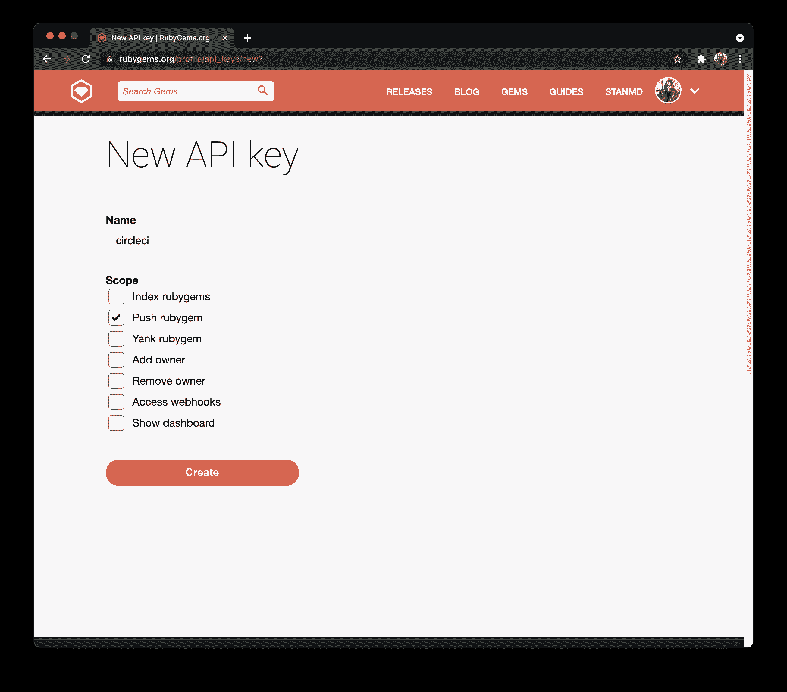
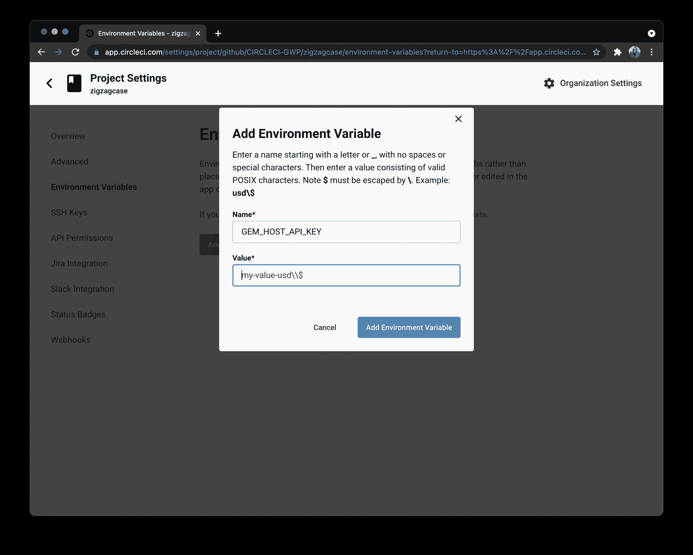
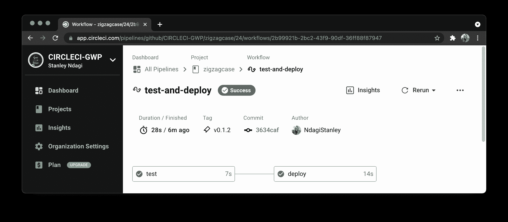
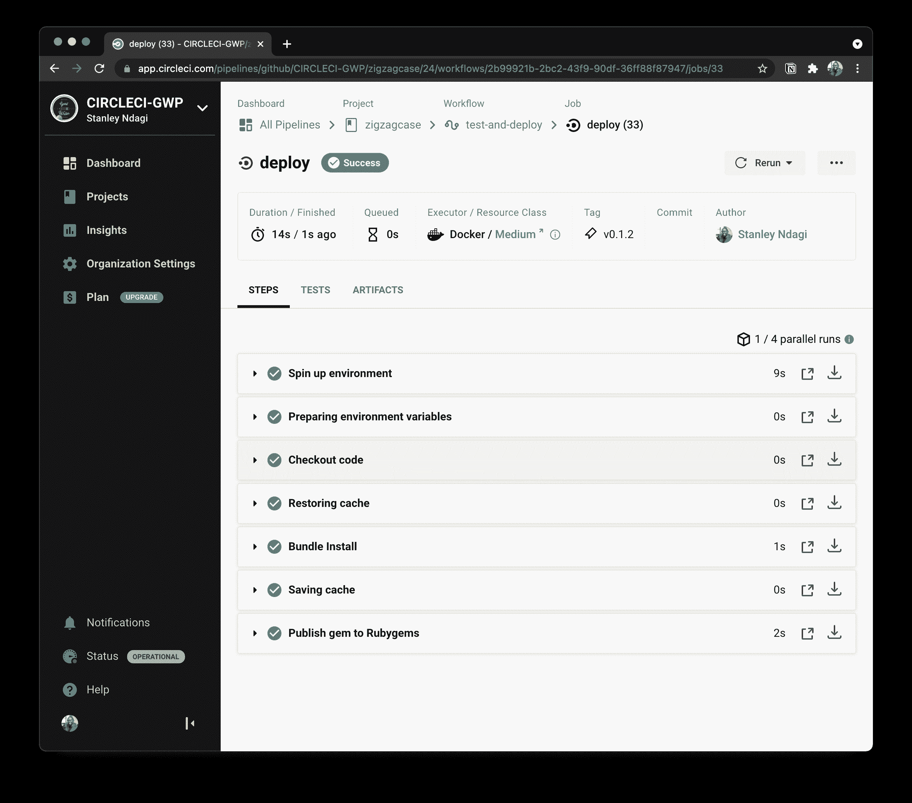

# 使用 CircleCI | CircleCI 发布到 Rubygems

> 原文：<https://circleci.com/blog/publishing-with-rubygems/#2021-10-01T09:00:00-07:00>

如果您维护一个 Ruby gem，那么您肯定熟悉围绕新版本发布的重复性手工任务。这样做了一段时间后，您不可避免地会开始思考这些步骤中的一些可以自动化。他们可以！通过几行代码，您可以将连续交付的惊人世界带到您的项目中，并增加整个过程的可靠性，同时节省您的一些时间。双赢！

在本文中，我将演示如何围绕一个简单的 gem 创建一个完整的过程，这样您就可以看到一些可能性。

## 自动化的案例

将连续交付(CD)过程引入任何专业或激情项目有几个原因。我将从可能是最明显的一个开始:它节省你的时间。当然，初始设置将需要一些前期投资，而你研究和尝试的东西，直到一切都到位。然而，在那之后，好处会在你的项目的整个生命周期中累积。

另一个很大的优点是它带来的可重复性。自动化意味着可预测性，这可以通过总是以相同顺序运行的配置文件和命令来表达。反过来，如果您在部署过程中遇到问题，这使得调试更加容易。

最后，上面提到的决定论肯定会在发布阶段导致更少的错误和灾难。当您准备好部署一个新版本的 gem 时，不要试图记住要运行的命令的正确顺序，您只需要依靠您之前设置的经过尝试和测试的过程来完成这项工作。它被记录在案，你知道它会被完美地执行。

## 构建演示

在本教程中，我将带领你创建一个小项目，作为一个可出版的宝石。我们将使用一些简单的东西:一个将方法`zigzagcase`添加到 String 对象的 Ruby gem。它将返回字符大小写交替的字符串的副本:`LiKe tHiS`。为了简单起见，我们将保持我们的代码为普通的 Ruby，它易于编码和测试。您可以省去为另一个项目编写需要与 Rails、Sinatra 或其他 Ruby 框架一起工作的东西。

## 先决条件

跟随本教程，您将需要一些东西:

*   一个 [GitHub](https://github.com/) 账户。你可以在这里创建一个[。](https://github.com/join)
*   一个 [Rubygems 账户](https://rubygems.org/sign_up)来发布我们的 gem
*   一个 [CircleCI](https://circleci.com/) 账户。你可以在这里创建一个[。要轻松连接您的 GitHub 项目，您可以注册您的 GitHub 帐户。](https://circleci.com/signup/)

**注意:** *确保[捆扎机](https://bundler.io/#getting-started)已安装。您将使用它来简化宝石的创建。使用 Bundler 是 Ruby 社区中的人们管理他们的 gem 的主要方式，所以使用它来创建一个是有意义的。*

## 设置项目

从跑步开始:

```
$ bundle gem zigzagcase --test=minitest 
```

这个简单的命令创建一个脚手架文件夹，并初始化一个 git 存储库。如果这是你第一次使用 Bundler 2.1.4 运行`bundle gem`，会询问你是否要包含行为准则和许可证。推荐你加一个；麻省理工学院适合这个项目。我们传递的`test`标志将自动选择 minitest 作为我们的测试框架。

你可以[阅读更多由 Bundler 创建的脚手架](https://bundler.io/guides/creating_gem.html#getting-started)(有相当多的文件)，但要点是:

*   `zigzagcase/lib/zigzagcase.rb`被用作占位符来导入其他带有我们代码的文件
*   `zigzagcase/lib/zigzagcase/version.rb`持有当前版本的 gem
*   定义宝石:里面有什么，谁做的，许可证，以及其他技术细节

在前进之前，有一点家务要做。转到`cd zigzagcase`文件夹并运行`grep TODO zigzagcase.gemspec`。Bundler 留下了一些我们需要自己照顾的东西。如果我们不这样做，我们将很难运行其他命令，所以我们最好现在就解决这个问题。深入研究该文件，进行下一个代码块中所示的更改。

```
require_relative 'lib/zigzagcase/version'

Gem::Specification.new do |spec|
  spec.name          = "zgzgcase"
  spec.version       = Zigzagcase::VERSION
  spec.authors       = ["Gonçalo Morais"]
  spec.email         = ["author.email@example.com"]

  spec.summary       = %q{MaKe sTrInGs lOoK LiKe tHiS}
  spec.description   = %q{Alternates upper case and lower case across letters}
  spec.homepage      = "https://github.com/CIRCLECI-GWP/zigzagcase"
  spec.license       = "MIT"
  spec.required_ruby_version = Gem::Requirement.new(">= 2.3.0")

  spec.metadata["allowed_push_host"] = "https://rubygems.org"

  spec.metadata["homepage_uri"] = spec.homepage
  spec.metadata["source_code_uri"] = "https://github.com/CIRCLECI-GWP/zigzagcase"
  spec.metadata["changelog_uri"] = "https://github.com/CIRCLECI-GWP/zigzagcase/blob/main/CHANGELOG.md"

  # Specify which files should be added to the gem when it is released.
  # The `git ls-files -z` loads the files in the RubyGem that have been added into git.
  spec.files         = Dir.chdir(File.expand_path('..', __FILE__)) do
    `git ls-files -z`.split("\x0").reject { |f| f.match(%r{^(test|spec|features)/}) }
  end
  spec.bindir        = "exe"
  spec.executables   = spec.files.grep(%r{^exe/}) { |f| File.basename(f) }
  spec.require_paths = ["lib"]
end 
```

rubygems 中已经存在一个名为`zigzagcase`的 gem。对于本教程，我们使用名称`zgzgcase`代替。这是在前一个代码块中分配给`spec.name`的名字。为了成功发布您自己的 gem，您需要选择一个替代名称，并确认没有使用该名称的 gem。在 [rubygems](https://rubygems.org/) 搜索，如果没有你选择的宝石名称，你可以继续学习教程。用您的特定名称替换每个`zgzgcase`实例。

我们的宝石依赖于其他一些现成的宝石。可以查看`Gemfile`看看是哪些。通过运行`bundle install`安装它们，并提交由此产生的`Gemfile.lock`。

更新`README`文件也是一个很好的做法。首先，在安装部分，更新 gem 名称。用你的 GitHub repo 的 URL 更新贡献部分的 URL。接下来我们将创建回购。

在开始编写代码之前，先将这个起始结构保存在 GitHub 上。确保您[创建了一个空的 repo](https://docs.github.com/en/github/getting-started-with-github/create-a-repo) 。Bundler 为您初始化了一个本地 git 存储库，如果项目是空的，直接将您拥有的内容发送到 GitHub 会更容易。如果你不熟悉这个过程或者不熟悉 GitHub，请跟随[这篇教程](https://circleci.com/blog/pushing-a-project-to-github/)。

## 测试作为一项功能

一个健康的连续交付工作流程的一部分是建立一个可靠的测试套件，让你对你发布的东西有信心。因为这是如此重要的一部分，所以让我们确保添加一些测试来保持我们的 gem 的完整性。在搭建期间，我们选择了 [minitest](https://github.com/seattlerb/minitest) 作为我们的测试框架——但是你可以自由选择任何其他框架，重要的是编写有意义的测试。

如果您检查由 Bundler 创建的`Rakefile`，您将看到 Rake 的默认任务是运行测试，因此我们现在可以通过执行`bundle exec rake`来运行它，而不做任何更改。

```
Run options: --seed 21588

# Running:

.F

Finished in 0.001040s, 1923.0769 runs/s, 1923.0769 assertions/s.

  1) Failure:
ZigzagcaseTest#test_it_does_something_useful [zigzagcase/test/zigzagcase_test.rb:9]:
Expected false to be truthy.

2 runs, 2 assertions, 1 failures, 0 errors, 0 skips
rake aborted!
Command failed with status (1)
/Users/circleci/.rbenv/versions/2.6.5/bin/bundle:23:in `load'
/Users/circleci/.rbenv/versions/2.6.5/bin/bundle:23:in `<main>'
Tasks: TOP => default => test
(See full trace by running task with --trace) 
```

打开`test/zigzagcase_test.rb`并用我们方法的几个简单测试来代替它:

```
require "test_helper"

class ZigzagcaseTest < Minitest::Test
  def test_alternates_upcase_and_downcase
    assert_equal "AdVeNtUrE TiMe!", "Adventure Time!".zigzagcase
  end

  def test_keeps_original_string_untouched
    original_string = "Adventure Time!"
    expected_string = original_string.dup

    original_string.zigzagcase

    assert_equal expected_string, original_string
  end
end 
```

如果您碰巧试图运行这些测试，您会得到一个错误:`NoMethodError: undefined method 'zigzagcase' for "Adventure Time!":String`。我们得到这个错误是因为我们还没有为我们的方法写任何代码。

在`lib/zigzagcase`文件夹中创建一个`string.rb`文件。我们将在那里添加我们的代码(`lib/zigzagcase/string.rb`)。为了简单起见，这个 gem 会自动给 Ruby 的 String 类添加一个`zigzagcase`方法。

```
class String
  def zigzagcase
    modifiers = %i[upcase downcase].cycle
    self.chars.map{ |char| char.send(modifiers.next) }.join
  end
end 
```

简而言之，这段代码获取字符串中所有字符的数组，在对每个字符交替调用`upcase`或`downcase`的同时返回该数组的副本，最后将它们连接在一起返回一个新字符串。这个新文件还没有在任何地方使用，所以我们刚刚写的代码没有被拾取。我们将通过主 gem 类(`lib/zigzagcase.rb`)导入它来解决这个问题。将该文件的内容替换为:

```
require "zigzagcase/version"
require "zigzagcase/string" 
```

现在我们已经有了我们的代码，我们可以再次运行测试用例，只是为了看到它们成功地通过。

```
Run options: --seed 48145

# Running:

..

Finished in 0.000964s, 2074.6888 runs/s, 2074.6888 assertions/s.

2 runs, 2 assertions, 0 failures, 0 errors, 0 skips 
```

## 自动化流程

我们已经在本地运行，现在我们希望确保“机器人”为我们工作。我们将使用[这个例子作为参考](https://circleci.com/docs/language-ruby/#sample-configuration)，但是我们的配置将更加简单(`.circleci/config.yml`):

```
version: 2.1
orbs:
  ruby: circleci/ruby@1.0.4
jobs:
  test:
    docker:
      - image: cimg/ruby:2.7
    steps:
      - checkout
      - ruby/install-deps
      - run:
          name: Run tests
          command: bundle exec rake
workflows:
  version: 2
  deploy:
    jobs:
      - test 
```

添加后，确保提交上面的`.circleci/config.yml`并推送到 GitHub。这将自动触发您的项目在 CircleCI 上的首次构建。

## 准备发布

我们将遵循[语义版本](https://semver.org)来发布这个 gem。希望你正在遵循类似的实践。如果运用得当，这是一种快速简单的方法，可以让人们清楚地了解发生的变化。

使用版本化策略将允许我们实现连续交付和连续*部署*过程之间的关键区别。在构建 web 应用程序时，您可能希望尽可能快地向用户提供每一处代码更改。没有发布日期，因为发布意味着在没有人工干预或批准的情况下将新功能和变化提供给用户。对于连续交付，您希望保留手工发布过程。当在 gem 上工作时，每当主分支被合并时，您可能希望所有最新的代码都在主分支上，但是您不希望每次都发布新的版本。

作为一个额外的细节，有一个单一的地方来快速浏览版本之间的变化是非常有用的，而 changelog 文件是一个完美的地方。在下一节中，我们将创建一个并将其添加到我们的脚手架中。

现在我们将在 CircleCI 上设置一些很酷的东西:如果我们将一个 [git 标签](https://git-scm.com/book/en/v2/Git-Basics-Tagging)推送到 GitHub，就可以运行部署步骤。每当有东西被合并到我们的主分支中，我们只想运行我们的测试。但是当我们标记要发布的东西时，我们希望 CircleCI 来做艰苦的工作。在我们的测试通过之后，我们希望它自动构建我们的 gem 的新版本，并将其发布在 Rubygems 上。

我们将在 Rubygems 上设置一种认证方式，这样它就能以我们的名义发布 gems。在[检查了文档](https://guides.rubygems.org/command-reference/#gem-push)之后，我们知道可以用来自 [Rubygems 的 API 密钥页面](https://rubygems.org/profile/api_keys)的密钥在我们的服务器中设置一个`GEM_HOST_API_KEY`。点击**新 API 键**创建一个。输入一个名称来标识 API 键，选择所需的范围，然后单击**创建**。在我们的例子中，只检查了`Push rubygems`范围。



在您项目中设置[变量。](https://circleci.com/docs/env-vars/#setting-an-environment-variable-in-a-project)



有了凭证之后，我们需要更改 CircleCI 配置，以包含这个额外的步骤。我们正在添加一个部署作业，该作业将仅针对标记运行。下面是更新后的配置文件(`.circleci/config.yml`):

```
version: 2.1
orbs:
  ruby: circleci/ruby@1.0.4
jobs:
  test:
    docker:
      - image: cimg/ruby:2.7
    steps:
      - checkout
      - ruby/install-deps
      - run:
          name: Run tests
          command: bundle exec rake
  deploy:
    docker:
      - image: cimg/ruby:2.7
    steps:
      - checkout
      - ruby/install-deps
      - run:
          name: Publish gem to Rubygems
          command: bundle exec rake release
workflows:
  version: 2
  test-and-deploy:
    jobs:
      - test:
          filters:
            tags:
              only: /.*/
      - deploy:
          requires:
            - test
          filters:
            tags:
              only: /^v.*/
            branches:
              ignore: /.*/ 
```

这里有两个很大的区别:

*   我们的新工作是负责使用 Bundler 构建和发布我们的 gem
*   我们的工作流部分进行了更改，以适应过滤触发部署作业的事件的逻辑

在这个例子中，我们匹配任何分支(因此忽略所有分支)，并且只匹配以 v 开头的标签(v0.0.1 等等)。

## 把一切都包起来

现在是时候启动我们的工作流程了。每当你对合并到主分支中的更改感到满意，并且准备剪切出我们应用程序的新版本时，你只需要正确地标记它，并将其推送到 GitHub。

如果你想让你的项目保持出色，考虑[记录](https://keepachangelog.com)宝石经历的变化。这个记录可以作为它演变的时间线。我们将在`CHANGELOG.md`写一份我们创业板的变化总结。这里有一个例子。

```
# Change Log

All notable changes to this project will be documented in this file.

The format is based on [Keep a Changelog](http://keepachangelog.com/)
and this project adheres to [Semantic Versioning](http://semver.org/).

## [0.1.0] - 2020-09-19

### Added
- First release 
```

根据经验编辑你的。保持这个文件是最新的，因为在这里人们可以找到关于版本之间发生的变化的摘要和有用的链接。尤其重要的是要仔细检查可能的回归和安全修复。

另外，确保使用[注释标签](https://git-scm.com/book/en/v2/Git-Basics-Tagging#_annotated_tags)给你的宝石贴上尽可能多的信息。这将有助于您保持有用和丰富的 git 历史。

提交更改并标记提交:

```
git add .
git commit -m "Update CircleCI config & add CHANGELOG"
git tag -a v0.1.0 -m "First release" 
```

这里有一个您必须经常检查以确保一切顺利运行的细节:保持 git 标签和 gem 版本同步。在这种情况下，我们用`0.1.0`标记我们的宝石。这与我们在`lib/zigzagcase/version`和`Gemfile.lock`看到的版本相同。每当您准备好更新您的 gem 版本时(例如，因为您发布了一个错误修复),请确保:

*   在`lib/zigzagcase/version`更新
*   之后在控制台运行`bundle`

您的`Gemfile.lock`将反映版本增量，所以不要忘记`git commit`它。

现在，我们准备通过运行以下命令向世界发布我们闪亮的新版本:

```
git push origin main
git push origin --tags 
```

返回 CircleCI dashboard 查看您的成功发布。





## 结论

您现在已经自动发布了 gem！你可以在 Rubygems 网站上找到你发布的 gem 的新版本。每当你标记你的 gem 发布时，你用 CircleCI 设置的过程将确保你的新代码对 Ruby 社区可用。

我希望这篇教程能启发你自动化你自己的 Rubygems 部署，并激发你对还能自动化什么的好奇心。您可以对 NPM 模块、iOS pods 或 Unix tarballs 应用类似的过程。为什么不把所有的东西都录下来？

* * *

贡萨洛·莫莱斯是一名计算机工程师，对网络情有独钟。他目前正在帮助 BridgeU 的学生选择更好的职业，由 Rails 和 JavaScript 提供支持。Gonç alo 是 Recurse 中心的校友，偶尔也是 ultrarunner 和 boulderer。

[阅读更多贡萨洛·莫莱斯的文章](/blog/author/goncalo-morais/)