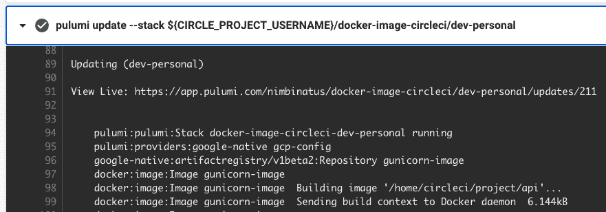

# 使用 Pulumi | CircleCI 从您的 CI 渠道构建云基础架构

> 原文：<https://circleci.com/blog/reusable-ci-cd-components-with-circleci-orbs-and-pulumi/#2022-04-12T06:05:00-07:00>

现代软件系统非常复杂，服务分布在世界各地的许多区域的数据中心。我们管理专用于我们组织的单个服务器的日子已经一去不复返了，因为我们对自己设置的独特之处了如指掌。

现在，我们依靠其他人来管理大规模的数据中心，我们借用共享硬件上的小块虚拟空间，通过共享网络传输，所有这些都在我们称为云的系统中。管理与云的交互是云工程的一部分。

为了干净地交付应用程序，您需要像管理连续交付一样管理管道基础设施。随着云工程的成熟，您可以将应用交付的实践作为代码引入基础设施。

## 使用 Pulumi 和 CircleCI 开始云工程

云工程使云更接近应用程序开发，将工程实践和原则应用于基础设施，并在整个团队中更快地进行创新和协作。Pulumi 是一个基础设施即代码平台，您可以用它来帮助在您的组织中创建云工程文化。这种文化包括持续集成、持续部署和交付，以及测试驱动的开发。

对于本教程，我们已经创建了一个构建在 [Falcon](https://falconframework.org/) 之上的小示例应用程序，这是一个用于 Python 的 RESTful API 框架。你可以在 https://github.com/nimbinatus/circleci-pulumi-sample 的[找到源代码。](https://github.com/nimbinatus/circleci-pulumi-sample)

你可以用 Pulumi 使用很多语言，比如 Python 或者 Go。对于本教程，我们将使用 Pulumi 的 TypeScript SDK 来部署它。

## 先决条件

如果你愿意，克隆[回购](https://github.com/nimbinatus/circleci-pulumi-sample)，或者复制代码。我们明确地不需要特定的版本控制系统，因为带有 CircleCI 的 Pulumi 可以使用它们中的任何一个。

让我们从一个工作流声明开始，它将我们的回购部署到谷歌云平台(GCP)的容器注册表，然后部署到云运行。

## 使用声明性工作流的参数构建基础结构

我们可以参数化 orb，这样我们就可以设置要下载的 Pulumi CLI 的版本，选择更新是否应该跳过预览，等等。对于其他 CI/CD 系统，您通常需要编写一次性的 Bash 脚本来从`https://get.pulumi.com`下载客户机，将其添加到当前的`$PATH`中，等等。orb 允许更简单、更具组合性和声明性的 CI/CD 工作流。

对于我们的例子，我们可以清楚地声明我们的初始工作流:

```
version: 2.1
orbs:
  pulumi: pulumi/pulumi@2.1.0
  gcp-cli: circleci/gcp-cli@2.4.0
  gcp-gcr: circleci/gcp-gcr@0.14.1
  node: circleci/node@5.0.0
jobs:
  build:
    docker:
      - image: cimg/node:17.5.0
    steps:
      - checkout
      - setup_remote_docker:
          docker_layer_caching: false
      - pulumi/login:
          access-token: ${PULUMI_ACCESS_TOKEN}
      - node/install-packages:
          app-dir: ~/project/infra-ts/image
      - gcp-cli/install
      - gcp-cli/initialize
      - gcp-gcr/gcr-auth:
          registry-url: us-central1-docker.pkg.dev
      - pulumi/update:
          stack: ${CIRCLE_PROJECT_USERNAME}/docker-image-circleci/dev-personal
          working_directory: ~/project/infra-ts/image
  deploy:
    docker:
      - image: cimg/node:17.5.0
    steps:
      - checkout
      - pulumi/login:
          access-token: ${PULUMI_ACCESS_TOKEN}
      - node/install-packages:
          app-dir: ~/project/infra-ts/cloud-run
      - gcp-cli/install
      - gcp-cli/initialize
      - gcp-gcr/gcr-auth:
          registry-url: us-central1-docker.pkg.dev
      - pulumi/update:
          stack: ${CIRCLE_PROJECT_USERNAME}/circleci-pulumi/dev-personal
          working_directory: ~/project/infra-ts/cloud-run
workflows:
  version: 2.1
  pulumi-deploy:
    jobs:
      - build:
          filters:
            branches:
              only:
                - main
      - deploy:
          requires:
            - build
          filters:
            branches:
              only:
                - main 
```

注意，在整个工作流程中，我们使用带有环境变量的标准 orb 调用。没有一次性脚本。不乱。漂亮、干净、易于阅读、重用和共享。

## 烟雾测试变得简单

有了 Pulumi 和 CircleCI，您可以构建短暂的环境来进行任何您想要的测试，所有这些都是您的管道的一部分。我们可以使用参数来创建独特的环境，并将测试结果发送回一个拉取请求或其他地方。例如，我们可以使用这样的代码来测试对 GitHub repo 的 pull 请求，以确保我们的端点按照预期做出响应，然后在测试通过后完全拆除测试环境。将这段代码添加到您的`.config.yaml`文件中:

```
# …
jobs:
  preview:
    docker:
      - image: cimg/node:17.5.0
    steps:
      - checkout
      - setup_remote_docker:
          docker_layer_caching: false
      - pulumi/login:
          access-token: ${PULUMI_ACCESS_TOKEN}
      - node/install-packages:
          app-dir: ~/project/infra-ts/cloud-run
      - node/install-packages:
          app-dir: ~/project/infra-ts/image
      - gcp-cli/install
      - gcp-cli/initialize
      - gcp-gcr/gcr-auth:
          registry-url: us-central1-docker.pkg.dev
      - pulumi/stack_init:
          stack: ${CIRCLE_PROJECT_USERNAME}/docker-image-circleci/qa_${CIRCLE_BUILD_NUM}-image
          working_directory: ~/project/infra-ts/image
          copy: ${CIRCLE_PROJECT_USERNAME}/docker-image-circleci/dev-personal
      - pulumi/stack_init:
          stack: ${CIRCLE_PROJECT_USERNAME}/circleci-pulumi/qa_${CIRCLE_BUILD_NUM}-cr
          working_directory: ~/project/infra-ts/cloud-run
          copy: ${CIRCLE_PROJECT_USERNAME}/circleci-pulumi/dev-personal
      - pulumi/preview:
          stack: ${CIRCLE_PROJECT_USERNAME}/docker-image-circleci/qa_${CIRCLE_BUILD_NUM}-image
          working_directory: ~/project/infra-ts/image
      - pulumi/preview:
          stack: ${CIRCLE_PROJECT_USERNAME}/circleci-pulumi/qa_${CIRCLE_BUILD_NUM}-cr
          working_directory: ~/project/infra-ts/cloud-run
      - pulumi/update:
          stack: ${CIRCLE_PROJECT_USERNAME}/docker-image-circleci/qa_${CIRCLE_BUILD_NUM}-image
          working_directory: ~/project/infra-ts/image
          skip-preview: true
      - pulumi/update:
          stack: ${CIRCLE_PROJECT_USERNAME}/circleci-pulumi/qa_${CIRCLE_BUILD_NUM}-cr
          working_directory: ~/project/infra-ts/cloud-run
          skip-preview: true
      - pulumi/stack_output:
          stack: ${CIRCLE_PROJECT_USERNAME}/circleci-pulumi/qa_${CIRCLE_BUILD_NUM}-cr
          property_name: cloudRunUrl
          env_var: TEST_URL
      - run:
          name: Test URL
          command: |
            curl -sSJL $TEST_URL/hello
      - pulumi/destroy:
          stack: ${CIRCLE_PROJECT_USERNAME}/docker-image-circleci/qa_${CIRCLE_BUILD_NUM}-image
          working_directory: ~/project/infra-ts/image
      - pulumi/destroy:
          stack: ${CIRCLE_PROJECT_USERNAME}/circleci-pulumi/qa_${CIRCLE_BUILD_NUM}-cr
          working_directory: ~/project/infra-ts/cloud-run
      - pulumi/stack_rm:
          stack: ${CIRCLE_PROJECT_USERNAME}/docker-image-circleci/qa_${CIRCLE_BUILD_NUM}-image
      - pulumi/stack_rm:
          stack: ${CIRCLE_PROJECT_USERNAME}/circleci-pulumi/qa_${CIRCLE_BUILD_NUM}-cr
# …
workflows:
  version: 2.1
  pulumi-preview:
    jobs:
      - preview:
          filters:
            branches:
              ignore:
                - main
# … 
```

在这个工作流程中，我们为每组资源构建一个新的堆栈，运行一些测试，然后在一个管道中分解所有的东西。非常方便！

## 与现有系统集成

Pulumi 与 CircleCI 的集成并不以一个基本的工作流结束。Pulumi 命令行客户端将 CircleCI 构建元数据与堆栈更新相关联，因此您可以将来自 Pulumi 服务的链接添加到 CircleCI 工作流期间发生的任何堆栈更新或预览中。


此外，由于 CircleCI orb 显示为 CI 系统，用于来自 CircleCI 工作流的任何更改，因此您可以审核更改来自何处。


您的 Pulumi 输出也显示在 CircleCI 应用程序的 CircleCI 构建信息中。



此外，如果您将 CircleCI 与 GitHub 一起使用，那么将 Pulumi 与 CircleCI 连接起来将会在源 GitHub pull request (PR)上显示来自 CI/CD 的任何预览或更新的结果。了解拉取请求是否会导致您的云基础架构发生变化总是有好处的！

如果你在 GitHub 上，去 PR 上找到预览工作流程的视图。


**Details** 链接将您带到 CircleCI 上的构建，这样您就可以找到该构建的所有信息。如果你想让 Pulumi 在任何 PR 上添加一个关于基础设施变更的评论，你也可以使用 [Pulumi GitHub 集成](https://www.pulumi.com/docs/guides/continuous-delivery/github-app/)来展示任何和所有的变更。

如果您正在检查最近的提交，当您选择标准勾号时，来自 CircleCI 的检查会出现，包括您设定在该分支上运行的所有工作流。


## 结论

我们一直致力于使 Pulumi 成为 CI/CD 工作流中“持续部署”部分的最佳工具，有了 CircleCI 的 orbs，事情就简单多了。通过[创建免费账户](https://pulumi.com)和[建立 CircleCI 工作流程](https://circleci.com/developer/orbs/orb/pulumi/pulumi)来试试吧，让我们知道你的想法！