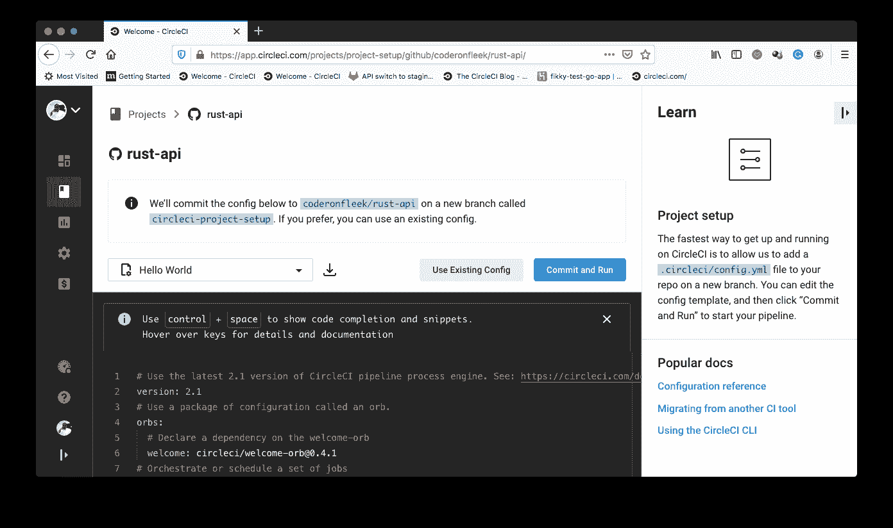
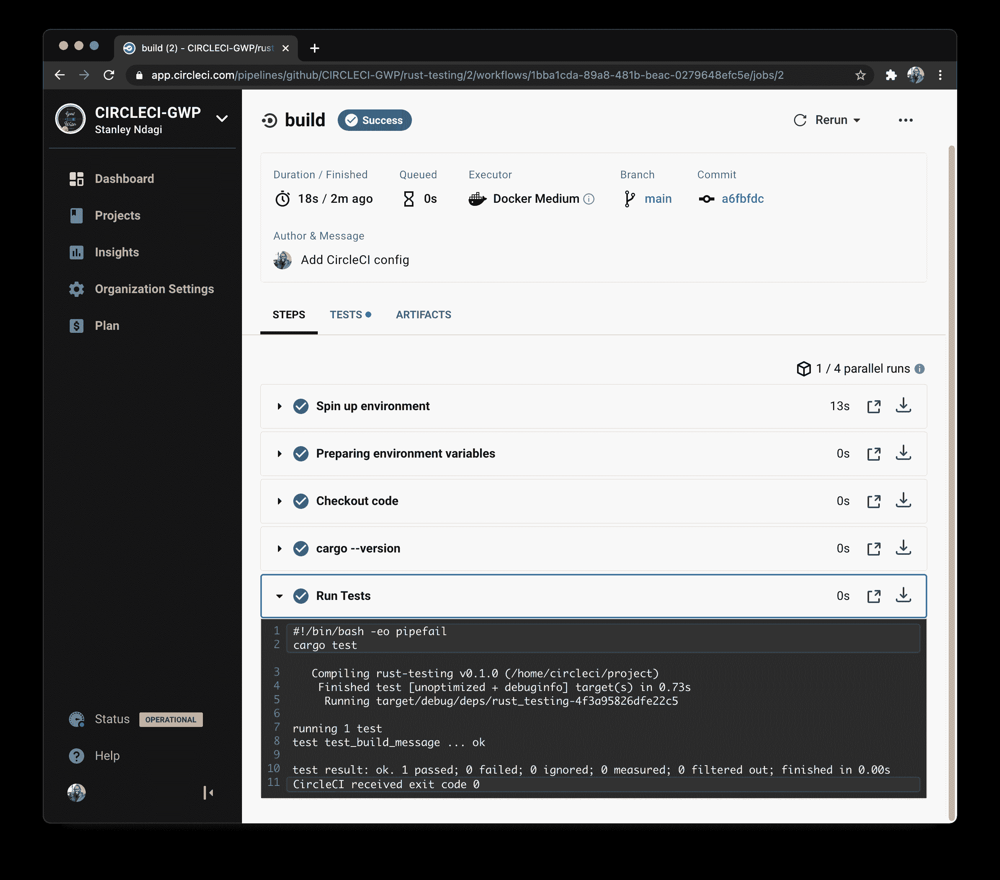

# Rust 应用的持续集成| CircleCI

> 原文：<https://circleci.com/blog/rust-ci/#2021-07-30T09:00:00-07:00>

## 介绍

Rust 是一种强大的语言，建立在对性能和可靠性的承诺之上。由于没有运行时或垃圾收集器，它很容易在任何环境中运行，并且可以集成到任何现有的语言或框架中。随着 [WebAssembly](https://developer.mozilla.org/en-US/docs/WebAssembly) 的出现。Rust 在 web 开发领域变得更加重要。Rust 与 Node.js 无缝对等，以构建高性能的功能，这让 web 开发人员欣喜不已。许多 web 开发人员宁愿编写 Rust，也不愿学习/编写用于 WebAssembly 集成的 C++或 C。

在本教程中，您将学习并演示如何在将 Rust 应用程序中的更新和升级推送到远程存储库时自动测试 Rust 应用程序。

## 先决条件

要按照教程进行操作，需要做一些事情:

1.  铁锈的基本知识
2.  [Rust](https://www.rust-lang.org/) 安装在你的系统上(在这里找到安装说明
3.  一个[圆](https://circleci.com/signup/)的账户
4.  GitHub 的一个账户

安装并设置好所有这些之后，是时候开始本教程了。

## 创建新的 Rust 项目

如果你在开始这个项目之前已经安装了 Rust，确保你运行`rustup update`以便你当前的安装是兼容的。首先，通过运行以下命令创建一个新的 Rust 应用程序:

```
cargo new rust-testing 
```

这个命令在`rust-testing`文件夹中快速搭建一个准系统 Rust 应用程序。您将构建一个简单的 CLI 应用程序，提示用户输入名称，并将问候消息打印回 CLI。

找到文件`src/main.rs`并用以下代码替换其内容:

```
fn main() {
    let mut line = String::new();
    println!("Please enter your name: ");
    std::io::stdin().read_line(&mut line).unwrap();
    println!("{}", build_message(line));
}

fn build_message(name: String) -> String{
    let message = "You are welcome ".to_owned() + &name;
    return message;
} 
```

在上面的代码中，定义了一个`build_message`函数，它接受一个`String`类型的`name`参数，并返回一个使用`name`参数构造的问候消息。

`main`功能提示用户输入名称。然后，该名称被传递给`build_message`函数，其返回值被打印到 CLI 输出。

通过在项目文件夹的根目录下运行下面的命令来运行该程序。

```
cargo run 
```

应用程序将提示您输入姓名。输入您的姓名并按下`Enter`键，以查看打印到 CLI 屏幕的问候消息，如下所示。

```
Finished dev [unoptimized + debuginfo] target(s) in 0.00s
     Running `target/debug/rust-testing`
Please enter your name: 
Fikayo Adepoju
You are welcome Fikayo Adepoju 
```

## 为 Rust 应用程序添加测试

Rust 的一个优点是它捆绑了自己的测试框架，不需要额外的设置。您将为`build_message`函数编写一个单元测试来断言它的输出。与其他大多数将测试放在单独文件中的语言和框架不同，Rust 实际上鼓励您将单元测试放在与被测试代码相同的文件中。

在 Rust 应用程序中运行测试的`cargo test`命令将定位项目中任何具有`#[test]`属性的函数，并将其作为测试用例运行。

在`build_message`函数下面添加这个测试用例:

```
#[test]
fn test_build_message(){
    let name = String::from("Fikayo");

    assert_eq!(build_message(name), "You are welcome Fikayo")
} 
```

在这个测试中，声明了一个`name`变量，并赋予了一个`Fikayo`的`String`值。下一行检查`build_message`函数是否为传入的参数返回预期的消息。

要运行此测试，请运行:

```
cargo test 
```

测试应该会成功运行。这是将出现在您的 CLI 上的输出:

```
Compiling rust-testing v0.1.0 (/Users/stanmd/Projects/CCI/rust-testing)
    Finished test [unoptimized + debuginfo] target(s) in 0.63s
     Running target/debug/deps/rust_testing-5cffbb684dbc6899

running 1 test
test test_build_message ... ok

test result: ok. 1 passed; 0 failed; 0 ignored; 0 measured; 0 filtered out; finished in 0.00s 
```

## 将 Rust 应用程序连接到 CircleCI

要开始 Rust 项目的测试自动化过程，您需要[将项目推送到 GitHub](https://circleci.com/blog/pushing-a-project-to-github/) 。

接下来，转到 [CircleCI 仪表板](https://app.circleci.com/projects)上的项目页面。选择适当的 GitHub 帐户并添加项目。


点击**设置项目**。



在设置页面上，点击 **Use Existing Config** 以指示您正在手动设置配置文件，并且不使用显示的示例。接下来，您会得到提示，要么下载管道的配置文件，要么开始构建。


点击**开始建造**。此构建将失败，因为您尚未设置配置文件。我们将在下一步构建这个文件。

## Rust 应用程序的自动化测试

是时候编写持续集成脚本了，该脚本将在更新被推送到远程代码存储库时自动运行项目中的测试。

在项目的根目录下，创建一个名为`.circleci`的文件夹，并向其中添加一个名为`config.yml`的文件。在`config.yml`里面，输入这个代码:

```
version: 2.1

jobs:
  build:
    docker:
      - image: cimg/rust:1.50.0
    steps:
      - checkout
      - run: cargo --version
      - run:
          name: Run Tests
          command: "cargo test" 
```

这段代码拉入 [CircleCI 铁锈图像](https://circleci.com/developer/images/image/cimg/rust) `cimg/rust:1.50.0`。通过此图像，您可以访问 Rust 安装可用的所有 CLI 命令。

然后从远程存储库中提取代码，标记为`Run Tests`的步骤使用`cargo test`命令运行项目中包含的测试。

提交对项目的所有更改，并推送到您的远程 GitHub 存储库。集成管道被触发，您应该有一个成功的构建。


有关部署的详细信息，请单击构建作业。



现在，每当您更改代码时，无论是通过添加更多的特性还是更多的测试，然后推送到您的远程存储库，您的测试都会自动运行。如果您的构建由于一段代码损坏而失败，您将收到警告。

平稳！

## 结论

在本教程中，您已经学习并演示了如何使用持续集成管道在 Rust 项目中自动化测试。为了扩展您的知识，请学习如何[持续部署 Rust 应用程序](https://circleci.com/blog/rust-cd/)。从开始到结束，你可以为你的团队增加 Rust 的价值，这样你就可以更快地构建更好的应用。

编码快乐！

* * *

Fikayo Adepoju 是 LinkedIn Learning(Lynda.com)的作者、全栈开发人员、技术作者和技术内容创建者，精通 Web 和移动技术以及 DevOps，拥有 10 多年开发可扩展分布式应用程序的经验。他为 CircleCI、Twilio、Auth0 和 New Stack 博客撰写了 40 多篇文章，并且在他的个人媒体页面上，他喜欢与尽可能多的从中受益的开发人员分享他的知识。你也可以在 Udemy 上查看他的视频课程。

[阅读 Fikayo Adepoju 的更多帖子](/blog/author/fikayo-adepoju/)