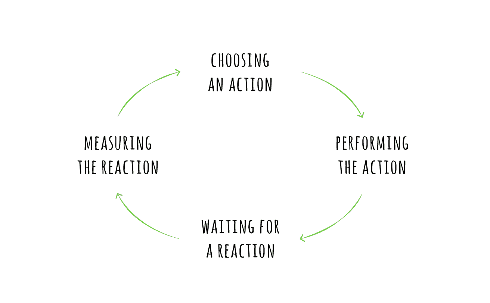
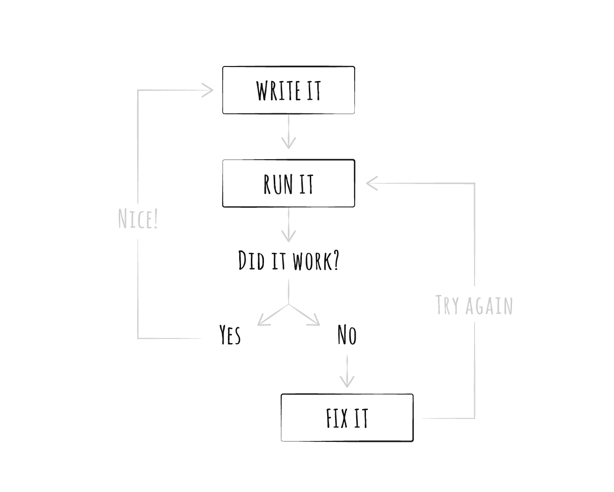

# 反馈循环:如何适应不断的变化

> 原文：<https://circleci.com/blog/the-feedback-loop-how-to-adapt-to-constant-change/#2017-11-30T07:28:00-08:00>

**来自出版商的说明:**您已经找到了我们的一些旧内容，这些内容可能已经过时和/或不正确。尝试在[我们的文档](https://circleci.com/docs/)或[博客](https://circleci.com/blog/)中搜索最新信息。

* * *

我们生活在一个加速发展的世界。

信息正以前所未有的速度被创造、传播、处理和反馈。但是我们的大脑不适应这种危险的节奏；随着*事物*数量的增加，我们的注意力持续时间一直在缩短，以保护自己免受源源不断的信息冲击。

世界也在改变，以弥补我们缺乏专注。脸书和推特源源不断地提供微小的内容，用多巴胺轰击大脑——博柏利在展示设计后的第二天就发布了新的设计——表情符号和迷因这两种艺术形式将我们的想法提炼成图像。最好的组织*了解*我们对新事物的迷恋:亚马逊、谷歌、脸书——这些公司满足了我们对即时满足的需求。他们通过缩短推动其业务的反馈循环来做到这一点，这样他们就可以给我们带来更多我们想要的东西。速度最快的公司是科技公司，这并不奇怪；软件开发本质上是迭代和自适应的。

但问题就在这里:现在，每家公司都涉足科技领域。这是必然的。代码已经渗透到每一个行业，现代公司现在面临着达尔文式的困境:适应或者死亡。当然，这不是一个新的比喻；托马斯·赫胥黎在 19 世纪 60 年代就已经在谈论“达尔文主义”，不久之后，人们开始将这个术语应用于像资本主义这样的非生物过程。

但是*新的是*变化的速度；比赛的节奏；迭代的速度。这不在于你有多快做出*特有的*改变；这是关于你能多快地装备你的公司来应对*不断的*变化。你公司的活力是其速度的直接反映。速度是整个组织中紧密反馈循环的结果。

识别和缩短组织的反馈循环是保持业务反应最有效的方法。当反馈仅限于一台计算机上的一名工程师时，缩短反馈循环是很简单的。但是在规模上，这变得更具挑战性，也更重要。DevOps 运动的核心是致力于减少传统开发人员和运营工程师之间的反馈回路。

## 什么是反馈回路？

反馈回路有两个组成部分:一个*动作*和一个*反应*。让它成为一个“循环”的是当反应的结果*反馈*到过程中的时候。在动作和反应之间也可能有几个步骤，但是，为了简单起见，我们将这些视为原始动作的一部分。

当我们识别反馈回路时，有两件事我们应该关心:1)动作和反应是什么，以及 2)整个反馈回路的周期时间。周期时间包括:

*   选择操作
*   执行操作
*   等待反应
*   测量反应

在我们讨论如何在您的组织中定位反馈环之前，让我们看一些具体的例子，看看它们是如何真正工作的。

### 生物学喜欢反馈循环

体内平衡是生物系统通过不断适应内部和外部变化来维持一系列条件的趋势。

反射也是非常短(和有限)的反馈回路。[当你触摸一个热锅](https://owlcation.com/stem/Here-is-what-happens-when-you-accidentally-touch-a-hot-pot)(动作)时，热量会触发你皮肤中的感觉神经元。这些信号作为电信号传输到你的脊髓，在那里被中间神经元处理(反应)。这些中间神经元向你手中的运动神经元传递信号，刺激肌肉，使你把手拿开(动作)。当你把手拿开时，感觉神经元停止尖叫，中间神经元停止告诉你手的运动神经元移动。这就是为什么你的手只会向后拉一小段距离。

所有这些都发生在你没有意识到的情况下——因为那需要太长时间。如果你着火了，你的身体想要尽快脱离那种状态。没有必要通过大脑的官僚机构来做决定；这只会增加循环的周期时间。

这不是人类独有的。任何可以繁殖的东西都是如此。所有的生命都依赖于忙碌的小反馈回路，使它们的宿主适应外部输入，并优化它们以进行复制。

如果我们缩小范围，我们可以看到跨物种运作的巨大反馈回路:在数百万年的时间里，数十亿种生物对外部刺激做出了反应。一些生命形式，如细菌，比其他生命形式的反馈回路更短；这就是为什么[抗生素耐药性越来越引起](http://www.who.int/mediacentre/factsheets/antibiotic-resistance/en/)的关注。或者是流感病毒，它每年都像博柏利病毒一样自我改造。

作为人类，我们倾向于认为自己在所有方面都是最好的。但是我们的生殖反馈循环非常缓慢:婴儿出生需要九个月，甚至需要*年*才能繁殖。我们的优势是我们的智慧:我们已经能够用我们的*工具*创建更快的反馈循环。通过语言和文字，我们交流知识，改变行为——这一切都发生在一代人的时间里。

通过以这种方式缩短反馈循环，我们已经能够创造人类最重要的三项发明——诗歌、粒子物理和 Soylent。

## 作为自我调节有机体的系统

很好，我已经漫谈了一些关于生物反馈循环的问题，但是这些与产品开发或者更普遍的商业有什么关系呢？让我们来看看短反馈循环提高产品生命力的一些领域。

### 沟通

两个人之间的(好的)对话是一个光荣的反馈循环的产物。你说了什么，对方回应了什么，你的下一句话就要被那个人说的话所告知。聪明的说话需要积极的倾听。

这就是为什么当有人主导谈话时会让人不舒服:不允许其他人发言，讨论就失去了与其他参与者的相关性。谈话狂忽略了有利于他们自己行动的反应，这让人感觉被忽视了。

这就是为什么高质量的单口喜剧演员不只是死记硬背他们的套路；他们观察他们的观众并适应这个房间。最好的老师不会给学生讲课 75 分钟；这甚至不是一个完整的反馈循环——它只是一个长期的行动。相反，他们用苏格拉底式的方法提问并创造出*对话*。每说一句话，学生就会暴露理解上的漏洞，给老师提供纠正的机会。

### 媒体

[一周可以创作一集《南方公园》](https://en.wikipedia.org/wiki/South_Park#Production)。这种制作时间在动画行业很少见，大多数节目都需要几个月的工作。该节目的创作者认为，这种短暂的转变使创作过程更具反应性，从而导致一个持续的主题节目。就生命力而言，这是一种制胜策略。自 1975 年以来，周六夜现场每周都有演出，而[没有停止的迹象。](http://www.vulture.com/2017/05/saturday-night-live-ratings-this-season-are-unprecedented.html)

音乐家们也认识到，如果他们发行月度单曲而不是年度专辑，观众会更加投入。这种音乐滴定煽起了歌迷的热情，帮助艺术家衡量观众的参与度。基于这些反应，音乐家可以进行调整，将风格或声音的反馈纳入未来的决策中。

最后，最近直播的激增([特别是在游戏行业](https://www.forbes.com/sites/alexknapp/2017/03/14/report-esports-and-game-content-streaming-revenues-will-rise-to-3-5-billion-by-2021/#546547a01c3c))似乎是这个世界对短反馈循环的痴迷的合乎逻辑的结论。还有什么比实时看到事情发生*更短暂的呢？Streamers 可以立即响应观众，根据观众的反馈修改表演。这让观众感觉参与到产品的创作中。即使是少量的代理也能增加情感投入和忠诚度。*

 *### 软件

软件工程师对短反馈循环非常熟悉，这并不奇怪。编写代码的行为本身就是一个巨大的反馈循环:

软件的美妙之处在于它通常很容易改变。如果你有一个性格难相处的孩子，你不能更新他们的源代码。迭代*和*产品的唯一方法是再生一个孩子，并更新你的育儿方式。

另一方面，发现软件中的 bug 并不需要召回整个产品；只要修复漏洞，继续你的生活。软件工程师天生了解高效反馈回路的力量；这就是为什么我们花这么多时间优化日常任务。

视频游戏行业的一个增长趋势是提供对标题的“早期访问”。这使得开发者可以将真实用户的反馈整合到设计决策中。数字市场 [Steam](http://store.steampowered.com/) 上一些[最成功的游戏](https://www.gamasutra.com/view/news/275719/7_successful_Early_Access_games_that_all_developers_should_study.php)是持续开发周期的结果。简短反馈循环的价值应该是显而易见的:开发人员和用户之间的公开对话会产生更令人愉快的产品。

## DevOps 由反馈回路供电

软件正在吞噬世界。而且，像大多数过程一样，软件开发受益于短的反馈循环。那么你应该从哪里开始呢？我反问的答案是“DevOps”。这个运动关注的是改进软件开发和交付的方式。通过优化开发者和操作者之间的反馈循环，公司降低了发布代码和衡量用户反应的成本。

这不是你需要担心的唯一的反馈回路。但这是一个可以自动化的反馈循环，让您专注于与您的业务相关的反馈循环。但是，在优化它们之前，您必须找到它们。你必须…

### 优化前识别

在你的组织中寻找反馈循环从识别你给客户带来的价值开始。使用反馈循环的四个部分来产生关于您的流程的问题:

*   我们如何做出产品决策？
*   我们如何改变产品？
*   我们如何将产品交付给用户？
*   我们如何知道用户对产品的看法？

问这些问题应该会把你引向你业务核心的一个反馈回路。这可能还不存在！如果是这种情况，您应该立即将重点放在构建缺失的功能上。这个“主要”反馈回路定义了你的任务，并突出了你的弱点。虽然肯定会有其他的反馈循环，但是你应该自动化这些循环，直到你优化了你的主要反馈循环。

### 虚构的例子

假设你经营一家回形针公司。你的工作是以合理的价格生产高质量的回形针。你的主要反馈循环包括生产回形针(行动)和衡量顾客的反应(反应)。

比方说，你通过生产一百万个绿色 1⅛塑料回形针开始创业。当你把这些带到市场上，你会意识到每个人都讨厌绿色，喜欢洋红色。但是你仍然需要出售这些额外的库存，所以你开始了一个社交媒体活动，将公众的偏好从洋红色转移到绿色。

你的公司精通色彩理论，通过机器学习算法运行了几个世纪的艺术，以测量光谱分布随时间的变化。你会发现切换颜色偏好是出了名的困难——尤其是当颜色互补的时候。所以你歇业了。

### 这显然是愚蠢的

但混乱中有真相:人们会被他们不需要解决的问题分心。如果你用每种主要颜色做了 100 个回形针，并测量了哪些卖了，你就会更好地了解人们想要什么。您可以帮助成千上万的人保持他们的文件在一起，同时仍然保持盈利！

你应该问一些关于主要反馈回路的问题:

*   做一个回形针需要多长时间？
*   将它们运送给供应商需要多长时间？
*   供应商多长时间进货一次？
*   你怎么知道哪些回形针受欢迎？

这些问题中的每一个都会引出一个值得优化的指标。您可能会发现您甚至缺少测量任何东西的工具！但是这没关系:即使意识到您的过程也是一项有价值的任务。

回避这些问题是可以理解的；它们背后往往隐藏着一个严酷的事实，有时这个残酷的事实就是你正在开发一个没有人需要甚至喜欢的产品。但是如果你想你的生意成功，你必须问和回答这些问题。

### 优化也是一个反馈循环

一旦你确定了你的反馈回路，你就需要开始考虑优化它们。正如我们所讨论的，投资于你的组织的适应性是你能为你的公司健康所做的最好的事情之一。

但是改变不会在一夜之间发生！我们都是人，依靠模式和结构来度过我们的日子。流程优化需要根本性的改变，即使是那些希望 T1 这么做的人也必须克服一些严重的惰性。

这里的技巧是根据 [DevOps 最佳实践](https://aws.amazon.com/devops/what-is-devops/)逐步引入变更。例如，如果你试图培养一种测试文化，要求每个人从今天开始写测试可能会受到一些抵制。相反，要求工程师为他们发现的每个 bug 编写一个测试。每一个新的测试都暴露了代码覆盖率中的差距，告知代码库的哪些区域应该获得下一个优先级。

在冲刺或中断之后，运行回顾以明确地捕捉来自涉众的反馈。通过这样做，你可以从错误中走出来，并获得如何在将来防止错误的信息。

最后，真正的用户反馈应该比其他任何东西都重要。你的“专家”不会像普通消费者一样思考，因为他们是创造者。

彻底的改变很少像预期的那样起作用；人太固执，会想方设法抗拒来自高层的命令。但是当你的文化改变时，对你的过程进行小的、渐进的改变会给你的团队一些喘息的空间。这允许改变有机地发生，同时仍然优先考虑你的产品中最脆弱的部分。

## 最快的生存者

软件交付可能不是你的主要反馈环。而且不应该；那是我们的工作。CircleCI 花时间想办法将代码从工程师的头脑中取出，送到用户手中——而不牺牲速度或安全性。

我们认为人们在知情的情况下会做出更好的决定。变得有见识需要做决定——在你确信成功之前执行。我们将帮助您更频繁地做出更多决定。我们无法预见未来，但我们非常确定它会与现在不同。随着世界发展速度的加快，您的组织需要跟上步伐。

跟上意味着增加你的产品对变化的适应力。这种变化可能是政治的、环境的、技术的或文化的——关键是*你不会知道*小行星什么时候会导致灭绝事件。不要让你的公司走上恐龙的老路，就像 T2 一样，因为它像 T3 一样移动；成为在冲击中幸存下来的小哺乳动物，因为它能够适应。

确定你的反馈循环并[缩短它们](https://circleci.com/signup/)。你的后代会感谢你的。*