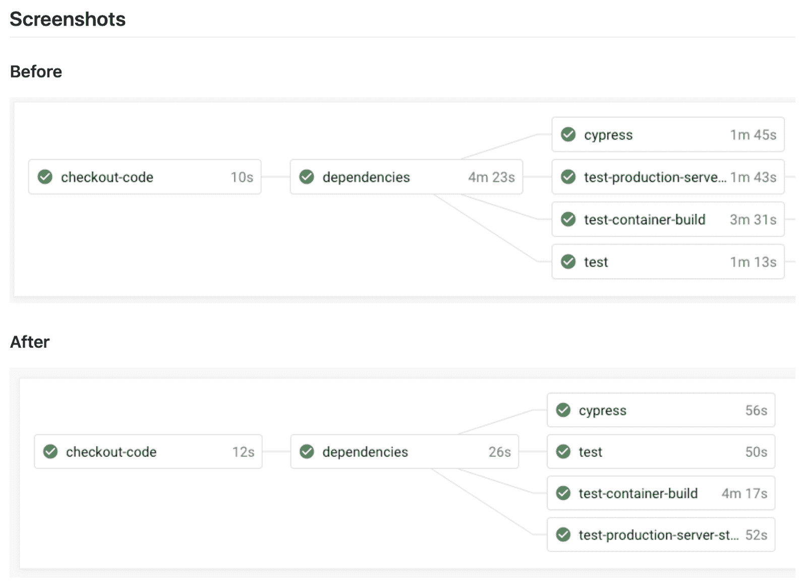

# CI | CircleCI 中的速度与决定论问题

> 原文：<https://circleci.com/blog/the-issue-of-speed-and-determinism-in-ci/#2020-07-20T09:00:00-07:00>

在 CI 中，我们花了很多时间讨论速度和决定论。持续集成的存在是为了帮助团队更快、更高质量地构建和发布软件。我们通过在代码库中添加小的改进来做到这一点，并采用动态测试来确保我们不会破坏任何东西。确保质量的一个关键因素是一个叫做[决定论](https://circleci.com/blog/preserve-build-integrity-prevent-problems-deterministic-builds/)的概念。本质上，决定论意味着同样的输入，你会得到同样的输出。一个测试运行一次就失败了，如果没有其他变化的话，下一次就不会通过了。

在过去的几个月里，我们一直致力于解决和修复一个问题，这个问题影响了我们对某些项目速度的确定性。在这篇文章中，我将谈论我们发现了什么，以及我们如何修复它。结果是，在 CircleCI [上使用 Docker executor 的项目现在可以配置 RAM 磁盘](https://circleci.com/docs/executor-types/#ram-disks)，作为在内存中而不是在 SSD 上执行 I/O 繁重操作的一种方式。

## 问题是:同样的工作，不同的结果

关于决定论，需要注意的一件重要事情是，没有决定论，就很难衡量其他任何东西；一个度量，任何度量(例如，“这个构建需要运行多长时间？”)只能给你有意义的信息，如果你可以依赖它是一致的。

我是 CircleCI 的解决方案工程师，因此我与潜在客户一起解决他们评估平台时出现的问题。我们最近与一位潜在客户合作，该客户因缓存恢复而体验到不一致的性能。

对于有问题的客户，我们偶尔会看到缓存恢复花费两倍甚至三倍于其通常持续时间的时间(长达 90 秒)。解决这个问题尤其重要，因为客户正在从传统的 Jenkins 安装进行迁移，而提交部署时间 CircleCI 传统上擅长的领域——是任何新 CI/CD 设置的关键成功指标。缓存恢复时间的这种变化使得很难掌握这一关键指标。

这种差异的影响在并行运行的作业中尤其明显。CircleCI 让用户能够一次在一系列不同的机器之间分割一个大型测试套件。然而，这些并行构建只和运行时间最长的作业一样快。任何不必要的变动都可能要求用户在继续其工作流之前等待单个作业完成。

虽然速度的差异令人沮丧，但作为一名解决方案工程师，我更担心这一点，因为这使我无法向潜在客户提供准确的报告，说明 CircleCI 可能为他们的构建提供的任何速度改进。我决定更深入地研究这个问题，以帮助这个潜在客户，但最终找到了一个解决方案，可以帮助任何在我们的平台上运行 node.js 的人。

## 深入研究

我决定探究可能导致这种情况的原因。我们如何加快提交部署时间？最终我们发现，我们看到的所有不一致都是在恢复 Docker 容器中运行的 Javascript 项目的缓存和工作空间时发生的。问题似乎源于 CircleCI 同时在同一个虚拟机上运行多个客户的 Docker 容器:如果一台机器的所有租户都在大量使用它们之间共享的硬盘驱动器，硬件可能会陷入困境。

我们注意到这些不一致的所有项目都是基于 Node.js 的，并且都缓存了它们的 node_modules 文件夹。节点模块是一个有趣的例子，因为它不仅仅是一个需要缓存的大型工件(我们看到了 150-300mb 范围的项目)，而是大量的小文件。我们检查的一个项目有一个 node_modules 文件夹，包含超过 150，000 个文件。此外，对于其他非 Node.js 项目中的大型缓存，我们似乎没有体验到相同的性能变化。

## 第一个实验

解决这个问题的第一步是研究用于压缩缓存档案的 tar 命令。压缩指定的目录相当简单。一个直接的观察结果是，tar 不是多线程的，因此增加 CPU 对任务的可用性不会产生任何影响。这导致了第一个实验，它将使用一个替代的 tar 实现，特别是[pigz](https://github.com/madler/pigz)(GZip 的并行实现)，以便减少压缩缓存归档所花费的时间。在本地，这种方法效果很好，表现出极大的性能提升。作为我们测试项目的一部分，在 CircleCI 上的测试产生了一个改进的最佳情况，但是在多次运行中仍然显示了同样令人沮丧的变化。

## 探索基于内存的解决方案

因为 CPU 似乎不是瓶颈，我们得出了一个新的假设，磁盘本身可能是问题所在。我们在构建软件时经常采用的一种传统折衷方法是用硬盘空间换取 RAM，因为内存运行速度更快，限制更少。对于我们的客户来说，解决这个内存问题意味着他们不仅能够使用资源来缓存或恢复工作区，还能够使用 node.js 在其 CI 环境中进行任何类型的操作。

在 CircleCI 的情况下，我们的 Docker 执行器通过在底层 AWS EC2 VM 上托管 Docker 容器来工作，根据请求为每个任务分配必要的 CPU 和 RAM，但容器都共享一个本地 SSD。我们如何测试它的一个想法可能是利用一个 ramdisk——并完全避免写入这个 SSD。方便的是，我们的容器已经在/dev/shm 安装了一个 ramdisk，这有助于快速试用这种方法。我们看到原始性能和一致性都得到了立即的提高，尽管不幸的是/dev/shm 被挂载为 NOEXEC，如果它被用作工作目录，就会立即出现问题——用户通常需要调用可执行脚本来安装依赖项或运行测试。

## 我们如何解决这个问题

最终，我们能够在平台上运行的每个容器中添加一个新目录。容器中的所有内容都将存在内存中。随后，我们对挂载 Docker 容器的方式做了一点小小的改变，以便在/mnt/ramdisk 中公开一个单独的 ramdisk。这个 ramdisk 可以利用用户配置中指定的资源类中可用的内存，并且没有上面详述的 NOEXEC 限制。对于拥有大型 git 存储库、缓存、工作区或其他 I/O 繁重工作负载的用户，一种简单的入门方法是通过配置中的 working_directory 设置使用新的/mnt/ramdisk 位置作为他们的工作目录。

RAM 磁盘现在提供了一种在内存中而不是在 SSD 上执行 I/O 繁重操作的便捷方式，同时仍然能够利用基于容器的 CI/CD 作业的便利性、确定性、低成本和快速启动时间。

这种方法还有其他一些优点。因为内存是如此快速和灵活，它给了客户一个额外的理由来利用我们的平台提供的更大的资源类。除了缓存之外，这一改变也很有用，它可以用于客户工作流中的任何 I/O 密集型操作。

这一变化导致了我们产品的两次重大升级。首先，也是最明显的，我们发现一致性问题的工作的工作流程时间减少了 40%。以下是修复前后运行的工作流示例。

然而，更重要的是，这些时间现在在每次运行中都是一致的——更具确定性。在这一关键性能指标没有变化的情况下，我们现在能够更容易、更准确地进行性能基准测试，同时也减轻了客户在遇到这一问题时的挫折感。

[这一功能现已在我们的产品中投入使用](https://circleci.com/docs/executor-types/#ram-disks)，因此，如果您的团队正在运行带有缓存或工作区的 Javascript 作业，您现在可以获得这一改进，这将有助于提高性能和一致性。

如果你喜欢发现和解决这样的重要问题，[加入我们的团队](https://circleci.com/careers/)！