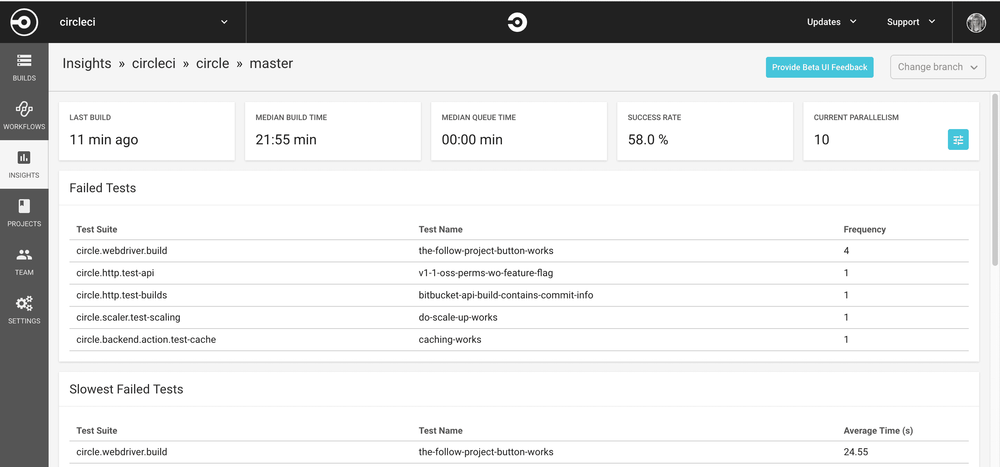
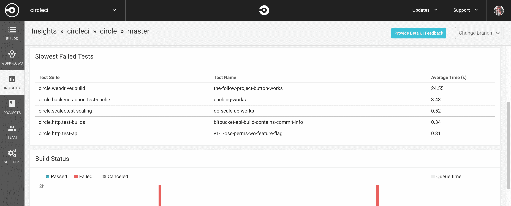

# 使用洞察力发现不可靠的、缓慢的和失败的测试

> 原文：<https://circleci.com/blog/using-insights-to-discover-flaky-slow-and-failed-tests/#2017-06-30T04:15:00-07:00>

**来自出版商的说明:**您已经找到了我们的一些旧内容，这些内容可能已经过时和/或不正确。尝试在[我们的文档](https://circleci.com/docs/)或[博客](https://circleci.com/blog/)中搜索最新信息。

* * *

### 测试，再测试

在 CircleCI，我们非常重视测试。在运行了超过 6500 万次构建之后，我们学到了一些东西。让团队能够经常更好地测试是我们工作的驱动力。运行测试使您的代码更加可靠。

但是你从你的测试中得到最大的收获了吗？除了简单地实现它们，你是否充分地测试了你的测试？毕竟，测试本身是可靠的。

### 如果你不能信任失败的测试，为什么要信任通过的测试呢？

不可靠的测试(当代码没有改变时，有时通过，有时失败)并不比根本没有测试好多少。在 Insights 选项卡中，您可以快速查看哪些测试可能是不可靠的，以及哪些是您最失败和运行最慢的测试。虽然我们不能为您重写测试，但我们可以帮助您准确地看到哪些测试是缓慢的、易出问题的和失败的，这样您的团队就可以在支持您的测试时集中精力。

### 你只能管理你能衡量的东西

但是不要相信我们的话！我们自己的测试并不总是很好。他们过去很慢，这很令人沮丧。但是我们不知道为什么，也不知道具体是哪一个慢。工程师 Marc O'Morain 知道他不能加快每个人的测试速度，但他可以做下一件最好的事情:~~羞耻~~鼓励他们自己做。

他对构建页面做了一个小小的修改，这样它将默认显示最慢的测试所花费的时间。他的希望是让人们感到内疚，从而加速他们的测试。而且成功了。发货后，我们都可以看到我们最慢的测试花了 2 分 20 秒，没多久就有人解决了。

现在我们的团队意识到了我们测试操作中的弱点，我们能够改进最糟糕的违规测试并加快我们的测试。

我们希望帮助您从测试中获得最大收益，因此以下是我们最喜欢的工具，现已提供给所有 CircleCI 用户:

**失败的测试:**你的哪些测试最失败？

**最慢的失败测试:**在你的失败测试中，哪些是最慢的？当试图加速你的测试时，从这些开始。

**成功率:**一个分支上有多少构建是成功的？在 master 上，测试应该 100%通过，任何更低的百分比都可能表明你的武器库中的测试可能是不可靠的。