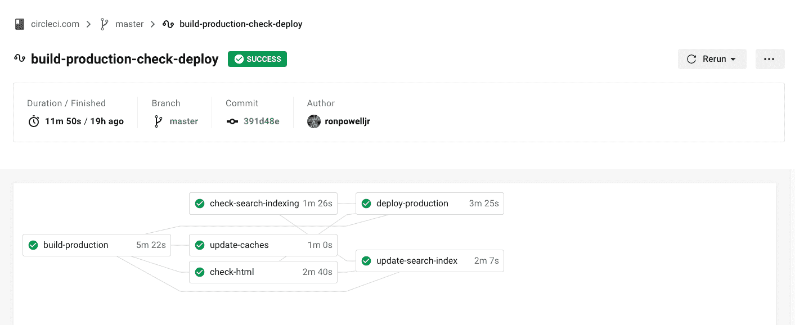
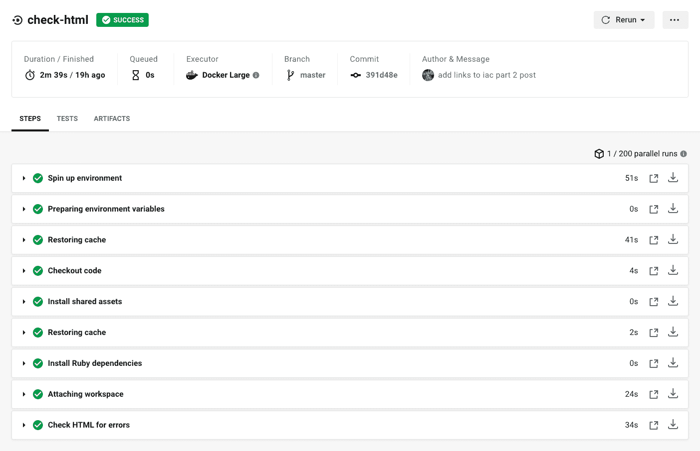

# 什么是 CI/CD 管道？圆环

> 原文：<https://circleci.com/blog/what-is-a-ci-cd-pipeline/#2022-10-06T01:00:00-07:00>

## 管道介绍

CI/CD 管道是自动化软件开发的最基本的组件。虽然该术语已被用于描述计算机科学的许多不同方面，但在 CircleCI 和 DevOps 行业的许多地方，我们使用“管道”来说明[持续集成(CI)](https://circleci.com/continuous-integration/) 中涉及的行为和过程的广泛应用。

CI 是一种软件开发策略，它可以提高开发速度，同时确保所部署代码的质量不受影响。使用 CI 工具，开发人员不断地以小增量提交代码，有时一天多次，然后在与共享存储库合并之前自动构建和测试代码。现代软件交付管道可以根据您的业务需求构建、测试和部署应用程序。

*点击观看 CI/CD 101 视频。*

## 什么是 CI/CD 管道？

CI/CD 管道是在您触发项目工作时运行的一整套流程。管道包含您的工作流，这些工作流协调您的作业，这都在您的项目[配置文件](https://circleci.com/docs/configuration-reference/)中定义。

持续集成自动化了软件的构建和测试。连续部署是这种自动化的扩展，它允许在通过测试套件的每个代码提交之后部署您的软件。最成功的开发团队经常部署他们的软件。有关更多信息，请阅读我们的[持续集成(CI)与持续部署(CD)](https://circleci.com/continuous-integration/#continuous-integration-ci-vs-continuous-deployment-cd) 页面。

## CI/CD 管道的组件

持续集成自动化了软件的构建和测试。连续部署是这种自动化的扩展，它允许在通过测试套件的每个代码提交之后部署您的软件。

最成功的开发团队经常部署他们的软件。有效地交付高质量的软件意味着使用 CI/CD 最佳实践来构建、测试和部署代码。

### 构建阶段

在构建阶段，多个开发团队将他们自己机器上开发的代码贡献给一个共享的存储库。这听起来很简单，但很快就引入了复杂性。除了版本控制，还会出现一些问题，包括开发人员和生产环境、工具和代码质量的细微差异。在您的管道中包含构建过程的优点是，它自动化了开发人员的贡献，并提供了标准化软件质量和环境的工具。

### 检验阶段

开发团队经常直接进入部署阶段。这是一个错误，因为测试阶段是 CI/CD 的主要优势所在。测试是一个复杂且重复的过程，您的 CI/CD pipeline 可以帮助您实现自动化。

有几种不同类型的测试，所有这些都可以在自动化持续集成管道中一起使用。您可以将单元测试与集成测试结合起来，以提供尽可能大的测试覆盖范围。测试还提供了关于软件性能的重要数据，这些数据可以立即集成到代码中。测试的结果是高质量的软件，错误越来越少。

### 部署阶段

在部署阶段，您可以将软件发布编排到生产或其他环境中。您的管道可以配置为按计划部署代码，向所有客户或仅一个选定的组推出软件，甚至在出现问题时回滚发布。您可以决定向客户提供更新软件的最佳策略。这些都可以作为 CI/CD 渠道的一部分实现自动化。

## 配置 CI 管道

**持续集成的 DNA 是配置。** CI 管道是配置文件中最高级别的编排。

### CI 工作流

[工作流](https://circleci.com/docs/configuration-reference/#workflows)允许您单独运行作业并进行故障排除，因此您可以实时查看失败的构建。如果工作流中的一个作业失败，您可以单独重新运行该作业，而不是重新运行整个作业集。

### CI 作业

[作业](https://circleci.com/docs/configuration-reference/#jobs)是在单个单元中执行的步骤的集合，工作流是定义该组作业及其运行顺序的规则集。

### 配置步骤

在作业中，[步骤](https://circleci.com/docs/configuration-reference/#steps)是单个键值对的列表。该键指示步骤的类型，值可以是配置映射或字符串。当步骤是运行时，您可以将要执行的命令指定为字符串值。

## 带有 CircleCI 的 CI/CD 功能

在 CircleCI 上通过管道构建代码时，您将遇到的一些特性是使用多个资源类、并行测试分割、orb、矩阵作业、环境变量/上下文和批准。

*   **资源类** : CircleCI 提供了大量的[资源类](https://circleci.com/docs/executor-types/#available-docker-resource-classes)，可以让你为每个任务优化 CPU 和 RAM 资源。

*   **并行测试分割**:为了减少时间，并行运行[测试](https://circleci.com/docs/parallelism-faster-jobs/#splitting-test-files)，将它们分布在多个独立的容器中。

*   **orb**:[orb](https://circleci.com/orbs/)是 YAML 配置的可重用包，它将重复的配置压缩成单行代码。

*   **矩阵作业**:矩阵[作业](https://circleci.com/docs/configuration-reference/#dependencies-and-matrix-jobs)允许你用不同的参数多次运行一个参数化的作业。

*   **参数** : [管道变量](https://circleci.com/docs/pipeline-variables/)、[环境变量](https://circleci.com/docs/env-vars/)和[上下文](https://circleci.com/docs/contexts/)是允许用户存储和重用数据以及保护敏感信息的参数。

*   **批准**:工作流程可编程为等待[手动批准](https://circleci.com/docs/workflows/#holding-a-workflow-for-a-manual-approval)后再继续。对您的存储库具有推送访问权限的任何人都可以批准作业以继续工作流。

## 在 CircleCI 开始建造管道

如果您不熟悉[持续集成](https://circleci.com/continuous-integration/)，理解管道的作用和能力将有助于您理解 CI 的真正价值。要了解更多信息，请访问 CircleCI [资源页面](https://circleci.com/resources/)。首先，查看我们的[文档](https://circleci.com/docs/#section=welcome)。