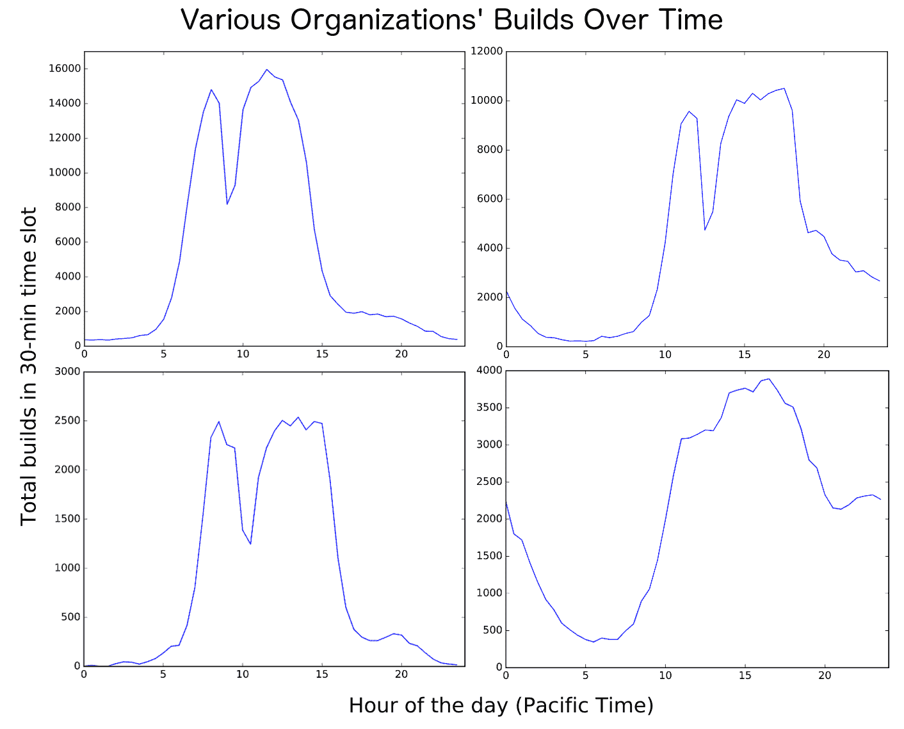

# 模拟自动扩展构建集群第 3 部分:当自动扩展构建机群工作时

> 原文：<https://circleci.com/blog/when-auto-scaling-build-fleets-work/#2016-04-18T08:30:00-07:00>

**来自出版商的说明:**您已经找到了我们的一些旧内容，这些内容可能已经过时和/或不正确。尝试在[我们的文档](https://circleci.com/docs/)或[博客](https://circleci.com/blog/)中搜索最新信息。

* * *

注意:这篇文章是系列文章的一部分。见[第一部分](/blog/mathematical-justification-for-not-letting-builds-queue/)、[第二部分](/blog/are-we-autoscaling-yet/)或[点击此处](https://goo.gl/forms/hq6sZEIiJ4)当另一个帖子被添加到此系列时会得到通知。

到目前为止，在这个系列中，我已经介绍了一个自动扩展构建车队的计算模型，并使用它来针对随机变化的构建负载尝试自动扩展。最终目标是找出如何最好地在 CircleCI Enterprise 的设备上使用自动扩展，这些设备在与 circleci.com T2 非常不同的流量模式下运行。在上一篇文章中，当我们意识到虚拟机启动时间太慢，无法响应现实世界流量的随机波动时，我们遇到了一点困难。这一次，我们将考虑全天的流量波动，看看自动缩放是否能帮到我们。

## 启动大数据 Hadoop 云

好吧，更像是启动 Postgres DB 和 Python 脚本…无论如何，让我们看看一些使用 CircleCI 的实际团队一天中构建的频率。查看单个公司的任何一天都是非常随机和尖锐的，但是合计几天内给定时间窗口内的所有构建会产生一些很好的平滑曲线。请记住，如果构建在一天中以恒定的速率随机发生，这些曲线将是平坦的线，但显然不是这样。

随着时间的推移，构建的情节看起来大多像拳击手套，在午餐时间略有下降。除了组织 4，它要么不吃午餐，要么可能分布在全球各地。如果你把 CircleCI 上所有组织的所有建筑加起来，你会得到一个类似这样的图:

这是一种正弦波，有几个午餐时间和几个位于欧洲的员工。有理由假设一个非常大的公司，其团队遍布世界各地，共享一个中央构建集群，看起来会像这样。

## 固定到达模式已经过时了

为了模拟这种时变流量，我们只需对模拟进行一项更改。我们将保留之前的所有随机尖峰，因为自动缩放过程仍然需要处理它，但我们将添加一个时变函数，在采样之前乘以我们的随机分布。

为了简单起见，我将使用一个正弦函数，从午夜的 0，到中午的 1，再到午夜的 0。我将用这个函数乘以上次的相同流量模式，因此过去的恒定流量现在将是峰值流量。

## 大揭秘

测试这种新流量模式的具体细节与上次基本相同，只需一次快速的 c4.8xlarge 操作，即可运行所有可能的自动缩放参数。在进一步分析结果之前，我将分享一个在这种流量模式下任意一天的模拟时间的快速示例:

耶！这就是我所说的自动缩放！请注意尖峰信号有多猛烈，并且模型被优化为只能勉强吸收它们。另请注意，在一天当中，紫色的大块实心区域表示大量设备的持续利用率，这对机器效率很有好处。

看了这张图之后，这张图显示了新交通模式下固定规模车队的成本节约情况，这并不令人惊讶:

首先，与恒定流量的情况相比，我们为每个流量级别节省了更多。第二，也是更重要的一点，节省的费用不会随着流量减少而是增加。当我们试图针对随机流量峰值进行自动扩展时，更多的流量意味着更多的随机性和峰值。当与一个移动更慢的基本流量率相比时，更多的流量意味着我们有一个坚实的使用基础(上图中紫色的大块)，同时仍然能够在晚上关闭大多数机器。

## 那么，我该如何设置我的 ASG 呢？

当我开始这个练习时，我的主要目标是确定自动扩展对于 CircleCI Enterprise 客户的实际启动时间和流量模式是否有意义，如果有意义，什么自动扩展参数可以产生最佳性能？

根据这篇文章和上一篇文章的结果，问题第一部分的答案似乎很清楚了。针对构建流量中每分钟的随机波动进行自动扩展对于实际的启动时间和流量模式来说没有意义，但是根据流量每小时的变化进行扩展肯定有意义。

问题的第二部分，即对于任何给定的交通模式，什么参数是最好的，要困难得多。我的强力方法有助于确定自动缩放为日常流量模式节省大量资金的参数确实存在，但这不足以为任何情况指定一套完整的参数，例如 AWS 自动缩放组(ASG)参数。即使在我的理想化模型中，这也是一个复杂的多维建模问题，在现实世界中更加复杂。

也就是说，我对优化工作中出现的参数做了一些简单的分析，发现了一些明显的趋势。我在一个简单的公式中捕获了这些信息，为给定的负载推荐 ASG 参数(CloudWatch 警报计时、阈值等)。该公式只依赖于构建的总容量(每小时构建分钟数)，而不依赖于构建的长度，因此希望它能够简化我的模型中构建时间是恒定的。该公式似乎在推荐参数方面做得相当好，即使是在我的强力方法的搜索空间之外的流量:

请注意，该公式只是相对于我在它所涵盖的领域中通过强力搜索找到的最佳参数而言一般，这是意料之中的，因为我没有在我的公式中捕捉到每一个可能的良好性能预测。然而，该公式在高容量的情况下表现得非常好，这也是意料之中的，因为这些情况应该有一个更大的运行构建的基础来扩展。如果不从客户群中收集更多真实世界的数据，而只是根据我的模型粗略地评估推荐的参数，那可能是愚蠢的。

## 后续步骤

关于自动扩展优化的系列文章到此结束，但是我们改进 CircleCI 企业自动扩展体验的工作还远远没有结束。下面是我们接下来要做的一些事情:

1.  **从客户那里获得反馈:**这种模拟业务很酷，但没有什么比来自现场的数据更能测试模型的实用性并指导我们的建议。
2.  **测试更多流量模式和参数:**使用简单的正弦波流量是一个很大的简化。测试更真实的交通模式也是一件好事。从客户那里获取流量数据可以让我们将预测的自动缩放性能与现实进行比较。到目前为止开发的简单参数预测公式也可以用于缩小参数空间，并以更高的分辨率搜索更好的公式。
3.  **探索替代的自动扩展指标和模型:**circle ci 的经验表明，根据可用容量进行扩展是抢先确保流量得到处理的好方法。然而，如果流量非常低，基于 CloudWatch 警报阈值的固定数量可能会导致夜间过度配置。我们可能会发布其他指标或技术来缓解这一问题。

同样，这个模拟在 [bellkev/asg-sim](https://github.com/bellkev/asg-sim) 是开源的，我鼓励任何 [CircleCI Enterprise](/enterprise/) 的客户、其他集群运营商或者只是好奇的市民去看一看！

注意:这篇文章是系列文章的一部分。见[第一部分](/blog/mathematical-justification-for-not-letting-builds-queue/)、[第二部分](/blog/are-we-autoscaling-yet/)或[点击此处](https://goo.gl/forms/hq6sZEIiJ4)当另一个帖子被添加到此系列时会得到通知。